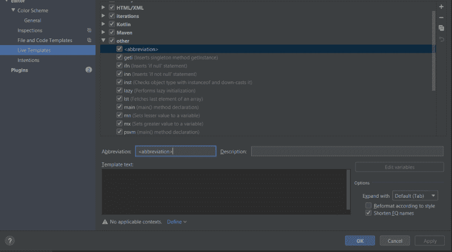
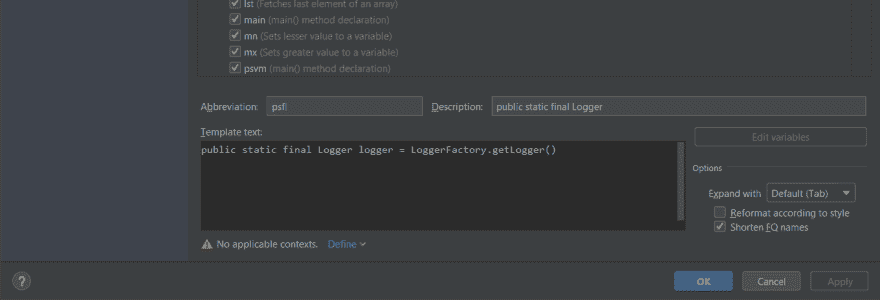
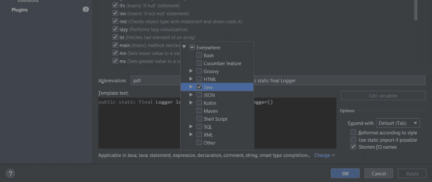

# 使用 IntelliJ IDEA 实时模板

> 原文：<https://dev.to/darshitpp/using-intellij-idea-live-templates-2bce>

IntelliJ IDEA 是一个很棒的 IDE，一个不太为人所知和使用的特性是 Live Templates。

实时模板使您只需几次击键就可以使用代码片段。IntelliJ 提供了许多现成的好工具。你可以使用快捷键按下`Double Shift`然后输入`Live Templates`来查看它们。无论你当前使用的是什么操作系统，这个快捷方式都是有效的(我也懒得指定特定操作系统的菜单)。

实时模板的一些示例如下:

键入`psvm`会将其替换为

```
public static void main(String[] args){

} 
```

<svg width="20px" height="20px" viewBox="0 0 24 24" class="highlight-action crayons-icon highlight-action--fullscreen-on"><title>Enter fullscreen mode</title></svg> <svg width="20px" height="20px" viewBox="0 0 24 24" class="highlight-action crayons-icon highlight-action--fullscreen-off"><title>Exit fullscreen mode</title></svg>

输入`psfs`神奇地变成了

```
public static final String 
```

<svg width="20px" height="20px" viewBox="0 0 24 24" class="highlight-action crayons-icon highlight-action--fullscreen-on"><title>Enter fullscreen mode</title></svg> <svg width="20px" height="20px" viewBox="0 0 24 24" class="highlight-action crayons-icon highlight-action--fullscreen-off"><title>Exit fullscreen mode</title></svg>

我最近重构了很多`Class` es，我不得不使用如下的`slf4j`日志库来替换很多遗留的日志初始化语句:

```
import org.slf4j.Logger;
import org.slf4j.LoggerFactory;

public class LoggerTest {
    public static final Logger logger = LoggerFactory.getLogger(LoggerTest.class);
} 
```

<svg width="20px" height="20px" viewBox="0 0 24 24" class="highlight-action crayons-icon highlight-action--fullscreen-on"><title>Enter fullscreen mode</title></svg> <svg width="20px" height="20px" viewBox="0 0 24 24" class="highlight-action crayons-icon highlight-action--fullscreen-off"><title>Exit fullscreen mode</title></svg>

如上所述，我有超过 30 个不同的类要重构，我当然不想再费力地手工编写所有的东西(证实了我很懒)。

幸运的是，IntelliJ Live 模板拯救了我！我使用上面提到的快捷方式启动了实时模板菜单，并点击了右上角的`+`按钮。

[](https://res.cloudinary.com/practicaldev/image/fetch/s--WNAGglSu--/c_limit%2Cf_auto%2Cfl_progressive%2Cq_auto%2Cw_880/https://imgur.com/6bbbZpm.png)

然后我点击了`Live Template`按钮。UI 现在指向底部，要求您输入一个缩写。

[](https://res.cloudinary.com/practicaldev/image/fetch/s--rpIZHYOk--/c_limit%2Cf_auto%2Cfl_progressive%2Cq_auto%2Cw_880/https://imgur.com/vSuAw6t.png)

我们输入缩写为`psfl`代表`public static final Logger`，也可以放在描述里。

在模板文本框中编写以下代码:

```
public static final Logger logger = LoggerFactory.getLogger(); 
```

<svg width="20px" height="20px" viewBox="0 0 24 24" class="highlight-action crayons-icon highlight-action--fullscreen-on"><title>Enter fullscreen mode</title></svg> <svg width="20px" height="20px" viewBox="0 0 24 24" class="highlight-action crayons-icon highlight-action--fullscreen-off"><title>Exit fullscreen mode</title></svg>

[](https://res.cloudinary.com/practicaldev/image/fetch/s--MRH3aeKe--/c_limit%2Cf_auto%2Cfl_progressive%2Cq_auto%2Cw_880/https://imgur.com/ZTj7Wj7.png)

但是等一下，IDE 给了我们一个警告来定义它将被使用的上下文。我们希望模板只在 Java 中使用，所以我们点击`Define`按钮，并选择`Java`。

[](https://res.cloudinary.com/practicaldev/image/fetch/s--TV9gTqLa--/c_limit%2Cf_auto%2Cfl_progressive%2Cq_auto%2Cw_880/https://imgur.com/6wXTcV1.png)

您可能会注意到，IDE 现在在模板上应用了语法突出显示。

等等，我们还没到那一步。我当然不想在`getLogger`函数里面手动写每一个类名！在这一点上，我不知道如何才能做到这一点。稍微搜索一下，stackoverflow 又来帮忙了。

我找到了以下答案:[https://stackoverflow.com/a/8552882/4840501](https://stackoverflow.com/a/8552882/4840501)

```
public static final org.slf4j.Logger logger =
org.slf4j.LoggerFactory.getLogger($CLASS_NAME$);
$END$ 
```

<svg width="20px" height="20px" viewBox="0 0 24 24" class="highlight-action crayons-icon highlight-action--fullscreen-on"><title>Enter fullscreen mode</title></svg> <svg width="20px" height="20px" viewBox="0 0 24 24" class="highlight-action crayons-icon highlight-action--fullscreen-off"><title>Exit fullscreen mode</title></svg>

所以我将代码复制粘贴到我的模板屏幕中(你期望什么？:P)

然后你需要定义`$CLASS_NAME$`是什么意思。为此，点击`Edit Variables`按钮并在`Expression`框中选择`className()`。

[](https://res.cloudinary.com/practicaldev/image/fetch/s--Q9ISz5Ys--/c_limit%2Cf_auto%2Cfl_progressive%2Cq_auto%2Cw_880/https://imgur.com/mTJoIvT.png)

`$END$`变量表示在应用模板后，您希望光标所在的位置。

点击`Apply`和`Ok`。

我们完了！

启动您的类，以 10 倍的速度重构！

相关链接:[https://www . jetbrains . com/help/idea/creating-and-editing-live-templates . html](https://www.jetbrains.com/help/idea/creating-and-editing-live-templates.html)