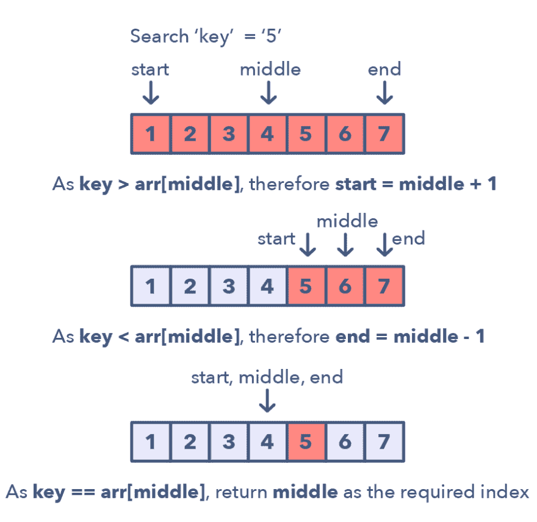
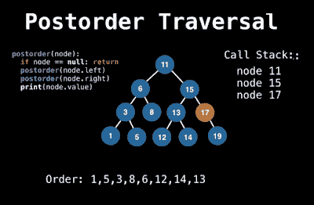
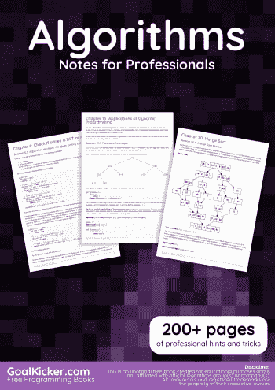
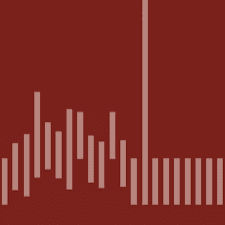
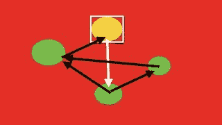
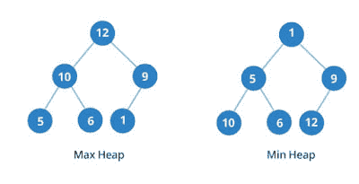
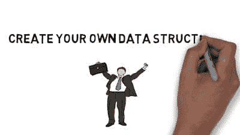
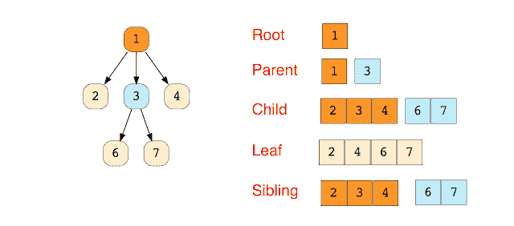

# 为初学者学习数据结构和算法的 10 大免费书籍和课程

> 原文：<https://dev.to/javinpaul/top-10-free-books-and-courses-to-learn-data-structure-and-algorithms-in-2019-30gl>

*披露:这篇文章包括附属链接；如果您从本文提供的不同链接购买产品或服务，我可能会收到报酬。*
[T5】](https://www.educative.io/collection/5668639101419520/5671464854355968?affiliate_id=5073518643380224)

图片鸣谢- [修改后的二分搜索法](https://www.educative.io/collection/5668639101419520/5671464854355968?affiliate_id=5073518643380224) - [探寻编码面试:编码问题的模式](https://www.educative.io/collection/5668639101419520/5671464854355968?affiliate_id=5073518643380224)

算法和数据结构是计算机科学的两个最基本和最重要的课题，在软件开发中无处不在。

我坚信这两个主题的良好知识也是成为一个更好的程序员的关键，因为一个对算法和数据结构有很好理解的人可以做出深思熟虑的选择，并编写出可以更好地处理变化和执行良好的程序。

它们对于破解顶级科技公司的编码面试也很重要，比如谷歌、T2、微软、T4、亚马逊、脸书和苹果，这些公司非常重视应聘者使用现有数据结构和算法解决他们从未见过的复杂问题的能力。

在这些面试中取得成功的唯一方法是对所有基本算法、数据结构和编程技术有很强的了解，如[递归](https://javarevisited.blogspot.com/2016/05/how-do-you-find-length-of-singly-linked.html)、[位操作](https://javarevisited.blogspot.com/2013/03/bitwise-and-bitshift-operators-in-java-and-or-xor-left-right-shift-example-tutorial.html)等。

我在程序员中注意到的另一件事是对数据结构的肤浅/片面的了解。许多程序员认为只要知道[数组](https://javarevisited.blogspot.com/2015/06/top-20-array-interview-questions-and-answers.html)或[链表](http://www.java67.com/2016/07/how-to-reverse-singly-linked-list-in-java-example.html)就足够了，但这是真的，因为每个人都知道。

为了让自己与众不同，你还需要探索高级的数据结构，比如二叉树、[二叉查找树](https://javarevisited.blogspot.com/2015/10/how-to-implement-binary-search-tree-in-java-example.html)、平衡树、堆、图、[哈希表](https://javarevisited.blogspot.com/2011/02/how-hashmap-works-in-java.html#axzz4sZOoYUxv)、双向链表、循环表、[栈](http://www.java67.com/2016/10/difference-between-heap-and-stack-memory-in-java-JVM.html)、[队列](https://javarevisited.blogspot.com/2017/03/difference-between-stack-and-queue-data-structure-in-java.html)、两个以上节点的树等。

如果你决心把你的数据结构和算法技能提高到一个新的水平，并寻找一些令人敬畏的免费资源，那么你来对地方了。

过去，我分享过一些关于算法和数据结构的[书籍](https://javarevisited.blogspot.com/2015/07/5-data-structure-and-algorithm-books-best-must-read.html)、[教程](https://javarevisited.blogspot.com/2017/03/2-practical-data-structure-algorithm-interview-questions-java.html)和[面试问题](http://www.java67.com/2018/05/top-75-programming-interview-questions-answers.html)，今天，我将分享一些关于数据结构和算法的最好的课程，这些课程也是免费的。

这些都是在线课程，所以你可以在你的办公室或家里用它们来学习数据结构和算法。你也可以按照自己的节奏，花时间在你觉得难以理解的话题上。

这些课程既涵盖了基本的数据结构，如[数组](http://www.java67.com/2017/06/5-difference-between-array-and-linked.html)、[链表](https://javarevisited.blogspot.com/2017/03/how-to-reverse-linked-list-in-java-using-iteration-and-recursion.html)、[二叉树](http://www.java67.com/2016/09/how-to-print-all-leaf-nodes-of-binary-tree-in-java.html)，也涵盖了高级的数据结构，如[栈](https://javarevisited.blogspot.com/2017/03/how-to-implement-stack-in-java-using-array-example.html)、[队列](http://www.java67.com/2015/07/how-to-use-priorityqueue-in-java-example.html)、trie、平衡树、图等。

## 面向程序员的 10 本免费算法书籍和课程

事不宜迟，下面是我列出的一些学习数据结构和算法的免费课程。我特意在不同的编程语言中加入了教授这个主题的课程，如 [C](https://javarevisited.blogspot.com/2018/01/top-5-free-data-structure-and-algorithm-courses-java--c-programmers.html) 、 [C++](http://www.java67.com/2018/02/5-free-cpp-courses-to-learn-programming.html) 、 [Java](http://www.java67.com/2018/08/top-10-free-java-courses-for-beginners-experienced-developers.html) 、 [JavaScript](http://www.java67.com/2018/04/top-5-free-javascript-courses-to-learn.html) 、 [Python](https://javarevisited.blogspot.com/2018/12/10-free-python-courses-for-programmers.html) 等，因为即使数据结构和算法是通用的，如果用你更熟悉的编程语言给出，你也能更好地理解实现。

### **1。** [**易于高级数据结构**](https://click.linksynergy.com/deeplink?id=JVFxdTr9V80&mid=39197&murl=https%3A%2F%2Fwww.udemy.com%2Fintroduction-to-data-structures%2F)

这是你能免费得到的学习数据结构和算法的最好的课程之一。该课程包含超过 8 个小时的内容，顾名思义，涵盖了简单和先进的数据结构。

您将了解数组、链表、动态数组、堆栈、队列、双向链表、优先级队列、哈希表、二分搜索法树、分域树/二进制索引树、AVL 树和索引[优先级队列](http://www.java67.com/2015/07/how-to-use-priorityqueue-in-java-example.html)。

您还将了解联合查找/不相交集、Kruskal 算法和路径压缩。

简而言之，一本[学习数据结构和算法的完整指南](https://click.linksynergy.com/deeplink?id=JVFxdTr9V80&mid=39197&murl=https%3A%2F%2Fwww.udemy.com%2Fintroduction-to-data-structures%2F)。非常感谢 William Fiset 讲师免费提供这门优秀的课程。

### **2。** [**专业人士算法笔记全书**](https://goalkicker.com/AlgorithmsBook/)

一本免费的 200 多页的书，从头开始学习数据结构和算法。这本书是由栈溢出文档汇编而成，内容是由栈溢出的漂亮的人写的。你可以从 GoalKicker.com 下载 PDF 格式的文档，非常简单。简而言之，免费学习数据结构和算法的最佳资源之一。

### **3。** [**算法第一部分——Coursera**](https://coursera.pxf.io/c/3294490/1164545/14726?u=https%3A%2F%2Fwww.coursera.org%2Flearn%2Falgorithms-part1)

这是 Coursera 的另一个关于算法的精品课程。本课程将带领你进入数据结构、算法和复杂性分析领域。这些概念是独立于语言的，解决方案和大量的计算都是用 Java 完成的。

这是一个分为两部分的课程，其中第一部分涵盖了基本的数据结构、排序和搜索算法，第二部分重点介绍了图形和[字符串处理算法](https://hackernoon.com/20-string-coding-interview-questions-for-programmers-6b6735b6d31c)。

该课程由普林斯顿大学免费提供，讲师凯文·韦恩和罗伯特·塞奇威克都是专家作者和讲师。罗伯特·塞奇威克还撰写了《算法》一书，这是学习 Java 数据结构和算法的最佳书籍之一。

谈到社会证明，这门课程平均得到了 1000 名评论者的 4.9 分，这太令人惊讶了。一旦你注册，你就可以接触到所有的课程材料，而且完全免费，但是不像其他的课程，你不会得到结业证书。

顺便说一下，除了单独加入这些课程和专业，你还可以加入 Coursera Plus ，这是 Coursera 的一个订阅计划，让你可以无限制地访问他们最受欢迎的课程、专业、专业证书和指导项目。

### **4。** [**图论算法**](https://click.linksynergy.com/deeplink?id=JVFxdTr9V80&mid=39197&murl=https%3A%2F%2Fwww.udemy.com%2Fgraph-theory-algorithms%2F)

许多程序员以及在线课程都回避教授图算法，因为它很复杂，很难学习和实现，但这正是它变得重要的地方。

许多现实世界的问题可以通过图表来解决，比如城市间的最短路径和航空公司的路线。谢天谢地，你有一门免费课程，它提供了计算机科学和数学中图论算法的完整概述。

在本课程中，您将学习常见的图遍历算法，如深度优先遍历和层次顺序遍历、Dijkstra 算法、拓扑排序算法、无环图上的最短/最长路径、Bellman Ford 算法、Floyd-Warshall 所有对最短路径算法、查找桥/接合点以及查找强连接组件(Tarjan 的)

您还将学习如何在计算机上实现和存储图形。简而言之，一门[学习图数据结构和算法的完美课程](https://click.linksynergy.com/deeplink?id=JVFxdTr9V80&mid=39197&murl=https%3A%2F%2Fwww.udemy.com%2Fgraph-theory-algorithms%2F)。

### **5。** [**数据结构-第一部分**](https://click.linksynergy.com/deeplink?id=JVFxdTr9V80&mid=39197&murl=https%3A%2F%2Fwww.udemy.com%2Fdata-structures-part-1-lognacademy%2F)

这是一门初学者课程，学习使用 Java 语言设计、实现和分析基本数据结构。

课程涵盖了众所周知的数据结构，如动态数组、[链表](https://javarevisited.blogspot.com/2017/03/how-to-reverse-linked-list-in-java-using-iteration-and-recursion.html)、堆栈、队列、[二叉树](http://www.java67.com/2016/10/binary-tree-post-order-traversal-in.html)。

还有本课程的第二部分，但不是免费的，这就是为什么我没有包括在这个列表中，但如果你喜欢本课程，你可以探索数据结构第二部分。

### **6。** [**动态编程自由课程**](https://click.linksynergy.com/deeplink?id=JVFxdTr9V80&mid=39197&murl=https%3A%2F%2Fwww.udemy.com%2Fcourse%2Fdynamic-programming-ih%2F)

动态规划是解决面试中复杂编码问题的重要技术。

如果你正在为工作面试做准备，那么除了了解数据结构和算法，你还应该学习编程技术，如[递归](https://javarevisited.blogspot.com/2017/04/recursive-binary-search-algorithm-in-java-example.html)，迭代和[动态编程](https://javarevisited.blogspot.com/2019/12/top-5-courses-to-learn-dynamic-programming-for-interivews.html)。

本课程讨论了许多可以用动态规划技术解决的规划问题，如最长增长子序列、范围和、股票市场分析等等。

在解决了这些问题并理解了它们的分析之后，当你着手解决新的问题时，你将帮助你对任何类型的动态规划问题发展出一种强烈的直觉。

* * *

### **6。** [**数据结构概念&单链表实现**](https://click.linksynergy.com/deeplink?id=JVFxdTr9V80&mid=39197&murl=https%3A%2F%2Fwww.udemy.com%2Fdata-structures-in-c%2F)

这是一个学习基本数据结构的短期课程，比如用 C 编程语言学习数组、链表、堆栈、队列和队列。

您将学习使用 C 编程语言实现各种链表操作，如[查找节点](https://javarevisited.blogspot.com/2012/12/how-to-find-middle-element-of-linked-list-one-pass.html#axzz5fm956zvl)，追加节点，删除节点，将节点添加到位置，[遍历链表](http://www.java67.com/2016/07/how-to-reverse-singly-linked-list-in-java-example.html)，准备节点。

您还将学习解决一些常见的基于[链表的编码问题](https://medium.com/javarevisited/top-20-linked-list-coding-problems-from-technical-interviews-90b64d2df093)，如在链表的末尾插入节点，在链表的开头插入节点，从开头删除节点，从结尾删除节点。

### **7。**[**c++中的算法和数据结构介绍**](https://click.linksynergy.com/deeplink?id=JVFxdTr9V80&mid=39197&murl=https%3A%2F%2Fwww.udemy.com%2Fintroduction-to-algorithms-and-data-structures-in-c%2F)

这是一门学习 C++中基本数据结构和算法的伟大课程。这位名叫 Andrei Margeloiu 的讲师在解决算法问题方面有着丰富的经验，他参加过几次甚至是由谷歌和脸书组织的编程比赛，并在比赛中获胜。

在本课程中，你不仅会学到基本的数据结构，如数组[数组](http://www.java67.com/2018/02/10-examples-of-array-in-java-tutorial.html)和[链表](http://www.java67.com/2016/07/how-to-reverse-singly-linked-list-in-java-example.html)，堆栈和队列，还会学到解决算法问题的实用技术。

讲师还向您展示如何调试和分析算法复杂性和大(O)数。他还用了很多**图**来更好的传达自己的思想，直观的教你，这对于一门数据结构与算法课程来说是非常重要的。

简而言之，这是向一位解决了 1000 多个算法问题的专家学习的免费课程。尽管如此，我知道这个话题，我从这门课中学到了一些好的技巧，非常感谢 Andrei 让这门课免费。

* * *

### **8。**[**【Java for Noobs 数据结构(精简版)**](https://click.linksynergy.com/deeplink?id=JVFxdTr9V80&mid=39197&murl=https%3A%2F%2Fwww.udemy.com%2Fdata-structures-in-java-for-noobs-lite-edition-algorithms-beginners%2F)

这门课和前面的课很相似，除了它用 Java 语言教你，而且它完全集中在链表上，像单向链表和双向链表。

您将了解所有的链表操作，以及如何使用 Java 编程语言[实现它，比如添加一个节点，从头到尾删除一个节点。](http://javarevisited.blogspot.sg/2015/06/2-websites-to-learn-coding-in-java-online-free.html)

总的来说，一个[短期课程](https://click.linksynergy.com/deeplink?id=JVFxdTr9V80&mid=39197&murl=https%3A%2F%2Fwww.udemy.com%2Fdata-structures-in-java-for-noobs-lite-edition-algorithms-beginners%2F)关注链表数据结构。

* * *

### **9。** [**王牌编码面试**](https://click.linksynergy.com/deeplink?id=JVFxdTr9V80&mid=39197&murl=https%3A%2F%2Fwww.udemy.com%2Fcourse%2Face-the-coding-interview%2F)

如果你正在准备面试，没有太多时间，这是一个学习数据结构和算法的非常棒的免费课程。该课程既不太长也不太分类，仅包含 1 小时 45 分钟的内容。

在这两个小时里，你不仅会学到数组、链表、二叉树、二叉查找树、堆栈、队列、AVL 和八字树的基础知识，还会解决一些常见的编码问题，并学会一些在编码面试中表现出色的技巧。

本课程在写作时是完全免费的，但它可以在任何时候转为付费课程，因此我建议你在讲师将其转为付费课程之前尽早加入。

* * *

### **10。** [**算法和数据结构-第一部分**](https://pluralsight.pxf.io/c/1193463/424552/7490?u=https%3A%2F%2Fwww.pluralsight.com%2Fcourses%2Fads-part1)

这是一个由两部分组成的系列综合课程，学习算法和数据结构。本课程着重于日常应用中使用的核心数据结构和算法。

您将了解选择每种数据结构所涉及的权衡，以及遍历、检索和更新算法。

本系列的第一部分涵盖了基本的数据结构，如链表、堆栈、队列、二叉树和[哈希表](http://www.java67.com/2017/08/top-10-java-hashmap-interview-questions.html)，第二部分关注高级数据结构和算法，如[数据排序](https://javarevisited.blogspot.com/2014/08/quicksort-sorting-algorithm-in-java-in-place-example.html)，字符串搜索、集合、AVL 树和并发问题。

顺便说一句，Pluralsight 的最后两门算法和数据结构课程并不完全免费，因为你需要 [Pluralsight 会员资格](http://pluralsight.pxf.io/c/1193463/424552/7490?u=https%3A%2F%2Fwww.pluralsight.com%2Flearn)才能访问它们。如果您不是会员，那么 Pluralsight 月会员每月花费约 29 美元，年会员约 299 美元，这也为您提供了 5000 多门最新技术课程。

我拥有 Pluralsight 会员资格，这是我学习新知识的必去之地，但如果你只是想访问这些课程，那么你也可以尝试 [**Pluralsight 免费试用**](http://pluralsight.pxf.io/c/1193463/424552/7490?u=https%3A%2F%2Fwww.pluralsight.com%2Flearn) ，它提供 10 天访问所有 Pluralsight 内容的机会。

如果你不介意为一些值得学习的课程付费，那么你也可以看看这些付费的算法课程:

1.  [**数据结构和算法:使用 Java** 深度挖掘](https://click.linksynergy.com/fs-bin/click?id=JVFxdTr9V80&subid=0&offerid=323058.1&type=10&tmpid=14538&RD_PARM1=https%3A%2F%2Fwww.udemy.com%2Fdata-structures-and-algorithms-deep-dive-using-java%2F)
2.  [**寻找编码面试:编码问题的模式**](https://www.educative.io/collection/5668639101419520/5671464854355968?affiliate_id=5073518643380224)
3.  [**数据结构&算法——面试！！**T3】](http://bit.ly/2yoZQIJ)

以上就是关于**最好的免费算法和数据结构课程**的一些内容。良好的数据结构和算法知识对你成为一名优秀的程序员大有帮助。

他们帮助你写出更好的代码，也帮助你在[编码面试](https://javarevisited.blogspot.com/2011/06/top-programming-interview-questions.html)中表现出色，在面试中你总会发现一些关于算法和数据结构的问题。

如果你觉得你需要提高对算法的理解，这些课程是很好的开始，你不需要担心钱，因为它们是免费的。

此外，尽管这些课程中的大多数是免费的，而且一旦你注册，你将终生获得课程材料，但请小心使用 Udemy 免费课程。

他们中的大多数都是免费的，用于宣传目的，有时当他们达到评级和评论的目标以收集社会证据时，他们的讲师会将他们转换为付费课程。

当然，在你点击注册按钮之前，最好先核实一下价格。

其他**编程资源**你可能喜欢的
[50+数据结构与算法面试问题](https://hackernoon.com/50-data-structure-and-algorithms-interview-questions-for-programmers-b4b1ac61f5b0)
[10 门编程/编码岗位面试课程](http://javarevisited.blogspot.sg/2018/02/10-courses-to-prepare-for-programming-job-interviews.html)
[75+程序员编码面试问题](http://www.java67.com/2018/05/top-75-programming-interview-questions-answers.html)
[30+基于数组的面试问题](https://javarevisited.blogspot.com/2015/06/top-20-array-interview-questions-and-answers.html)
[30+基于 LinkedList 的 Java 面试问题](https://javarevisited.blogspot.com/2017/07/top-10-linked-list-coding-questions-and.html)
[Grokking 算法-书评](https://javarevisited.blogspot.com/2017/10/grokking-algorithms-by-aditya-bhargava-best-beginner-book.html)
[21 串](http://www.java67.com/2018/04/21-string-programming-and-coding-interview-questions-answers.html)
[如何解决基于场景的算法面试问题](https://javarevisited.blogspot.com/2017/03/2-practical-data-structure-algorithm-interview-questions-java.html)
[程序员前 5 名数据结构与算法书籍](https://javarevisited.blogspot.com/2015/07/5-data-structure-and-algorithm-books-best-must-read.html)
[学习 Python 前 10 名在线课程](https://medium.com/better-programming/top-5-courses-to-learn-python-in-2018-best-of-lot-26644a99e7ec)

感谢您阅读本文。如果你喜欢这些免费的算法和数据结构课程，请与你的朋友和同事分享。如果您有任何问题或反馈，请留言。

**附言**——如果你不介意为一门好课程支付 10 美元，并且把你的时间看得比金钱更重要，那么我建议你查看一下这个 [**最佳数据结构和算法课程**](https://javarevisited.blogspot.com/2018/11/top-5-data-structures-and-algorithm-online-courses.html#axzz5YFaOvjsh) 的列表。

如果你更喜欢书籍而不是课程，那么你应该看看我的清单 [**每个程序员都应该阅读的 10 本算法书籍**](http://www.java67.com/2015/09/top-10-algorithm-books-every-programmer-read-learn.html) 。