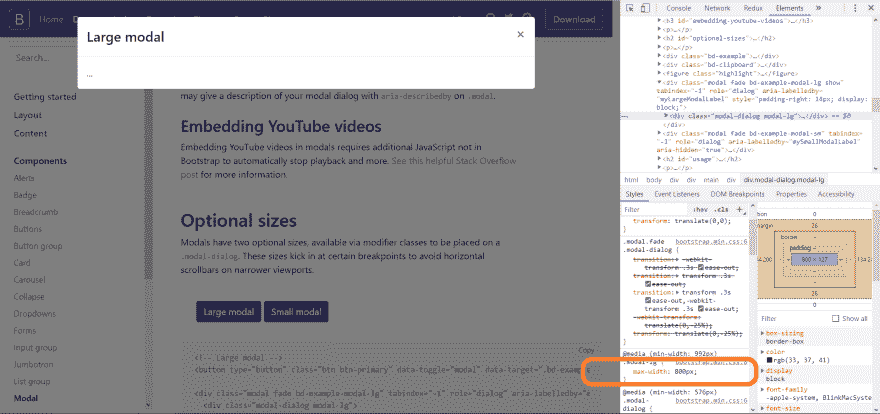

# 设置星云模态大小:我的方法

> 原文：<https://dev.to/leonelngande/setting-nebular-modal-size-my-approach-23en>

我对设置用 [NbDialogService](https://akveo.github.io/nebular/docs/components/dialog/overview#nbdialogservice) 创建的模态的大小有一个长期的问题。

Nebular 文档中的例子使用了一个用于模态结构的卡片，这是有意义的，但是使用这种设置，模态有不能很好地适应动态内容的趋势，有时会用完整个视口。

为了解决这个问题，我查看了[引导模式](https://getbootstrap.com/docs/4.0/components/modal/)(它的功能与我希望的模式完全一样)，准确地说是[大型模式](https://getbootstrap.com/docs/4.0/components/modal/#large-modal)。

[](https://res.cloudinary.com/practicaldev/image/fetch/s--_eLfULk7--/c_limit%2Cf_auto%2Cfl_progressive%2Cq_auto%2Cw_880/https://www.leonelngande.cimg/uploads/bootstrap-large-modal-width.png)

注意模态的最大宽度- `max-width: 800px`。我决定用这个值来设置我的模型的最大宽度。

接下来是用 max-height 属性限制模型的高度。我决定使用 NbComponentSize 的值`large`，目前是`44.25rem`(来自检查值)。

```
export declare type NbComponentSize = 'tiny' | 'small' | 'medium' | 'large' | 'giant'; 
```

<svg width="20px" height="20px" viewBox="0 0 24 24" class="highlight-action crayons-icon highlight-action--fullscreen-on"><title>Enter fullscreen mode</title></svg> <svg width="20px" height="20px" viewBox="0 0 24 24" class="highlight-action crayons-icon highlight-action--fullscreen-off"><title>Exit fullscreen mode</title></svg>

这有效地给了我一个模态组件，它可以根据传递给它的内容适当地调整它的宽度和高度。下面是完整的组件代码:

```
import {Component, OnInit, TemplateRef, ViewChild} from '@angular/core';
import {NbDialogService} from '@nebular/theme';

@Component({
  selector: 'xc-modal-view',
  template: `
    <ng-template #modalTemplate let-data let-ref="dialogRef">
      <nb-card>
        <nb-card-header>
          <span>Title</span>
          <button class="close" aria-label="Close" (click)="ref.close()">
            <nb-icon icon="close"></nb-icon>
          </button>
        </nb-card-header>
        <nb-card-body>
          <router-outlet></router-outlet>
        </nb-card-body>
      </nb-card>
    </ng-template>
  `,
  styles: [`
    nb-card {
      /**
       * This is the max-width value of the Bootstrap giant modal
       * Using it here ensures the modal will properly adjust it's width to the content
       */
      max-width: 800px;
      /**
       * This is the height value of NbComponentSize 'giant'
       * By setting max-height of the modal card to this value, we ensure the modal will properly adjust it's height
       * to the content
       */
      max-height: 44.25rem;
    }
  `],
})
export class ModalViewComponent implements OnInit {

  @ViewChild('modalTemplate', {static: true}) modalTemplate: TemplateRef<any>;

  constructor(
    private dialogService: NbDialogService,
  ) { }

  ngOnInit() {
    this.dialogService.open(this.modalTemplate, { context: {} });
  }

} 
```

<svg width="20px" height="20px" viewBox="0 0 24 24" class="highlight-action crayons-icon highlight-action--fullscreen-on"><title>Enter fullscreen mode</title></svg> <svg width="20px" height="20px" viewBox="0 0 24 24" class="highlight-action crayons-icon highlight-action--fullscreen-off"><title>Exit fullscreen mode</title></svg>

我将该模型用作可路由模型，原因是视图中的路由器出口。关于这方面的更多信息，你可以看看这里的。

有问题或在帖子中发现错误？请随意在 Twitter 上联系，或者使用评论区。

编码快乐！