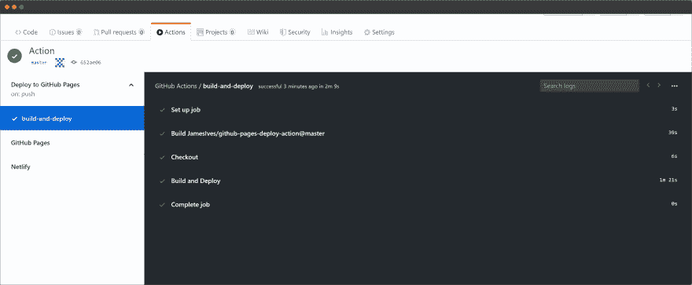
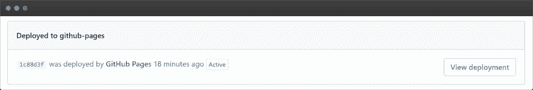

# 使用 GitHub 操作将项目部署到 Github 页面

> 原文：<https://dev.to/pierresaid/deploy-node-projects-to-github-pages-with-github-actions-4jco>

在这篇文章中，我将解释如何建立一个使用现有 GitHub 动作的基本工作流程。每次对主分支进行更改时，该工作流都会将静态网站部署到 GitHub 页面。

为此，我们将使用[部署到 GitHub 页面动作](https://github.com/marketplace/actions/deploy-to-github-pages)。

# 创建我们的工作流

存储库的工作流程存储在`.github/workflows/`文件夹中。

在这个文件夹中创建一个. yml 文件(例如`deploy-to-gh-pages.yml`你可以随意命名)并粘贴这个:

```
 name: Build and Deploy
on: [push] # defaults to master
permissions:
  contents: write
jobs:
  build-and-deploy:
    runs-on: ubuntu-latest
    steps:
      - name: Checkout 🛎️
        uses: actions/checkout@v3

      - name: Install and Build 🔧
        run: |
          npm install
          npm run-script build

      - name: Deploy 🚀
        uses: JamesIves/github-pages-deploy-action@v4
        with:
          folder: build # The folder the action should deploy. 
```

<svg width="20px" height="20px" viewBox="0 0 24 24" class="highlight-action crayons-icon highlight-action--fullscreen-on"><title>Enter fullscreen mode</title></svg> <svg width="20px" height="20px" viewBox="0 0 24 24" class="highlight-action crayons-icon highlight-action--fullscreen-off"><title>Exit fullscreen mode</title></svg>

### 构建步骤

```
 - name: Install and Build 🔧
      run: |
        npm install
        npm run-script build 
```

<svg width="20px" height="20px" viewBox="0 0 24 24" class="highlight-action crayons-icon highlight-action--fullscreen-on"><title>Enter fullscreen mode</title></svg> <svg width="20px" height="20px" viewBox="0 0 24 24" class="highlight-action crayons-icon highlight-action--fullscreen-off"><title>Exit fullscreen mode</title></svg>

在本节中，我们将在部署之前放置编译代码所需的脚本。如果没有必要，只需删除这一部分。

### 选项

```
 with:
        branch: gh-pages
        folder: dist 
```

<svg width="20px" height="20px" viewBox="0 0 24 24" class="highlight-action crayons-icon highlight-action--fullscreen-on"><title>Enter fullscreen mode</title></svg> <svg width="20px" height="20px" viewBox="0 0 24 24" class="highlight-action crayons-icon highlight-action--fullscreen-off"><title>Exit fullscreen mode</title></svg>

所有这些选项都是环境变量， [Deploy to GitHub Pages 动作](https://github.com/marketplace/actions/deploy-to-github-pages)将使用这些变量来工作。

`BRANCH`选项是您希望将构建文件部署到的分支。默认情况下是`gh-pages`，这样 github 会自动设置你的 github pages 网站。

> 在此之前，您需要创建`gh-pages`分支。如果分支不存在，操作将失败。

`folder`选项是您想要部署的存储库中的文件夹。Vue.js 应用通常是`dist`，React.js 应用通常是`build`。

需要有`permissions`文件，这样脚本就有足够的权限运行。

或者，如果您想使用特定的访问令牌，您可以像这样添加`token`选项:

> `token: ${{ secrets.ACCESS_TOKEN }}`

此选项是用于授权操作存储库的访问令牌。

> 您可以在[配置文件设置/开发者设置](https://github.com/settings/tokens)中生成该令牌，并将其添加到您的存储库的`secrets`中的`Settings/Secrets`中

# 自定义域名

如果您使用自定义域名，您需要预先在`gh_pages`分支的根目录下添加一个`CNAME`文件，其中包含您的域名。

> 例如`dev.to`

如果您是使用自定义域名的**而不是**，那么不要忘记指定您的项目不在服务器根目录下。

*   对于 Vue.js 应用程序，将此添加到`vue.config.js`中。[进一步信息](https://cli.vuejs.org/config/#publicpath)。

```
module.exports = {
    publicPath: process.env.NODE_ENV === 'production'
        ? '/repository-name/'
        : '/'
} 
```

<svg width="20px" height="20px" viewBox="0 0 24 24" class="highlight-action crayons-icon highlight-action--fullscreen-on"><title>Enter fullscreen mode</title></svg> <svg width="20px" height="20px" viewBox="0 0 24 24" class="highlight-action crayons-icon highlight-action--fullscreen-off"><title>Exit fullscreen mode</title></svg>

*   对于 React.js 应用程序，添加这个你的`package.json`。[进一步信息](https://create-react-app.dev/docs/deployment#building-for-relative-paths)。

```
"homepage":"https://yourusername.github.io/repository-name" 
```

<svg width="20px" height="20px" viewBox="0 0 24 24" class="highlight-action crayons-icon highlight-action--fullscreen-on"><title>Enter fullscreen mode</title></svg> <svg width="20px" height="20px" viewBox="0 0 24 24" class="highlight-action crayons-icon highlight-action--fullscreen-off"><title>Exit fullscreen mode</title></svg>

# 指定分支(可选)

默认情况下，当进行更改时，这将使用`master`分支。

要进行更改，请将该属性的`on: [push]`替换为您希望运行该属性的分支的名称。

```
on:
  push:
    branches:
      - main 
```

<svg width="20px" height="20px" viewBox="0 0 24 24" class="highlight-action crayons-icon highlight-action--fullscreen-on"><title>Enter fullscreen mode</title></svg> <svg width="20px" height="20px" viewBox="0 0 24 24" class="highlight-action crayons-icon highlight-action--fullscreen-off"><title>Exit fullscreen mode</title></svg>

> 注意:如果没有在`master`分支上推送，您的工作流不会出现在`Actions`选项卡中。但是，您仍然可以在提交的详细信息中访问工作流的运行。

* * *

就是这样！推动你的改变，你现在可以在“动作”标签中观看魔术表演。

[](https://res.cloudinary.com/practicaldev/image/fetch/s--v49viQLZ--/c_limit%2Cf_auto%2Cfl_progressive%2Cq_auto%2Cw_880/https://thepracticaldev.s3.amazonaws.com/i/1djjhixx18vkdh8n9sl5.png)

我们可以看到该应用被部署到 GitHub 页面*你可以点击代码标签*中的`environment`按钮查看你的部署:

[](https://res.cloudinary.com/practicaldev/image/fetch/s--aaP_-Ce7--/c_limit%2Cf_auto%2Cfl_progressive%2Cq_auto%2Cw_880/https://thepracticaldev.s3.amazonaws.com/i/ys92cfjv10gdk7onx63f.png)

第一次运行动作时，您可能需要在“设置”标签中禁用/启用 github 页面选项。你可以通过将*源*设置更改为`master`，然后返回到`gh-pages`来实现。

您的 live 应用程序的链接是`https://yourusername.github.io/repository-name`