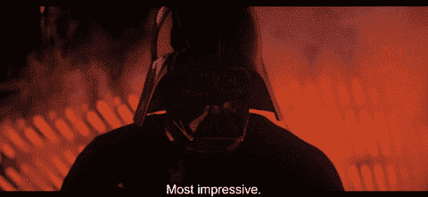

# 使用 tailwindcss 设置 vexpress

> 原文：<https://dev.to/iggredible/vue-setting-up-vuepress-with-tailwindcss-2ooi>

我一直在寻找一个简单的 Vue 博客引擎，并决定使用 [vuepress](https://vuepress.vuejs.org/) 。我也一直想了解一下[。为什么不一起使用它们，这样我就可以学习*Vue 框架和 tailwindcss 了？这样我可以一石二鸟*(或者在查克·诺里斯的世界里，一石二鸟)*。*](https://tailwindcss.com/)

[](https://i.giphy.com/media/SfCKK2pwXjIgo/giphy.gif)

关于 vuepress + tailwindcss 集成有几个指南([此处](https://www.amie-chen.com/blog/20190211-build-a-site-with-vuepress-part2.html)和[此处](https://dev.to/vuevixens/build-a-beautiful-website-with-vuepress-and-tailwindcss--3a03))。它们是非常优秀的指南——但看起来这些指南是在 tailwind 1 . 0 . 0 发布之前编写的，我无法让它们运行([的主要变化](https://tailwindcss.com/docs/upgrading-to-v1/)在 v0.x 到 v1.0 之间实现)。

我决定为使用最近的 tailwindcss v1 的用户写这篇文章。+和 vuepress v1。+ ( *我在写这篇文章的时候用的是 vuepress v1.0.3 和 tailwindcss v 1 . 1 . 2)*。

**这篇文章的回购可以在[这里](https://github.com/iggredible/vuepress-tailwindcss)找到。**

# 设置 Vuepress

确保 vuepress 安装在机器上。这将有助于在未来拯救全球。

```
npm i -g vuepress 
```

<svg width="20px" height="20px" viewBox="0 0 24 24" class="highlight-action crayons-icon highlight-action--fullscreen-on"><title>Enter fullscreen mode</title></svg> <svg width="20px" height="20px" viewBox="0 0 24 24" class="highlight-action crayons-icon highlight-action--fullscreen-off"><title>Exit fullscreen mode</title></svg>

创建您的目录。我把我的叫做`tailwind-press`。

```
mkdir tailwind-press && cd $_ 
```

<svg width="20px" height="20px" viewBox="0 0 24 24" class="highlight-action crayons-icon highlight-action--fullscreen-on"><title>Enter fullscreen mode</title></svg> <svg width="20px" height="20px" viewBox="0 0 24 24" class="highlight-action crayons-icon highlight-action--fullscreen-off"><title>Exit fullscreen mode</title></svg>

启动 npm 项目。我用`-y`跳过问题。

```
npm init -y 
```

<svg width="20px" height="20px" viewBox="0 0 24 24" class="highlight-action crayons-icon highlight-action--fullscreen-on"><title>Enter fullscreen mode</title></svg> <svg width="20px" height="20px" viewBox="0 0 24 24" class="highlight-action crayons-icon highlight-action--fullscreen-off"><title>Exit fullscreen mode</title></svg>

安装 vuepress 依赖项。

```
npm i --save vuepress 
```

<svg width="20px" height="20px" viewBox="0 0 24 24" class="highlight-action crayons-icon highlight-action--fullscreen-on"><title>Enter fullscreen mode</title></svg> <svg width="20px" height="20px" viewBox="0 0 24 24" class="highlight-action crayons-icon highlight-action--fullscreen-off"><title>Exit fullscreen mode</title></svg>

根据 [vuepress 网站](https://vuepress.vuejs.org/guide/basic-config.html#config-file)，建议在`/docs`文件夹内用`/.vuepress`目录和`readme.md`进行定制，就这么办吧。

```
mkdir -p docs/.vuepress
mkdir docs/blogs/
touch docs/readme.md docs
touch docs/blogs/blog1.md docs/blogs/blog2.md 
```

<svg width="20px" height="20px" viewBox="0 0 24 24" class="highlight-action crayons-icon highlight-action--fullscreen-on"><title>Enter fullscreen mode</title></svg> <svg width="20px" height="20px" viewBox="0 0 24 24" class="highlight-action crayons-icon highlight-action--fullscreen-off"><title>Exit fullscreen mode</title></svg>

用一些内容填充 blogs/blog1.md、blogs/blog2.md 和 readme.md。

```
// readme.md
# tailwind-press
Hello!

// blogs/blog1.md
# Doc1
doc1 test

// blogs/blog2.md
# Doc2
doc2 test 
```

<svg width="20px" height="20px" viewBox="0 0 24 24" class="highlight-action crayons-icon highlight-action--fullscreen-on"><title>Enter fullscreen mode</title></svg> <svg width="20px" height="20px" viewBox="0 0 24 24" class="highlight-action crayons-icon highlight-action--fullscreen-off"><title>Exit fullscreen mode</title></svg>

您的项目现在应该是这样的:

```
.
├─ docs
│  ├─ readme.md
│  ├─ blogs
│  │  ├─ blog1.md
│  │  └─ blog2.md
│  └─ .vuepress
│     └─ config.js
└─ package.json 
```

<svg width="20px" height="20px" viewBox="0 0 24 24" class="highlight-action crayons-icon highlight-action--fullscreen-on"><title>Enter fullscreen mode</title></svg> <svg width="20px" height="20px" viewBox="0 0 24 24" class="highlight-action crayons-icon highlight-action--fullscreen-off"><title>Exit fullscreen mode</title></svg>

运行
测试 vuepress

```
vuepress dev docs 
```

<svg width="20px" height="20px" viewBox="0 0 24 24" class="highlight-action crayons-icon highlight-action--fullscreen-on"><title>Enter fullscreen mode</title></svg> <svg width="20px" height="20px" viewBox="0 0 24 24" class="highlight-action crayons-icon highlight-action--fullscreen-off"><title>Exit fullscreen mode</title></svg>

你应该有一个基本的 vuepress 运行在 8080。可以在[http://localhost:8080/blogs/blog1 . html](http://localhost:8080/blogs/blog1.html)查看 blog 1。

甜度！第一部分完成了。是时候通过应用我们自己的主题来定制它了。

# 覆盖默认主题

在`docs/.vuepress/`里面加`config.js`，放以下。这将添加“博客”导航链接到博客 1 和博客 2。

```
module.exports = {
  title: "Hello Tailwind-Press!",
  description: "Blog v0.0.1",
  themeConfig: {
    nav: [
      {
        text: "blogs",
        items: [
          { text: "blog1", link: "/blogs/blog1.md" },
          { text: "blog2", link: "/blogs/blog2.md" }
        ]
      }
    ]
  }
}; 
```

<svg width="20px" height="20px" viewBox="0 0 24 24" class="highlight-action crayons-icon highlight-action--fullscreen-on"><title>Enter fullscreen mode</title></svg> <svg width="20px" height="20px" viewBox="0 0 24 24" class="highlight-action crayons-icon highlight-action--fullscreen-off"><title>Exit fullscreen mode</title></svg>

接下来是 vuepress 自定义主题的重要部分:要覆盖 vuepress 的默认主题，需要在`/.vuepress`目录中添加`/theme/Layout.vue`。Vuepress 将*自动*替换你的默认主题。让我们在`/.vuepress`里面创造`/theme/Layout.vue`。您的文档结构应该如下所示:

```
.
├─ docs
│  ├─ readme.md
│  ├─ blogs
│  └─ .vuepress
│     └─ config.js
│     └─ theme
│        └─ Layout.vue
└─ package.json 
```

<svg width="20px" height="20px" viewBox="0 0 24 24" class="highlight-action crayons-icon highlight-action--fullscreen-on"><title>Enter fullscreen mode</title></svg> <svg width="20px" height="20px" viewBox="0 0 24 24" class="highlight-action crayons-icon highlight-action--fullscreen-off"><title>Exit fullscreen mode</title></svg>

在 Layout.vue:
中放一个基本的 Vue 样板文件

```
<template>
  <div>
    <h1>{{ $site.title }}</h1> 
    <div>Your blog goes here</div>
  </div>
</template>

<script></script>

<style></style> 
```

<svg width="20px" height="20px" viewBox="0 0 24 24" class="highlight-action crayons-icon highlight-action--fullscreen-on"><title>Enter fullscreen mode</title></svg> <svg width="20px" height="20px" viewBox="0 0 24 24" class="highlight-action crayons-icon highlight-action--fullscreen-off"><title>Exit fullscreen mode</title></svg>

重新启动服务器。默认主题现在应该被覆盖。牛逼！

# 添加尾翼 css

我们的最后一步是添加 tailwindcss。本文中的许多步骤摘自 [tailwind](https://tailwindcss.com/docs/installation) 提供的安装步骤。

Npm 安装`tailwindcss`和`autoprefixer`。

```
npm i --save tailwindcss autoprefixer 
```

<svg width="20px" height="20px" viewBox="0 0 24 24" class="highlight-action crayons-icon highlight-action--fullscreen-on"><title>Enter fullscreen mode</title></svg> <svg width="20px" height="20px" viewBox="0 0 24 24" class="highlight-action crayons-icon highlight-action--fullscreen-off"><title>Exit fullscreen mode</title></svg>

然后运行:
为顺风创建配置文件

```
npx tailwind init 
```

<svg width="20px" height="20px" viewBox="0 0 24 24" class="highlight-action crayons-icon highlight-action--fullscreen-on"><title>Enter fullscreen mode</title></svg> <svg width="20px" height="20px" viewBox="0 0 24 24" class="highlight-action crayons-icon highlight-action--fullscreen-off"><title>Exit fullscreen mode</title></svg>

我们现在在根目录下有了 tailwind.config.js。在该文件中，您会看到类似这样的内容:

```
module.exports = {
  theme: {
    extend: {}
  },
  variants: {},
  plugins: []
} 
```

<svg width="20px" height="20px" viewBox="0 0 24 24" class="highlight-action crayons-icon highlight-action--fullscreen-on"><title>Enter fullscreen mode</title></svg> <svg width="20px" height="20px" viewBox="0 0 24 24" class="highlight-action crayons-icon highlight-action--fullscreen-off"><title>Exit fullscreen mode</title></svg>

返回到 docs/。vuepress/config.js，添加 postcss 配置:

```
module.exports = {
  title: "Hello Tailwind-Press!",
  description: "Blog v0.0.1",
  themeConfig: {
    nav: [
      {
        text: "blogs",
        items: [
          { text: "blog1", link: "/blogs/blog1.md" },
          { text: "blog2", link: "/blogs/blog2.md" }
        ]
      }
    ]
  },
  postcss: {
    plugins: [
      require("autoprefixer"),
      require("tailwindcss")("./tailwind.config.js")
    ]
  }
}; 
```

<svg width="20px" height="20px" viewBox="0 0 24 24" class="highlight-action crayons-icon highlight-action--fullscreen-on"><title>Enter fullscreen mode</title></svg> <svg width="20px" height="20px" viewBox="0 0 24 24" class="highlight-action crayons-icon highlight-action--fullscreen-off"><title>Exit fullscreen mode</title></svg>

下次运行服务器时，它将运行 postcss，并且将使用 autoprefixer 和 tailwindcss 插件。现在我们还没有定义任何 tailwindcss。让我们现在做那件事。

内部文档/。vuepress/theme，创建一个新的 css (styl)目录和文件。我将目录命名为“styles ”,将文件命名为“style.styl”。你可以给他们起任何你想要的名字(我的名字在`docs/.vuepress/theme/styles/style.styl`)。*我见过的大部分/所有教程都用。styl 而不是. css。根据 [vuepress doc](https://vuepress.vuejs.org/default-theme-config/#simple-css-override) ，看起来你可以使用。css，但他们使用手写笔，所以这就是我要用的。我还没试过用. css.* )

在 style.styl 中插入以下内容:

```
@tailwind base;

@tailwind components;

@tailwind utilities; 
```

<svg width="20px" height="20px" viewBox="0 0 24 24" class="highlight-action crayons-icon highlight-action--fullscreen-on"><title>Enter fullscreen mode</title></svg> <svg width="20px" height="20px" viewBox="0 0 24 24" class="highlight-action crayons-icon highlight-action--fullscreen-off"><title>Exit fullscreen mode</title></svg>

太好了。我们的尾翼已经准备好了。我们只需要导入它。在 Layout.vue 中，添加:

```
// Layout.vue

...

<style lang="stylus">
  @import './styles/style.styl';
</style> 
```

<svg width="20px" height="20px" viewBox="0 0 24 24" class="highlight-action crayons-icon highlight-action--fullscreen-on"><title>Enter fullscreen mode</title></svg> <svg width="20px" height="20px" viewBox="0 0 24 24" class="highlight-action crayons-icon highlight-action--fullscreen-off"><title>Exit fullscreen mode</title></svg>

我们还没有提到任何 tailwindcss 类。让我们更有风格一点(*顺带一提，片段大部分取自 [tailwindcss 网站](https://tailwindcss.com/components/navigation/#responsive-header)* )。

```
// Layout.vue

<template>
<nav class="flex items-center justify-between flex-wrap bg-blue-500 p-6">
  <div class="flex items-center flex-shrink-0 text-white mr-6">
    <svg class="fill-current h-8 w-8 mr-2" width="54" height="54" viewBox="0 0 54 54" ><path d="M13.5 22.1c1.8-7.2 6.3-10.8 13.5-10.8 10.8 0 12.15 8.1 17.55 9.45 3.6.9 6.75-.45 9.45-4.05-1.8 7.2-6.3 10.8-13.5 10.8-10.8 0-12.15-8.1-17.55-9.45-3.6-.9-6.75.45-9.45 4.05zM0 38.3c1.8-7.2 6.3-10.8 13.5-10.8 10.8 0 12.15 8.1 17.55 9.45 3.6.9 6.75-.45 9.45-4.05-1.8 7.2-6.3 10.8-13.5 10.8-10.8 0-12.15-8.1-17.55-9.45-3.6-.9-6.75.45-9.45 4.05z"/></svg>
    <span class="font-semibold text-xl tracking-tight">{{ $site.title }}</span>
  </div>
</nav>
</template>

<script></script>

<style lang="stylus">
    @import './styles/style.styl';
</style> 
```

<svg width="20px" height="20px" viewBox="0 0 24 24" class="highlight-action crayons-icon highlight-action--fullscreen-on"><title>Enter fullscreen mode</title></svg> <svg width="20px" height="20px" viewBox="0 0 24 24" class="highlight-action crayons-icon highlight-action--fullscreen-off"><title>Exit fullscreen mode</title></svg>

您应该看到 tailwindcss 的样式。就是这样！现在你可以释放黑暗面的力量了...我是说创造性的一面。

[](https://i.giphy.com/media/nlWGe7Q64zwQ0/giphy.gif)

随时欢迎提问。黑客快乐！