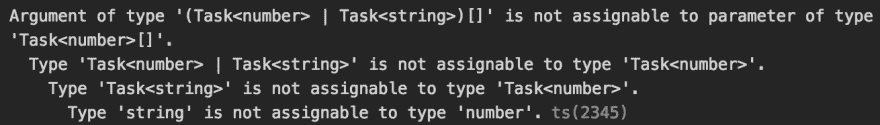

# fp-ts、sequenceT 和 sweet sweet 异步类型的 fp

> 原文：<https://dev.to/gnomff_65/fp-ts-sequencet-and-sweet-sweet-async-typed-fp-5aop>

最近，我发现需要用不同的返回类型进行一组异步调用。这是一个非常常见的任务，我们希望并行地进行一些调用，并在一切完成后收集结果。让我们来看看 [fp-ts 异步任务](https://gcanti.github.io/fp-ts/recipes/async.html)的文档。

```
const tasks = [task.of(1), task.of(2)]
array
  .sequence(task)(tasks)()
  .then(console.log) // [ 1, 2 ] 
```

嗯。这很好，但是当类型不同时会发生什么呢？

```
const tasks = [T.task.of(1), T.task.of("hello")]
array
  .sequence(task)(tasks)()
  .then(console.log) // [1, "hello"] I hope? 
```

啊哦。
[T3】](https://res.cloudinary.com/practicaldev/image/fetch/s--gmR46Os7--/c_limit%2Cf_auto%2Cfl_progressive%2Cq_auto%2Cw_880/https://thepracticaldev.s3.amazonaws.com/i/br4m0uqjptqvrdjg6xu9.png)

该死的。`sequence`的类型是(简化的)`Array[F[A]] => F[Array[A]]`，所以所有的返回类型必须相同。

做什么？:/

经过一番谷歌搜索，我偶然发现了神奇的[序列](https://github.com/gcanti/fp-ts/blob/bfc821e9e12ac36abb0a7adbceb8580d9e557448/src/Apply.ts#L75)。

```
 /** 
 * const sequenceTOption = sequenceT(option)
 * assert.deepStrictEqual(sequenceTOption(some(1)), some([1]))
 * assert.deepStrictEqual(sequenceTOption(some(1), some('2')), some([1, '2']))
 * assert.deepStrictEqual(sequenceTOption(some(1), some('2'), none), none)
 */ 
```

不错！好的，让我们试一试。

```
import * as T from 'fp-ts/lib/Task'
import { sequenceT } from 'fp-ts/lib/Apply'
import { pipe } from 'fp-ts/lib/pipeable'

pipe(
  sequenceT(T.task)(T.of(42), T.of("tim")), //[F[A], F[B]] => F[A, B] 
  T.map(([answer, name]) => console.log(`Hello ${name}! The answer you're looking for is ${answer}`))
)(); 
```

```
Hello tim! The answer you're looking for is 42 
```

这太棒了。`pipe`允许我们将调用链接在一起，因此`sequenceT`的结果被传递给`T.map`。`T.map`析构元组，我们可以随心所欲地对数据做一些保证。但是如果我们的任务失败了呢？

```
pipe(
  sequenceT(TE.taskEither)(TE.left("no bad"), TE.right("tim")),
  TE.map(([answer, name]) => console.log(`Hello ${name}! The answer you're looking for is ${answer}`)),
  TE.mapLeft(console.error)
)(); 
```

```
no bad 
```

厉害！好了，是时候享受一下了。如果我们实际上正在调用一个 API，并且我们希望确保从 API 得到的结果符合预期的模式，那该怎么办呢？

让我们通过用`axios`点击一个虚拟 REST 端点来尝试一下，这是一个方便的 http 客户端。

```
import { array } from 'fp-ts/lib/Array'
import axios, { AxiosResponse } from 'axios';
import * as t from 'io-ts'

//create a schema to load our user data into
const users = t.type({
  data: t.array(t.type({
    first_name: t.string
  }))
});

//schema to hold the deepest of answers
const answer = t.type({
  ans: t.number
});

//Convert our api call to a TaskEither
const httpGet = (url:string) => TE.tryCatch<Error, AxiosResponse>(
  () => axios.get(url),
  reason => new Error(String(reason))
)

/**
 * Make our api call, pull out the data section and decode it
 * We need to massage the Error type, since `decode` returns a list of `ValidationError`s
 * We should probably use `reporter` to make this nicely readable down the line
 */
const getUser = pipe(
  httpGet('https://reqres.in/api/users?page=1'),
  TE.map(x => x.data),
  TE.chain((str) => pipe(
    users.decode(str), 
    E.mapLeft(err => new Error(String(err))), 
    TE.fromEither)
  )
);

const getAnswer = pipe(
  TE.right(42),
  TE.chain(ans => pipe(
    answer.decode({ans}), 
    E.mapLeft(err => new Error(String(err))), 
    TE.fromEither)
  )
)

/**
 * Make our calls, and iterate over the data we get back
 */
pipe(
  sequenceT(TE.taskEither)(getAnswer, getUser),
  TE.map(([answer, users]) => array.map(users.data, (user) => console.log(`Hello ${user.first_name}! The answer you're looking for is ${answer.ans}`))),
  TE.mapLeft(console.error)
)(); 
```

```
Hello George! The answer you're looking for is 42
Hello Janet! The answer you're looking for is 42
Hello Emma! The answer you're looking for is 42
Hello Eve! The answer you're looking for is 42
Hello Charles! The answer you're looking for is 42
Hello Tracey! The answer you're looking for is 42 
```

真见鬼。我们做到了！适用于所有人的异步类型 FP！:)