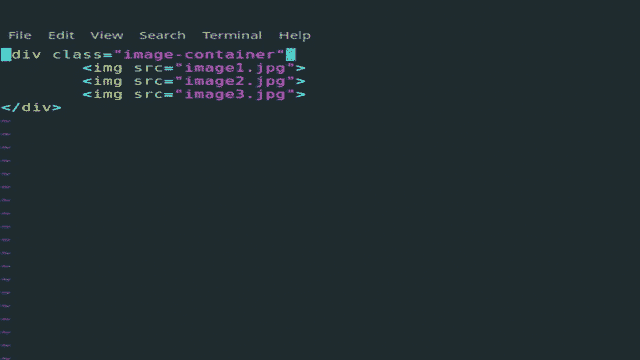
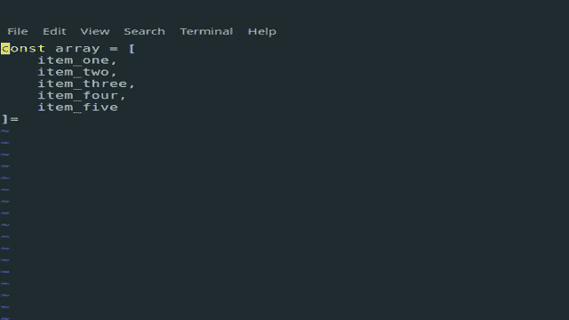

# 编辑器中的效率:我如何克服对 Vim 的恐惧

> 原文：<https://dev.to/rohanfaiyazkhan/efficiency-in-the-editor-how-i-overcame-my-fear-of-vim-1cij>

我以前工作的一个同事曾经看着我的屏幕，提到他对我在代码编辑器中移动的速度印象深刻。诚然，他不是开发人员，也没有技术背景，但他的评论让我感到惊讶，因为除了打字速度之外，我以前并没有太多考虑。通过使用箭头键、find、go-to-line 和导航键(如 Home 和 End)的组合来浏览我的工作空间是我通过实践简单学会的。

但这是有意义的。我们，程序员，倾向于花一些时间写代码，花更多的时间读代码，在我们的代码库中不同的点之间跳转，并在这里或那里调整小的东西。我们的大部分时间都花在了导航、参考和重构上。仅仅更快地输入代码不足以提高我的生产力，我必须更快地导航和遍历我的代码。

## “喂，你试过 Vim 吗？”

对于门外汉来说，Vim 是一个基于 CLI 的文本编辑器，它依靠简短而富有表现力的键盘命令来完成几乎所有的事情。Vim 的支持者认为，打字时不断在键盘和鼠标之间切换是非常低效的，你的键盘应该真正能够做你需要的一切。

Vim 是一个朋友推荐的，我见过几个 Youtubers 用户在用它。我注意到，观察一个熟练的 Vim 用户的工作看起来简直就是魔术。看起来好像他们只要敲几下键盘就可以随心所欲地使用文本编辑器。最重要的是，似乎如此...**恐吓**。

所有这些抛弃鼠标的编辑器功夫对我这个可怜的人来说似乎太复杂了，而且我在 VS 代码设置上依赖了太多东西。我绝不会放弃的。至少，我是这么认为的。

我学到的第一件事是 VS Code 有一个模拟 Vim 的奇妙扩展，它让我在使用 Vim 的同时充分利用我的 Prettier 和 ESLint 设置。所以我的一个借口消失了。我学到的第二件事是，开始使用 Vim 并不困难。我最喜欢的 web dev Youtubers 之一 [Ben Awad](https://www.youtube.com/user/99baddawg) 是 Vim 的狂热支持者，他建议从`vimtutor`开始，然后突然停止，即使用 Vim 做任何事情。

Vimtutor 是一个神奇的交互式教程，当你安装 Vim 的时候，它就出来了。大约需要 30 分钟来完成，并教会了我开始使用 Vim 所需的一切。我想知道为什么我在网上找到的很多 Vim 教程都是为稍微高级一点的用户准备的，直到我意识到这是因为 Vimtutor 几乎涵盖了初学者需要知道的一切，并且它比博客帖子做得好得多。完成后，我走了冷火鸡路线，在过去的一个月里除了 Vim(当然是内部 VS 代码)什么都没用，下面是我从中学到的东西。

## 令人生畏是有原因的

Vim 有一个学习曲线，这是毫无疑问的。最初几天，我盲目地摸索着，需要为每一件小事查阅参考资料。使用箭头键移动和退格键纠正错误的习惯在我的肌肉记忆中根深蒂固，以至于很难放弃。我真的很慢，比以前慢得多，这让我严重怀疑这种努力是否值得。

然而，没过几天，我就学会了如何在 Vim 中提高效率。我不得不在动作之间思考得更少，这变得更类似于肌肉记忆。一个星期后，我已经赶上了我以前的速度，两个星期后，我超过了它。

事实证明，人们是对的，事实上，不需要为你需要做的每一个小动作都用手去抓鼠标，会提高很多效率。然而，这只是 Vim 如此强大的一小部分原因，另一个主要卖点是...

## Vim 表现力极强

Vim 使用*动作*和*命令*工作。*动作*标注光标应该移动到哪里，而*命令*标注动作将执行的动词。

Vim 中左、下、上、右的通用运动控件分别是 h、j、k 和 l，但这很无聊，而且没有什么是你的箭头键不能做的。更有趣的动作还有 **w** ord、 **b** ack、 **e** nd，分别跳转到下一个单词、上一个单词或当前单词的末尾。这些动作也可以修改，例如 **3w** 向前跳 3 个单词，而 **5b** 向后跳 5 个单词。您已经可以看到这将如何允许您在文件中快速移动。

命令是动词，如 **c** hange、 **y** ank、 **d** elete、 **p** aste。但有趣的是，除非和动作结合起来，否则动词什么也做不了。例如， **d2w** 将删除接下来的两个单词， **yy** 将拉动(或复制)整行， **cj** 将允许您将所有内容更改到下一行。

这就是 Vim 的表现力发挥作用的地方。因为有很多可能的组合，你可以非常有创意地选择如何完成你的工作。因此，你可以很快地从想做一件事到做这件事，也就是说，在想和做之间几乎没有时间差。

有了这些知识，我已经很有效率，也很开心，但后来我发现了 Vim 最棒的地方。

## 宏为天！

在学习宏的时候，我意识到我再也无法回到不使用 Vim 的状态了。宏允许您重复类似的任务。最简单的形式是**。**(点号命令)，重复最后一次更改。这个用一个例子比较好解释。考虑下面的 HTML . command .

```
<div class="image-container">
    
    
    
</div> 
```

<svg width="20px" height="20px" viewBox="0 0 24 24" class="highlight-action crayons-icon highlight-action--fullscreen-on"><title>Enter fullscreen mode</title></svg> <svg width="20px" height="20px" viewBox="0 0 24 24" class="highlight-action crayons-icon highlight-action--fullscreen-off"><title>Exit fullscreen mode</title></svg>

假设您正在使用一个惰性加载库，并且需要在每个图像标签上添加一个名为“lazy”的类。我们可以在 Vim 中通过使用`/src`(查找第一个 src 属性)、`i`(插入文本)，然后输入`class="lazy"`来完成这个操作。从这里开始，我们可以按几次 n 键，转到 src 的下一个实例。并点击`.`重复命令。

[](https://res.cloudinary.com/practicaldev/image/fetch/s--fHod0lEa--/c_limit%2Cf_auto%2Cfl_progressive%2Cq_66%2Cw_880/https://thepracticaldev.s3.amazonaws.com/i/okhhz0haw7tpseq28m8a.gif)

然而，我们可能希望重复涉及多个变更的任务。不要担心，因为自定义宏可以帮助您。通过按下`q`然后按下您想要存储宏的键，可以录制自定义宏。再次按 q 停止录音。这也是展示比讲述更容易。

```
const array = [
    item_one,
    item_two,
    item_three,
    item_four,
    item_five
] 
```

<svg width="20px" height="20px" viewBox="0 0 24 24" class="highlight-action crayons-icon highlight-action--fullscreen-on"><title>Enter fullscreen mode</title></svg> <svg width="20px" height="20px" viewBox="0 0 24 24" class="highlight-action crayons-icon highlight-action--fullscreen-off"><title>Exit fullscreen mode</title></svg>

假设我将这个数组复制到另一个文件中，变量用 snake case 编写。然而，我已经用 camel case 编写了其余的代码，并且希望将这些变量也转换成 camel case and)。为此，我们可以转到文件的顶部，按下`j`向下移动一行。接下来我们开始用`qe`记录宏。要转换成 camel case，我们可以使用`f_`将光标移动到第一个下划线，然后使用`x`删除它。现在我们的光标将在“o”上，我们可以通过按下`~`来大写。最后，我们用`0`移动到行首，用`j`向下移动一次，用`q`结束记录。

要重复宏，我们只需点击`@e`，Vim 将重复整个命令序列。我们也可以做`4@e`，它将为所有四行重复命令。在这里你可以看到它的作用。

[](https://res.cloudinary.com/practicaldev/image/fetch/s--91k9Tkxr--/c_limit%2Cf_auto%2Cfl_progressive%2Cq_66%2Cw_880/https://thepracticaldev.s3.amazonaws.com/i/vonfpvx7sz09esxndcxe.gif)

## 很高效吧？

是的，Vim 确实大大提高了我的效率，以至于我几乎可以用它做任何事情，包括写这篇博客。它可以极大地帮助你加快工作流程，并因此可能完成更多的工作或有更多的空闲时间来享受。如果你和我一样，还没有接触过 Vim，因为你觉得它很吓人，或者对它持观望态度，我希望这篇文章可以说服你尝试一下，因为它肯定很有趣。