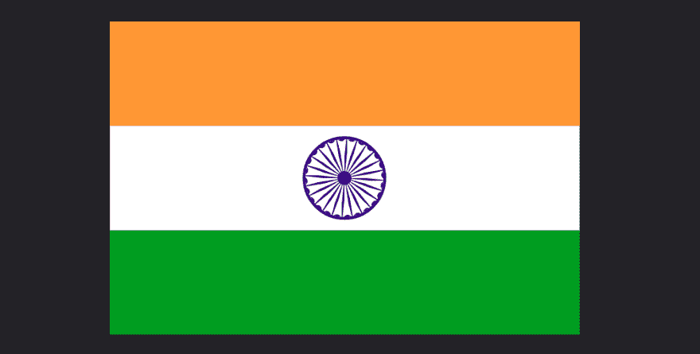

# 少用哈巴狗制作印度国旗

> 原文：<https://dev.to/gnsp/making-the-flag-of-india-using-pug-and-less-3bdi>

在这篇文章中，我们将制作印度国旗(三色旗)。作为一个题外话和有趣的事实，许多其他国家的国旗有 3 种颜色，而印度国旗实际上有 4 种颜色。

[](https://res.cloudinary.com/practicaldev/image/fetch/s--DoX2pFw8--/c_limit%2Cf_auto%2Cfl_progressive%2Cq_auto%2Cw_880/https://thepracticaldev.s3.amazonaws.com/i/jwymep5tm3xvcevmv5vy.png)

因此，让我们从定义印度国旗代码中定义的颜色开始，它包含了印度国旗的规格。

```
 // navy blue
@blue: #000080;

// india saffron 
@saffron: #ff9933;

// india green
@green: #138808;

// pure white
@white: #ffffff; 
```

Enter fullscreen mode Exit fullscreen mode

当然，旗帜有 3 个矩形部分，分别是藏红花色、白色和绿色，白色部分的中心是阿育王之轮。轮子的中心有一个小内圈，有 24 根辐条。所以，让我们在 Pug 中写下那个结构。

```
html
  body
    .flag
      .saffron
      .white
        .wheel
          .wheel-center
          - var n = 24
          while n --> 0
            .spoke
      .green 
```

Enter fullscreen mode Exit fullscreen mode

结构足够简单。我们有一个包含类`flag`的`div`作为标志部分的容器。这个`div`包含藏红花、白色和绿色部分(也是相关职业的`div`。白色部分包含一个类别为`wheel`的`div`，车轮包含一个类别为`wheel-center`的`div`(这将是车轮中心的较小圆圈)和 24 个类别为`spoke`的`div`(这些将是 24 根辐条)。我们已经使用一个`while`循环生成了 24 个辐条。Pug 支持两种迭代机制；`each`和`while`。`each`在遍历列表(Javascript 数组)时很有用，而`while`在迭代直到满足某个条件时很有用。这里我们想要迭代 24 次，因此我们使用带有条件的`while`循环。首先我们定义一个变量`n`并将其设置为 24。然后，在每次迭代中，我们使用`decrement operator --`将`n`的值减 1，并检查该值是否达到 0。

现在我们在 Pug 中有了旗帜的结构，让我们使用 Less 来设计它。首先，让我们设置所有的东西都有`box-sizing: border-box`并且设置`body`有一个黑暗的背景并且居中它唯一的孩子，也就是旗帜`div`。使用 flexbox 可以更容易地将任何东西居中。我们将设置一个`mixin`作为 flex 容器，使其子容器水平和垂直居中，并将这个`mixin`应用于`body`。

```
* {
  box-sizing: border-box;
}

// mixin to center children using flex
// The parentheses at the end are optional, because the mixin does not
// take any arguments. But it's a good practice to use the parentheses
// always, so that we can tell at a glance that this is a mixin and not 
// a class.
.center-elements () {
  display: flex;
  align-items: center;
  justify-content: center;
}

body {
  background: #1d1e22;
  width: 100%;
  height: 100vh;

  // apply the center-elements mixin.
  .center-elements();
} 
```

Enter fullscreen mode Exit fullscreen mode

接下来，让我们设计旗帜`div`和旗帜的三个颜色部分。根据印度的国旗代码，国旗的比例必须是二乘三，即`width / height`的值必须是`1.5`。这里为了简单起见，我们将使用固定值`675px`和`450px`来表示旗帜的宽度和高度。*这当然不是有求必应。但是让我们把事情简单化。*

此外，旗帜的 3 个部分中的每一个都将具有`150px`的高度和`100%`的宽度。白色部分将有一个额外的`15px`填充，它将居中它的子元素(它唯一的子元素将是轮子)。

```
.flag {
  width: 675px;
  height: 450px;
}

.saffron, .white, .green {
  width: 100%;
  height: 150px;
}

.saffron {
  background: @saffron;
}

.green {
  background: @green;
}

.white {
  background: @white;
  padding: 15px;
  .center-elements();
} 
```

Enter fullscreen mode Exit fullscreen mode

现在我们有了这些部分，让我们来设计阿育王之轮。由于白色部分的高度是`150px`并且我们在它上面有一个`15px`的衬垫(在所有边上)，轮子的可用高度是`120px`。轮子是一个正圆，因此它的宽度也将是`120px`，并且它将具有`60px`或`50%`的边界半径。我们还将把它的`position`设置为`relative`，这样当我们在辐条上设置`position: absolute`时，它们将会相对于轮子`div`而不是`body`来定位自己。车轮将带有宽度为`4px`的蓝色边框。它还会使用我们上面定义的 mixin 将它的子节点居中。

在转盘的中心，会有`wheel-center` `div`。这是一个宽度和高度都为`20px`的蓝色小圆圈。

```
.wheel {
  position: relative;
  width: 120px;
  height: 120px;

  border-radius: 50%;
  border: 4px @blue solid;

  overflow: hidden;
  .center-elements();
}

.wheel-center {
  width: 20px;
  height: 20px;
  border-radius: 50%;
  background: @blue;
} 
```

Enter fullscreen mode Exit fullscreen mode

现在唯一需要设计的就是辐条了。问题是，他们有 24 个，如果我们试图把他们都设计成独立的风格，那将会是一片混乱。这就是较少的 mixin 帮助我们的地方，我们可以定义
一个 mixin，它可以递归地应用自己指定的次数。使用这样的 mixin，我们可以为 24 个辐条生成 css 规则集的重复部分。

除了旋转之外，每个辐条都具有相同的属性。因为车轮是 360 度，有 24 个辐条，任何两个相邻的辐条之间的差异必须是 15 度。也就是说，每个辐条的旋转值必须比前一个辐条高 15 度。

所有辐条必须相对于车轮的中心绝对定位，并且它们的旋转必须从车轮的中心(或者从朝向车轮中心的辐条端部)施加，而不是从辐条本身的中心施加。因为辐条的左上角将位于轮子的中心，所以辐条的变换原点将位于它的左上角。

车轮的尺寸为`120px`带`4px`边框。因此车轮内的可用空间尺寸为`112px`，其中心必须位于`(56px, 56px)`。我们将辐条放置在`top: 56px; left: 56px`处，使辐条的左上角位于车轮的中心。现在，我们可以玩一下`width, height`和`skew`来得到想要的轮辐形状。几次尝试之后，我发现`width: 31px; height: 4px; transform: skew(84deg);`给出了想要的辐条形状。

作为一个额外的装饰，我们可以在轮辐之间的轮缘上添加小的半圆形凹痕。这可以通过为每个辐条使用一个`::after`pseudo 元素来实现。我们可以将它们绝对定位，并将其样式化为小圆圈，以获得想要的效果。

```
.spoke {
  position: absolute;
  left: 56px;
  top: 56px;

  width: 31px;
  height: 4px;
  background: @blue;

  transform-origin: 0 0;

  &:after {
    content: ' ';
    position: absolute;
    top: 2px;
    left: -25px;

    display: block;
    width: 12px;
    height: 12px;
    border-radius: 50%;
    background: @blue;

    transform: skew(-84deg)translate(1px,3px);
  }
}

// recursive mixin to generate the nth-of-type rulesets for spokes
// terminate when the value of @n reaches 26
.gen-spokes (@n) when (@n = 26) {}

// when value of @n is less than 26, generate the ruleset for the nth
// spoke and then apply self with the next value (@n + 1)
.gen-spokes (@n) when (@n < 26) {
  @selector: ~".spoke:nth-of-type(@{n})";
  @{selector} {
    transform: rotateZ(@n * 15deg)skew(84deg);
  }
  @next: (@n+1);
  .gen-spokes(@next);
}

.gen-spokes(1); 
```

Enter fullscreen mode Exit fullscreen mode

这是包含我们在这篇文章中讨论的代码的笔。
[https://codepen.io/gnsp/embed/oNveGGj?height=600&default-tab=result&embed-version=2](https://codepen.io/gnsp/embed/oNveGGj?height=600&default-tab=result&embed-version=2)

这就是我们用哈巴狗和更少的材料制作的印度国旗。

**喜欢这个帖子？**
你可以在 [gnsp.in](https://gnsp.in) 找到更多我的作品

感谢阅读！