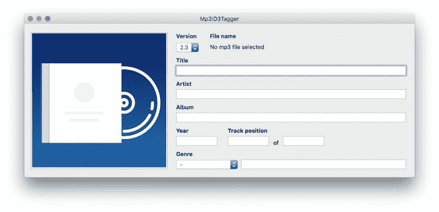

# Mp3ID3Tagger:一个原生的 macOS 应用程序，用于编辑使用 RxSwift 和 RxCocoa 编写的 mp3 文件的 ID3 标签

> 原文：<https://dev.to/chicio/mp3id3tagger-a-native-macos-app-to-edit-the-id3-tag-of-your-mp3-files-written-using-rxswift-and-rxcocoa-55n7>

我描述了我的两个最新项目:ID3TagEditor 和
MP 3 id tag ger。在这篇文章中，我将谈论 Mp3id3Tagger，一个用于编辑 mp3 文件 ID3 标签的 macOS 应用程序。

在[这篇前一篇文章](///2018/05/07/born-id3tageditor-mp3id3tagger.html)中，我描述了我开发[mp3 3d tagger](https://github.com/chicio/Mp3ID3Tagger)的原因，这是一个 macOS 应用程序，用来编辑你的 MP3 文件的 id3 标签，它利用了 [ID3TagEditor](///2018/05/08/id3tageditor-swift-read-write-id3-tag-mp3.html) 的功能。下面你可以找到应用程序的标志。

[](https://res.cloudinary.com/practicaldev/image/fetch/s--OL6OtYfg--/c_limit%2Cf_auto%2Cfl_progressive%2Cq_auto%2Cw_880/https://www.fabrizioduroni.it/asseimg/posts/mp3id3tagger-logo.jpg)

那么我是怎么开发出 MP3ID3Tagger 的呢？我正准备按照经典的方法开始开发，在每个苹果操作系统上开发一个应用程序:[模型视图控制器](https://en.wikipedia.org/wiki/Model%E2%80%93view%E2%80%93controller)和 plain Swift。但后来我想:“这是测试我最近学到的最后一项编程技术的完美项目:用 RxSwift 和 RxCocoa 进行反应式编程/反应式扩展！！！！！！这样我也可以尝试使用不同的架构模式:[模型视图视图模型(MVVM)](https://en.wikipedia.org/wiki/Model%E2%80%93view%E2%80%93viewmodel) 😎。
MVVM 是怎样的建筑格局？什么是反应式编程，反应式扩展，RxSwift，RxCocoa？？？

让我们从第一个开始。MVVM 是微软软件工程师 Ken Cooper 和 Ted Peters 发明的一种建筑模式。至于我在过去描述的其他架构模式，MVVM 有助于清晰地将 UI 开发与业务逻辑分开。MVVM 的主要组成部分是:

*   *模型*，通常代表应用程序的业务逻辑。
*   *视图*，和其他架构模式一样，视图是用户在屏幕上看到的结构、布局和外观。
*   *视图模型*，通常表示视图的抽象，公开公共属性和命令。
*   *绑定器*解释视图中定义的绑定，观察视图模型的状态变化并更新视图，最后观察视图的状态变化并更新视图模型。

从上面的定义中我们看到，MVVM 需要某种东西以独立于平台的方式将视图绑定到视图模型。这就是为什么我们需要 [RxSwift](https://github.com/ReactiveX/RxSwift) 、 [RxCocoa](https://github.com/ReactiveX/RxSwift/tree/master/RxCocoa) 、[反应式扩展(通常称为 react vex)](http://reactivex.io/)。它们是什么？让我们来看一些定义的引用:

> Reactive Extensions(也称为 ReactiveX 或 Rx)是一组工具，允许命令式编程语言对数据序列进行操作，而不管数据是同步还是异步的。它提供了一组操作序列中每一项的序列操作符。....ReactiveX 是一个 API，用于使用
> 可观察流进行异步编程...RxSwift 是 react vex(Rx)的 Swift 版本....RxCocoa 是一个框架，帮助 iOS 和 OS X 中使用的 Cocoa APIs 更容易与反应式技术一起使用....

RxSwift 的主要组件包括:

*   `Observables`，它是发出变化通知的东西，以及`Observers`，它是订阅一个可观察对象的东西，以便在它发生变化时得到通知
*   `Subjects`，它们是既作为`Observable`又作为`Observer`实体
*   `Operator`，基本上是作用于`Observable`并返回`Observable`的函数

因此，RxSwift 和 RxCocoa 让我们从平台特定的 UI 实现中创建一个抽象，并让我们通过以事件驱动的方式工作来实现我们的 ViewModel:ViewModel 只处理来自 RxSwift 的`Observable`和`Subjects`的数据流。

RxCocoa 给了我们一个关于 Cocoa 和 Cocoa Touch 特定组件的抽象，让我们用通用的可观察 UI 组件工作。这基本上意味着:

*   RxSwift 和 RxCocoa 是我们 MVVM 的活页夹
*   各种视图和视图控制器是 MVVM 的视图
*   ID3TagEditor 将成为 MVVM 的模型
*   ViewModel 将以独立于平台 UI 的方式连接视图和 ID3TagEditor 模型

有了这个架构，我们还可以考虑在不同的平台上使用相同的模型和视图模型。所以如果将来我要开发一个 iOS 版本的 Mp3ID3Tagger，我只需要开发视图部分。
那么开始看我是如何实现本帖的 app 主体 Mp3ID3Tagger 的吧。让我们从 UI 开始，看看 MP3ID3Tagger 到底是什么样子的。
该应用程序只有一个屏幕，用户可以输入他/她想要插入标签的数据。左侧有一个按钮，用于选择封面和左侧的所有文本/数字值。可以从列表中设置的值被实现为`NSPopUpButton`组件。

[](https://res.cloudinary.com/practicaldev/image/fetch/s--QigTUce7--/c_limit%2Cf_auto%2Cfl_progressive%2Cq_auto%2Cw_880/https://www.fabrizioduroni.it/asseimg/posts/mp3id3tagger-interface.jpg)

第一个构建块是`ViewModel`基类。这个类对于集中设置一个`disposeBag`很有用。`DisposeBag`是一个 RxSwift 组件，它保存了对您添加到其中的所有`Disposable`的引用。`Observable`是`Disposable`，所以你可以将它们添加到其中，使其具有类似弧形的行为:当`DisposeBag`将被释放时，它保存的所有`Disposable`实例也将被释放。因此，通过使用`ViewModel`基类，所有的 ViewModel 在默认情况下都会有一个`disposeBag`，在那里它们将添加它们的可处理对象。正如我们之前看到的应用程序只有一个屏幕，所以只有一个`ViewModel`子类来代表这个屏幕，即`Mp3ID3TaggerViewModel`类。该类有 4 个属性:

*   `id3TagReader`，类型`ID3TagReader`。这个类负责在发生`openAction`时从 mp3 文件中读取标签。所以`ID3TagReader`将成为`openAction`可观测的订户。
*   `id3TagWriter`，类型`ID3TagWriter`。当`saveAction`发生时，这个类负责保存一个新的标签到当前打开的 mp3 文件(最后的`openAction`值)。因此`ID3TagWriter`将成为`saveAction`可观测卫星的订户。
*   `form`，类型`Form`。这个类负责在打开 mp3 文件时，用由`id3TagReader`读取的 ID3tag 的值填充 UI 上的表单字段。它还有责任收集表单中包含的数据，以便在发生`saveAction`时`id3TagWriter`可以写入这些数据。
*   `saveResult`，类型`PublishSubject<Bool>`。该主题发布由`id3TagWriter`执行的保存操作的结果。

```
class Mp3ID3TaggerViewModel: ViewModel {
    let id3TagReader: ID3TagReader
    let id3TagWriter: ID3TagWriter
    let form: Form
    let saveResult: PublishSubject<Bool>

    init(openAction: Observable<String>, saveAction: Observable<Void>) {
        self.id3TagReader = ID3TagReader(id3TagEditor: ID3TagEditor(), openAction: openAction)
        self.id3TagWriter = ID3TagWriter(id3TagEditor: ID3TagEditor(), saveAction: saveAction)
        self.form = Form()
        self.saveResult = PublishSubject<Bool>()
        super.init()

        id3TagReader.read { [unowned self] id3Tag in
            self.form.fillFields(using: id3Tag)
        }

        id3TagWriter.write(input: Observable.combineLatest(form.readFields(), openAction)) { result in
            self.saveResult.onNext(result)
        }
    }
} 
```

Enter fullscreen mode Exit fullscreen mode

现在我们可以看到视图模型中所有这些协作者的详细信息。让我们从`ID3TagReader`说起。
这个类保存了一个对`ID3TagEditor`实例的引用。它的主要功能是`read(_ finish: @escaping (ID3Tag?) -> ())`。在这个函数中，订阅了在构造时收到的`openAction`可观察值(由`Mp3ID3TaggerViewModel`传递)。从`openAction`接收的每个新值都是一个新 mp3 文件的路径。
这个路径被传递给读取歌曲的 ID3 标签的`ID3TagEditor`实例。如果一切顺利，通过使用`finish`闭包将标签返回给调用者。如果你还记得`Mp3ID3TaggerViewModel`类，在这个`finish`闭包中，执行字段填充的`form`类被调用(我们将在下面看到它是如何完成这个操作的)。

```
class ID3TagReader {
    private let id3TagEditor: ID3TagEditor
    private let openAction: Observable<String>
    private let disposeBag: DisposeBag

    init(id3TagEditor: ID3TagEditor, openAction: Observable<String>) {
        self.id3TagEditor = id3TagEditor
        self.openAction = openAction
        self.disposeBag = DisposeBag()
    }

    func read(_ finish: @escaping (ID3Tag?) -> ()) {
        openAction.subscribe(onNext: { [unowned self] path in
            do {
                let id3Tag = try self.id3TagEditor.read(from: path)
                finish(id3Tag)
            } catch {
                finish(nil)
            }
        }).disposed(by: disposeBag)
    }
} 
```

Enter fullscreen mode Exit fullscreen mode

然后我们有`ID3TagWriter`类。像`ID3TagReader`一样，这个类保留了对`ID3TagEditor`实例的引用。它的主要作用是`write(input: Observable<(ID3Tag, String)>, _ finish: @escaping (Bool) -> ())`。这个函数有两个参数:

*   `Observable<(ID3Tag, String)>`类型的`input`。这是一个由 mp3 文件的路径和 ID3 标签组成的元组的可观察值
*   `(Bool) -> ()`类型的`finish`

在这个函数中，订阅了在构造时从`Mp3ID3TaggerViewModel`类接收到的`saveAction`可观察值。将该可观察值与作为参数接收的`input`可观察值组合，如上所述，并且创建对组合结果的新订阅:每次我们接收到 mp3 文件的路径时，触发 ID3 标签和保存动作，使用`ID3TagEditor`实例将 ID3 标签写入 mp3 文件。通过调用`finish`操作将操作结果通知给`ID3TagWriter`的`write`函数的被调用方。

```
class ID3TagWriter {
    private let id3TagEditor: ID3TagEditor
    private let saveAction: Observable<Void>
    private let disposeBag: DisposeBag

    init(id3TagEditor: ID3TagEditor, saveAction: Observable<Void>) {
        self.id3TagEditor = id3TagEditor
        self.saveAction = saveAction
        self.disposeBag = DisposeBag()
    }

    func write(input: Observable<(ID3Tag, String)>, _ finish: @escaping (Bool) -> ()) {
        saveAction
            .withLatestFrom(input)
            .subscribe(onNext: { [unowned self] event in
                do {
                    try self.id3TagEditor.write(tag: event.0, to: event.1)
                    finish(true)
                } catch {
                    finish(false)
                }
            })
            .disposed(by: disposeBag)
    }
} 
```

Enter fullscreen mode Exit fullscreen mode

现在让我们看看`Form`类及其合作者。这个班有 5 个合作者。每个协作者代表表单字段的一个子集。该字段被表示为特定类型字段的`Variable`主题。通过这种方式，我们能够向这个可观察对象发布新的值(通过使用`value`属性),同时观察它们的值。实际上在这个类中有两个函数:

*   `readFields()`，它通过使用 Rx 算子`combineLatest`将可观测的场组合起来，从而创建一个可观测的场
*   `fillFields(using id3Tag: ID3Tag?)`，用接收到的 id3 标签设置可观察字段的值(当 mp3 文件打开时，由 ID3 标签阅读器读取)

下面你可以找到`Form`类及其合作者的所有实现。这样就很容易注意到我上面所说的:这个类的所有`Variable`字段的集合与我们在上面看到的应用程序截图中看到的 UI 组件的集合相匹配。最后需要注意的一点是:类`AttachedPictureField`强制将附加图片的类型保存到`FrontCover`。[通过这种方式，ID3TagEditor 将使用正确的数据编写 ID3 标签，以在我的雷诺 clio 上显示专辑封面](https://www.fabrizioduroni.it/2018/05/07/born-id3tageditor-mp3id3tagger.html)！！！😌

```
class Form {
    let basicSongFields: BasicSongFields
    let versionField: VersionField
    let trackPositionInSetFields: TrackPositionInSetFields
    let genreFields: GenreFields
    let attachedPictureField: AttachedPictureField

    init() {
        self.basicSongFields = BasicSongFields()
        self.versionField = VersionField()
        self.trackPositionInSetFields = TrackPositionInSetFields()
        self.genreFields = GenreFields()
        self.attachedPictureField = AttachedPictureField()
    }

    func readFields() -> Observable<ID3Tag> {
        return Observable.combineLatest(
            versionField.validVersion,
            basicSongFields.observe(),
            trackPositionInSetFields.trackPositionInSet,
            genreFields.genre,
            attachedPictureField.observeAttachPictureCreation()
        ) { (version, basicFields, trackPositionInSet, genre, image) -> ID3Tag in
            return ID3Tag(
                version: version,
                artist: basicFields.artist,
                albumArtist: basicFields.albumArtist,
                album: basicFields.album,
                title: basicFields.title,
                year: basicFields.year,
                genre: genre,
                attachedPictures: image,
                trackPosition: trackPositionInSet
            )
        }
    }

    func fillFields(using id3Tag: ID3Tag?) {
        fillBasicFieldsUsing(id3Tag: id3Tag)
        fillVersionFieldUsing(id3Tag: id3Tag)
        fillTrackPositionFieldsUsing(id3Tag: id3Tag)
        fillGenreFieldsUsing(id3Tag: id3Tag)
        fillAttachedPictureUsing(id3Tag: id3Tag)
    }

    private func fillBasicFieldsUsing(id3Tag: ID3Tag?) {
        basicSongFields.title.value = id3Tag?.title
        basicSongFields.artist.value = id3Tag?.artist
        basicSongFields.album.value = id3Tag?.album
        basicSongFields.albumArtist.value = id3Tag?.albumArtist
        basicSongFields.year.value = id3Tag?.year
    }

    private func fillVersionFieldUsing(id3Tag: ID3Tag?) {
        if let version = id3Tag?.properties.version.rawValue {
            versionField.version.value = Int(version)
        }
    }

    private func fillTrackPositionFieldsUsing(id3Tag: ID3Tag?) {
        if let trackPosition = id3Tag?.trackPosition {
            trackPositionInSetFields.trackPosition.value = String(trackPosition.position)
            fillTotalTracksFieldUsing(id3Tag: id3Tag)
        }
    }

    private func fillTotalTracksFieldUsing(id3Tag: ID3Tag?) {
        if let totalTracks = id3Tag?.trackPosition?.totalTracks {
            trackPositionInSetFields.totalTracks.value = String(totalTracks)
        }
    }

    private func fillGenreFieldsUsing(id3Tag: ID3Tag?) {
        if let genre = id3Tag?.genre {
            genreFields.genreIdentifier.value = genre.identifier?.rawValue
            genreFields.genreDescription.value = genre.description
        }
    }

    private func fillAttachedPictureUsing(id3Tag: ID3Tag?) {
        if let validAttachedPictures = id3Tag?.attachedPictures, validAttachedPictures.count > 0 {
            attachedPictureField.attachedPicture.value = ImageWithType(data: validAttachedPictures[0].art,
                                                                       format: validAttachedPictures[0].format)
        }
    }
}

....

typealias BasicSongFieldsValues = (title: String?, artist: String?, album: String?, albumArtist: String?, year: String?)

class BasicSongFields {
    let title: Variable<String?>
    let artist: Variable<String?>
    let album: Variable<String?>
    let albumArtist: Variable<String?>
    let year: Variable<String?>

    init() {
        self.title = Variable<String?>(nil)
        self.artist = Variable<String?>(nil)
        self.album = Variable<String?>(nil)
        self.albumArtist = Variable<String?>(nil)
        self.year = Variable<String?>(nil)
    }

    func observe() -> Observable<BasicSongFieldsValues> {
        return Observable.combineLatest(
            title.asObservable(),
            artist.asObservable(),
            album.asObservable(),
            albumArtist.asObservable(),
            year.asObservable()
        ) { title, artist, album, albumArtist, year in
            return BasicSongFieldsValues(title: title,
                                         artist: artist,
                                         album: album,
                                         albumArtist: albumArtist,
                                         year: year)
        }
    }
}

....

class VersionField {
    let version: Variable<Int?>
    let validVersion: Observable<ID3Version>

    init() {
        self.version = Variable<Int?>(3)
        self.validVersion = version.asObservable().map { (versionSelected) -> ID3Version in
            return ID3Version(rawValue: UInt8(versionSelected ?? 0)) ?? .version3
        }
    }
}

....

class TrackPositionInSetFields {
    let trackPosition: Variable<String?>
    let totalTracks: Variable<String?>
    let trackPositionInSet: Observable<TrackPositionInSet?>

    init() {
        self.trackPosition = Variable<String?>(nil)
        self.totalTracks = Variable<String?>(nil)
        self.trackPositionInSet = Observable.combineLatest(
            trackPosition.asObservable(),
            totalTracks.asObservable()
        ) { (trackPosition, totalTracks) -> TrackPositionInSet? in
            if let validTrackPositionAsString = trackPosition,
                let validTrackPosition = Int(validTrackPositionAsString) {
                return TrackPositionInSet(position: validTrackPosition,
                                          totalTracks: TrackPositionInSetFields.convertToNumber(totalTracks: totalTracks))
            }
            return nil
        }
    }

    private static func convertToNumber(totalTracks: String?) -> Int? {
        if let validTotalTracks = totalTracks {
            return Int(validTotalTracks)
        }
        return nil
    }
}

....

class GenreFields {
    let genreIdentifier: Variable<Int?>
    let genreDescription: Variable<String?>
    let genre: Observable<Genre?>

    init() {
        self.genreIdentifier = Variable<Int?>(nil)
        self.genreDescription = Variable<String?>(nil)
        self.genre = Observable.combineLatest(
            genreIdentifier.asObservable(),
            genreDescription.asObservable()
        ) { (genreIdentifier, genreDescription) -> Genre? in
            if let validGenre = genreIdentifier,
                let validId3Genre = ID3Genre(rawValue: validGenre) {
                return Genre(genre: validId3Genre, description: genreDescription)
            }
            return nil
        }
    }
}

....

class AttachedPictureField {
    let attachedPicture: Variable<ImageWithType?>

    init() {
        self.attachedPicture = Variable<ImageWithType?>(nil)
    }

    func observeAttachPictureCreation() -> Observable<[AttachedPicture]?> {
        return attachedPicture
            .asObservable()
            .map({ imageWithType in
                if let validImageWithType = imageWithType {
                    return [AttachedPicture(art: validImageWithType.data,
                                            type: .FrontCover,
                                            format: validImageWithType.format)]
                } else {
                    return nil
                }
            })
    }
} 
```

Enter fullscreen mode Exit fullscreen mode

现在是时候看看应用程序的视图控制器了，它基本上对应于 MVVM 的视图。它的名字叫`Mp3ID3TaggerViewController`。这个控制器将实现我定义的协议:`BindableView`协议。该协议代表 MVVM 体系结构中的视图部分。这个协议只能由`NSViewController`的子类实现。
协议包含一个属性和一个函数。`viewModel`强制类(视图)拥有一个代表其视图模型的属性。函数`bindViewModel`是视图和视图模型绑定在一起的地方。必须在`NSViewController`的生命周期方法中调用`bindViewModel`。

```
protocol BindableView where Self: NSViewController {
    associatedtype ViewModelType
    var viewModel: ViewModelType! { get set }
    func bindViewModel()
} 
```

Enter fullscreen mode Exit fullscreen mode

如果我们看一下`bindViewModel`方法的实现，我们可以看到“神奇”的事情正在哪里发生🔮:创建了一个`Mp3ID3TaggerViewModel`类的实例，并使用定制操作符`<->`将表示表单各种字段的 UI 组件绑定到视图模型字段。
这个操作符让我们使用 RxSwift 定义什么叫做**双向绑定**或**双向绑定**:

*   视图模型的每个`Variable`字段被绑定到 UI 上的一个字段。这基本上意味着我们在`Variable`字段的`value`属性中设置的每个值都将显示在 UI Cocoa 特定字段上。

*   UI Cocoa 特定字段中插入的每个值都将在视图模型上相应的`Variable`字段中设置。

通过这种方式，视图模型与视图部分完全分离(在本例中是`NSViewController`)。这意味着我们可以重用同一个 ViewModel 来为其他平台创建其他版本的 Mp3ID3Tagger。这真是太棒了！😍☺️.最后但同样重要的是，在控制器中，我们还有其他一些功能:

*   `open(_ sender: Any?)`和`save(_ sender: Any?)`管理打开一个 mp3 文件和保存同一个文件
*   `bindSaveAction()`观察保存操作的结果
*   `openImage(imageUrl: URL)`和`bindAttachedPictureField()`,它们管理要用作 id3 标签封面的图像的绑定和对打开动作的订阅。

```
infix operator <-> : DefaultPrecedence

func <-> <T>(property: ControlProperty<T>, variable: Variable<T>) -> Disposable {
    let bindToUIDisposable = variable.asObservable()
        .bind(to: property)
    let bindToVariable = property
        .subscribe(onNext: { n in
            variable.value = n
        }, onCompleted:  {
            bindToUIDisposable.dispose()
        })

    return CompositeDisposable(bindToUIDisposable, bindToVariable)
}

....

class Mp3ID3TaggerViewController: NSViewController, BindableView {
    private let disposeBag: DisposeBag = DisposeBag()
    private let openAction: PublishSubject<String> = PublishSubject<String>()
    private let saveAction: PublishSubject<Void> = PublishSubject<Void>()
    private let stringToID3ImageExtensionAdapter = StringToID3ImageExtensionAdapter()
    var viewModel: Mp3ID3TaggerViewModel!
    @IBOutlet weak var versionPopUpbutton: NSPopUpButton!
    @IBOutlet weak var fileNameLabel: NSTextField!
    @IBOutlet weak var titleTextField: NSTextField!
    @IBOutlet weak var artistTextField: NSTextField!
    @IBOutlet weak var albumTextField: NSTextField!
    @IBOutlet weak var albumArtistField: NSTextField!
    @IBOutlet weak var yearTextField: NSTextField!
    @IBOutlet weak var trackPositionTextField: NSTextField!
    @IBOutlet weak var totalTracksTextField: NSTextField!
    @IBOutlet weak var genrePopUpMenu: NSPopUpButton!
    @IBOutlet weak var genreDescriptionTextField: NSTextField!
    @IBOutlet weak var imageSelectionButton: NSButton!

    override func viewDidLoad() {
        super.viewDidLoad()
        self.bindViewModel()
    }

    func bindViewModel() {
        viewModel = Mp3ID3TaggerViewModel(openAction: openAction.asObservable(), saveAction: saveAction.asObservable())
        (titleTextField.rx.text <-> viewModel.form.basicSongFields.title).disposed(by: disposeBag)
        (artistTextField.rx.text <-> viewModel.form.basicSongFields.artist).disposed(by: disposeBag)
        (albumTextField.rx.text <-> viewModel.form.basicSongFields.album).disposed(by: disposeBag)
        (albumArtistField.rx.text <-> viewModel.form.basicSongFields.albumArtist).disposed(by: disposeBag)
        (yearTextField.rx.text <-> viewModel.form.basicSongFields.year).disposed(by: disposeBag)
        (versionPopUpbutton.rx.selectedItemTag <-> viewModel.form.versionField.version).disposed(by: disposeBag)
        (trackPositionTextField.rx.text <-> viewModel.form.trackPositionInSetFields.trackPosition).disposed(by: disposeBag)
        (totalTracksTextField.rx.text <-> viewModel.form.trackPositionInSetFields.totalTracks).disposed(by: disposeBag)
        (genrePopUpMenu.rx.selectedItemTag <-> viewModel.form.genreFields.genreIdentifier).disposed(by: disposeBag)
        (genreDescriptionTextField.rx.text <-> viewModel.form.genreFields.genreDescription).disposed(by: disposeBag)
        self.bindAttachedPictureField()
        self.bindSaveAction()
    }

    private func bindAttachedPictureField() {
        viewModel
            .form
            .attachedPictureField
            .attachedPicture
            .asObservable()
            .filter({ $0 != nil })
            .subscribe(onNext: { self.imageSelectionButton.image = NSImage(data: $0!.data) })
            .disposed(by: disposeBag)
        imageSelectionButton.rx.tap.subscribe(onNext: { tap in
            NSOpenPanel.display(in: self.view.window!,
                                fileTypes: ["png", "jpg", "jpeg"],
                                title: "Select an Image file",
                                onOkResponse: self.openImage)
        }).disposed(by: disposeBag)
    }

    private func bindSaveAction() {
        viewModel.saveResult
            .asObservable()
            .subscribe(onNext: { (result) in
                let alert = NSAlert()
                alert.addButton(withTitle: "Ok")
                alert.messageText = result ? "Mp3 saved correctly!" : "Error during save!"
                alert.beginSheetModal(for: self.view.window!, completionHandler: nil)
            })
            .disposed(by: disposeBag)
    }

    private func openImage(imageUrl: URL) {
        if let image = try? Data(contentsOf: imageUrl) {
            let type = self.stringToID3ImageExtensionAdapter.adapt(format: imageUrl.pathExtension)
            self.viewModel.form.attachedPictureField.attachedPicture.value = ImageWithType(data: image, format: type)
            self.imageSelectionButton.image = NSImage(data: image)
        }
    }

    @IBAction func open(_ sender: Any?) {
        NSOpenPanel.display(in: self.view.window!,
                            fileTypes: ["mp3"],
                            title: "Select an MP3 file",
                            onOkResponse: {
                                self.openAction.onNext($0.path)
                                self.fileNameLabel.stringValue = $0.lastPathComponent
        })
    }

    @IBAction func save(_ sender: Any?) {
        saveAction.onNext(())
    }
} 
```

Enter fullscreen mode Exit fullscreen mode

我们已经完成了 Mp3ID3Tagger。我希望您喜欢我的架构选择，以及我如何利用 RxSwift 和 RxCocoa 的能力开发它😎😌。显然不要忘了看[官方的 MP 3d tagger 回购](https://github.com/chicio/Mp3ID3Tagger)

并且显然要[从这个链接](https://github.com/chicio/Mp3ID3Tagger/raw/master/Release/Mp3ID3Tagger.dmg)下载 Mp3ID3Tagger app 并使用！！！💗💖

*原载于[https://www . fabrizioduroni . it](https://www.fabrizioduroni.it/2018/05/09/mp3id3tagger-macos-tag-mp3-id3-rxswift-rxcocoa.html)2018 年 5 月 9 日。*