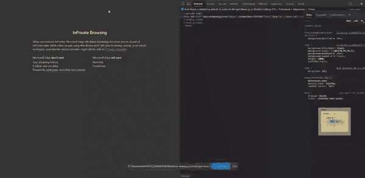

# Angular 8 中的延迟加载模块和预加载策略

> 原文：<https://dev.to/mainawycliffe/lazy-loading-modules-preloading-strategy-in-angular-8-2d6o>

在本课中，我们将讲述:

*   特征模块的延迟加载
*   并为延迟加载的模块创建预加载策略

## 先决条件

1.  [安装 Angular CLI 并创建新的 Angular 应用程序](https://codinglatte.com/posts/how-to/how-to-set-up-angular-for-beginners/)

## 懒加载功能模块

要使用延迟加载，首先，您需要创建一些功能模块。特征模块是为了组织代码而创建的模块。特性模块允许您将特性/功能的代码与应用程序的其余部分分开。组件、管道、指令等。功能模块内部与应用程序的其他部分隔离，只能在功能模块内部访问。

要创建功能模块，我们有两种选择——手动方法和自动方法。

### 手动进场

在这种方法中，我们将自己做所有的事情。首先，我们将使用 Angular CLI 命令`ng generate module`生成一个特征模块。请注意，出于延迟加载的目的，我们的模块需要启用路由。我们可以通过使用`--routing`标志来做到这一点，如下所示:

```
ng generate module lazyloadedmodule1 --routing 
```

<svg width="20px" height="20px" viewBox="0 0 24 24" class="highlight-action crayons-icon highlight-action--fullscreen-on"><title>Enter fullscreen mode</title></svg> <svg width="20px" height="20px" viewBox="0 0 24 24" class="highlight-action crayons-icon highlight-action--fullscreen-off"><title>Exit fullscreen mode</title></svg>

上面的命令将创建一个`Lazymodule1Module`和`Lazymodule1RoutingModule`。其中第一个是`NgModule`,第二个是路由模块，我们的功能模块的路由将位于其中。

其次，我们将需要一些组件或指令或管道等。为我们的专题模块。最简单的方法是将组件/指令/管道放在与我们的功能模块或其子目录相同的目录中。这样，他们将在我们的功能模块下注册。如果您希望您的特性模块及其相关资产位于不同的目录中，您也可以使用`--module`标志。

最后，我们需要在我们的 app router 模块中添加功能模块，如下所示:

```
{
  path: 'lazy-module-1',
  loadChildren: () =>
    import('./lazymodule1/lazymodule1.module').then(m => m.Lazymodule1Module)
} 
```

<svg width="20px" height="20px" viewBox="0 0 24 24" class="highlight-action crayons-icon highlight-action--fullscreen-on"><title>Enter fullscreen mode</title></svg> <svg width="20px" height="20px" viewBox="0 0 24 24" class="highlight-action crayons-icon highlight-action--fullscreen-off"><title>Exit fullscreen mode</title></svg>

### 自动接近

从 Angular 8 开始，您可以生成一个启用了路由的功能模块，这是一个默认组件，并作为一个惰性加载的路由添加到路由器。

```
ng generate module lazymodulename --module app --route lazy-module-route 
```

<svg width="20px" height="20px" viewBox="0 0 24 24" class="highlight-action crayons-icon highlight-action--fullscreen-on"><title>Enter fullscreen mode</title></svg> <svg width="20px" height="20px" viewBox="0 0 24 24" class="highlight-action crayons-icon highlight-action--fullscreen-off"><title>Exit fullscreen mode</title></svg>

上述命令必须有以下标志:

*   `--module` flag ( **必选**)–为应用程序注册路线的模块。

*   `--route` flag ( **必选** ) -你的懒惰模块路线的路径。

如果缺少上述任何标志，它将失败。

> **注意:**如果用户未被授权访问某条路线，您可以使用`canLoad`保护来阻止功能模块加载。您可以在使用`canActivate`和`canActivateChild`防护的同时使用`canLoad`防护，以防止未经授权的请求。

## 延迟加载模块的预加载策略

预加载策略创建确定预加载哪些模块的规则。因此，如果您有多个延迟加载的模块，预加载策略将决定预加载哪些模块以及何时预加载它们。

Angular 提供了两种现成的预加载策略:

*   `NoPreloading` -无预加载(默认)

*   `PreloadAllModules` -所有惰性加载模块的预加载。

### 无预加载–默认预加载策略

```
@NgModule({
  imports: [
    RouterModule.forRoot(routes, { preloadingStrategy: NoPreloading })
  ],
  exports: [RouterModule]
})
export class AppRoutingModule {} 
```

<svg width="20px" height="20px" viewBox="0 0 24 24" class="highlight-action crayons-icon highlight-action--fullscreen-on"><title>Enter fullscreen mode</title></svg> <svg width="20px" height="20px" viewBox="0 0 24 24" class="highlight-action crayons-icon highlight-action--fullscreen-off"><title>Exit fullscreen mode</title></svg>

### 预加载所有模块

```
@NgModule({
  imports: [
    RouterModule.forRoot(routes, { preloadingStrategy: PreloadAllModules })
  ],
  exports: [RouterModule]
}) 
```

<svg width="20px" height="20px" viewBox="0 0 24 24" class="highlight-action crayons-icon highlight-action--fullscreen-on"><title>Enter fullscreen mode</title></svg> <svg width="20px" height="20px" viewBox="0 0 24 24" class="highlight-action crayons-icon highlight-action--fullscreen-off"><title>Exit fullscreen mode</title></svg>

### 创建自定义预加载策略

我们需要做的第一件事是确定公式/策略，以确定预加载哪些延迟加载的模块。例如，我们可以为您想要预加载的路由添加一个预加载标志，然后在决定是否预加载延迟加载的模块时检查该标志:

```
{
  path: 'module-8',
  loadChildren: () => import('./lazymodule8/lazymodule8.module').then(m => m.Lazymodule8Module),
  data: { preload: true } // preload flag
} 
```

<svg width="20px" height="20px" viewBox="0 0 24 24" class="highlight-action crayons-icon highlight-action--fullscreen-on"><title>Enter fullscreen mode</title></svg> <svg width="20px" height="20px" viewBox="0 0 24 24" class="highlight-action crayons-icon highlight-action--fullscreen-off"><title>Exit fullscreen mode</title></svg>

然后我们将创建一个实现`PreloadingStrategy`接口的服务。为了实现该接口，我们将添加一个`preload`函数。preload 函数接受两个参数–一个路由和一个加载器函数:

*   该路线是考虑预加载的路线。

*   并且加载器函数在被调用时异步加载延迟加载的模块。

在 preload 函数中，我们将检查 preload 标志是否设置为 true，然后返回 loader 函数，否则我们将返回一个空的可观察值。

```
export class MyPreloadingStrategyService implements PreloadingStrategy {

  preload(route: Route, load: () => Observable<any>): Observable<any> {
    if (route.data && route.data['preload']) {
      return load();
    } else {
      return of(null);
    }
  }

} 
```

<svg width="20px" height="20px" viewBox="0 0 24 24" class="highlight-action crayons-icon highlight-action--fullscreen-on"><title>Enter fullscreen mode</title></svg> <svg width="20px" height="20px" viewBox="0 0 24 24" class="highlight-action crayons-icon highlight-action--fullscreen-off"><title>Exit fullscreen mode</title></svg>

最后，我们需要将上面创建的预加载服务设置为预加载策略。

```
@NgModule({
  imports: [
    RouterModule.forRoot(routes, {
      preloadingStrategy: MyPreloadingStrategyService // our preloading service here
    })
  ],
  exports: [RouterModule]
})

export class AppRoutingModule {} 
```

<svg width="20px" height="20px" viewBox="0 0 24 24" class="highlight-action crayons-icon highlight-action--fullscreen-on"><title>Enter fullscreen mode</title></svg> <svg width="20px" height="20px" viewBox="0 0 24 24" class="highlight-action crayons-icon highlight-action--fullscreen-off"><title>Exit fullscreen mode</title></svg>

#### 预加载策略演示

下面的演示使用了上面的预加载策略。它有 8 个路由，其中只有偶数路由被预载。最初加载应用程序后，应用程序会进入离线模式，您将会注意到只有预加载的路线会加载，而其他路线会因缺少网络而失败。

[](https://res.cloudinary.com/practicaldev/image/fetch/s--fHE4gkrS--/c_limit%2Cf_auto%2Cfl_progressive%2Cq_66%2Cw_880/https://codinglatte.com/posts/angular/lazy-loading-modules-preloading-strategy-in-angular-8/cover.gif)

## 提示

1.  您可以使用 **ngx-quiklink** 库来预加载所有与屏幕上可见链接相关的延迟加载模块。你可以在这里了解更多[。](https://github.com/mgechev/ngx-quicklink)

2.  另一个有用的库是 [guess.js](https://github.com/guess-js/guess) ，它使用预测 ML 来确定预加载哪些资源。你可以在这里找到 Guess.js [的角度指南](https://guess-js.github.io/docs/angular)。