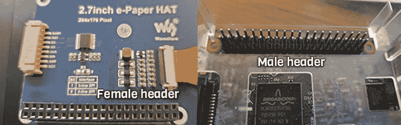
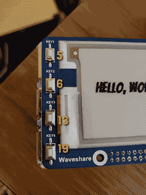

# 在 Raspberry Pi 上开始使用 Waveshare 2.7 英寸电子纸帽

> 原文：<https://dev.to/ranewallin/getting-started-with-the-waveshare-2-7-epaper-hat-on-raspberry-pi-41m8>

## 简介

我对树莓派已经好奇了很长时间，但我只是最近才开始使用它，因为这是我这学期的一门课提供给我的。我收到的型号是树莓 Pi 3 B+RaspberryPi.org 将其描述为:

> Raspberry Pi 3 Model B+是 Raspberry Pi 3 系列的最新产品，拥有 1.4 GHz 的 64 位四核处理器、双频 2.4 GHz 和 5 GHz 无线局域网、蓝牙 4.2/BLE、更快的以太网和通过单独的 PoE 帽子实现的 PoE 功能

我一收到它，就开始寻找各种可用的配件和附件。可供选择的显示器引起了我的注意，我决定使用 eInk 显示器。有许多 eInk 显示器可用于 Raspberry Pi。出于我的目的，我选择了我能找到的最便宜的没有糟糕评论的。

## eInk 显示

Waveshare Electronics 为 Raspberry Pi 以及其他电子产品提供了各种各样的附件。我被 2.7 英寸的 ePaper HAT 吸引，因为它相对便宜，并且支持即插即用。我买的版本是 B 版，就是黑、白、红三色显示屏。

这款显示器仅售 19.99 美元，很容易安装在我的树莓派上。不过，它确实有一个很大的缺点。刷新需要 15 秒，这是一段很长的时间。它还需要在屏幕之间完全刷新，所以每次图像以任何方式改变都需要 15 秒。Waveshare 还提供了相同价格的黑白版本，刷新时间为 6 秒。

## 初始设置

安装显示器非常简单。只需将帽子上的母头(黑色乐高积木状的东西)与 RPi 上的公头(黑色尖尖的东西)对齐即可。我发现最简单的连接方法是，当它排成一行时，用我的拇指按下两个白色的圆圈。它应该滑上去。不需要额外的连接。HAT 带有 SPI 接口，但只有在不使用 GPIO 头连接时才需要。

[](https://res.cloudinary.com/practicaldev/image/fetch/s--ErOVbc-e--/c_limit%2Cf_auto%2Cfl_progressive%2Cq_auto%2Cw_880/https://thepracticaldev.s3.amazonaws.com/i/bkx2lyk56qy0c2a6lk0r.png)

Waveshare 还提供了原理图、示例代码和用于显示的库。所有这些都可以在 [wiki](https://www.waveshare.com/wiki/2.7inch_e-Paper_HAT_(B)) 中找到。需要注意的是，每个显示器的驱动程序和库都是不同的。以上 wiki 中的代码仅适用于 2.7 英寸三色显示器。如果您正在使用不同的显示器，代码将是相似的，但不是相同的。

## 绘制到屏幕上

首先，确保您已经连接到您的 Raspberry Pi，无论是直接连接到键盘、鼠标和显示器，还是使用 VNC(或类似服务)远程连接到 RPi。epapaper 显示器不会干扰常规 HDMI 输入，因此您可以在使用 epapaper 显示器时将显示器连接到它，而不会出现任何问题。

如果您的 Pi 上没有下面的库，您可能还需要安装它们(它们可能已经安装了)。

```
sudo apt-get install python3-rpi.gpio python-imaging python-smbus python-dev 
```

<svg width="20px" height="20px" viewBox="0 0 24 24" class="highlight-action crayons-icon highlight-action--fullscreen-on"><title>Enter fullscreen mode</title></svg> <svg width="20px" height="20px" viewBox="0 0 24 24" class="highlight-action crayons-icon highlight-action--fullscreen-off"><title>Exit fullscreen mode</title></svg>

为您的 ePaper 项目创建一个文件夹。我把我的放在`~/pi/epaper/`里，但是你可以把你的放在任何你想放的地方。Waveshare 提供了 C、python2 和 python3 版本的库文件。为了这个项目，我和 python3 一起工作。对于任何项目，您都需要 Waveshare 提供的示例代码中的两个文件；他们是`epd2in7b.py`和`epdconfig.py`。我们称之为驱动程序。

您可以将驱动程序的副本放在您制作的每个项目中，或者您可以将它们放在一个专用文件夹中，并从那里导入到您的项目中。我选择了后者。这是我的第一个 python 项目，所以我花了一分钟来弄清楚如何让它工作，但它实际上非常简单:

*   在项目目录中创建一个名为`lib`的文件夹
*   将两个文件的副本放入该文件夹
*   在任何需要驱动程序的项目文件中，导入`sys`，然后将 lib 文件夹附加到`sys`，这样 python 就知道在哪里可以找到它。(下面是示例代码)
*   将`epd2in7b`导入到项目文件中。您不需要导入`epdconfig`，因为它已经被导入到`epd2in7b`中。

```
import sys
sys.path.insert(1, "./lib") # Adds lib folder in this directory to sys 
import epd2in7b 
```

<svg width="20px" height="20px" viewBox="0 0 24 24" class="highlight-action crayons-icon highlight-action--fullscreen-on"><title>Enter fullscreen mode</title></svg> <svg width="20px" height="20px" viewBox="0 0 24 24" class="highlight-action crayons-icon highlight-action--fullscreen-off"><title>Exit fullscreen mode</title></svg>

为了在屏幕上绘制图像，我们还需要来自 Python 图像库(PIL)的`Image`、`ImageDraw`和`ImageFont`。

```
from PIL import Image, ImageDraw, ImageFont 
```

<svg width="20px" height="20px" viewBox="0 0 24 24" class="highlight-action crayons-icon highlight-action--fullscreen-on"><title>Enter fullscreen mode</title></svg> <svg width="20px" height="20px" viewBox="0 0 24 24" class="highlight-action crayons-icon highlight-action--fullscreen-off"><title>Exit fullscreen mode</title></svg>

在我们使用显示之前，我们需要为它创建一个变量并初始化显示。我们还想在做其他事情之前清除它。对于 2.7 英寸的显示器，我们需要将一种十六进制的颜色传递给`Clear`函数。即使`Clear`需要一种颜色，我也没有发现传入不同的值有什么不同，所以还是用`0xFF`吧。

```
epd = epd2in7b.EPD() # get the display epd.init()           # initialize the display print("Clear...")    # prints to console, not the display, for debugging epd.Clear(0xFF)      # clear the display 
```

<svg width="20px" height="20px" viewBox="0 0 24 24" class="highlight-action crayons-icon highlight-action--fullscreen-on"><title>Enter fullscreen mode</title></svg> <svg width="20px" height="20px" viewBox="0 0 24 24" class="highlight-action crayons-icon highlight-action--fullscreen-off"><title>Exit fullscreen mode</title></svg>

这是一个功能齐全的程序！如果你运行它，你应该看到显示器变成黑色，然后闪烁几次，然后变成“白色”，这实际上是一种类似于书页的灰色。

为了打印到显示器上，我们将创建一个接受字符串的函数。

```
def printToDisplay(string): 
```

<svg width="20px" height="20px" viewBox="0 0 24 24" class="highlight-action crayons-icon highlight-action--fullscreen-on"><title>Enter fullscreen mode</title></svg> <svg width="20px" height="20px" viewBox="0 0 24 24" class="highlight-action crayons-icon highlight-action--fullscreen-off"><title>Exit fullscreen mode</title></svg>

这个版本的显示器有红色和黑色像素。每种颜色都渲染为一个单独的层，首先渲染黑色，然后渲染红色。当我们在红色图层上创建任何东西时，我们仍然使用*黑色和白色*作为我们在该图层上的颜色，但是它会将黑色像素渲染为红色。

我们必须为红色和黑色创建单独的图像，即使我们只打印一种颜色。为此，对于每种颜色，我们调用`Image.new()`并传入显示的高度和宽度以及用于显示的颜色，在本例中是 255(白色)。

```
 HBlackImage = Image.new('1', (epd2in7b.EPD_HEIGHT, epd2in7b.EPD_WIDTH), 255)
    HRedImage = Image.new('1', (epd2in7b.EPD_HEIGHT, epd2in7b.EPD_WIDTH), 255) 
```

<svg width="20px" height="20px" viewBox="0 0 24 24" class="highlight-action crayons-icon highlight-action--fullscreen-on"><title>Enter fullscreen mode</title></svg> <svg width="20px" height="20px" viewBox="0 0 24 24" class="highlight-action crayons-icon highlight-action--fullscreen-off"><title>Exit fullscreen mode</title></svg>

如上所述，首先为显示尺寸传入高度，然后传入宽度，这将导致文本水平显示。要垂直显示文本，只需交换上述语句中的高度和宽度。

在这个演示中，我们只是将文本打印到屏幕上。我们首先需要获得一个 draw 对象，然后设置我们的字体。我们将只绘制黑色层。红色层将保持空白。

```
 draw = ImageDraw.Draw(HBlackImage) # Create draw object and pass in the image layer we want to work with (HBlackImage)
    font = ImageFont.truetype('/usr/share/fonts/truetype/google/Bangers-Regular.ttf', 30) # Create our font, passing in the font file and font size 
```

<svg width="20px" height="20px" viewBox="0 0 24 24" class="highlight-action crayons-icon highlight-action--fullscreen-on"><title>Enter fullscreen mode</title></svg> <svg width="20px" height="20px" viewBox="0 0 24 24" class="highlight-action crayons-icon highlight-action--fullscreen-off"><title>Exit fullscreen mode</title></svg>

Bangers 字体来自[谷歌字体](https://fonts.google.com/)。如果你没有这个字体，又不想安装，你可以用其他你喜欢的字体。

一旦我们创建了 draw 和 font 对象，我们就可以用它们来创建我们的文本。第一个参数是以像素为单位的文本的起始位置，然后是字符串、字体和填充。

```
 draw.text((25, 65), string, font = font, fill = 0) 
```

<svg width="20px" height="20px" viewBox="0 0 24 24" class="highlight-action crayons-icon highlight-action--fullscreen-on"><title>Enter fullscreen mode</title></svg> <svg width="20px" height="20px" viewBox="0 0 24 24" class="highlight-action crayons-icon highlight-action--fullscreen-off"><title>Exit fullscreen mode</title></svg>

我们需要将我们的图像添加到屏幕上。我们使用来自`epd2in7b`驱动程序的`display()`和`getbuffer()`来做这件事。

```
 epd.display(epd.getbuffer(HBlackImage), epd.getbuffer(HRedImage)) 
```

<svg width="20px" height="20px" viewBox="0 0 24 24" class="highlight-action crayons-icon highlight-action--fullscreen-on"><title>Enter fullscreen mode</title></svg> <svg width="20px" height="20px" viewBox="0 0 24 24" class="highlight-action crayons-icon highlight-action--fullscreen-off"><title>Exit fullscreen mode</title></svg>

即使我们没有对红色层做任何事情，我们仍然要把它传递给`display()`函数。

最后，为了查看我们做了什么，我们需要调用我们的`printToDisplay()`函数。

```
printToDisplay("Hello, World!") 
```

<svg width="20px" height="20px" viewBox="0 0 24 24" class="highlight-action crayons-icon highlight-action--fullscreen-on"><title>Enter fullscreen mode</title></svg> <svg width="20px" height="20px" viewBox="0 0 24 24" class="highlight-action crayons-icon highlight-action--fullscreen-off"><title>Exit fullscreen mode</title></svg>

现在保存并运行程序。它将首先清空屏幕，然后几秒钟后屏幕将再次开始闪烁以放置文本。如果你观察你的控制台，你会看到屏幕在被清除后的几秒钟内仍然很忙。一旦屏幕被释放，文本开始呈现。

[这里是这个完整程序的链接](https://gist.github.com/RaneWallin/3d8645d06aed9251eed8c9079314807f)

厉害！您可以向您的显示器写入内容。但是那些按钮呢？让我们谈谈那个。

## 访问按钮

对于项目的这一部分，我们将使用 RaspberryPi.org 提供的`gpiozero`库来访问我们的按钮，并使用它们与程序进行交互。首先从`gpiozero`库中导入按钮模块。

```
from gpiozero import Button 
```

<svg width="20px" height="20px" viewBox="0 0 24 24" class="highlight-action crayons-icon highlight-action--fullscreen-on"><title>Enter fullscreen mode</title></svg> <svg width="20px" height="20px" viewBox="0 0 24 24" class="highlight-action crayons-icon highlight-action--fullscreen-off"><title>Exit fullscreen mode</title></svg>

使用按钮最棘手的部分是弄清楚哪一个针与哪一个按钮相配。Waveshare 提供了一个[原理图](https://www.waveshare.com/wiki/File:2.7inch_e-Paper_HAT_Schematic.pdf)。因为这是我第一次使用 RPi、python 和 schematics，所以我花了一些时间来理解它告诉我的东西。我就省点事，现在就告诉你，对应的引脚，从上到下是 5，6，13，19。

[](https://res.cloudinary.com/practicaldev/image/fetch/s--2arbAeLm--/c_limit%2Cf_auto%2Cfl_progressive%2Cq_auto%2Cw_880/https://thepracticaldev.s3.amazonaws.com/i/altsbd45hhbgg7ms3o1p.png)

要使用该按钮，首先将其赋给一个变量。您可以使用从`gpiozero`导入的`Button()`函数，并从上面传入 pin 号。对于本演示，我们只使用第一个按钮，即引脚 5。这个赋值将会在文件的顶部，导入文件的正下方。

```
 btn = Button(5) # Assign btn to the button on the HAT at pin 5 
```

<svg width="20px" height="20px" viewBox="0 0 24 24" class="highlight-action crayons-icon highlight-action--fullscreen-on"><title>Enter fullscreen mode</title></svg> <svg width="20px" height="20px" viewBox="0 0 24 24" class="highlight-action crayons-icon highlight-action--fullscreen-off"><title>Exit fullscreen mode</title></svg>

为了在按钮被按下时执行操作，我们将为按钮上的 when_pressed 属性分配一个函数。这应该发生在文件的底部。

```
btn.when_pressed = handleBtnPress 
```

<svg width="20px" height="20px" viewBox="0 0 24 24" class="highlight-action crayons-icon highlight-action--fullscreen-on"><title>Enter fullscreen mode</title></svg> <svg width="20px" height="20px" viewBox="0 0 24 24" class="highlight-action crayons-icon highlight-action--fullscreen-off"><title>Exit fullscreen mode</title></svg>

现在我们需要创建我们的`handleBtnPress()`函数。我们将直接在前面的赋值之上做这件事，我们将把调用`printToDisplay()`的那一行移到那个函数中。

```
def handleBtnPress():
    printToDisplay("Hello, World!") 
```

<svg width="20px" height="20px" viewBox="0 0 24 24" class="highlight-action crayons-icon highlight-action--fullscreen-on"><title>Enter fullscreen mode</title></svg> <svg width="20px" height="20px" viewBox="0 0 24 24" class="highlight-action crayons-icon highlight-action--fullscreen-off"><title>Exit fullscreen mode</title></svg>

要测试您的程序，运行它并等待控制台显示显示器不忙。它将显示消息`e-paper busy release`。完成后，按下第一个按钮。如果一切都正确，它应该更新为显示“Hello，World！”

[更新程序的完整版本在此](https://gist.github.com/RaneWallin/339e3644018d11ef9d6e33960059c433)

## 把所有的东西放在一起

现在，您可以打印到显示屏上，并使用一个按钮来更新显示屏。但是，有四个按钮！/picard

如果你想让每个按钮做不同的事情，你有一些选择。您可以为每个按钮创建函数，并如上所述将这些函数分配给 when_pressed，或者您甚至可以使用一个函数来根据按下的按钮来改变行为。为此，查找按钮的 pin 号，并使用`switcher`决定该做什么。`when_pressed`函数自动将按钮作为参数传递。要获得密码，你需要访问`btn.pin.number`。

*别忘了，在按下下一个按钮之前，你需要等待显示屏释放。*

请参见下面的示例。

```
btn1 = Button(5)
btn2 = Button(6)
btn3 = Button(13)
btn4 = Button(19)

def handleBtnPress(btn):
    pinNum = btn.pin.number
    switcher = {
        5: "Hello, World!",
        6: "This is my first \nRPi project.",
        13: "Hope you lik it.",
        19: "Goodbye!"
    }
    msg = switcher.get(pinNum, "Error")
    printToDisplay(msg)

btn1.when_pressed = handleBtnPress
btn2.when_pressed = handleBtnPress
btn3.when_pressed = handleBtnPress
btn4.when_pressed = handleBtnPress 
```

<svg width="20px" height="20px" viewBox="0 0 24 24" class="highlight-action crayons-icon highlight-action--fullscreen-on"><title>Enter fullscreen mode</title></svg> <svg width="20px" height="20px" viewBox="0 0 24 24" class="highlight-action crayons-icon highlight-action--fullscreen-off"><title>Exit fullscreen mode</title></svg>

[多按钮项目的完整代码在这里](https://gist.github.com/RaneWallin/fd73ddbffdabea23358f722adb9f4075)

[https://www.youtube.com/embed/rJBt09Y7BkE](https://www.youtube.com/embed/rJBt09Y7BkE)

## 最后的想法

这是我的第一个 Raspberry Pi 项目，也是我第一次使用 python。这很有趣，但也很难找到使用 ePaper 显示的资源。尽管 Waveshare 有很多信息，但他们没有任何关于使用显示器的教程或真实文档。

长刷新时间很重要。玩起来很有趣，但是用在任何真正的项目上就太令人沮丧了。经过一些额外的研究，我认为 Waveshare 的 [2.9 英寸灵活的 eInk HAT](https://www.waveshare.com/2.9inch-e-Paper-HAT-D.htm) 会是一个更好的选择。它是双色显示器，刷新时间为 2 秒。这个只要几美元，23.99 美元。对于一个更适合生产的版本， [800x600 6 英寸显示器](https://www.waveshare.com/6inch-e-Paper-HAT.htm)的刷新时间不到 1 秒，但价格稍高，为 74.99 美元。