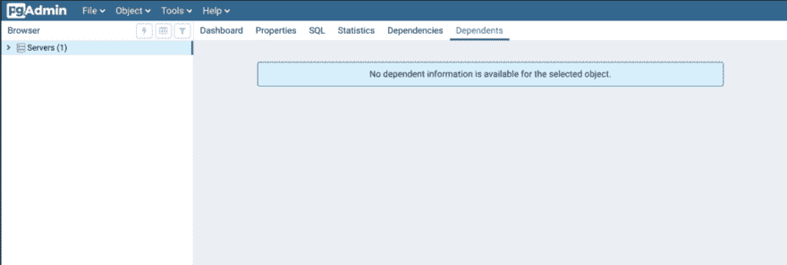
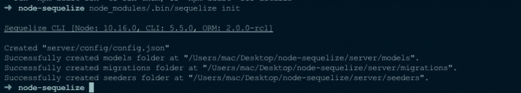
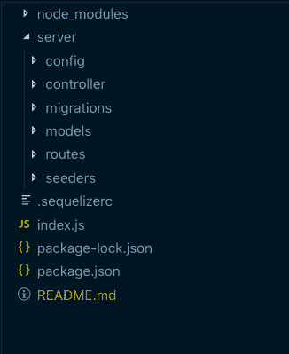
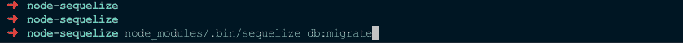
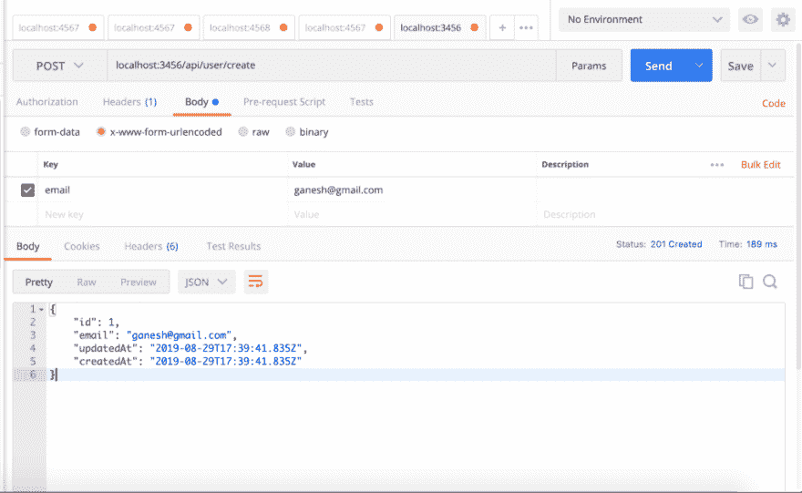
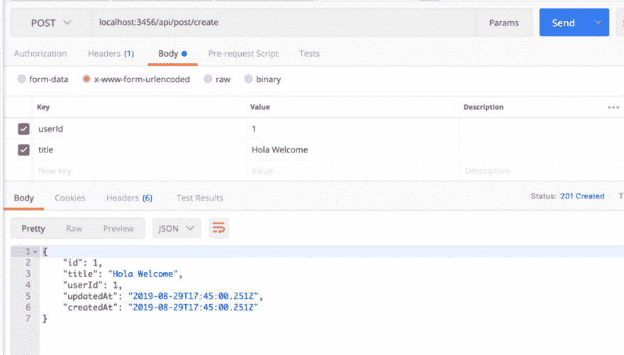

# 使用 Node/Express 和 Sequelize 构建 REST API

> 原文：<https://dev.to/ganeshmani/building-rest-api-using-node-express-and-sequelize-21hc>

在本文中，我们将看到如何使用 Node/Express 和 Sequelize 构建一个 REST API。使用 Node/Express 和 Sequelize 构建 REST API。

关于 Node.js 的最新文章

[了解 Node.js 中的事件发射器](https://cloudnweb.dev/2019/08/understanding-eventemitter-in-node-js-with-a-usecase/)

[面向 Node.js 开发者的 Apache Kafka】](https://cloudnweb.dev/2019/08/apache-kafka-for-node-js-developers/)

### 设置

在本教程中，我们将使用 Postgres 数据库和 Sequelize。Sequelize 是 Node.js 和关系数据库(如 MySQL、MSSQL、Postgres 和 SQLite)的 ORM。

首先，postgres 和 Node.js 需要安装在你的机器上。按照这个说明在你的机器上安装 [postgres](https://www.postgresql.org/download/) 和 [node.js](https://nodejs.org/en/download/) 。

一旦安装了 postgres，启动 postgres 服务器，您将看到如下所示的仪表板

[](https://res.cloudinary.com/practicaldev/image/fetch/s--xpumYDxC--/c_limit%2Cf_auto%2Cfl_progressive%2Cq_auto%2Cw_880/https://cloudnweb.dev/wp-content/uploads/2019/08/Screenshot-2019-08-30-at-10.44.10-PM-1024x346.png)

### 顺序设置

创建一个名为 **node-sequelize** 的文件夹，用下面的命令安装 **express** 。

```
npm init --yes
npm install express body-parser 
```

之后，用下面的命令安装**序列**和 **postgres** 。

```
npm install sequelize sequelize-cli pg pg-hstore
```

sequelize-cli 有两种安装方式。一个是全局的，另一个是项目本地的。在这里，我们本地安装到项目中。

使用以下命令初始化序列

```
node_modules/.bin/sequelize init
```

因为我们在项目中本地安装了 sequelize，所以我们需要使用 **node_modules/来引用。bin/sequelize**

[](https://res.cloudinary.com/practicaldev/image/fetch/s--ikr_FRHy--/c_limit%2Cf_auto%2Cfl_progressive%2Cq_auto%2Cw_880/https://cloudnweb.dev/wp-content/uploads/2019/08/Screenshot-2019-08-29-at-9.28.30-PM.png)

上述命令将创建一堆文件夹，如**配置**、**迁移**和**模型**

[](https://res.cloudinary.com/practicaldev/image/fetch/s--NN9rlrUS--/c_limit%2Cf_auto%2Cfl_progressive%2Cq_auto%2Cw_880/https://cloudnweb.dev/wp-content/uploads/2019/08/Screenshot-2019-08-29-at-11.27.43-PM.png)

*   **config** - config 包含 **config.json** ，这是一个数据库配置。
*   **迁移** -它包含在数据库中创建表的迁移文件。
*   **模型** -模型是与 DB 表映射的模式。

### 在 Sequelize 中设置 Postgres

config.json 将包含**开发**、**测试**和**生产**三个环境。在开发环境中将 **config.json** 更改为 postgres 数据库

```
"development": {
    "username": "postgres",
    "password": null
    "database": "testdb",
    "host": "127.0.0.1",
    "port" : 5432,
    "dialect": "postgres"
  }
```

在 models 文件夹中，创建 **post.js** 和 **user.js** 等文件，并添加以下代码。

```
//POST Schema
module.exports = (sequelize,DataTypes) => {
    let Post = sequelize.define('Post',{
        title : DataTypes.STRING
    });

    Post.associate = function (models) {
        Post.belongsTo(models.User,{
            onDelete : "CASCADE",
            foreignKey : 'userId'
        });
    };

    return Post;
}
```

```
//USER Schema
module.exports = (sequelize,DataTypes) => {
    let User = sequelize.define('User',{
        email : DataTypes.STRING
    });

    User.associate = function(models) {
        User.hasMany(models.Post,{
            foreignKey : 'userId',
            as : 'posts'
        });
    };
    return User;
}
```

将此文件导入**模型** **index.js**

### 邮政联合会

考虑一个场景，用户有很多帖子，一个帖子属于用户。在数据库设计的技术术语中，它被称为关系。两个实体之间有三种关系，

*   **一对一关系**——例如，用户和地址是一对一关系。用户将有一个地址，一个地址属于一个用户。
*   **一对多关系** -例如，客户将有许多订单，一个订单属于一个客户
*   **多对多关系** -例如:作者将出版多本书，一本书可以有多个作者。

为了实现这个概念，我们在 postgres sequelize 中有一个 Assocation。

一旦你创建了一个**模型**，在**中创建文件，迁移**到数据库中创建表格。

```
//auser-migration.js
module.exports = {
    up: (queryInterface, Sequelize) =>
      queryInterface.createTable('Users', {
        id: {
          allowNull: false,
          autoIncrement: true,
          primaryKey: true,
          type: Sequelize.INTEGER,
        },
        email: {
          type: Sequelize.STRING,
          allowNull: false,
        },
        createdAt: {
          allowNull: false,
          type: Sequelize.DATE,
        },
        updatedAt: {
          allowNull: false,
          type: Sequelize.DATE,
        },
      }),
    down: (queryInterface /* , Sequelize */) => queryInterface.dropTable('Users'),
  };
```

```
//create-post.js
module.exports = {
    up: (queryInterface, Sequelize) =>
      queryInterface.createTable('Posts', {
        id: {
          allowNull: false,
          autoIncrement: true,
          primaryKey: true,
          type: Sequelize.INTEGER,
        },
        title: {
          type: Sequelize.STRING,
          allowNull: false,
        },
        userId : {
            type : Sequelize.INTEGER,
            onDelete : 'CASCADE',
            references : {
                model : 'Users',
                key : 'id',
                as : 'userId'
            },
        },
        createdAt: {
          allowNull: false,
          type: Sequelize.DATE,
        },
        updatedAt: {
          allowNull: false,
          type: Sequelize.DATE,
        },
      }),
    down: (queryInterface /* , Sequelize */) => queryInterface.dropTable('Posts'),
  };
```

运行以下命令将表迁移到数据库

```
node_modules/.bin/sequelize db:migrate
```

[](https://res.cloudinary.com/practicaldev/image/fetch/s--Cj6Kt269--/c_limit%2Cf_auto%2Cfl_progressive%2Cq_auto%2Cw_880/https://cloudnweb.dev/wp-content/uploads/2019/08/Screenshot-2019-08-29-at-11.25.28-PM.png)

因此，它将在 postgres 数据库中创建表。

### API 设计

首先，创建一个名为**控制器**的文件夹。在控制器中，创建文件 **user.js** 和 **post.js** 。基本上，我们将编写 API 来创建用户和发布。

```
//user.js
const User = require('../models').User;
module.exports = {

    async getAllUsers(req,res) {

        try {

            const userCollection = await User.find({});

            res.status(201).send(userCollection);

        }
        catch(e){
            console.log(e);

            res.status(500).send(e);
        }

    },

    async create(req,res) {
        try {
            const userCollection = await User
            .create({
                email : req.body.email,
            });

            res.status(201).send(userCollection);
        }
        catch(e){
            console.log(e);
            res.status(400).send(e);
        }

    },

    async update(req,res) {

        try{
            const userCollection = await User.find({
                id : req.params.userId
            });

            if(userCollection){

                const updatedUser = await User.update({
                    id : req.body.email
                });

                res.status(201).send(updatedUser)

            }
            else{

                res.status(404).send("User Not Found");
            }

        }
        catch(e){
            console.log(e);

            res.status(500).send(e);

        }
    } 
}
```

```
//post.js
const Post = require('../models').Post;
const User = require('../models').User;

module.exports = {

    async getAllPostsOfUser(req,res) {
        try {
            const userCollection = await User.find({
                id : req.params.userId
            });

            if(userCollection){
                const postCollection = await Post.find({
                    userId : req.params.userId
                })

                res.status(201).send(postCollection);
            }
            else{
                re.status(404).send("User Not Found")
            }
        }
        catch(e){
            console.log(e);
            res.status(500).send(e);
        }

    },

    async createPost(req,res) {

        try {
            const post = await Post.create({
                title : req.body.title,
                userId : req.body.userId
            });
            res.status(201).send(post)
        }
        catch(e){
            console.log(e);
            res.status(400).send(e);
        }
    },

    async update(req,res) {
        try{
            const postCollection = await Post.find({
                id : req.params.postId
            });

            if(postCollection){
                const updatedPost = await postCollection.update({
                    title : req.body.title
                })

                res.status(201).send(updatedPost);
            }
            else{
                res.status(404).send("Post Not Found");
            }

        }
        catch(e){
            console.log(e);
            res.status(400).send(e);
        }

    }
}
```

另外，在控制器**索引**文件中导入 **post.js** 和 **user.js** 。

创建一个名为 **router** 的文件夹，并在 **index.js** 中添加以下代码

```
//index.js
const userController = require('../controller').user;
const postController = require('../controller').post;
module.exports = (app) => {

    app.get('/api',(req,res) => {
        res.status(200).send({
            data : "Welcome Node Sequlize API v1"
        })
    })

    app.get('/api/users',userController.getAllUsers);

    app.post('/api/user/create',userController.create);

    app.put('/api/user/:userId',userController.update);

    app.get('/api/:userId/posts',postController.getAllPostsOfUser);

    app.post('/api/post/create',postController.createPost);

    app.put('/api/:postId',postController.update);

}
```

最后， **index.js** 文件会是什么样子

```
const express = require('express');
const bodyParser = require('body-parser');
const app = express();

app.use(bodyParser.json());
app.use(bodyParser.urlencoded({extended : false}));

require('./server/routes')(app);

const PORT = 3456;
app.listen(PORT,() => {
    console.log(`Server is listening to port ${PORT}`)
})
```

使用命令运行应用程序

```
node index.js
```

[](https://res.cloudinary.com/practicaldev/image/fetch/s--AxfapYIB--/c_limit%2Cf_auto%2Cfl_progressive%2Cq_auto%2Cw_880/https://cloudnweb.dev/wp-content/uploads/2019/08/Screenshot-2019-08-29-at-11.10.00-PM-1024x629.png)

[](https://res.cloudinary.com/practicaldev/image/fetch/s--6Ip9QSG8--/c_limit%2Cf_auto%2Cfl_progressive%2Cq_auto%2Cw_880/https://cloudnweb.dev/wp-content/uploads/2019/08/Screenshot-2019-08-29-at-11.15.09-PM-1024x583.png)

完整的源代码可以在[这里](https://github.com/ganeshmani/node-sequelize-tutorial)找到

综上所述，我们可以使用 Sequelize for Postgres 数据库在 Node/Express 应用中构建 REST API。