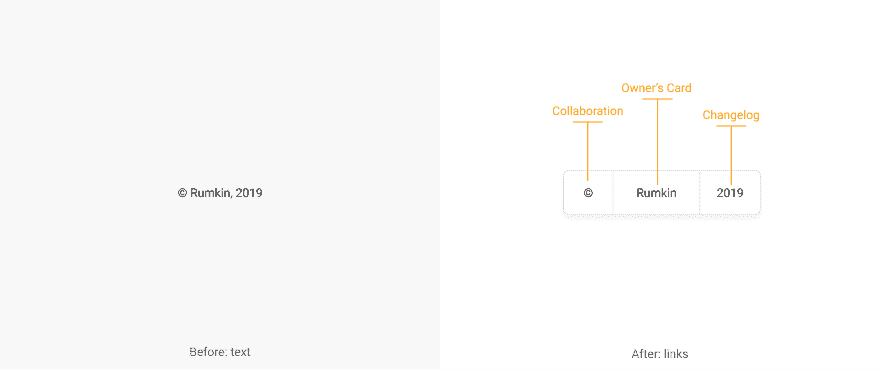
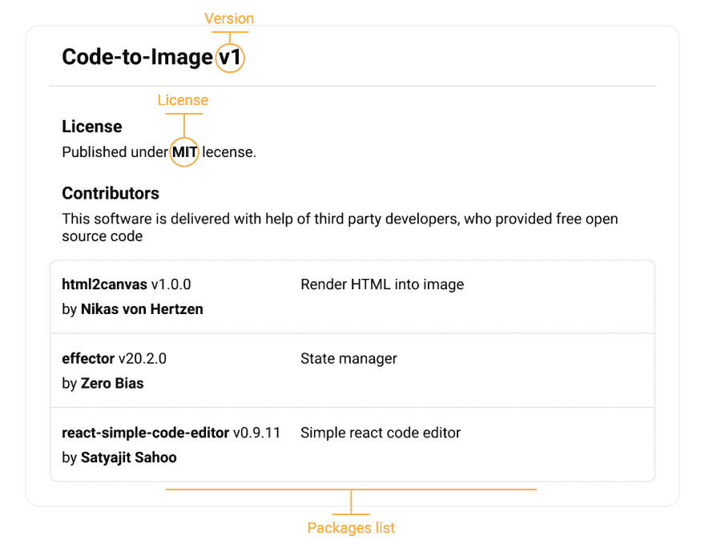

# 复制栏:用于协作

> 原文：<https://dev.to/rumkin/is-for-collaboration-8a0>

今天，每个开发者都在使用他人的作品。在你的项目中避免第三方依赖几乎是不可能的。但是没有那么多办法支持其他开发者。我们需要找到一个既能帮助独立开发者，同时又不会伤害开源运动本身的解决方案。结果应该是技术解决方案，而不是对话。

我的建议是显示我们在 web 应用程序中使用的库的列表。为此，我建议将无用的版权信息转换成功能组件。

> 在 [Github](https://github.com/rumkin/copybar) 上支持 star 计划。

## 预览

[https://codesandbox.io/embed/srxn7](https://codesandbox.io/embed/srxn7)

## 动机

*   融资-将实施原型广告网络纳入`standard` npm 包。
*   与使用他们作品的作者相比，图书馆开发者获得资助的机会更少。

## 规格

将版权信息(如“作者，2019”)转换为一组链接或按钮，其中:

*   " "指的是具有应用程序依赖关系的“关于”部分
*   “作者”是指作者的联系信息
*   “2019”是指 app 的 changelog。

### 关于节

本节包含许可信息、使用的软件包列表、应用程序名称和版本。

### 作者章节

这个部分不需要任何特殊的结构。

### 变更日志部分

将有价值的信息呈现到一个 web 应用程序中。应包含包含更改和提交链接的版本列表。

## 优点

*   有用性。它为开发人员带来了新的方式来推广他们的工作。
*   可用性。这是确定实现中使用了哪些库的一个非常简单的方法。
*   安全。每个人都可以弄清楚使用该应用程序是否安全。
*   法律问题。我们应该根据许可证提供有关我们产品中使用的软件的信息。
*   伦理。分享帮助过你的人的信息就对了。

## 弊

还没找到。

## 现实生活中的例子

您可以在代码到图像的 web 应用中看到它的作用:

*   [关于](https://code-to-image.now.sh/#copyright)。
*   [作者](https://code-to-image.now.sh/#author)。
*   [Changelog](https://code-to-image.now.sh/#changelog) 。

## 参考文献

*   [复印栏规格](https://github.com/rumkin/copybar)