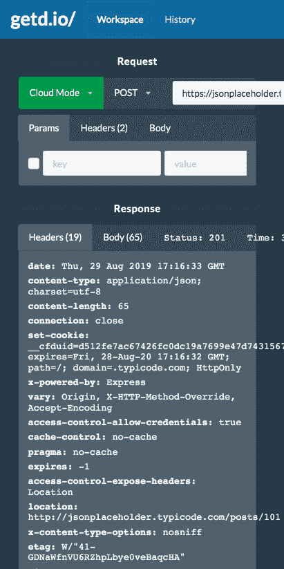
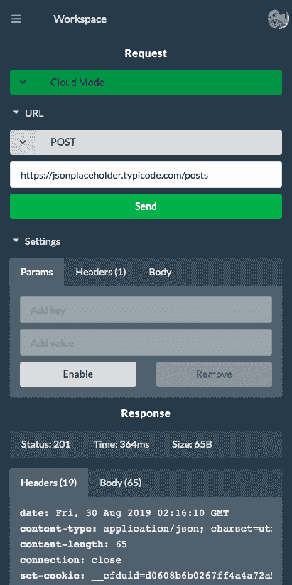
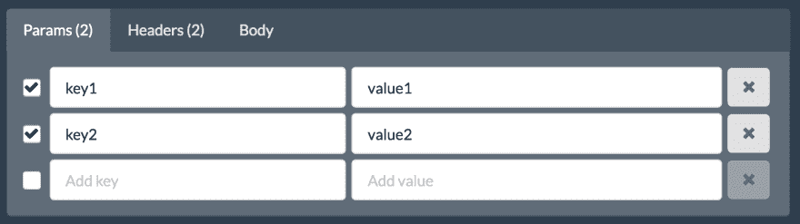
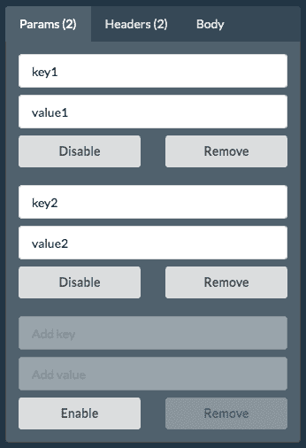
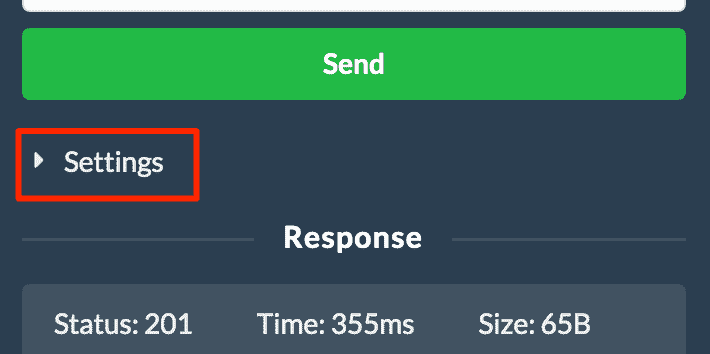
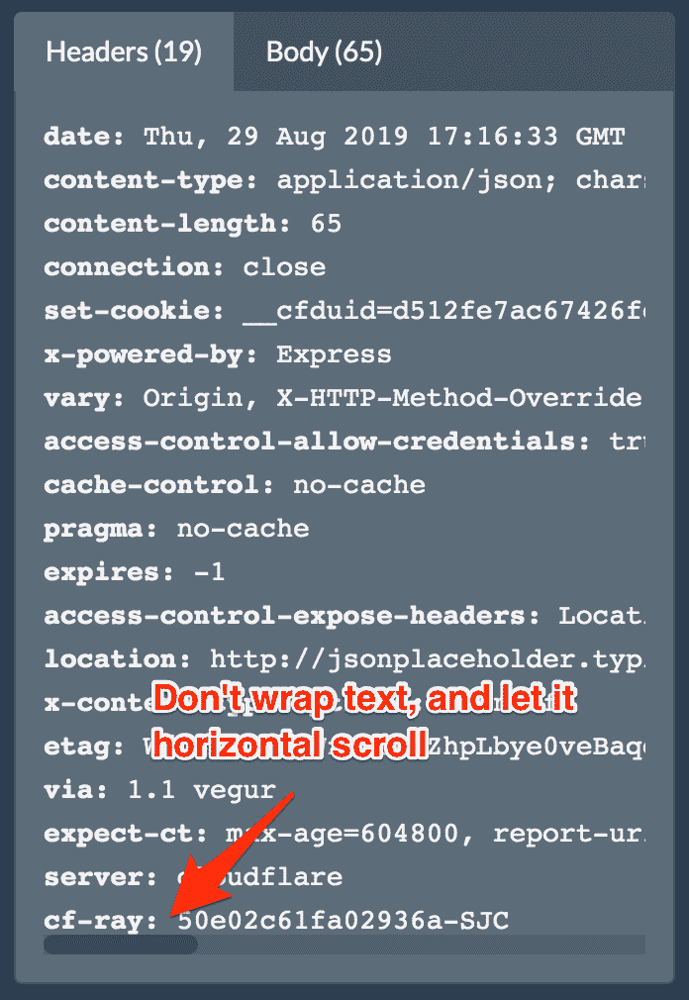
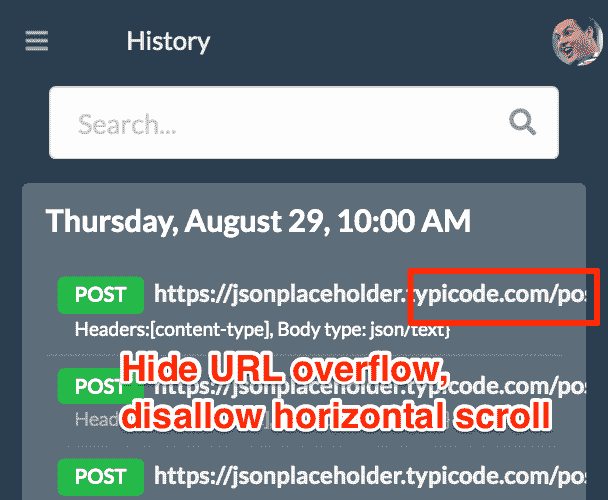
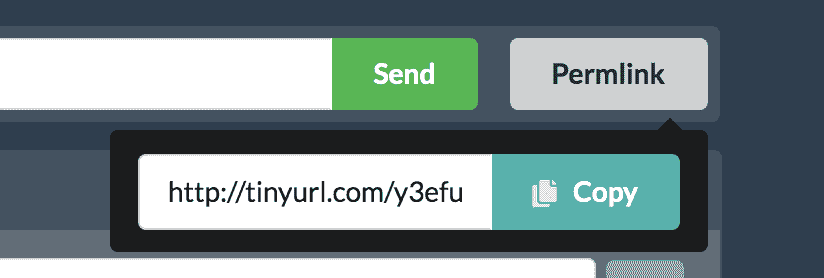

# 我如何让 getd.io mobile 在短短一小时内做出响应⏰

> 原文：<https://dev.to/getd/i-added-mobile-responsiveness-to-getd-io-in-just-one-hour-here-is-how-62b>

*这并不是移动响应的完整指南。更确切地说，这是一个快速指南，告诉你如何在最少的代码修改和很高的时间限制下，拼凑出一个合理的解决方案。*

| 以前 | 在...之后 |
| --- | --- |
|  |  |

# UI 框架是你最好的朋友🤝

一个好的 UI 框架给你很高的开发速度🚀。 [getd.io](https://getd.io/) 使用[语义 UI React](https://react.semantic-ui.com) 。它不仅提供了所有基本组件，还深入到现代应用程序常见的特定用例中。例如，它不仅支持[多选](https://react.semantic-ui.com/modules/dropdown/#types-multiple-selection)，还支持[多选加](https://react.semantic-ui.com/modules/dropdown/#usage-multiple-allow-additions)。

如果你看看[的一个示例网站](https://react.semantic-ui.com/layouts/homepage)，它展示了如何构建一个响应页面，当屏幕移动时，将顶部菜单栏转换成侧边栏。魔法在这里是 [`Responsive`](https://react.semantic-ui.com/addons/responsive/) 的分量。API 很简单:您可以指定显示包装内容的最小/最大宽度。例如，当屏幕宽度大于 768 像素时，下面的代码将显示桌面内容，当屏幕宽度小于 768 像素时，将显示移动内容。

```
<Fragment>
  <Responsive minWidth={768}>
    {desktopContent}
  </Responsive>
  <Responsive maxWidth={767}>
    {mobileContent}
  </Responsive>
</Fragment> 
```

但是，当许多 UI 组件只需要重新设计样式或移动时，为桌面和移动设备提供两个独立的 UI 实现是很浪费的。因此，我们真正想做的是让我们的组件“设备感知”，以便它们可以在桌面和移动设备上重用:

```
<Fragment>
  <Responsive minWidth={768}>
    <Content />
  </Responsive>
  <Responsive maxWidth={767}>
    <Content />
  </Responsive>
</Fragment>

const Content = () => {
  if device is 'DESKTOP':
    return (
      <TopMenu />
      <BodyContent />
    );
  else
    return (
      <Sidebar>
        <TopMenu />
      </Sidebar>
      <BodyContent />
    );
}

const TopMenu = () => {
  if device is 'DESKTOP', return a desktop layout
  else, return a mobile layout
} 
```

# 使用 React 上下文

使用 React 上下文，我们可以将设备信息深入传递到组件堆栈中。

```
// Data type
type ResponsiveContextData = {
  device: "MOBILE" | "DESKTOP";
};

// Create context
const ResponsiveContext = React.createContext<ResponsiveContextData>({
  device: "DESKTOP"
});

// Set different device context based on responsive UI
<Fragment>
  <Responsive minWidth={768}>
    <ResponsiveContext.Provider value={{ device: "DESKTOP" }}>
      <Content />
    </ResponsiveContext.Provider>      
  </Responsive>
  <Responsive maxWidth={767}>
    <ResponsiveContext.Provider value={{ device: "MOBILE" }}>
      <Content />
    </ResponsiveContext.Provider>
</Fragment> 
```

并且在每个响应组件中:

```
const MyResponsiveComponent = () => {
  const responsiveContextData = React.useContext(ResponsiveContext);
  if (responsiveContextData.device === "DESKTOP") {
    return (desktop layout)
  else ...
} 
```

# 使它们叠加🍔

[getd.io](https://getd.io/) 中的 params 编辑器有一个不适合移动屏幕的水平布局。

[](https://res.cloudinary.com/practicaldev/image/fetch/s--JH7IH9iR--/c_limit%2Cf_auto%2Cfl_progressive%2Cq_auto%2Cw_880/https://thepracticaldev.s3.amazonaws.com/i/amtbseembbald6tijo30.png)

要将其转换为垂直/堆叠布局:

1.  每行一个组件:对于可以有不同宽度的组件(例如，输入框)，这几乎总是必需的。但是，如果两个或两个以上的组件关系密切并且具有固定的宽度，则可以将它们放在同一行中(例如，下面的禁用和删除按钮)
2.  胖手指问题:不要让用户点击小盒子。尽可能让它们变大。例如，这里我将桌面上的复选框转换为移动设备上的禁用/启用按钮。

[](https://res.cloudinary.com/practicaldev/image/fetch/s---1bnPVmR--/c_limit%2Cf_auto%2Cfl_progressive%2Cq_auto%2Cw_880/https://thepracticaldev.s3.amazonaws.com/i/hfy8hc5965joelm461ki.png)

# 垂直空格和滚动

当处理移动设备上的垂直间距时，这里有两个快速指南:

1.  尽量避免一个垂直滚动在另一个垂直滚动中。比如 [getd.io](https://getd.io/) 用的是 JSON 编辑器(感谢牛逼的 [React Ace 编辑器](https://github.com/securingsincity/react-ace))。当 JSON 内容很长时，编辑器和窗口都显示垂直滚动，这会导致混乱和糟糕的 UI。这里的一个快速技巧是首先计算 JSON 的总行数，然后将编辑器`minLines`设置为总行数，这样它就不会显示垂直滚动。

2.  允许用户折叠/隐藏部分用户界面以节省垂直空间。例如， [getd.io](https://getd.io/) 使用`Accordion`组件来隐藏请求设置窗格。 [](https://res.cloudinary.com/practicaldev/image/fetch/s--qpTRx9IN--/c_limit%2Cf_auto%2Cfl_progressive%2Cq_auto%2Cw_880/https://thepracticaldev.s3.amazonaws.com/i/ktt7bgfjfc4dh5u83ot2.png)

3.  处理空白换行:通常最好禁用换行，因为换行内容会使垂直空格变得不可预测。

4.  句柄溢出:具体情况具体分析。例如，在 [getd.io](https://getd.io/) 中，我允许水平滚动来显示没有换行的响应标题。但是在历史标签中，当 URL 太长时，我隐藏了溢出，因为在历史搜索结果中水平滚动没有意义。

[](https://res.cloudinary.com/practicaldev/image/fetch/s--c3t8V5IM--/c_limit%2Cf_auto%2Cfl_progressive%2Cq_auto%2Cw_880/https://thepracticaldev.s3.amazonaws.com/i/o86ec2trct7j376obrge.png)

[](https://res.cloudinary.com/practicaldev/image/fetch/s--j-IM2aen--/c_limit%2Cf_auto%2Cfl_progressive%2Cq_auto%2Cw_880/https://thepracticaldev.s3.amazonaws.com/i/6gjyag8p1gbj5lp2pujw.png)

# 认为在移动📱

有时候，你不能简单地将桌面用户界面转换成移动用户界面，这需要你跳出固有的思维模式，找到更具移动性的最佳用户界面。例如，桌面上的“创建永久链接”按钮显示允许用户复制链接的弹出窗口。

[](https://res.cloudinary.com/practicaldev/image/fetch/s--ktia31jl--/c_limit%2Cf_auto%2Cfl_progressive%2Cq_auto%2Cw_880/https://thepracticaldev.s3.amazonaws.com/i/bsnm9m4a1y0g33ubigf9.png)

我们可以在移动设备上做同样的事情，但是在移动设备上显示弹出窗口并不是一个好主意，因为它打破了平面的用户界面体验。在这种情况下，我会将工作流更改为右下角的浮动“共享”按钮，鼓励用户与其他人共享当前设置。如果你有更好的主意，请在下面留言，❤️！