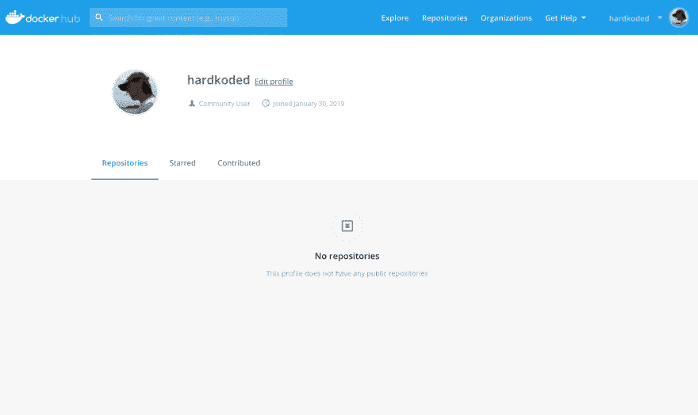
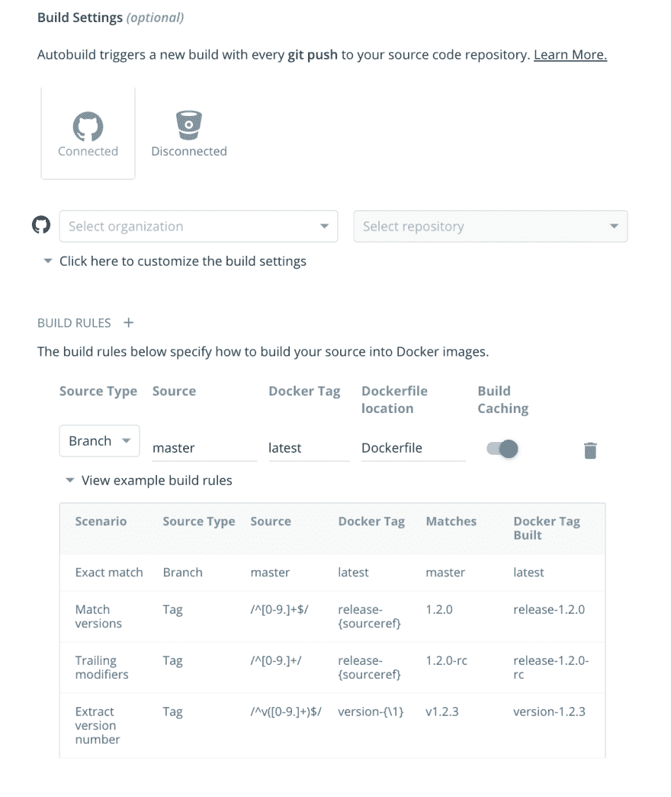
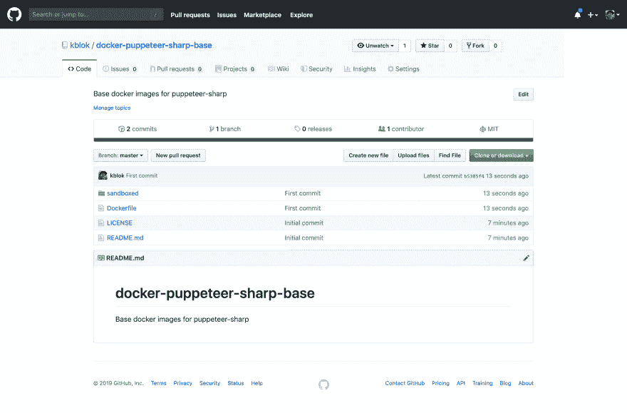
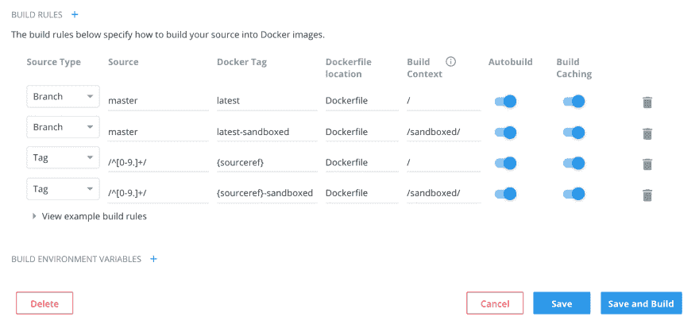
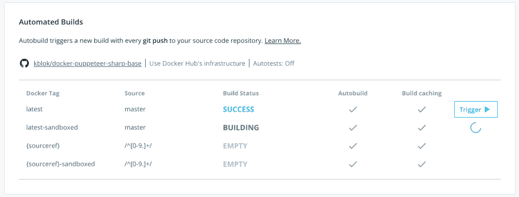
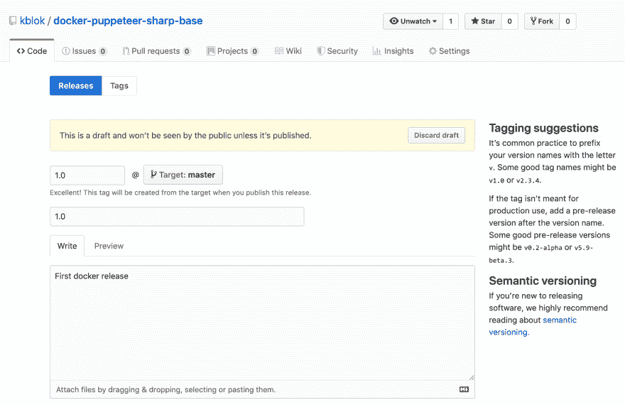
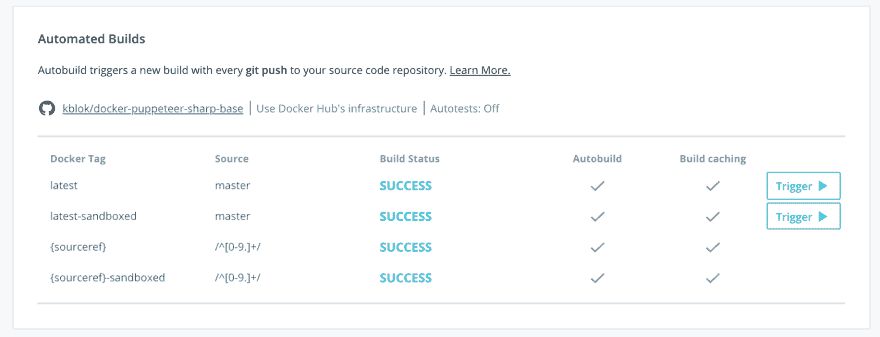
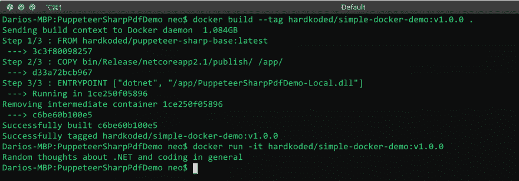

# 将您的 Docker 图片推送到 Docker Hub

> 原文：<https://dev.to/hardkoded/pushing-your-docker-images-to-docker-hub-3mna>

在我之前的一篇文章中，我们创建了一个图像来让 puppeter-Sharp 在 Docker 上运行。让我们看看是否可以将该图像发布到 Docker Hub，并使该图像对社区可用。

我在 Docker Hub 上已经有了一个[用户，所以我打赌第一步已经完成了。](https://hub.docker.com/u/hardkoded)

[](https://res.cloudinary.com/practicaldev/image/fetch/s--iSqDlO1o--/c_limit%2Cf_auto%2Cfl_progressive%2Cq_auto%2Cw_880/https://raw.githubusercontent.com/kblok/kblok.github.io/master/img/pushing-to-docker/1.png)

我想创建一个带有两个标签的存储库:

*   `puppeteer-sharp-base:1.0`
    *   `puppeteer-sharp-base:1.0-sandboxed`

如果我们转到 [Create Repository](https://cloud.docker.com/repository/create) 页面，我们可以看到我们应该能够创建一个 Github 存储库，并让 Docker 从那里构建我们的图像。我们喜欢这种东西，不是吗？

[](https://res.cloudinary.com/practicaldev/image/fetch/s---lz0Gt57--/c_limit%2Cf_auto%2Cfl_progressive%2Cq_auto%2Cw_880/https://raw.githubusercontent.com/kblok/kblok.github.io/master/img/pushing-to-docker/2.png)

因此，让我们创建我们的回购！

[](https://res.cloudinary.com/practicaldev/image/fetch/s--fZN7B3OL--/c_limit%2Cf_auto%2Cfl_progressive%2Cq_auto%2Cw_880/https://raw.githubusercontent.com/kblok/kblok.github.io/master/img/pushing-to-docker/3.png)

我将在这里展示两张图片:

*   没有用户创建的基本图像。
*   沙盒映像，它将从基础映像开始，然后创建用户。我将把这个文件放在一个“沙箱”文件夹中。

[](https://res.cloudinary.com/practicaldev/image/fetch/s--QsdlG0iG--/c_limit%2Cf_auto%2Cfl_progressive%2Cq_auto%2Cw_880/https://raw.githubusercontent.com/kblok/kblok.github.io/master/img/pushing-to-docker/4.png)

是时候回到码头中心了...

我们将创建两组构件:

*   一个用于最新版本，使用主分支。
*   一个用于标记版本。

我们将构建两个图像:

*   木偶师-锐基:`<version>`
*   木偶师-夏普-基地:`<version>`-沙盒

[](https://res.cloudinary.com/practicaldev/image/fetch/s--X_MSMLI5--/c_limit%2Cf_auto%2Cfl_progressive%2Cq_auto%2Cw_880/https://raw.githubusercontent.com/kblok/kblok.github.io/master/img/pushing-to-docker/5.png)

让我们创造和建设！

[](https://res.cloudinary.com/practicaldev/image/fetch/s--mUjA1Nde--/c_limit%2Cf_auto%2Cfl_progressive%2Cq_auto%2Cw_880/https://raw.githubusercontent.com/kblok/kblok.github.io/master/img/pushing-to-docker/6.png)

现在，我们可以在 Github 上创建一个 1.0 版本。

[](https://res.cloudinary.com/practicaldev/image/fetch/s--ctyXaVrL--/c_limit%2Cf_auto%2Cfl_progressive%2Cq_auto%2Cw_880/https://raw.githubusercontent.com/kblok/kblok.github.io/master/img/pushing-to-docker/7.png)

瞧！我们 Docker 上有 1.0 版！

[](https://res.cloudinary.com/practicaldev/image/fetch/s--ycam7Iy_--/c_limit%2Cf_auto%2Cfl_progressive%2Cq_auto%2Cw_880/https://raw.githubusercontent.com/kblok/kblok.github.io/master/img/pushing-to-docker/8.png)

最后，关键时刻到了，让我们看看我是否能替换掉我以前 docker 文件中的所有代码，只替换成新的图像。

```
FROM hardkoded/puppeteer-sharp-base:latest

COPY bin/Release/netcoreapp2.1/publish/ /app/
ENTRYPOINT ["dotnet", "/app/PuppeteerSharpPdfDemo-Local.dll"] 
```

嘣！我们的新形象正在发挥作用！

[](https://res.cloudinary.com/practicaldev/image/fetch/s--nOdW3Qji--/c_limit%2Cf_auto%2Cfl_progressive%2Cq_auto%2Cw_880/https://raw.githubusercontent.com/kblok/kblok.github.io/master/img/pushing-to-docker/9.png)

[](https://res.cloudinary.com/practicaldev/image/fetch/s--i_aBAxM4--/c_limit%2Cf_auto%2Cfl_progressive%2Cq_66%2Cw_880/https://media2.giphy.com/media/3o8doT9BL7dgtolp7O/giphy.gif%3Fcid%3Decf05e47466ea3c4637d81e4575ee127d7e94f854c1c9c11%26rid%3Dgiphy.gif)

## 最后的话

我希望这次旅行可以帮助你建立自己的形象，并开始使用 Docker 上的木偶剧。如你所见，我不是码头专家。如果你在我的帖子里发现了什么，请告诉我！

不要停止编码！

最初发布于[harkoded.com](https://www.hardkoded.com/blog/pushing-to-docker)