# ★ Flare:为 Laravel 应用程序构建的错误跟踪器

> 原文：<https://dev.to/freekmurze/flare-an-error-tracker-built-for-laravel-apps-3l85>

今天在 Laracon EU，Marcel Pociot 和我介绍了 T2 Flare，这是一款为 Laravel 应用开发的新错误跟踪器。我们的服务还与我们推出的名为[点火](https://freek.dev/1441-ignition-a-new-error-page-for-laravel)的新错误页面携手合作。

[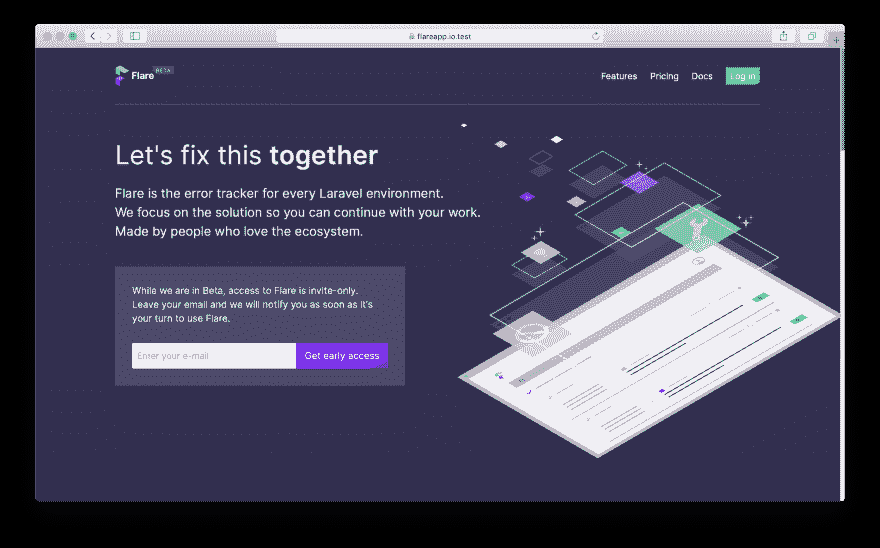](https://res.cloudinary.com/practicaldev/image/fetch/s--J7hmcR9n--/c_limit%2Cf_auto%2Cfl_progressive%2Cq_auto%2Cw_880/https://freek.dev/uploads/media/flare-2019/homepage.png)

如果您曾经不得不在您的生产环境中寻找一个 bug，并发现自己在实时服务器上挖掘日志文件，或者更糟的是，您的应用程序用户/客户必须通知您应用程序中有一个错误，Flare 就是您一直在等待的服务！

Flare 与 Ignition 相结合，在出现不可预见的错误时，为您的应用提供了非常具体的见解。

它可以做你期望从错误跟踪器中得到的一切，比如对错误进行分组和发送通知。不像一些现有的错误追踪器，我们非常专注于创建一个简单易用的界面。

马塞尔、我和我们在 [Beyond Code](https://beyondco.de) 和 [Spatie](https://spatie.be) 的团队投入了大量工作来完善这项服务。在我看来，像这样的服务只有和它的文档一样好，所以我们花了很多时间写[我们的文档](https://flareapp.io/docs)。

我想简要介绍一下 Flare 的功能。

## 将 Flare 安装到您的应用中

让我们先介绍一下基础知识。注册 Flare 后，您将看到如何设置您的第一个项目的安装说明。这很大程度上可以归结为向项目的`.env`文件添加一个 API 键。

[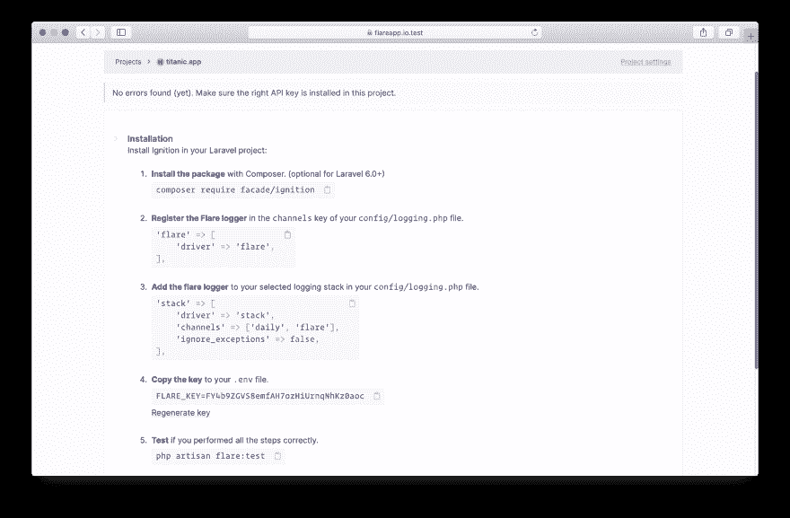](https://res.cloudinary.com/practicaldev/image/fetch/s--x8W-7u54--/c_limit%2Cf_auto%2Cfl_progressive%2Cq_auto%2Cw_880/https://freek.dev/uploads/media/flare-2019/installation-instruction.png)

您可以通过运行`php artisan flare:test`命令来验证 Flare 安装是否正确。

[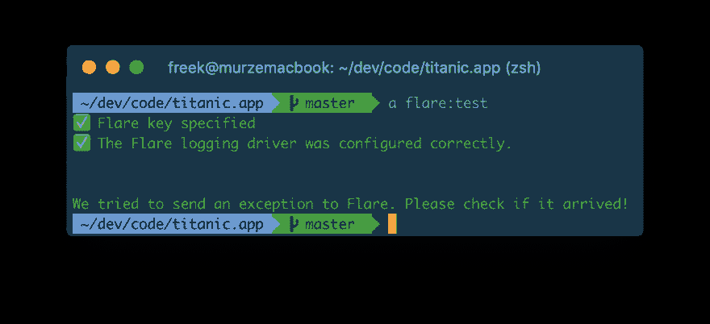](https://res.cloudinary.com/practicaldev/image/fetch/s--uhJhLeNZ--/c_limit%2Cf_auto%2Cfl_progressive%2Cq_auto%2Cw_880/https://freek.dev/uploads/media/flare-2019/test.png)

一切就绪！Flare 准备接收错误。

## 探索错误

以下是项目的已填充错误列表页面的外观。它显示了为一个项目发送的所有不同的错误。在错误上方，有一个搜索栏，允许您[追踪特定的错误](https://flareapp.io/docs/general/errors)。

[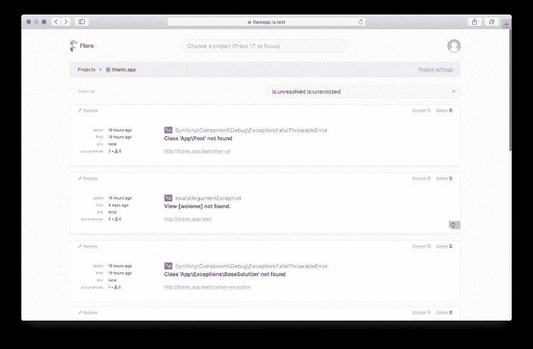](https://res.cloudinary.com/practicaldev/image/fetch/s--hDEclz4U--/c_limit%2Cf_auto%2Cfl_progressive%2Cq_auto%2Cw_880/https://freek.dev/uploads/media/flare-2019/error-list.png)

错误卡本身具有将错误标记为已解决、暂停错误或将其从我们的系统中删除的选项。

[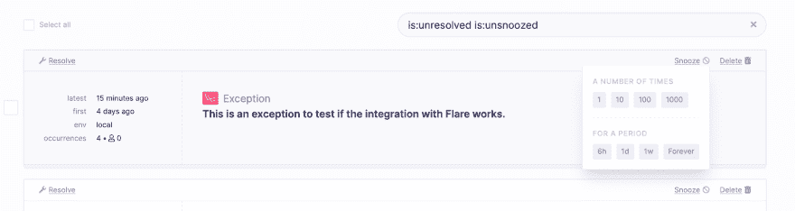](https://res.cloudinary.com/practicaldev/image/fetch/s--vHIHM7hf--/c_limit%2Cf_auto%2Cfl_progressive%2Cq_auto%2Cw_880/https://freek.dev/uploads/media/flare-2019/snoozing-options.png)

如果你点击一个错误，你会看到它的最新情况。注意，这里显示的视图非常类似于[点火错误页面](https://flareapp.io/docs/ignition-for-laravel/introduction)，这是 Laravel 6 中的默认错误视图。

[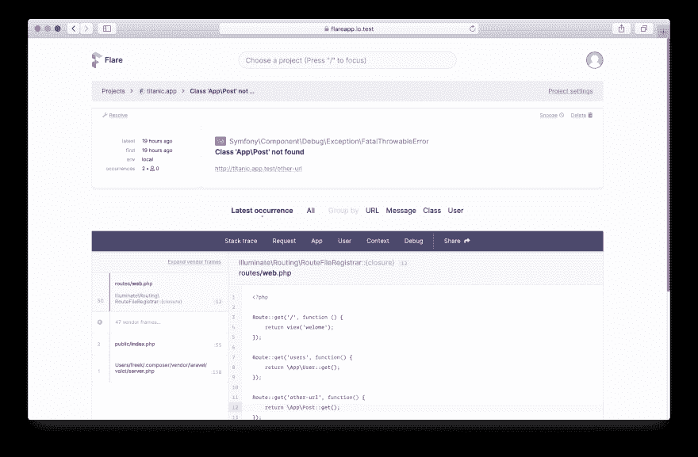](https://res.cloudinary.com/practicaldev/image/fetch/s--haNl9BjO--/c_limit%2Cf_auto%2Cfl_progressive%2Cq_auto%2Cw_880/https://freek.dev/uploads/media/flare-2019/error-occurrence.png)

您可以单击“全部”来查看此特定错误的所有事件。这里还有一个搜索栏，可以让你[搜索特定的事件](https://flareapp.io/docs/general/error-occurrences)或者对它们进行分组。

[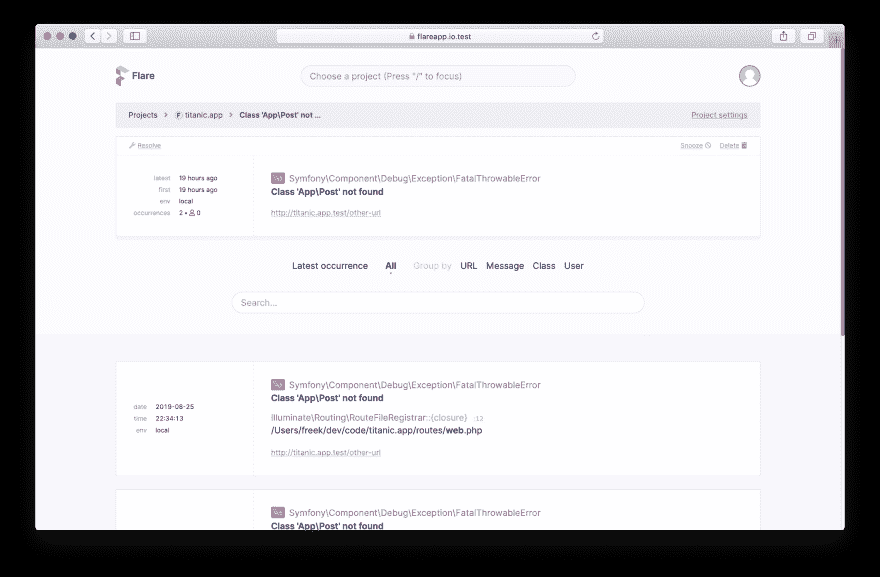](https://res.cloudinary.com/practicaldev/image/fetch/s--ExWA_vQ7--/c_limit%2Cf_auto%2Cfl_progressive%2Cq_auto%2Cw_880/https://freek.dev/uploads/media/flare-2019/all-error-occurrences.png)

在项目的所有错误列表中，您可能已经注意到第二个错误在右下角有一个绿色的小灯泡图标。这意味着这个错误也包含一个解决方案。添加到例外的所有解决方案都将显示在 Flare 中。我们的文档深入解释了[定制解决方案](https://flareapp.io/docs/solutions/adding-custom-solutions)。

## 共享错误

项目属于一个团队，您可以邀请其他人加入您的团队。

[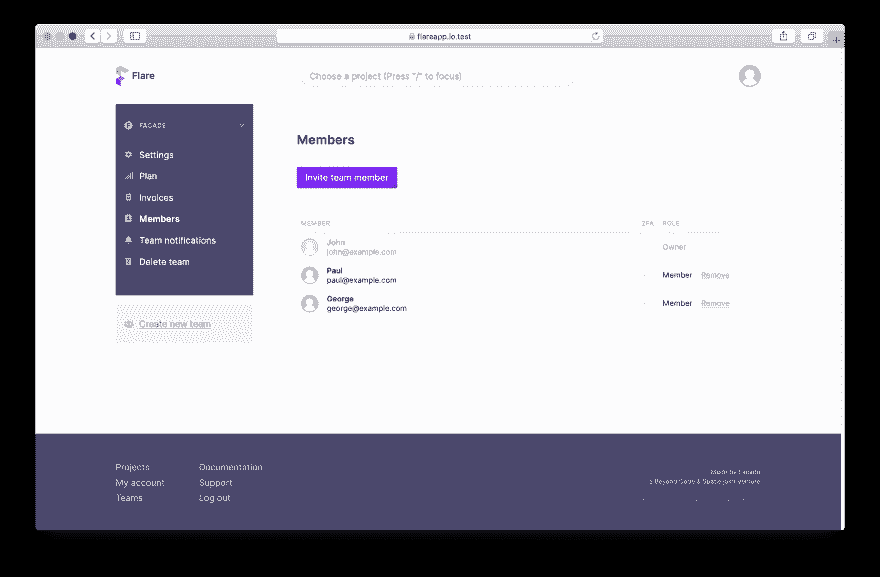](https://res.cloudinary.com/practicaldev/image/fetch/s--IFt_IgzQ--/c_limit%2Cf_auto%2Cfl_progressive%2Cq_auto%2Cw_880/https://freek.dev/uploads/media/flare-2019/members-screen.png)

如果您想要授予某人访问特定项目的权限，您可以邀请他们作为客人。

还有一个选项是与他人分享一个事件。您可以在“错误发生”页面上执行此操作。只需点击分享按钮。在出现的对话框中，您可以选择应该共享哪些选项卡。

[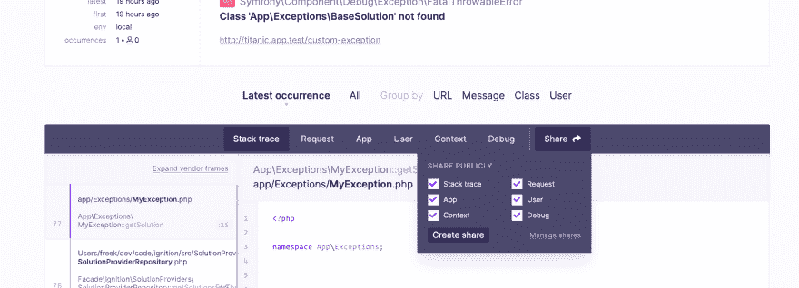](https://res.cloudinary.com/practicaldev/image/fetch/s--xsJvD0eP--/c_limit%2Cf_auto%2Cfl_progressive%2Cq_auto%2Cw_880/https://freek.dev/uploads/media/flare-2019/sharing-error.png)

在您点击“创建共享”后，我们将生成一个带有难以猜测的 URL 的页面，您可以与他人共享该页面，以帮助解决您的错误。

[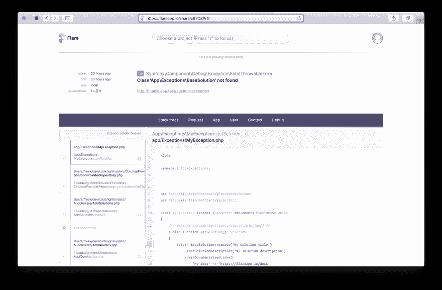](https://res.cloudinary.com/practicaldev/image/fetch/s--XahVuK0L--/c_limit%2Cf_auto%2Cfl_progressive%2Cq_auto%2Cw_880/https://freek.dev/uploads/media/flare-2019/shared-error.png)

如果您想查看哪些事件被共享，请前往项目设置的“共享”部分。

[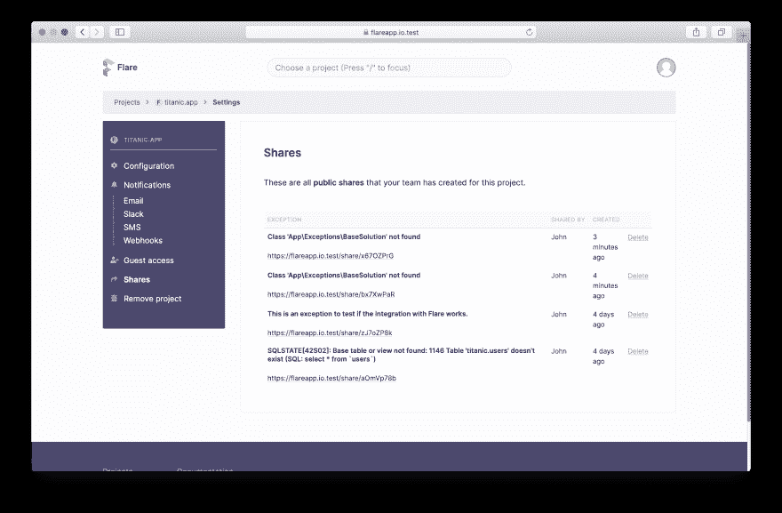](https://res.cloudinary.com/practicaldev/image/fetch/s--1zKKyYn4--/c_limit%2Cf_auto%2Cfl_progressive%2Cq_auto%2Cw_880/https://freek.dev/uploads/media/flare-2019/managing-shared-errors.png)

## 得到通知

当某些事件发生时，Flare 可以通过 [email](https://flareapp.io/docs/notifications/mail) 、 [Slack](https://flareapp.io/docs/notifications/slack) 、 [SMS](https://flareapp.io/docs/notifications/sms) 和 [webhooks](https://flareapp.io/docs/notifications/webhooks) 通知您。

[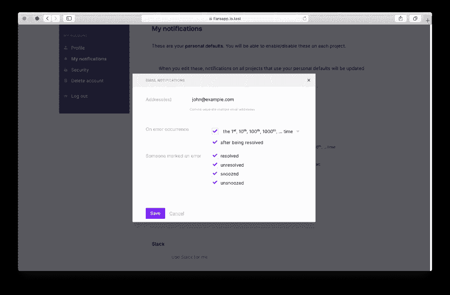](https://res.cloudinary.com/practicaldev/image/fetch/s--Z7uCV5qW--/c_limit%2Cf_auto%2Cfl_progressive%2Cq_auto%2Cw_880/https://freek.dev/uploads/media/flare-2019/notification-events.png)

这些通知可以配置为个人、团队的[和项目](https://flareapp.io/docs/notifications/configuring-notifications#on-the-team-level)的[。](https://flareapp.io/docs/notifications/configuring-notifications#on-the-project-level)

如果使用时差通知，您可以暂停并直接从时差中解决错误。如果您的错误有解决方案，我们也可以在 Slack 中显示该解决方案。

这是我们在构建 Flare 的文档部分时得到的一个示例。

[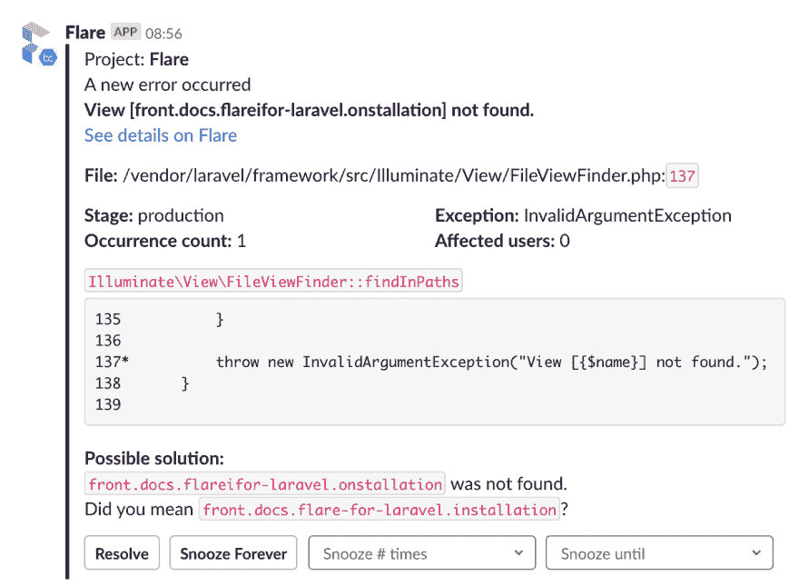](https://res.cloudinary.com/practicaldev/image/fetch/s--5hWjX7RE--/c_limit%2Cf_auto%2Cfl_progressive%2Cq_auto%2Cw_880/https://freek.dev/uploads/media/flare-2019/slack-notification.png)

## 关闭思绪

如果您想试用 Flare，请在我们的等候名单中注册[。如果你有更多关于 Flare 的问题，看看](https://flareapp.io)[我们丰富的文档](https://flareapp.io/docs)，或者发微博给我们[@ Flare pre io](https://flareapp.io)。

Flare 是用[惯性](https://inertiajs.com/)打造的，我怀疑 Flare 是现在正在生产的最大惯性项目。我们的代码库包含了很多技术上有趣的东西。在接下来的几周里，期待一些技术深度的帖子吧！

虽然马塞尔和我是我们公司的公众人物，但如果没有我们的团队，我们不可能取得 Flare。这是所有 Spatie 团队成员的 twitter 列表，这是 Beyond Code 的 T2 的 Twitter 账户。确保遵循它们。

我们推出了 Ignition，这是 Laravel 的一个漂亮的新错误页面，与 Flare 并列。前往 [Ignition 的介绍文章](https://freek.dev/1441-ignition-a-new-error-page-for-laravel)阅读更多内容！