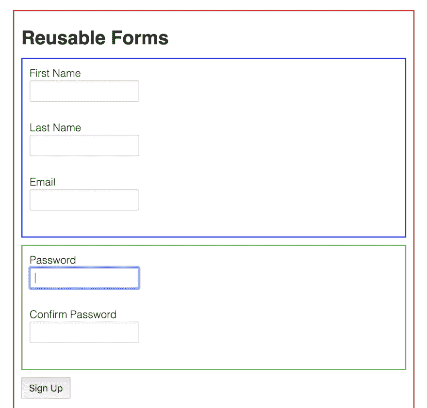

# 在 Angular 中构建可重用表单

> 原文：<https://dev.to/coryrylan/building-reusable-forms-in-angular-3li2>

这篇文章是从我的新电子书[角形要素](https://angularforms.dev)中摘录的章节

当构建大型应用程序时，您可能会遇到创建可重用表单以及嵌套表单组件的用例。在本帖中，我们将介绍如何使用 [`ControlValueAccessor`](https://coryrylan.com/blog/angular-custom-form-controls-with-reactive-forms-and-ngmodel) API 构建一个可重用的角度表单。

对于我们的用例，我们需要构建三个表单。第一个表单是一个创建密码表单，它有两个字段，`password`和`confirmPassword`。第二个表单是一个用户资料表单，有三个字段，`firstName`、`lastName`和`email`。我们的最后一个表单将把用户资料表单和创建密码表单合并成一个用户注册表单。

我们将注册表单分成两个较小的表单，以允许表单在应用程序的其他部分重用。例如，密码表单可以用在注册表单和密码重置表单中。

[](https://res.cloudinary.com/practicaldev/image/fetch/s--D6CCQCeK--/c_limit%2Cf_auto%2Cfl_progressive%2Cq_auto%2Cw_880/https://coryrylan.com/asseimg/posts/2019-07-24-building-reusable-forms-in-angular/reusable-forms-in-angular.png)

在上图中，我们看到了所有三种形式。每个表单都用不同的颜色突出显示。蓝色表单是用户配置文件表单。绿色表单是创建密码表单，红色表单是组合用户注册表单。让我们从父用户注册表单开始。

```
import { Component } from '@angular/core';
import { FormGroup, FormBuilder } from '@angular/forms';

@Component({
  selector: 'app-reusable-forms-example',
  templateUrl: './reusable-forms-example.component.html',
  styleUrls: ['./reusable-forms-example.component.scss']
})
export class ReusableFormsExampleComponent {
  signupForm: FormGroup;

  constructor(private formBuilder: FormBuilder) {
    this.signupForm = this.formBuilder.group({
      password: [],
      profile: []
    });
  }

  submit() {
    console.log(this.signupForm.value);
  }
} 
```

Enter fullscreen mode Exit fullscreen mode

我们的父表单是使用`FormBuilder`服务的标准反应式表单。注意我们只有两个控件名，`password`和`profile`。只需要两个控件名，因为它们代表一个子窗体控件。我们的每个表单控件都是嵌套的反应式表单。即使它们是嵌套窗体，父窗体也只是将它们视为另一个窗体控件。

```
<form [formGroup]="signupForm" (ngSubmit)="submit()">
  <app-profile-form formControlName="profile"></app-profile-form>
  <app-password-form formControlName="password"></app-password-form>
  <button>Sign Up</button>
</form> 
```

Enter fullscreen mode Exit fullscreen mode

通过让我们的子表单实现`ControlValueAccessor` API，每个子表单都是一个独立的可重用表单控件。通过使每个子表单成为一个独立的控件，可以很容易地重用、验证和嵌套 Angular 中的自定义表单。

## 带有控制值访问器的子窗体

让我们看一下 profile 表单，看看如何使用`ControlValueAccessor` API 来实现它，使其可重用。我们的配置文件表单有三个输入，`firstName`、`lastName`和`email`。在此表单中，需要输入`email`。我们先从模板说起。

```
<div [formGroup]="form">
  <label for="first-name">First Name</label>
  <input formControlName="firstName" id="first-name" />

  <label for="last-name">Last Name</label>
  <input formControlName="lastName" id="last-name" />

  <label for="email">Email</label>
  <input formControlName="email" type="email" id="email" />
  <div *ngIf="emailControl.touched && emailControl.hasError('required')" class="error">
    email is required
  </div>
</div> 
```

Enter fullscreen mode Exit fullscreen mode

这个表单是一个标准的反应式表单，但是注意我们没有使用`form`标签，而是使用了`div`。我们不使用`form`标签，因为当我们将它作为自定义控件时，我们可以嵌入到其他表单中，并且我们不能将一个`form`元素嵌套在另一个`form`中。在 TypeScript 中，我们将使用`FormBuilder`和 [`ControlValueAccessor` API](https://coryrylan.com/blog/angular-custom-form-controls-with-reactive-forms-and-ngmodel) 创建一个反应式表单。

```
import { Component, forwardRef, OnDestroy } from '@angular/core';
import { FormBuilder, FormGroup, Validators } from '@angular/forms';

@Component({
  selector: 'app-profile-form',
  templateUrl: './profile-form.component.html',
  styleUrls: ['./profile-form.component.scss']
})
export class ProfileFormComponent {
  form: FormGroup;

  get emailControl() {
    return this.form.controls.email;
  }

  constructor(private formBuilder: FormBuilder) {
    this.form = this.formBuilder.group({
      firstName: [],
      lastName: [],
      email: ['', Validators.required]
    });
  }
} 
```

Enter fullscreen mode Exit fullscreen mode

我们使用`FormBuilder`服务创建的个人资料表单。为了使
表单可重用，我们将使用`ControlValueAccessor`将表单映射到父表单，并传递更新，如值更改和验证更新。

```
import { Component, forwardRef, OnDestroy } from '@angular/core';
import { ControlValueAccessor, NG_VALUE_ACCESSOR, FormBuilder, FormGroup, Validators, FormControl, NG_VALIDATORS } from '@angular/forms';
import { Subscription } from 'rxjs';

// describes what the return value of the form control will look like
export interface ProfileFormValues {
  firstName: string;
  lastName: string;
  email: number;
}

@Component({
  selector: 'app-profile-form',
  templateUrl: './profile-form.component.html',
  styleUrls: ['./profile-form.component.scss'],
  providers: [
    {
      provide: NG_VALUE_ACCESSOR,
      useExisting: forwardRef(() => ProfileFormComponent),
      multi: true
    },
    {
      provide: NG_VALIDATORS,
      useExisting: forwardRef(() => ProfileFormComponent),
      multi: true,
    }
  ]
})
export class ProfileFormComponent implements ControlValueAccessor, OnDestroy {
  form: FormGroup;
  subscriptions: Subscription[] = [];

  get value(): ProfileFormValues {
    return this.form.value;
  }

  set value(value: ProfileFormValues) {
    this.form.setValue(value);
    this.onChange(value);
    this.onTouched();
  }

  get emailControl() {
    return this.form.controls.email;
  }

  constructor(private formBuilder: FormBuilder) {
    // create the inner form
    this.form = this.formBuilder.group({
      firstName: [],
      lastName: [],
      email: ['', Validators.required]
    });

    this.subscriptions.push(
      // any time the inner form changes update the parent of any change
      this.form.valueChanges.subscribe(value => {
        this.onChange(value);
        this.onTouched();
      })
    );
  }

  ngOnDestroy() {
    this.subscriptions.forEach(s => s.unsubscribe());
  }

  onChange: any = () => {};
  onTouched: any = () => {};

  registerOnChange(fn) {
    this.onChange = fn;
  }

  writeValue(value) {
    if (value) {
      this.value = value;
    }
  }

  registerOnTouched(fn) {
    this.onTouched = fn;
  }

  // communicate the inner form validation to the parent form
  validate(_: FormControl) {
    return this.form.valid ? null : { profile: { valid: false, }, };
  }
} 
```

Enter fullscreen mode Exit fullscreen mode

在我们的装饰器中，我们使用`NG_VALUE_ACCESSOR`注册组件，并使用`NG_VALIDATORS`让 angular 确认该表单将自我验证。通过自验证，我们可以让表单验证其输入，然后将验证状态传递给父表单。

在构造函数中，我们监听内部表单值，并触发控件更新表单值已更改。

```
this.subscriptions.push(
  this.form.valueChanges.subscribe(value => {
    this.onChange(value);
    this.onTouched();
  })
); 
```

Enter fullscreen mode Exit fullscreen mode

我们还希望父表单能够知道概要表单是否有效。为此，我们实现了一个`validate()`方法。

```
validate(_: FormControl) {
  return this.form.valid ? null : { profile: { valid: false, } };
} 
```

Enter fullscreen mode Exit fullscreen mode

如果内部表单无效，那么我们向父表单
传达内部表单处于无效状态，这将允许我们在父级处理
验证。接下来，我们来看看密码表单。

## 可重复使用的密码创建表单

密码表单使用与我们的个人资料表单相同的技术。我们将使用`FormBuilder`服务和`ControlValueAccessor` API。

```
<div [formGroup]="form">
  <label for="password">Password</label>
  <input formControlName="password" type="password" id="password" />
  <div *ngIf="passwordControl.touched && passwordControl.hasError('required')" class="error">
    password is required
  </div>

  <label for="confirm-password">Confirm Password</label>
  <input formControlName="confirmPassword" type="password" id="confirm-password" />
  <div *ngIf="confirmPasswordControl.touched && confirmPasswordControl.hasError('required')" class="error">
    password is required
  </div>

  <div *ngIf="passwordControl.touched && confirmPasswordControl.touched && form.hasError('missmatch')" class="error">
    passwords do not match
  </div>
</div> 
```

Enter fullscreen mode Exit fullscreen mode

密码表单有两个输入，密码和确认密码。该表单还将使用组验证来确保两个输入正确匹配。

```
import { Component, forwardRef, OnDestroy } from '@angular/core';
import { NG_VALUE_ACCESSOR, FormGroup, FormBuilder, ControlValueAccessor, Validators, NG_VALIDATORS, FormControl } from '@angular/forms';
import { Subscription } from 'rxjs';

import { matchingInputsValidator } from './validators';

export interface PasswordFormValues {
  password: string;
  confirmPassword: string;
}

@Component({
  selector: 'app-password-form',
  templateUrl: './password-form.component.html',
  styleUrls: ['./password-form.component.scss'],
  providers: [
    {
      provide: NG_VALUE_ACCESSOR,
      useExisting: forwardRef(() => PasswordFormComponent),
      multi: true
    },
    {
      provide: NG_VALIDATORS,
      useExisting: forwardRef(() => PasswordFormComponent),
      multi: true,
    }
  ]
})
export class PasswordFormComponent implements ControlValueAccessor, OnDestroy {
  form: FormGroup;
  subscriptions: Subscription[] = [];

  get value(): PasswordFormValues {
    return this.form.value;
  }

  set value(value: PasswordFormValues) {
    this.form.setValue(value);
    this.onChange(value);
    this.onTouched();
  }

  get passwordControl() {
    return this.form.controls.password;
  }

  get confirmPasswordControl() {
    return this.form.controls.confirmPassword;
  }

  constructor(private formBuilder: FormBuilder) {
    this.form = this.formBuilder.group({
      password: ['', Validators.required],
      confirmPassword: ['', Validators.required]
    }, { validator: matchingInputsValidator('password', 'confirmPassword') });

    this.subscriptions.push(
      this.form.valueChanges.subscribe(value => {
        this.onChange(value);
        this.onTouched();
      })
    );
  }

  ngOnDestroy() {
    this.subscriptions.forEach(s => s.unsubscribe());
  }

  onChange: any = () => {};
  onTouched: any = () => {};

  registerOnChange(fn) {
    this.onChange = fn;
  }

  writeValue(value) {
    if (value) {
      this.value = value;
    }
  }

  registerOnTouched(fn) {
    this.onTouched = fn;
  }

  validate(_: FormControl) {
    return this.form.valid ? null : { passwords: { valid: false, }, };
  }
} 
```

Enter fullscreen mode Exit fullscreen mode

我们用`FormBuilder`定义表单，然后将信息传递回父表单。

```
constructor(private formBuilder: FormBuilder) {
  this.form = this.formBuilder.group({
    password: ['', Validators.required],
    confirmPassword: ['', Validators.required]
  }, { validator: matchingInputsValidator('password', 'confirmPassword') });

  this.subscriptions.push(
    this.form.valueChanges.subscribe(value => {
      this.onChange(value);
      this.onTouched();
    })
  );
} 
```

Enter fullscreen mode Exit fullscreen mode

我们还创建了`validate`方法来告诉父表单密码控制表单何时无效或有效。

```
validate(_: FormControl) {
  return this.form.valid ? null : { passwords: { valid: false, }, };
} 
```

Enter fullscreen mode Exit fullscreen mode

现在我们已经创建并定义了两个子表单，我们可以轻松地重用它们，并在我们的 Angular 应用程序中将它们组合成其他表单。回到我们的注册表单，我们可以看到两个子表单都被用作独立的控件。

```
<form [formGroup]="signupForm" (ngSubmit)="submit()">
  <app-profile-form formControlName="profile"></app-profile-form>
  <app-password-form formControlName="password"></app-password-form>
  <button>Sign Up</button>
</form>

<p>
  Form is {{signupForm.valid ? 'Valid' : 'Invalid'}}
</p>

<pre>
{{signupForm.value | json}}
</pre> 
```

Enter fullscreen mode Exit fullscreen mode

当我们提交表单时，我们得到以下表单值。

```
{  "password":  {  "password":  "123456",  "confirmPassword":  "123456"  },  "profile":  {  "firstName":  "John",  "lastName":  "Doe",  "email":  "example@example.com"  }  } 
```

Enter fullscreen mode Exit fullscreen mode

Angular 传递回表单值，就像我们构造子表单一样，使得从组合和嵌套表单中收集多个值变得容易。通过使用`ControlValueAccessor` API，我们可以使表单在角度应用程序中可重用和可组合。在这里找到完整的工作演示。