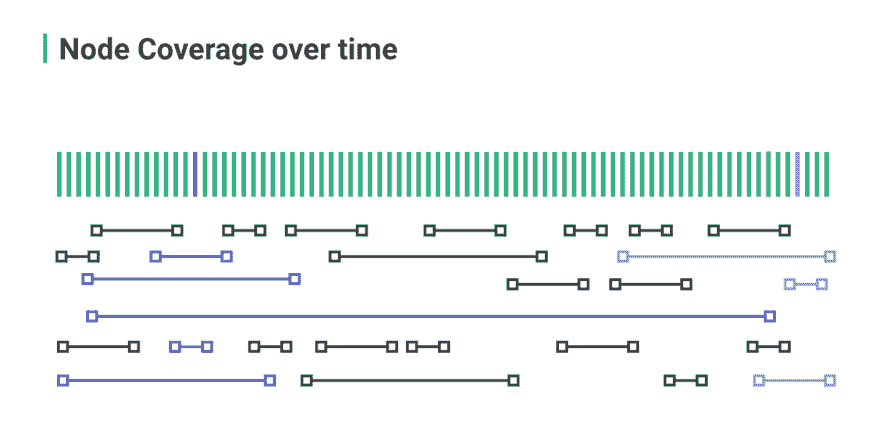
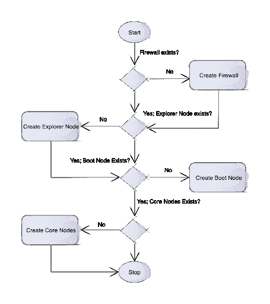
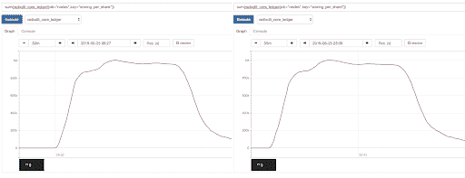
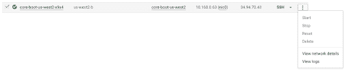

# 在谷歌云上将 DLT 扩展到超过 100 万 TPS

> 原文：<https://dev.to/radixdlt/scaling-dlt-to-over-1m-tps-on-google-cloud-11d8>

Radix 仅使用 700 美元的谷歌云基础设施，就创下了每秒 140 万笔金融交易的纪录。这项测试在不到一个小时的时间里回放了 10 年的比特币交易历史，在遍布 17 个国家的 1187 台谷歌服务器上进行。

将这一结果放在大背景下看，它几乎是整个 [Visa 网络](https://www.visa.gr/dam/VCOM/download/corporate/media/visanet-technology/aboutvisafactsheet.pdf)最大交易吞吐量的 17 倍，是[支付宝有史以来最高吞吐量](https://twitter.com/alipay/status/929123909970153472?lang=en-gb)的 4 倍多，是 WhatsApp[平均每秒发送消息数](https://www.weforum.org/agenda/2018/03/internet-minute-whatsapp-facebook-emails/)的 2 倍多。

这篇文章概述了我们如何实现这个结果，Radix 底层技术的描述，我们如何进行测试，以及我们如何使用谷歌云平台(GCP)。

如果您想重新创建测试或者使用任何工具，所有相关的代码都可以在这里找到:

[https://github . com/radixdlt/mtps](https://github.com/radixdlt/mtps)

## 这次测试的目的是什么？

互联网的诞生需要创建一套协议(TCP、UDP 等。)允许计算机联网在一起，为世界各地的企业和个人建立一个公共的、未经许可的共享空间。

最近公开的、未经许可的去中心化账本技术(如比特币和脸书 Libra)的爆发，代表着全球经济数字化的下一个阶段:一个可以持有、转移和编程资金、资产和权利的公共基础设施。

然而，互联网的协议只携带信息；一旦信息被传输，它们就不存储信息。此外，该协议并不关心这些信息是否被复制并发送给数千、数百万或数十亿人。

然而，要创造数字货币，你必须能够保证资金不能被复制——例如，你被禁止向两个不同的人发送相同的数字美元。为了防止这种情况发生，系统必须不断更新谁拥有什么的记录。

使用集中服务来保存这样的记录并不太难。然而，在不使用中央服务器的情况下公开未经许可的资金则更具挑战性。让这些钱同时为全世界所用是一个更大的挑战。

Radix 着手解决的最大问题是:如何构建一个可以同时为超过 75 亿人和 5000 亿台设备服务的数字货币创建协议？这项测试是验证我们的技术可扩展性的第一步。

## 什么是 DLT(分布式账本技术)？

DLT 是一个统称，涵盖了包括[比特币](https://bitcoin.org/)和[以太坊](https://www.ethereum.org/)在内的区块链技术，包括 [IOTA](https://www.iota.org/) 和 [Hashgraph](https://www.hedera.com/) 在内的 DAG(有向无环图)技术，以及 Tempo 等新架构。Tempo 是 Radix 专门开发的架构，旨在实现主流应用程序使用 DLT 所需的巨大可伸缩性和吞吐量。

DLT 网络的特点是共享记录系统，该系统可以由网络中的所有计算机更新，而不会导致共享分类帐中的条目冲突。这通常用于交易系统，因为它非常适合于防止相同的资金被花费两次，并且它还可以实施更复杂的规则系统，通常被称为“智能合同”

## DLT 架构有何不同？

要构建一个线性可伸缩的事务系统，首先需要仔细考虑如何分割基数分类账。由于协调开销，在分布式的、分散的系统中动态地分割数据通常不是一个好主意。更简洁的解决方案是创建一个静态碎片范围，然后将数据映射到可用碎片。

在 Radix 上，您的钱包地址确定性地将您映射到您的资金和交易信息所在的碎片。因此，不需要全局状态，只需要碎片级状态。

任何计算机都可以加入网络，成为一个“节点”这些节点可以为其本地资源(CPU/RAM/存储)允许的或多或少的碎片提供服务。虽然节点可以改变它所服务的分片数量，但是 Radix 网络中的分片总数总是 18.4 万亿分之一(2^64).

操作相同碎片的节点彼此冗余，这意味着它们验证相同的事务集，并且彼此一致。交易通常在至少两个不同的碎片中进行验证:源地址的碎片(也称为发送钱包)和目的地址的碎片范围(例如接收钱包)。

[](https://res.cloudinary.com/practicaldev/image/fetch/s--hP5XbhL3--/c_limit%2Cf_auto%2Cfl_progressive%2Cq_auto%2Cw_880/https://www.radixdlt.com/wp-content/uploads/2019/08/pasted-image-0-1.png)

上图举例说明了 Radix 上的碎片范围配置，绿色竖线表示静态碎片空间，横线表示节点和每个节点服务的碎片空间量。

要了解这在实践中是如何工作的，请观看这个关于基数分片的短片[。](https://youtu.be/u0GyEYvK7EI)

## Radix DLT 是如何在 Google Cloud 上部署的？

### 测试场景

1187 个节点(运行 Radix ledger 的虚拟机)分布在 17 个 Google 云区域(数据中心)。

在测试过程中，每个节点都被配置为彼此有少量的碎片重叠。我们通过将可用的碎片(2^64)切割成大块的 2^44 碎片来做到这一点。然后，我们在这些块上平均分配节点。由一个节点服务的分片被称为该节点的“分片范围”在测试期间，每个节点碎片范围与其相邻节点的节点碎片范围有大约 10%的重叠。

[](https://res.cloudinary.com/practicaldev/image/fetch/s--YrmWpFEH--/c_limit%2Cf_auto%2Cfl_progressive%2Cq_auto%2Cw_880/https://www.radixdlt.com/wp-content/uploads/2019/08/unnamed-24.png)

这个测试场景是为尽可能经济高效地实现最大网络吞吐量而定制的。在一个生产网络中，我们期望每个碎片被至少 100 个不同的节点覆盖。这对吞吐量影响不大，但会大大增加测试成本。

在测试过程中，节点互相“八卦”以交换事务信息和元数据(通过 UDP)。在 Radix 网络中，每个节点(平均而言)与八个随机的对等节点闲聊；因此，传播复杂度为 O(8n)，如这里的[所解释的](https://youtu.be/9kPyyOIn6Bo)。

### 关于网络状况的说明

在可行的情况下，我们希望创建一个模拟公共网络的测试场景。这包括:

-仅使用公共 IP 地址
-具有地理分布的节点

各大洲之间的基本瓶颈仍然是光速，这使得数据包延迟具有一定的代表性。然而，还应该注意的是，在测试期间，八卦交易从未离开谷歌的高性能网络，这减少了节点之间的数据包延迟。

在正常操作下，谷歌的网络中没有数据包丢失。估计网上正常丢包在 3%以下；与这些测试相比，这将使 Radix 主网络的效率降低大约相同的量。

### 浏览器节点

资源管理器节点从所有其他节点收集和聚合指标和数据。托管在资源管理器节点上的最重要的服务是[资源管理器服务](https://github.com/radixdlt/mtps/tree/master/explorer)，它[服务于 UI](https://www.radixdlt.com/test/) 并提供度量 API。Radix 在 https://test.radixdlt.com/维护了一个 Explorer 的公共版本。

### 数据集准备人节点

数据集准备器节点将比特币的交易数据转换为 Radix 兼容的交易数据，以便可以在 Radix 网络上重放。这个过程是非常 CPU 和 I/O 密集型的，这就是为什么我们选择单独托管它。

该功能由我们为此构建的两个服务组成:

- [bitcoind](https://en.bitcoin.it/wiki/Bitcoind)
- [百万富翁-数据集-制作者](https://github.com/radixdlt/mtps/tree/e324f7f302a7950d30b49009e5d8350f40140662/millionaire-dataset-preparator)

### 工装

每一次优化测试的费用大约为 700 美元。为了减少虚拟机的运行时间，我们决定创建一个定制的 [Ubuntu 16.04 镜像](https://github.com/radixdlt/mtps/blob/master/tools/packer/core-image-template.json)，安装 Radix 核心依赖项(Docker)。我们为此使用了[封隔器](https://packer.io/)，它在 GCE 中工作得很好。

核心虚拟机的其余配置在初始引导期间通过 [cloudinit](https://cloudinit.readthedocs.io/en/latest/) 完成。这个工具可能不太为普通(Google)云用户所知，但我们喜欢它，因为它使我们能够对任何支持它的云提供商使用相同的配置脚本(他们几乎都这样做)。

我们在这个项目中使用了配置管理工具 [libcloud](https://libcloud.apache.org/) 。它提供 python APIs，是 [Google Cloud SDK](https://cloud.google.com/sdk/) (又名“gcloud”)的直接替代品。当我们的 shell 脚本(使用 gcloud)变得太复杂而难以维护时，我们转向了 libcloud。使用 libcloud 优于 gcloud 的另一个优势是，我们可以选择使用 python [paramiko](http://www.paramiko.org/) SSH 客户端，与 gcloud 不同，它使用 Yubikeys 支持([间接](https://ttmm.io/tech/yubikey/) ) SSH 密钥认证。

## Google Cloud 如何帮助 Radix DLT 达到 1M TPS？

为了简单起见，我们构建了一个定制的 [mtps.py](https://github.com/radixdlt/mtps/blob/master/tools/libcloud/mtps.py) python 脚本，在一次调用中完成所有的节点设置。这是 mtps.py 工具的流程图。这个脚本是等幂的，这意味着它将跳过已经创建的组件。

“引导节点”是一个普通的核心节点。它首先启动，以便为其他节点提供一个具体的 IP 地址进行连接。

[](https://res.cloudinary.com/practicaldev/image/fetch/s--kOCWWFm_--/c_limit%2Cf_auto%2Cfl_progressive%2Cq_auto%2Cw_880/https://www.radixdlt.com/wp-content/uploads/2019/08/unnamed-25.png)

### 先决条件

1.你需要有一个[谷歌云](https://cloud.google.com/)账户
2。[配置 libcloud](https://libcloud.readthedocs.io/en/latest/compute/drivers/gce.html) 使用你的谷歌云账户
3。用:
pip3 install 安装 libcloud 和 paramiko—用户 Apache-lib cloud paramiko cryptography
4。启动一个交互式 python 终端:
python3

```
>>> gce = ComputeEngine(
"libcloud@m-tps-test.iam.gserviceaccount.com",
"~/m-tps-test.json",
project="m-tps-test"
) 
```

探索者节点和核心节点需要能够从互联网到达，这就是为什么我们需要穿透防火墙:

```
>>> explorer_ports = [
{"IPProtocol": "tcp", "ports": ["22", "443"]},
{"IPProtocol": "udp", "ports": ["20000"]}
]
>>> core_ports = [
{"IPProtocol": "tcp", "ports": ["22", "443", "20000"]},
{"IPProtocol": "udp", "ports": ["20000"]}
]
>>> gce.ex_create_firewall(
name='explorer-ingress-rules',
allowed=explorer_ports,
description='explorer-ingress-rules')
>>> gce.ex_create_firewall(
name='core-ingress-rules',
allowed=core_ports,
description='core-ingress-rules') 
```

[[doc](https://libcloud.readthedocs.io/en/latest/compute/drivers/gce.html#libcloud.compute.drivers.gce.GCENodeDriver.ex_create_firewall)[[来源](https://github.com/radixdlt/mtps/blob/912da377bfa751ea2adac40ecc7c31b61c0acd97/tools/libcloud/gcp.py#L23-L49)

### 创建浏览器节点

下一步是创建资源管理器节点，它托管[资源管理器服务](https://test.radixdlt.com/)。

注意:该命令需要一个有效的 explorer_cloud_init 配置(字符串)，该配置基于[这个模板](https://github.com/radixdlt/mtps/blob/912da377bfa751ea2adac40ecc7c31b61c0acd97/tools/cloudinit/explorer)。手工生成这个模板非常困难，因此下面的代码块是不可执行的:

```
>>> node = gce.create_node(
name = "explorer",
image = "https://www.googleapis.com/compute/v1/projects/ubuntu-os-cloud/globimg/ubuntu-1604-xenial-v20190530c",
size = "n1-standard-8",
location = "europe-west3-a",
ex_metadata = {"user-data": explorer_cloud_init},
ex_disks_gce_struct = [
{
'autoDelete': True,
'boot': True,
'type': 'PERSISTENT',
'mode': 'READ_WRITE',
'deviceName': "explorer",
'initializeParams': {
'diskName': "explorer",
'sourceImage': "https://www.googleapis.com/compute/v1/projects/ubuntu-os-cloud/globimg/ubuntu-1604-xenial-v20190530c"
}
},
]
) 
```

[[doc](https://libcloud.readthedocs.io/en/latest/compute/drivers/gce.html#libcloud.compute.drivers.gce.GCENodeDriver.create_node)[[来源](https://github.com/radixdlt/mtps/blob/912da377bfa751ea2adac40ecc7c31b61c0acd97/tools/libcloud/gcp.py#L203-L224)

### 创建引导节点/创建核心节点

这就是事情变得非常复杂的地方，因为我们使用了 [17 个不同的谷歌云引擎(GCE)区域](https://cloud.google.com/compute/docs/regions-zones/)。

首先启动引导节点，直到引导节点在 HTTPS 端口 443 上服务并在 Gossip (UDP)端口 20000 上侦听时，才创建剩余的核心节点。

用 gce.create_node 逐个创建 1187 个核心节点(就像我们对上面的 Explorer 节点所做的那样)在理论上是可能的，但是效率非常低。这就是为什么我们创建了[实例组](https://cloud.google.com/compute/docs/instance-groups/)——每个 GCE 区域一个。

注意:与创建 Explorer 节点类似，需要从[模板](https://github.com/radixdlt/mtps/blob/912da377bfa751ea2adac40ecc7c31b61c0acd97/tools/cloudinit/core)中为核心节点生成一个具体的 cloudinit 配置(与用于引导节点的配置相同)，这超出了本博客的范围。

谷歌云区域是一个有多个数据中心(区域)的地理位置(城市)。通常谷歌在每个地区都有三个区域。在[谷歌云控制台](https://console.cloud.google.com/)中，可以在一个区域中创建一个实例组，而不局限于某个特定的区域。但是，libcloud 2.5.0 仅支持为每个区域创建实例组。解决方案是下面的猴子补丁，它将一直工作到 libcloud 赶上:

```
def create_core_group(gce, region, size, template, prefix="cores"):
try:
region = region or gce.region
if not hasattr(region, 'name'):
region = gce.ex_get_region(region)
request = '/regions/%s/instanceGroupManagers' % (region.name)
manager_data = {}

#If the user gave us a name, we fetch the GCEInstanceTemplate for it.
if not hasattr(template, 'name'):
template = gce.ex_get_instancetemplate(template)
manager_data['instanceTemplate'] = template.extra['selfLink']

# If base_instance_name is not set, we use name.
manager_data['name'] = manager_data['baseInstanceName'] = "{0}-{1}".format(prefix, region.name)
manager_data['distributionPolicy'] = dict(
zones = [{"zone": "zones/" + z.name} for z in gce.ex_list_zones() if z.status == "UP" and z.name.startswith(region.name)]
)
manager_data['targetSize'] = size
manager_data['description'] = None

gce.connection.request(request, method='POST', data=manager_data)
except ResourceExistsError:
pass 
```

[ [来源](https://github.com/radixdlt/mtps/blob/912da377bfa751ea2adac40ecc7c31b61c0acd97/tools/libcloud/gcp.py#L66-L88)

# 最后的话

我们的五人团队花了大约两个月的时间来开发一个稳定的解决方案，用于在 GCE 中实例化和运行 1M TPS 测试。总体而言，我们对该平台的体验非常积极。但是，有些特性很突出，值得详细介绍(见下文)。

## 我们喜欢谷歌云平台的什么

### 可靠性和性能一致性

传统的 web 服务很难开发、调试和产品化。对于高可用性应用程序来说，这就更难了，因为在这些应用程序中，全局状态需要在一个法定数量(通常为 3 或 5 个)的节点之间进行同步。如果您决定在地球的另一端托管每个节点，挑战会变得更大，因为延迟也会成为一个重大问题。我们的测试场景有 1187 个节点，分布在 Google Cloud 的大部分区域，这使得测试变得更加复杂。

尽管如此复杂且遍布全球，但谷歌云平台对我们来说一直坚如磐石，是少数几个我们没有遇到问题的组件之一。特别是，当分析测试运行之间的性能变化时，GCE 非常一致，使我们能够专注于调整 RadixCore。为了证明这一点，请查看下面两张随时间变化的每秒事务处理性能图。请注意，这是相同的软件、相同的配置、相同数量的 GCE 区域、相同数量的节点/区域(1187)；唯一的区别是一个比另一个晚运行 13.5 小时:

[](https://res.cloudinary.com/practicaldev/image/fetch/s--JtrO33rg--/c_limit%2Cf_auto%2Cfl_progressive%2Cq_auto%2Cw_880/https://www.radixdlt.com/wp-content/uploads/2019/08/unnamed-26.png)

### 稳定的 API 和工具

最初我们用的是 [gcloud](https://cloud.google.com/sdk/install) 。当我们的 shell 脚本(使用 gcloud CLI)变得太大、太复杂而无法维护时，我们决定只在项目结束时放弃它。总的来说，我们发现 gcloud 是成熟和稳定的，没有时间问题。唯一缺少的特性是将它绑定到我们的 YubiKey (SSH Key)的能力。

### 项目基础安全

我们喜欢 GCP 安全边界的组织方式:在顶层你有你的组织，在你的组织内你创建项目。在我们的例子中，我们在一个项目中运行关键业务服务，在另一个项目中运行 100 万 TPS 测试。与 1M TPS 测试相比，这使我们能够对业务关键型服务进行不同级别的访问控制。

Google 身份访问管理(IAM)解决方案也非常直观。通过在云控制台应用程序中的快速试错，我们设法找出了我们遗漏了哪些偶然权限。大多数时候，工具会告诉您缺少什么权限。

### 支持良好，有求必应

除了提高配额，我们不需要谷歌云的支持，但我们经常使用它。

我们总是在 24 小时内得到确认和回应，除了[谷歌云平台关闭](https://www.wired.com/story/google-cloud-outage-catch-22/)的时候。帮助是巨大的，尽管获得配额是一个非常痛苦和耗时的过程。

## 需要改进的地方

### 定额流程

GCP 配额的奇妙世界！当您使用多个数据中心位置并且所有这些位置都有不同的配额集时，这一过程可能会变得令人沮丧，尤其是当它阻碍您获得您想要的东西时:更多的虚拟机！

一旦你确定了你需要的第一个配额，你可以很容易地通过谷歌云控制台中的一个表格请求增加它。事实上，这太容易了，以至于当你意识到自己错过了什么时，很容易就会提出个人配额申请。后来有人向我们解释说，有些配额需要时间，尤其是当您想在一个分区中从 8 个 CPU 增加到 800 个 CPU 时。谷歌保留了一些闲置产能，但大幅增加产能通常是一个精心策划的过程，需要得到公司多个层面的批准。

遗憾的是，无法在控制台中跟踪配额请求，如果您想跟进，只能回复电子邮件。这意味着我们看不到我们的同事已经创建了什么配额请求，结果是多人在稍微不同的时间创建了相同的配额请求。

### 上级配额

我们增加配额是为了实例化更多的虚拟机。根据虚拟机配置，我们通常需要一次请求多个配额。例如，在我们的测试场景中，以下配额集需要一起增加:

-CPU
-使用中的 IP 地址
-永久磁盘 SSD (GB)

作为一项改进建议，一个更好的 UX 将允许用户从正在运行的虚拟机的选项菜单中请求配额，而不是向用户公开每个配额。—例如，新的配额表格最好从该菜单开始:

[](https://res.cloudinary.com/practicaldev/image/fetch/s--QMGaEYku--/c_limit%2Cf_auto%2Cfl_progressive%2Cq_auto%2Cw_880/https://www.radixdlt.com/wp-content/uploads/2019/08/unnamed-27.png)

在新的配额表单中，用户将有高级选项来:

-在当前区域
中获得更多类似 x 的内容-在当前区域
中获得更多类似 x 的内容-在任何区域
中获得更多类似 x 的内容-自定义(将带您进入传统配额表单)

这将导致更准确和完整的配额请求，这将减少谷歌云支持的负载，并让最终用户更快地解除封锁。

# 结论

我们非常自豪能够在八周内从一个不成熟的想法变成一个稳定的产品。不细说，项目过程中有许多小的决策点，使得这八周对相关团队来说压力很大，我们本可以做得更好。

我们在项目早期做出的一个更大的决定是在 Google 云平台上构建我们的项目。这一决定是基于我们以前与 GCP 的经验；事实上，在这个项目启动时，我们已经(现在仍然)在 GCP 拥有大量的生产基础设施。我很高兴地说，与谷歌云合作也是这个项目的正确选择。谷歌的基础设施是坚实的，它的支持组织可以处理像我们这样的非常规用例(1187 个短暂节点),并在合理的时间内做出响应。

# 加入 Radix 社区

[电报](https://t.me/radix_dlt)普通聊天
[不和](https://discord.gg/7Q7HSZZ)开发者聊天
[Reddit](https://reddit.com/r/radix) 普通讨论
[论坛](https://forum.radixdlt.com/)技术讨论
[推特](https://twitter.com/radixdlt)发布公告
[电子邮件](https://radixdlt.typeform.com/to/nyKvMV)简讯每周更新
邮件[hello@radixdlt.com](//hello@radixdlt.com)普通查询