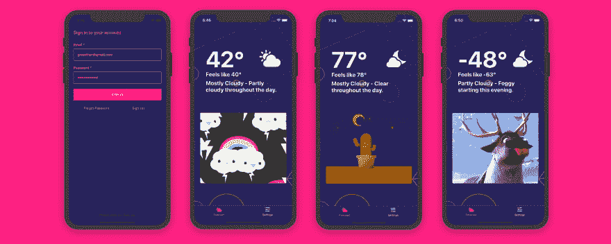

# 介绍 Gweather -一个带有 gif 的微型天气应用程序！

> 原文：<https://dev.to/theworstdev/introducing-gweather-a-micro-weather-app-with-gifs-5704>

[](https://res.cloudinary.com/practicaldev/image/fetch/s--19YHogfx--/c_limit%2Cf_auto%2Cfl_progressive%2Cq_auto%2Cw_880/https://thepracticaldev.s3.amazonaws.com/i/s4ad3yoczy7wpcc1goz7.jpg)

**部署完整的应用程序，为您提供时尚的实时天气更新。**

我收到了很多反馈，说我之前构建的应用程序示例对于学习 AWS Amplify 非常有用，因为它展示了如何将所有部分组合在一起以制作一个实际的应用程序。考虑到这一点，我决定展示一下 Amplify 的一个我最喜欢的特性，它支持带有无服务器功能的 GraphQL 解析器。这允许你使用任何东西作为数据源，这是一个如此强大的特性！

## 它有什么作用

Gweather 是一款微型天气应用，提供以下功能:

*   🌎使用地理定位获取天气数据
*   ⛈微天气更新
*   🌠与天气相关的图片
*   👮‍认证
*   🔥无服务器后端
*   🚀GraphQL
*   💻在几分钟内部署后端

## 工作原理

应用程序的代码位于[这里](https://github.com/kkemple/gweather)。

这个项目使用 AWS AppSync 来提供一个无服务器的 GraphQL api，它由一个获取天气和 gif 数据的无服务器函数支持。

在项目中，您会注意到一个名为`amplify`的文件夹。该文件夹包含应用程序的后端，可以在任何人的帐户中重新部署。在`amplify`文件夹中，你会看到一个`backend`文件夹。在该文件夹中，您将看到三个主要功能的配置:

*   认证服务(由 Amazon Cognito 提供支持)
*   GraphQL API(使用 AWS AppSync 构建)
*   函数(用 AWS Lambda 构建)

在`backend/api`文件夹中，你会看到 GraphQL API 配置以及基本的 [GraphQL 模式](https://github.com/kkemple/gweather/blob/master/amplify/backend/api/gweatherapp/schema.graphql)。

这是基本的 GraphQL 模式。您将看到基础模式如下所示:

```
type  Query  {  weather(lat:  Float!,  lon:  Float!):  Weather  @function(name:  "getweather-${env}")  }  type  Weather  {  timezone:  String  current:  WeatherSummary!  hourly:  WeatherSummary!  weekly:  WeatherSummary!  icon:  String!  temperature:  Int!  feelsLike:  Int!  gif:  String!  }  type  WeatherSummary  {  summary:  String!  icon:  String!  } 
```

<svg width="20px" height="20px" viewBox="0 0 24 24" class="highlight-action crayons-icon highlight-action--fullscreen-on"><title>Enter fullscreen mode</title></svg> <svg width="20px" height="20px" viewBox="0 0 24 24" class="highlight-action crayons-icon highlight-action--fullscreen-off"><title>Exit fullscreen mode</title></svg>

如果你以前从未使用过 Amplify，你可能不知道`@function`指令。这是 Amplify CLI 的 [GraphQL 转换](https://aws-amplify.github.io/docs/cli-toolchain/graphql)库的一部分。

**@ function**——用这个指令修饰任何字段，使用无服务器函数作为 AppSync 解析器。

## 部署 App

为了运行这个应用程序，你需要为 [Giphy API](https://developers.giphy.com/) 和[黑暗天空 API](https://darksky.net/dev) 提供一个 API 密匙。两者都有一个免费计划，运行这个应用程序应该绰绰有余。

### 部署后端，运行 app

1.  克隆存储库并安装依赖项

```
~ git clone https://github.com/kkemple/qweather.git
~ cd gweather
~ npm install 
```

<svg width="20px" height="20px" viewBox="0 0 24 24" class="highlight-action crayons-icon highlight-action--fullscreen-on"><title>Enter fullscreen mode</title></svg> <svg width="20px" height="20px" viewBox="0 0 24 24" class="highlight-action crayons-icon highlight-action--fullscreen-off"><title>Exit fullscreen mode</title></svg>

1.  使用`amplify/backend/function/getweather/src/index.js`中的黑暗天空 API 和 Giphy API 密钥更新无服务器功能

```
const buildDarkSkyUrl = (lat, lon) =>
  `https://api.darksky.net/forecast/[key]/${lat},${lon}`;

const buildGiphyUrl = tag =>
  encodeURI(
    `https://api.giphy.com/v1/gifs/random?api_key=[key]S&tag=${tag}&rating=G`
  ); 
```

<svg width="20px" height="20px" viewBox="0 0 24 24" class="highlight-action crayons-icon highlight-action--fullscreen-on"><title>Enter fullscreen mode</title></svg> <svg width="20px" height="20px" viewBox="0 0 24 24" class="highlight-action crayons-icon highlight-action--fullscreen-off"><title>Exit fullscreen mode</title></svg>

1.  初始化放大项目

```
~ amplify init
? Enter a name for the environment: dev (or whatever you would like to call this env)
? Choose your default editor: <YOUR_EDITOR_OF_CHOICE>
? Do you want to use an AWS profile? Y 
```

<svg width="20px" height="20px" viewBox="0 0 24 24" class="highlight-action crayons-icon highlight-action--fullscreen-on"><title>Enter fullscreen mode</title></svg> <svg width="20px" height="20px" viewBox="0 0 24 24" class="highlight-action crayons-icon highlight-action--fullscreen-off"><title>Exit fullscreen mode</title></svg>

1.  模拟后端，以确保应用程序正常工作

```
amplify mock 
```

<svg width="20px" height="20px" viewBox="0 0 24 24" class="highlight-action crayons-icon highlight-action--fullscreen-on"><title>Enter fullscreen mode</title></svg> <svg width="20px" height="20px" viewBox="0 0 24 24" class="highlight-action crayons-icon highlight-action--fullscreen-off"><title>Exit fullscreen mode</title></svg>

1.  启动应用程序

```
~ expo start 
```

<svg width="20px" height="20px" viewBox="0 0 24 24" class="highlight-action crayons-icon highlight-action--fullscreen-on"><title>Enter fullscreen mode</title></svg> <svg width="20px" height="20px" viewBox="0 0 24 24" class="highlight-action crayons-icon highlight-action--fullscreen-off"><title>Exit fullscreen mode</title></svg>

1.  推送到 AWS

```
~ amplify push
? Are you sure you want to continue? Y
? Do you want to generate code for your newly created GraphQL API? N
> We already have the GraphQL code generated for this project, so generating it here is not necessary. 
```

<svg width="20px" height="20px" viewBox="0 0 24 24" class="highlight-action crayons-icon highlight-action--fullscreen-on"><title>Enter fullscreen mode</title></svg> <svg width="20px" height="20px" viewBox="0 0 24 24" class="highlight-action crayons-icon highlight-action--fullscreen-off"><title>Exit fullscreen mode</title></svg>

## 定制 GraphQL 模式

此模式可以编辑。如果需要额外的字段或基本类型，可以通过执行以下操作来更新后端:

更新模式(位于 amplify/back end/API/gweather app/schema . graph QL)。

重新部署后端

```
amplify push 
```

<svg width="20px" height="20px" viewBox="0 0 24 24" class="highlight-action crayons-icon highlight-action--fullscreen-on"><title>Enter fullscreen mode</title></svg> <svg width="20px" height="20px" viewBox="0 0 24 24" class="highlight-action crayons-icon highlight-action--fullscreen-off"><title>Exit fullscreen mode</title></svg>

> 应用程序中有一个设置页面，一个有趣的挑战是允许用户存储位置，并为预测设置一个！

如果您或您认识的任何人需要帮助来启动和运行此应用程序，请通过 [Twitter](https://twitter.com/kurtiskemple) 联系我，我很乐意提供帮助！