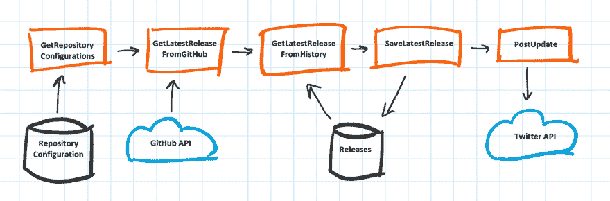
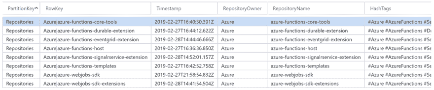
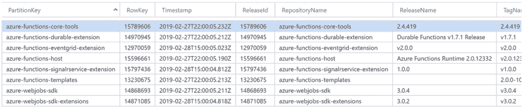

# 创建 Azure 函数更新 Twitterbot

> 原文：<https://dev.to/xpirit/creating-the-azure-functions-updates-twitterbot-25hc>

## TL；速度三角形定位法(dead reckoning)

前往[https://twitter.com/az_func_updates](https://twitter.com/az_func_updates)并关注该帐户，了解最新的 Azure Functions 版本！

## 我在努力解决什么

Azure Functions 生态系统由许多移动部件组成。有运行时、核心工具、VS 模板、Webjobs SDK 及其十几个扩展、使用 TypeScript 编写函数的定义等等。

作为一名开发人员，了解最新的版本以及彼此之间的兼容性非常重要。过去，我花了相当多的时间来排除不兼容的运行时和包，如果这种体验能够得到改善，那就太好了。

## 想法

我在想一个通知开发者关于 Azure 功能新发布的方法。几乎所有的 Azure Functions 组件都在 GitHub 上，所以我可以使用 [GitHub API](https://developer.github.com/) 来检查最新版本。

由于 IT 社区在 Twitter 上非常活跃，可以成为沟通渠道，所以一个 [Azure Functions 更新 Twitterbot](https://twitter.com/az_func_updates) 的想法就诞生了。

当然，这并没有解决处理不兼容组件的问题，但它确实有助于传播关于新版本的信息，并知道何时更新拼图的哪个部分。

## 实现

因为我自己是 Azure 函数的忠实粉丝，所以我想用这个服务作为 Twitterbot 的后端。逻辑应用也可能是一个有效的选择，但我更喜欢本地调试和测试，这很容易用 Azure 函数来完成。

应用程序的设计如下:

[](https://res.cloudinary.com/practicaldev/image/fetch/s--FvOK1iVX--/c_limit%2Cf_auto%2Cfl_progressive%2Cq_auto%2Cw_880/https://thepracticaldev.s3.amazonaws.com/i/jbi4jav35yyqnayvvg0c.png)

### 存储:天蓝色桌面存储

应用程序需要存储两件东西:

1.  GitHub 库来检查新版本。
2.  要比较的每个存储库的最新版本。

两者都需要很少的存储空间。我决定使用 Azure Table Storage，因为它易于安装和使用，而且性能也很好。

要检查的存储库存储在`RepositoryConfigurations`表中:

[](https://res.cloudinary.com/practicaldev/image/fetch/s--vXGO8UyJ--/c_limit%2Cf_auto%2Cfl_progressive%2Cq_auto%2Cw_880/https://thepracticaldev.s3.amazonaws.com/i/omtpwjs2pkzyjnylfp9v.png)

从 GitHub 检索到的发布信息存储在`Releases`表中:

[](https://res.cloudinary.com/practicaldev/image/fetch/s---P5sz2nN--/c_limit%2Cf_auto%2Cfl_progressive%2Cq_auto%2Cw_880/https://thepracticaldev.s3.amazonaws.com/i/00v946icxlt9pueanl4y.png)

我没有存储整个 GitHub Release 对象，只存储了我需要的(或者计划很快使用的)属性。

### 计算:Azure 函数

如前所述，我将 Azure 函数用于该应用程序的计算部分。具体来说，我使用了[持久函数](https://docs.microsoft.com/en-us/azure/azure-functions/durable/durable-functions-overview)扩展来控制应用程序的流程。计时器触发器每小时启动 [`ReleaseUpdateOrchestration`](https://github.com/marcduiker/az-func-updates/blob/master/src/AzureFunctionsUpdates/Orchestrations/ReleaseUpdateOrchestration.cs) 功能。

流程(伪代码)如下:

```
- GetRepositoryConfigurations
- for each of the repositories:
    - GetLatestReleaseFromGitHub
    - GetLatestReleaseFromHistory
- for each of the repositories:
    - if release from GitHub is not equal to release from History
        - SaveLatestRelease
        - PostUpdate 
```

<svg width="20px" height="20px" viewBox="0 0 24 24" class="highlight-action crayons-icon highlight-action--fullscreen-on"><title>Enter fullscreen mode</title></svg> <svg width="20px" height="20px" viewBox="0 0 24 24" class="highlight-action crayons-icon highlight-action--fullscreen-off"><title>Exit fullscreen mode</title></svg>

orchestrator 函数使用扇出/扇入模式，因为它可以为每个已配置的存储库并行调用相同的活动函数。

### GitHub API

对于 GitHub 集成，我使用的是 [Octokit](https://github.com/octokit/octokit.net) ，一个优秀的. GitHub API 客户端库。

用法如下: