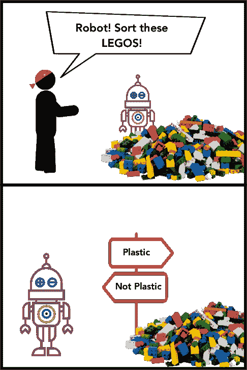
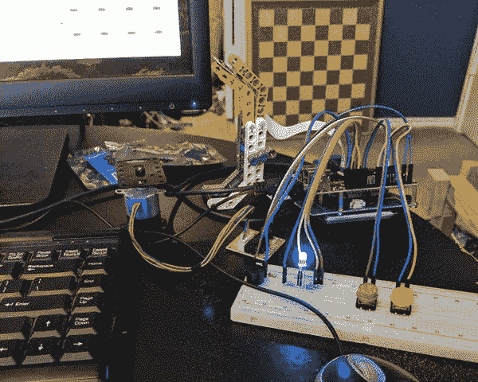
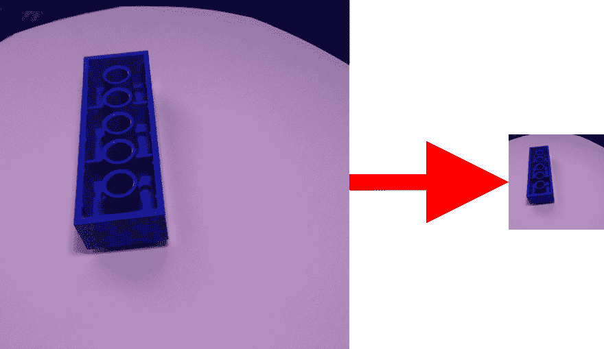

# 乐高分类器- CNN 和肘油脂

> 原文：<https://dev.to/ladvien/a-lego-classifier-cnn-and-elbow-grease-35nj>

[](https://res.cloudinary.com/practicaldev/image/fetch/s--ljnhhJeg--/c_limit%2Cf_auto%2Cfl_progressive%2Cq_auto%2Cw_880/https://ladvien.cimg/lego_classifier/lego_classifier_comic.png)

我有一个机器人朋友。需要说明的是，这位朋友不是机器人，而是我们一起制造的机器人。我们折腾的一个项目是造一个乐高分拣机。火箭是朋友的名字——同样，不是机器人——教孩子们机器人技术。对于他们的设计，乐高是主要的组成部分。不幸的是，这导致花费很多时间来准备一个事件。

他对我提到，“我真正需要的是一台分拣机。”并开始解释他的平原建立一个。

有一段时间我持怀疑态度，但最后，我被吸引住了，他谈到要整合一个深度神经网络。更具体地，卷积神经网络(CNN)。我一直在寻找建立 CNN 的借口。这是个好主意。

无论如何，这些博客文章是我们建造乐高分类器的日志。

在我们开始之前，关于这个系列的一个注意事项:我不会花太多时间来解释在其他地方更好地记录的部分工作。相反，我会专注于我发现其他人都忽略的东西。比如，让神经网络发挥作用。这个让我很困扰。每个人都喜欢说，“老兄，我的分类器的验证准确率达到了 99.999%！”这很好，但正如我们发现的，验证准确性并不总是转化为*生产准确性。*

## TL；速度三角形定位法(dead reckoning)

如果你不想听我东拉西扯或者想用简单的方法做事，你可以使用 Google 的 Colab 直接进入代码:

*   [乐高 _ 分类器](https://colab.research.google.com/drive/1gD51CXRngVZhTO9464aFKHV2pejsVPcx)

这个笔记本是用来下载 Rocket 的数据和训练分类器的。感谢 Google 提供了用于训练的 GPU 和用于托管数据的 Github。

或者如果你想在本地运行代码，Rocket 公开了训练数据。要知道，你需要一个图形处理器。

*   [乐高 _ id _ 训练 _ 数据](https://github.com/Ladvien/lego_id_training_data)

然后点击[这里](https://ladvien.com/lego-deep-learning-classifier/#preprocessing-code-needed-libraries)跳转到代码。

## 想法

开始的时候很简单。我们会在互联网上找到一些乐高的图片，然后训练 CNN 根据零件代码对它们进行分类。这有点天真，但这就是项目必须存在的地方，对吗？充满希望的天真。

不管怎样，我们在网上搜索类似的项目，因为我们希望他们已经准备好了图片。谷歌告诉我们有几个人在做类似的工作。我不打算一一列举，只列出我认为值得一读的:

*   [在树莓 Pi 上使用 TensorFlow 的乐高分类器](https://medium.com/@pacogarcia3/tensorflow-on-raspbery-pi-lego-sorter-ab60019dcf32)

这是一个由[帕科·加西亚](https://medium.com/@pacogarcia3)完成的*非常*有据可查的项目。

所以，在读了一些文章后，我们认为我们可以这样做。我们只是需要数据。进一步搜索后，我们发现了以下数据集:

*   [Kaggle:乐高“图像”数据库(由模型渲染而来)](https://www.kaggle.com/joosthazelzet/lego-brick-images)
*   [Kaggle:乐高 vs 普通砖块](https://www.kaggle.com/pacogarciam3/lego-vs-generic-brick-image-recognition#example_Lego_1x4_crop0.jpg)

我对这些数据集不满意。它们的结构不是很好，也不是为了帮助训练分类器而设计的。但是后来，火箭队发现帕科实际上已经向公众开放了他的数据集:

*   [Kaggle:乐高积木排序(最佳)](https://www.kaggle.com/pacogarciam3/lego-brick-sorting-image-recognition?fbclid=IwAR303nIR4revbYVmW7YfC_4Frnqu3yn5gOi_HP7elJ4h1_a7uXDE1MVtacw)

还有一点，Paco 也公开了他的代码:

*   [11 级张量流模型](https://github.com/pacogarcia3/lego-11class-tensorflow)

帕克，你也是一个机器人朋友！

好吧，我们被帕科鼓舞了。我们知道这个项目是可能的。然而，我们不想踩在[棕色地带](https://en.wikipedia.org/wiki/Brownfield_(software_development))上。我们需要绿色。或者，如果你不会说 dev，我们不想以简单的方式重复 Paco 的工作。我们想彻底打败自己，从头开始做每一件事。

## 创建数据集

正如我之前所说，除了 Paco，我不喜欢任何数据集。这是真实的图像，旨在训练一个分类器。但是，它们不是我们想要分类的乐高玩具。火箭的乐高项目涉及许多技术砖块，这似乎不在 Paco 的组合中。所以，我们开始创造我们自己的。

创建训练图像的第一次尝试是通过使用 Python 版本的[可视化工具包](https://vtk.org/)渲染来自互联网上找到的`.stl`文件的图像。我不会在这里介绍它，因为它是一个失败，因为我以后会写一篇关于我们尝试过但没有成功的东西的文章。

[ ](https://res.cloudinary.com/practicaldev/image/fetch/s--SDXE_7cf--/c_limit%2Cf_auto%2Cfl_progressive%2Cq_auto%2Cw_880/https://ladvien.cimg/lego_classifier/rockets_contraption.jpg) {:。总之，当我在做的时候，火箭有一个很棒的计划。他发明了一种仪器来给旋转盘上的乐高玩具拍照。它使用了树莓派，Pi 凸轮，步进电机，和独角兽放屁。

然后火箭开始给 10 类乐高拍照。不知道这花了多长时间，但很快他告诉我他有 19000 张照片。(好，好，他可能是*部分*机器人。)

我不打算解释这种构造，因为我相信火箭以后会这么做。除此之外，我唯一能理解的是独角兽的肠胃气胀。

好吧！现在我需要做好准备，修复软件。

## 预处理代码

在我们开始用火箭的图像训练 CNN 之前，我们需要做一些预处理。首先，图像是全分辨率的，但我们需要裁剪它们，因为 CNN 在方形图像上训练得更好。当然，为了不丢失目标数据(乐高)，图像需要被裁剪。

例如
[](https://res.cloudinary.com/practicaldev/image/fetch/s--p4q-L9ff--/c_limit%2Cf_auto%2Cfl_progressive%2Cq_auto%2Cw_880/https://ladvien.cimg/lego_classifier/crop_and_resize.png)

此外，培训师可能会期望一个类似这样的文件结构:

```
data
├── test
│   ├── 2456
│   │     └── 2456_0001.jpg
│   │     └── 2456_0002.jpg
│   │     └── 2456_0003.jpg
│   │     └── ....
│   ├── 3001
│   ├── 3002
│   ├── 3003
│   ├── 3004
│   ├── 3010
│   ├── 3039
│   ├── 32064
│   ├── 3660
│   └── 3701
└── train
    ├── 2456
    ├── 3001
    ├── 3002
    ├── 3003
    ├── 3004
    ├── 3010
    ├── 3039
    ├── 32064
    ├── 3660
    └── 3701 
```

Enter fullscreen mode Exit fullscreen mode

因此，我编写了一个 Python 脚本来完成以下任务

1.  选择一个路径，在这个路径中，图像按照类名存储
2.  加载图像
3.  将图像调整到指定的大小
4.  从图像中心向外裁剪
5.  创建一个训练和测试文件夹
6.  用类名在 train 和 test 中创建子文件夹
7.  在此过程中随机播放图像
8.  将裁剪后的文件保存在适当的文件夹中，这取决于您想要保留用于测试的图像的百分比。
9.  对每个图像重复步骤 2-8

让我们直接进入代码。

完整的代码可以在这里找到:

*   [square_crop.py](https://github.com/Ladvien/lego_sorter/blob/master/square_crop.py)

但是我将遍历下面的代码。

## 预处理代码:需要的库

```
import os
import glob
import cv2
import random 
```

Enter fullscreen mode Exit fullscreen mode

我们使用的唯一非标准 Python 库是:

*   [OpenCV](https://pypi.org/project/opencv-python/)

根据您使用的操作系统以及您使用的是 Anaconda 还是 straight Python，这可能有点棘手。不过，下面是我们用的:

```
pip install https://pypi.org/project/opencv-python/ 
```

Enter fullscreen mode Exit fullscreen mode

如果您在加载`cv2`库时遇到任何问题，这可能意味着安装 OpenCV 时出现了问题。请在评论中告诉我，我可以帮忙调试。

## 预处理代码:加工参数

下面控制预处理的流程

*   `dry_run`:如果设置为 true，则不保存图像，但执行其他所有操作
*   `gray_scale`:将图像转换为灰度。
*   `root_path`:项目的根文件夹
*   `show_image`:显示图像的前后。
*   `output_img_size`:调整到您想要的输出图像尺寸
*   `grab_area`:调整大小前原始图像的总面积
*   `train_test_split`:测试图像扣留率
*   在这个过程中，图像应该被打乱吗
*   `part_numbers`:输入中包含的所有类别文件夹的列表

```
#####################
# Parameters
##################### 
dry_run                 = False # If true, will print output directory. gray_scale              = True

root_path               = './data/'
input_path              = f'{root_path}raw/size_1080/'
output_path             = f'{root_path}cropped/'

show_image              = False

output_img_size         = (300, 300)
grab_area               = 500
train_test_split        = 0.3
shuffle_split           = True

part_numbers            = [
                           '2456',
                           '3001',
                           '3002',
                           '3003',
                           '3004',
                           '3010',
                           '3039',
                           '3660',
                           '3701',
                           '32064'
                        ] 
```

Enter fullscreen mode Exit fullscreen mode

下面是主循环。它将对在根文件夹中找到的每个**文件夹**进行重复。

```
for part_number in part_numbers:

    part_input_path  = f'{input_path}{part_number}/'

    # Get input file paths.
    image_files = glob.glob(f'{part_input_path}*.jpg')
    num_files = len(image_files)

    # Image index.
    index = 0

    # If true, the images will be loaded and then split at random.
    if shuffle_split:
        file_index = random.sample(range(1, num_files), num_files - 1)
    else:
        file_index = range(1, num_files) 
```

Enter fullscreen mode Exit fullscreen mode

这是内部循环，它加载 class class 文件夹中的每个图像文件，修改它，并将其保存到输出文件夹中。

```
 for file_num in file_index:

        # Increment the file index.
        index += 1

        # Load the image
        input_file_path = f'{input_path}{part_number}/{str(file_num).zfill(4)}.jpg'
        print(f'LOADED: {input_file_path}')

        # Crop raw image from center.
        img = cv2.imread(input_file_path)

        # Get the center of the image.
        c_x, c_y = int(img.shape[0] / 2), int(img.shape[1] / 2)
        img = img[c_y - grab_area: c_y + grab_area, c_x - grab_area: c_x + grab_area]

        # Resize image
        img = cv2.resize(img, output_img_size, interpolation = cv2.INTER_AREA)

        # Should we convert it to grayscale?
        if gray_scale:
            img = cv2.cvtColor(img, cv2.COLOR_BGR2GRAY)

        # Show to user.
        if show_image:
            cv2.imshow('image', img)
            cv2.waitKey(0)
            cv2.destroyAllWindows() 

        # Determine if it should be output to train or test.
        test_or_train = 'train'        
        if index < int(num_files * train_test_split): 
            test_or_train = 'test'

        # Prepare the output folder.
        color = ''
        if gray_scale:
            part_output_folder = f'{output_path}gray_scale/{test_or_train}/{part_number}/'
        else:
            part_output_folder = f'{output_path}color/{test_or_train}/{part_number}/'

        # Make the output directory, if it doesn't exist.
        if not os.path.exists(part_output_folder):
            os.makedirs(part_output_folder)

        # Create part path.
        part_image_path = f'{part_output_folder}{part_number}_{index}.jpg'

        # Output
        if dry_run:
            print(f'Would have saved to: {part_image_path}')
        else:
            print(f'SAVED: {part_image_path}')
            cv2.imwrite(part_image_path, img) 
```

Enter fullscreen mode Exit fullscreen mode

相当简单。只需确保从主目录运行脚本。例如

```
project_folder
└── square_crop.py <--- run from here
└── data
    ├── test
    │   ├── 2456
    │   │     └── 2456_0001.jpg
... 
```

Enter fullscreen mode Exit fullscreen mode

或者，如果你不想这么做。火箭队公开了他的照片

*   [乐高 _ id _ 训练 _ 数据](https://github.com/Ladvien/lego_id_training_data)

## 接下来

接下来，我将深入研究 Tensorflow CNN 代码。敬请期待，我的机器人朋友们！