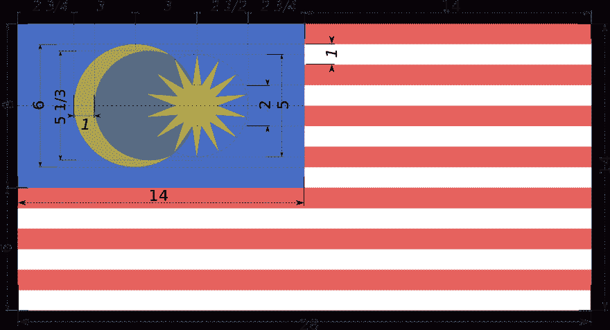

# 如何用 HTML 和 CSS 🇲🇾创建马来西亚国旗

> 原文：<https://dev.to/henrylim96/how-to-create-malaysia-flag-with-html-and-css-3obe>

马来西亚现在 [62 岁](https://en.wikipedia.org/wiki/Hari_Merdeka)！🎉马来西亚，生日快乐！🎂

为了庆祝这个重要的日子，我决定使用 HTML 和 CSS(仅)创建马来西亚国旗，不使用任何 JavaScript、SVG，当然，也不使用任何图像。

嗯……但从技术上来说，我可以使用表情符号，对吗？或者也许我可以用[这个 NPM 包](https://www.npmjs.com/package/emoji-flag-my)？

* * *

### Flag of Malaysia - Jalur Gemilang 🇲🇾

> 马来西亚的国旗，也被称为马来文:Jalur Gemilang(“荣耀的条纹”)，由 14 条红色和白色相间的条纹组成**和一个蓝色的旗帜，上面有**一个新月**和**一颗 14 角星**被称为唐斌星(联邦星)。**

 **以下是我需要使用 HTML 和 CSS 创建的组件:

*   14 条红白相间的条纹:听起来很简单😎
*   **月牙:**嗯，里面一个大圈一个小圈？🤔
*   我完全不知道该怎么做🤭

* * *

### 第一步:用 CSS 网格创建旗帜布局

<figure>

<figcaption>(Source: [Wikipedia](https://en.wikipedia.org/wiki/Flag_of_Malaysia#/media/File:Construction_sheet_of_Flag_of_Malaysia.svg))</figcaption>

</figure>

首先，我将使用 [CSS 网格](https://css-tricks.com/snippets/css/complete-guide-grid/)创建旗帜布局。

这非常简单，我将使用`grid-template-rows`和`grid-template-columns`属性创建 2 行 2 列的标志布局。

然后，我将使用`grid-column: span 2`将底部的列扩展为一整行*(或 2 列)*。**