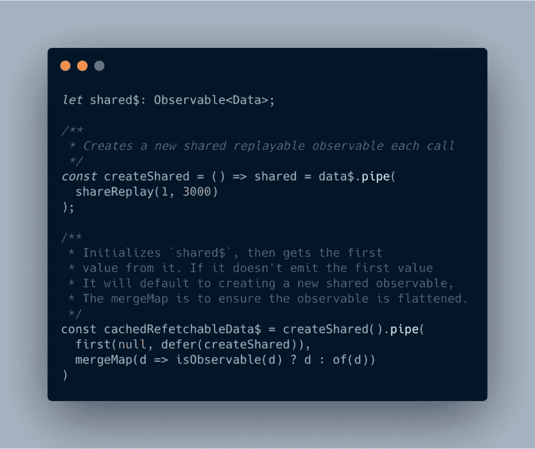

# RxJS 缓存和刷新 Angular

> 原文：<https://dev.to/prestonjlamb/rxjs-caching-and-refreshing-in-angular-2icn>

## tldr；

在 Angular 中开发时，我每天都使用 Observables 和 RxJS，但很多时候我只是使用默认的、开箱即用的标准特性。但是在最近的一个项目中，我真正想要的是缓存一些我们需要从服务器获取的数据。数据不会经常改变，所以在重新获取数据之前缓存一两个小时的响应是完美的。幸运的是，RxJS 有`shareReplay`操作符，它会自动与新订户共享以前的响应。在许多情况下，这是一种足够的缓存数据的方式。但是如果您想在某个时间段之后更新数据，您需要一个`shareReplay`、`defer`和`mergeMap`的组合，这样当一个订户被添加到一个可观察对象中时，如果必要的话，数据会被刷新。看看下面的例子，并继续阅读了解更多信息。

*   [Stackblitz 示例](https://stackblitz.com/edit/pjlamb12-rxjs-caching-and-refreshing-data)
*   [GitHub 回购](https://github.com/pjlamb12/pjlamb12-rxjs-caching-and-refreshing-data)

## 用 RxJS 缓存数据

前几天，我在工作中开发一个应用程序，我们需要从服务器获取一些数据，但是这些数据并不经常更新。因此，大约一小时获取一次信息不成问题。RxJS 让这一切变得非常简单！我很幸运！下面是让 RxJS 缓存数据并将相同的数据提供给其他订阅者所需做的全部工作:

```
this._http.get(this.url).pipe(shareReplay(1)); 
```

<svg width="20px" height="20px" viewBox="0 0 24 24" class="highlight-action crayons-icon highlight-action--fullscreen-on"><title>Enter fullscreen mode</title></svg> <svg width="20px" height="20px" viewBox="0 0 24 24" class="highlight-action crayons-icon highlight-action--fullscreen-off"><title>Exit fullscreen mode</title></svg>

这个例子使用 Angular 的`HttpClient`模块在某个`url`调用 API 端点，并使用`shareReplay`操作符告诉 RxJS 将最新数据发送给新订户。你可以在 RxJS 文档中阅读更多关于`shareReplay` [的内容。这里传递给`shareReplay`操作符的`1`将操作符的缓冲区大小设置为 1，这就是它只与新订户共享最新数据的原因。](https://rxjs.dev/api/operators/shareReplay)

在许多情况下，这种缓存方法就足够了。当应用程序刷新时，数据将被更新。只要在此之前不需要刷新数据，这种方式就能很好地工作。但是，如果您不能等到应用程序刷新后再刷新数据，我们将需要做更多的工作。

## 用 RxJS 缓存和更新数据

好的，现在让我们假设我们想要缓存我们的数据 5 分钟，5 分钟后我们需要为下一个订阅者更新它。幸运的是，`shareReplay`可以接受第二个参数，`windowTime`。`windowTime`本质上是用`shareReplay`声明数据将被缓存多长时间。因此，如果我们以`windowTime`的身份在 5 分钟内通过，那么从第一个 0 秒的订户到第四个 4 分 59 秒的订户，任何订户都将获得相同的数据。在第 5 分钟，观察完成，之后的任何订户都将得到一个空值。

现在，这不是*确切地说*我们想要的，因为`windowTime`之后的新订户没有数据，但我们真的希望他们有数据(显然)。这是本·莱什在推特上为我回答的问题。以下是他的推文:

> 本莱什[@本莱什](https://dev.to/benlesh)[@ prestonjlamb](https://twitter.com/prestonjlamb)[@ Sam Julien](https://twitter.com/samjulien)[@ DeborahKurata](https://twitter.com/DeborahKurata)嗯..那很棘手。RxJS 没有那种 OOTB 的东西，但首先映入我脑海的会是这样的:23:09PM-28 Aug 2019[](https://twitter.com/intent/tweet?in_reply_to=1166850444351758336)[](https://twitter.com/intent/retweet?tweet_id=1166850444351758336)[](https://twitter.com/intent/like?tweet_id=1166850444351758336)

你也可以阅读他的图片代码中的注释，但是`createShared`函数用`data$`可观察值初始化`shared$`可观察值。它还使用`defer`，如果 null 是从`shared$`可观测值发出的第一个值，就使用它。在这种情况下，它创建一个可观察对象的新实例并传递它。我对此进行了测试，效果非常好。看看[这个 StackBlitz 例子](https://stackblitz.com/edit/pjlamb12-rxjs-caching-and-refreshing-data)。组件一加载，可观察对象就被订阅，然后在`windowTime`到期后，第二个订阅者加入并获取新数据。自从第一次观测完成后，这两组数据很有可能不匹配。(*注意:显示的项目是从星球大战 API 返回的人员列表中随机选择的 1 到 10 个。同一个数字有可能出现两次，但是第一次没有更新它的数据来匹配新的第二次数据调用。)

为了更容易地创建这种类型的可观察对象，我创建了这个函数:

```
let returnObs$: Observable<any>;
const createReturnObs = (obs: Observable<any>, time: number, bufferReplays: number) =>
    (returnObs$ = obs.pipe(shareReplay(bufferReplays, time)));

export function renewAfterTimer(obs: Observable<any>, time: number, bufferReplays: number = 1) {
    return createReturnObs(obs, time, bufferReplays).pipe(
        first(null, defer(() => createReturnObs(obs, time, bufferReplays))),
        mergeMap(d => (isObservable(d) ? d : of(d))),
    );
} 
```

<svg width="20px" height="20px" viewBox="0 0 24 24" class="highlight-action crayons-icon highlight-action--fullscreen-on"><title>Enter fullscreen mode</title></svg> <svg width="20px" height="20px" viewBox="0 0 24 24" class="highlight-action crayons-icon highlight-action--fullscreen-off"><title>Exit fullscreen mode</title></svg>

要获得一个新的可观察对象，它将在给定的时间内缓存数据，然后在给定的时间后为新的订阅者进行刷新，请像这样使用函数:

```
myObs$ = renewAfterTimer(of(true), 1500); 
```

<svg width="20px" height="20px" viewBox="0 0 24 24" class="highlight-action crayons-icon highlight-action--fullscreen-on"><title>Enter fullscreen mode</title></svg> <svg width="20px" height="20px" viewBox="0 0 24 24" class="highlight-action crayons-icon highlight-action--fullscreen-off"><title>Exit fullscreen mode</title></svg>

其中`of(true)`是需要刷新的可观察值。

## 结论

因此，回顾一下，使用 RxJS 中的`shareReplay`操作符为您的应用程序缓存数据。使用上面来自 Ben 的示例(或者我构建的用于创建 Ben 提到的那些 observable 的函数)来创建一个 observable，该 observable 将数据缓存一段时间，然后为新订户进行刷新。