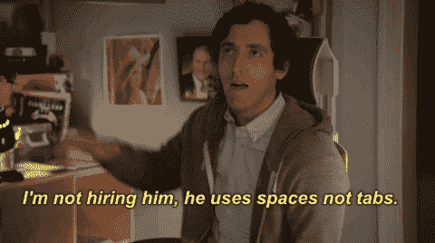
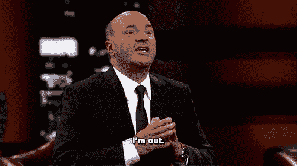
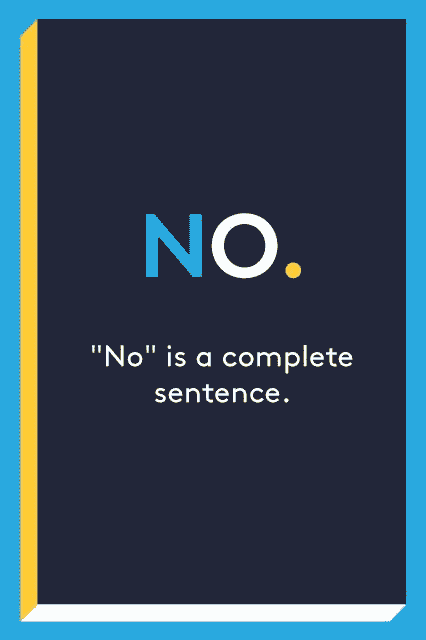
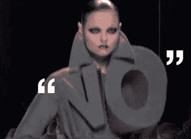

# 应对“不”

> 原文：<https://dev.to/vetswhocode/dealing-with-no-21k8>

## 如何应对拒绝

作为一个终生的书呆子和自学成才的 web 开发人员，我花了很长时间来习惯拒绝，无论是在我的个人生活中，申请工作，还是向开源项目提交 PR。被拒绝可能会很痛苦...这对自我是一个沉重的打击，可能会非常令人沮丧。不过，顺其自然才是结束。

### 求职时被拒

我以此开头，因为我在兽医 FNG 牧马人的职位很像公司招聘人员。我们有一个面试过程来决定谁能进入，虽然我们希望包括所有申请的人，但人们通常不会。求职面试者的处境很艰难...当他们试图填补一个职位时，他们有一套标准，他们经常不得不费力地从几十个，有时是几百个可能不符合这些标准的申请人中找到一两个符合标准的。即使这样，他们也可能没有一个以上的职位，不得不在合格的申请人中做出选择。求职者很难把自己放在面试官的位置上，因为他们的注意力集中在自己的需求和情况上。被告知你不合格或者只是不适合某个职位肯定会令人沮丧，但这不是世界末日，也不意味着你应该停止尝试。一些选项:

*   **回顾你的技能:**也许你真的没有他们想要的，或者没有他们想要的答案。如果你发现自己的技能有所欠缺，那就去寻找教程、课程等...做研究，提高你下次的机会。如果你缺乏经验，试着为开源项目做贡献。
*   查看就业市场:看看你申请的职位，看看你面临的是什么样的竞争。也许市场已经饱和了，你最好去寻找一些稍微不同的东西。
*   查看你的简历:你的简历是你给任何未来雇主的第一印象，大多数面试官每天都会看到大量的简历。问问你自己...这份简历是把我描述成一个能做自己想做的事情的人吗？是什么让我脱颖而出？它有没有说什么不该说的关于我的话？
*   回顾一下你在面试中的表现:作为一名开发人员，这十有八九是我失败的原因。就像我说的，我是一个终生的书呆子，这与我的智力关系不大，更多的是因为我严重缺乏人际交往能力。我经常意识不到我说的或做的某些事情会让别人感到不安或不快，或者我的外表会影响人们对我的看法，当我和陌生人说话时，我经常会紧张。我花了很多时间在镜子前练习，和我的妻子练习，和朋友练习，学习如何以一种吸引潜在雇主的方式展示自己。去面试就像为一个演员的角色做准备，如果你排练一下会更好。
*   无论如何，都要感谢你的面试官抽出时间:保持尊重和礼貌，尤其是在你被拒绝的时候。也许你不是他们在这个特定职位上寻找的人，但你的技能可能正是他们在另一个职位上寻找的人。态度差可能会使你得不到考虑。
*   继续尝试:这不用说...如果你失业了，你就没有选择了。

### 提出想法时遭到拒绝

 
比方说，你正试图启动一家初创公司，你正在寻找资本。你已经准备好了你的商业计划，你的技术要求，你的精神状态...你准备好了，渴望去。你去见一个风投，做你的陈述，然后他们拒绝了你。你看到你的梦想在你眼前熊熊燃烧。这种拒绝就像看着某人踢你的孩子，这是令人心碎的。最糟糕的是，令人恼火。你是做什么的？

*   撇开细节不谈，这种拒绝与求职被拒非常相似，在大多数情况下，回顾一下你展示了什么以及你是如何展示自己的，可以在提高下次机会方面创造奇迹。
*   保持冷静，坚持下去:在处理任何形式的拒绝时，专业的态度会让你走得更远。保持你的方向，问问题...正确的问题，正确的态度。这引出了我的下一个要点...
*   采纳你听到的任何建议:大多数风投都有很好的理由拒绝项目...他们做的是通过提供资金来赚钱的生意，如果他们不知道什么能赚钱，什么不能赚钱，他们就不会非常成功。可能是他们看到了与你相似的想法表现不佳，或者你的市场研究有缺陷。尊重地倾听，并利用他们的免费建议。
*   **学会何时放弃(不要真的放弃):**接受这样一种想法，即你构想并精心打造的卡特彼勒租赁手机应用可能并不是一个好主意。这并不一定意味着你没有创业的权利，只是说你没有创业的权利*和*。这就好像一个作者的故事被一个编辑拒绝了一样:这篇文章可能有节奏问题，或者可能没有观众。这并不意味着作者一定是坏的...大多数成功的作家在作品被接受之前都有过无数次的拒绝。给自己留点心痛，接受好的建议。如果你已经多次向不同的风投提出同一个想法，并且你不断听到同样的事情，那么很可能他们是对的，而你是错的。学会接受它，继续下一件事。

### 拒绝拉取请求

好了，您已经有了您参与的工作/启动/开源项目，并且您已经提交了一个同行评审的请求，以合并您最新的特性或错误修复...而且被拒绝了。哦不！三天的工作，全都白费了！好吧，所以这种拒绝并不是很难接受，但是作为一名开发人员，即使是一名经验丰富的开发人员，这也是您可能最经常收到的类型，所以您最好知道如何处理它。

*   **你的同行不是因为拒绝你的拉动请求而成为希特勒:**不要这样对待他们。记住，他们会抽出时间来检查你的工作，他们可能和你一样有很多事情要做。同样，他们是你的同事，在将来的某个时候，他们需要和你的代码一起工作。感谢他们的投入，并相应地承认。
*   假设你的同事知道的和你一样多，或者比你更多:如果你毫无疑问地知道自己是这个房间里最聪明的人，那你就走错房间了。如果你是白痴中的天才，那也没什么好学的，这是一种停滞不前的好方法。然而从统计数据来看，情况不会是这样的。如果他们能提供一个有效的论据来反对你在代码中所做的事情，请注意。
*   对意见迅速做出反应:正如我之前所说，你的同事和你一样忙，所以要记住他们的建议，并迅速采取行动。如果你有一个很好的理由来解释你所做的事情，并且可以支持它，不要害怕讨论它...他们可能会让步，看到你的观点。如果没有，做出建议的改变并完成它，不要为了赢得争论而拖延。在这一点上，你所做的只是减慢你的团队的速度，让每个人看起来都很糟糕，更糟糕的是，对你感到不舒服...这就引出了我的最后一点...
*   **一如既往，保持礼貌和接受:**除了对你的同事/老板/陌生人发表仇恨言论(或办公用品)之外，没有什么比和每个人都争吵更快地让你被踢出团队，即使是糟糕的表现。如果你发现自己一直在为公关拒绝争论不休，那么重新审视自己的做法，并做出相应的调整。否则，你可能会无意中发现自己又回到了本文的开头(在寻找新工作时经历了多次拒绝)。

### 如果你是那个不得不说“不”的人呢？

 
当你是不得不说不的那个人时，你仍然需要记得要有礼貌，讲道理。请记住，并不是所有与你打交道的人都会阅读这篇文章(我敢肯定，很多人已经阅读了，但不会留意)。他们可能会抱怨、哭泣、乞求、辱骂等...被拒绝后。如果你是面试官或风投，他们可能会给你发垃圾邮件，乞求再给你一次机会。尽可能礼貌，但要明确这次是“不”，不是“也许”，不是“我们走着瞧”。试图通过用你的语言表达不清楚来减轻某人的感受只会把事情拖得更久，听到有人倾吐他们自己的不幸故事，比如他们为什么需要这份工作/资金/任何东西，因为他们发现你可能是一个弱势群体，这可能会让人心碎。事实上，每次我不得不拒绝申请人时，我都有点难过，特别是因为我们在 Vets Who Code 的整个目的是帮助退伍军人在离开军队后过上更好的生活。有相当多的人认为他们有权得到我们的帮助，仅仅是因为我们的存在是为了帮助像他们一样的人，但事实并非如此...我们的资源有限，而我们的申请人却很多；我们不能接受所有人。同样，一个工作面试官有那么多职位，一个风投有那么多资源，一个评审有那么多耐心。很难对一个潜在的雇员、企业家或同事说不，但不可避免地，在某些时候，这是必要的。不要让它把你拖垮。

## 结论:

 
“不”可以让人郁闷。“不”可能会令人痛苦和残酷。但是如果态度正确，“不”可以成为学习和成长的机会。当有人对你说‘不’的时候，这既不是世界末日，也不是你最终的失败。世界上最成功的人都有自己的拒绝时刻，他们和那些不太成功的人的区别在于，他们没有让那些失败阻止他们...他们爬起来，掸掉身上的灰尘，再试一次。