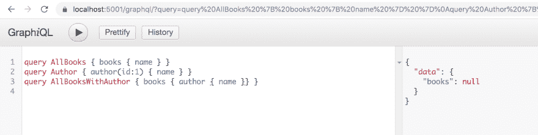
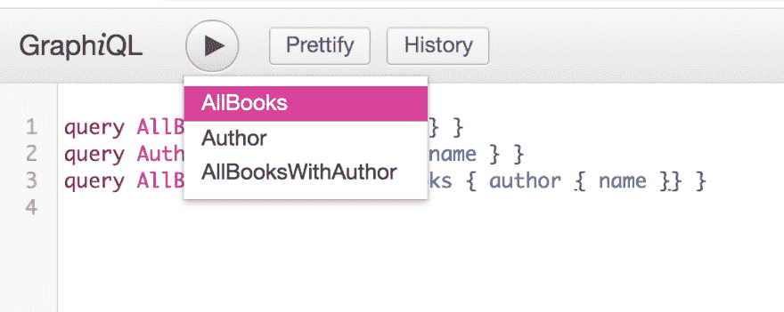
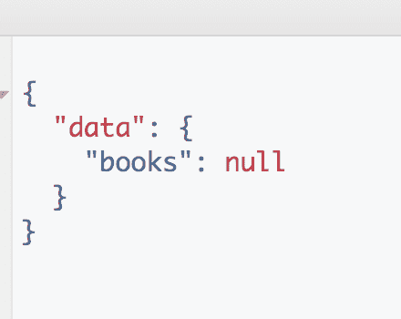
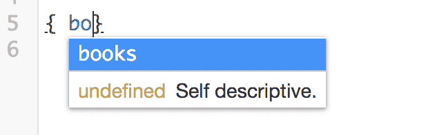
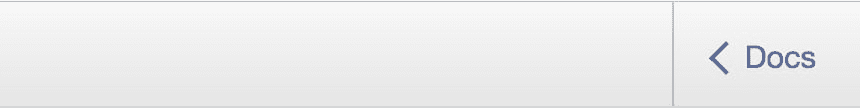
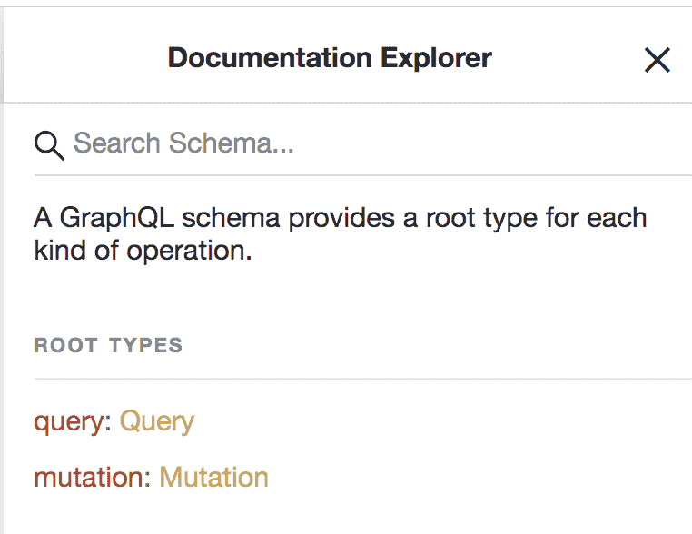
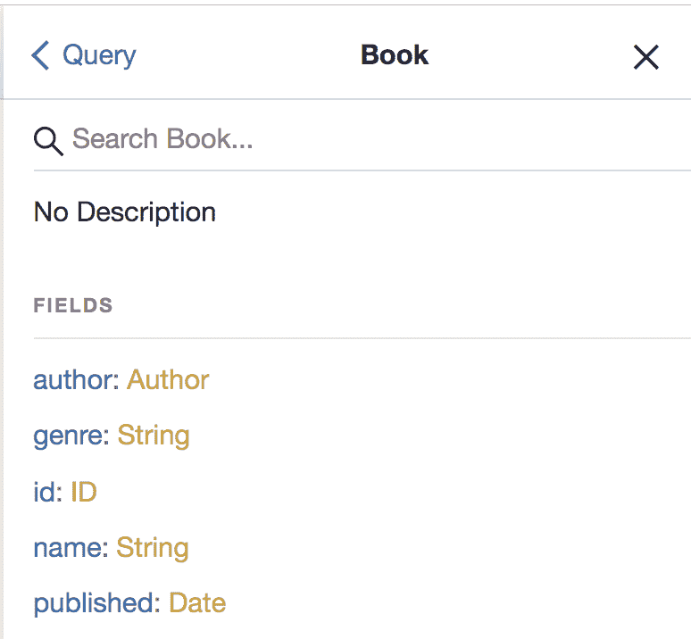
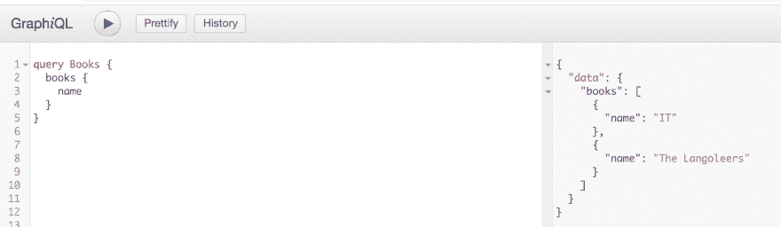
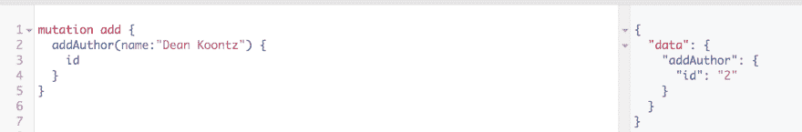

# 如何使用 GraphQL 构建 Web API？Net 核心和实体框架

> 原文：<https://dev.to/dotnet/how-you-can-build-a-web-api-using-graphql-net-core-and-entity-framework-1ago>

# 使用 GraphQL 构建 Web Api。Net 核心和实体框架

在本文中，我们将了解:

*   **构建 Web Api** ，我们将学习如何使用。Net 核心 CLI 以及不同的类如何响应不同的请求
*   **集成 GraphQL** ，我们将创建必要的助手类来创建诸如模式、解析器之类的东西。此外，我们将学习使用可视化环境 GraphiQL
*   **建立实体框架**并将类映射到表，这里我们将建立一个带有实体的类，这些实体将在数据库中创建相应的表和列。我们还将把 EF 与我们的 API 集成在一起

以下是这篇文章的回复:

> [https://github.com/softchris/graphql-ef-demo](https://github.com/softchris/graphql-ef-demo)

## 资源

*   中关于创建 webapi 的文章。网络核心

*   在中构建您的第一个 Graphql 应用。Net Core
    教你如何在。Net 核心使用 GraphQL。这讨论了一些基本的主题，比如查询、变异、解析器等等。

*   用 GraphQL 构建一个无服务器的 Api。Net Core
    这涵盖了如何用底层的 GraphQL API 构建一个无服务器的 API。

*   我根据
    撰写了这篇文章，从很多方面来看，这都是一篇优秀的文章。它使用了一种不同的、更详细的方法来设置 GraphQL。你想用哪种方法取决于你自己

*   部署您的。Net Core app to the Cloud
    这教你如何从 VS 代码部署

*   免费 Azure 账户
    要部署无服务器 Azure 功能，你需要一个免费的 Azure 账户

## 构建我们的 Web Api

我们要做的第一件事是搭建一个. Net 核心项目。我们将使用一个名为`webapi`的模板。命令如下:

```
dotnet new webapp -o aspnetcoreapp 
```

<svg width="20px" height="20px" viewBox="0 0 24 24" class="highlight-action crayons-icon highlight-action--fullscreen-on"><title>Enter fullscreen mode</title></svg> <svg width="20px" height="20px" viewBox="0 0 24 24" class="highlight-action crayons-icon highlight-action--fullscreen-off"><title>Exit fullscreen mode</title></svg>

这将在文件夹`aspnetcoreapp`中创建一个 Web Api 项目。标志`-o`表示给目录取什么名字。所以你可以用自己选择的名字代替`aspnetcoreapp`。

如果您从未在。Net Core 之前，我建议看一看在`Resources`中提到的 Web Api 链接。不过，我还是要说。这个想法是有一个与控制器匹配的路线的概念。在一个普通的 Wep Api 中，你通常会有一个由`ProductsController`类处理的路由`api/Products`。当我们实现 GraphQL 部分时，我们将对此进行更深入的研究。

## 整合 GraphQL

我们将采取以下步骤来集成 GraphQL:

1.  从 NuGet 安装依赖项
2.  **定义**一个具有自定义类型、查询类型和变异的模式
3.  **创建响应请求的**解析器函数
4.  **添加一个 Web Api 路由**来响应来自我们的可视化环境 GraphiQL 的请求

### 安装依赖项

首先确保我们在我们的项目目录中:

```
cd aspnetcoreapp 
```

<svg width="20px" height="20px" viewBox="0 0 24 24" class="highlight-action crayons-icon highlight-action--fullscreen-on"><title>Enter fullscreen mode</title></svg> <svg width="20px" height="20px" viewBox="0 0 24 24" class="highlight-action crayons-icon highlight-action--fullscreen-off"><title>Exit fullscreen mode</title></svg>

现在像这样安装依赖项:

```
dotnet add package GraphQL --version 2.4.0
dotnet add package graphiql --version 1.2.0 
```

<svg width="20px" height="20px" viewBox="0 0 24 24" class="highlight-action crayons-icon highlight-action--fullscreen-on"><title>Enter fullscreen mode</title></svg> <svg width="20px" height="20px" viewBox="0 0 24 24" class="highlight-action crayons-icon highlight-action--fullscreen-off"><title>Exit fullscreen mode</title></svg>

包`GraphQL`将为我们提供建立模式和定义解析器所需的核心库。`graphiql` package 是一个可视化环境，我们将使用它来展示开发人员的体验有多棒。

### 设置模式

像这样创建一个`Graphql`目录:

```
mkdir Graphql 
```

<svg width="20px" height="20px" viewBox="0 0 24 24" class="highlight-action crayons-icon highlight-action--fullscreen-on"><title>Enter fullscreen mode</title></svg> <svg width="20px" height="20px" viewBox="0 0 24 24" class="highlight-action crayons-icon highlight-action--fullscreen-off"><title>Exit fullscreen mode</title></svg>

现在创建一个文件`Schema.cs`，并赋予它以下内容:

```
using GraphQL.Types;
using GraphQL;
using Api.Database;

namespace Api.Graphql 
{
  public class MySchema 
  {
    private ISchema _schema { get; set; }
    public ISchema GraphQLSchema 
    {  
      get 
      {
        return this._schema;
      }
    }

    public MySchema() 
    {
      this._schema = Schema.For(@"
          type Book {
            id: ID
            name: String,
            genre: String,
            published: Date,
            Author: Author
          }

          type Author {
            id: ID,
            name: String,
            books: [Book]
          }

          type Mutation {
            addAuthor(name: String): Author
          }

          type Query {
              books: [Book]
              author(id: ID): Author,
              authors: [Author]
              hello: String
          }
      ", _ =>
      {
        _.Types.Include<Query>();
        _.Types.Include<Mutation>();
      });
    }

  }
} 
```

<svg width="20px" height="20px" viewBox="0 0 24 24" class="highlight-action crayons-icon highlight-action--fullscreen-on"><title>Enter fullscreen mode</title></svg> <svg width="20px" height="20px" viewBox="0 0 24 24" class="highlight-action crayons-icon highlight-action--fullscreen-off"><title>Exit fullscreen mode</title></svg>

我们来分解一下刚才做的。`Query`和`Mutation`是保留字。`Query`是我们的公共 API，我们放在这里的任何东西都可以被查询。`Mutation`也是公共 API 的一部分，但表明我们想要改变数据。我们唯一的条目是`addAuthor`，它将允许我们创建一个作者。`Author`和`Book`是我们刚刚定义的自定义类型，它们有一些合适的属性。

### 查询

如果您还没有读过我关于 GraphQL 的其他文章，我建议您看一下参考资料部分，但是这里有一个快速浏览，它是如何在 GraphQL 中进行查询的。给定上面的模式，我们可以查询`books`。可能是这样的:

```
{ 
  books { 
    name,
    genre,
    published
  }
} 
```

<svg width="20px" height="20px" viewBox="0 0 24 24" class="highlight-action crayons-icon highlight-action--fullscreen-on"><title>Enter fullscreen mode</title></svg> <svg width="20px" height="20px" viewBox="0 0 24 24" class="highlight-action crayons-icon highlight-action--fullscreen-off"><title>Exit fullscreen mode</title></svg>

这将给出如下响应:

```
{  "data":  {  "books"  :  [{  "name":  "IT",  "genre":  "Horror",  "published":  "1994"  }]  }  } 
```

<svg width="20px" height="20px" viewBox="0 0 24 24" class="highlight-action crayons-icon highlight-action--fullscreen-on"><title>Enter fullscreen mode</title></svg> <svg width="20px" height="20px" viewBox="0 0 24 24" class="highlight-action crayons-icon highlight-action--fullscreen-off"><title>Exit fullscreen mode</title></svg>

GraphQL 最棒的一点是，它允许我们更深入地查询更多数据，所以我们可以要求它在上面的查询中列出作者，就像这样:

```
{
  books {
    name, 
    genre,
    published,
    author {
      name
    }
  }
} 
```

<svg width="20px" height="20px" viewBox="0 0 24 24" class="highlight-action crayons-icon highlight-action--fullscreen-on"><title>Enter fullscreen mode</title></svg> <svg width="20px" height="20px" viewBox="0 0 24 24" class="highlight-action crayons-icon highlight-action--fullscreen-off"><title>Exit fullscreen mode</title></svg>

有了相应的答案:

```
{  "data":  {  "books"  :  [{  "name":  "IT",  "genre":  "Horror",  "published":  "1994",  "author":  {  "name":  "Stephen King"  }  }]  }  } 
```

<svg width="20px" height="20px" viewBox="0 0 24 24" class="highlight-action crayons-icon highlight-action--fullscreen-on"><title>Enter fullscreen mode</title></svg> <svg width="20px" height="20px" viewBox="0 0 24 24" class="highlight-action crayons-icon highlight-action--fullscreen-off"><title>Exit fullscreen mode</title></svg>

### 定义解析器

在我们定义解析器之前，我们需要几个类型。我们需要创建`Author`和`Book`。

**创建类型**

首先在目录`Database`下创建一个文件`Author.cs`。给它以下内容:

```
// Database/Author.cs

using System.Collections.Generic;

namespace Api.Database
{
  public class Author
  {
    public int Id { get; set; }
    public string Name { get; set; }
    public List<Book> Books { get; set; }
  }
} 
```

<svg width="20px" height="20px" viewBox="0 0 24 24" class="highlight-action crayons-icon highlight-action--fullscreen-on"><title>Enter fullscreen mode</title></svg> <svg width="20px" height="20px" viewBox="0 0 24 24" class="highlight-action crayons-icon highlight-action--fullscreen-off"><title>Exit fullscreen mode</title></svg>

现在创建`Book.cs`也就是`Database`目录下的那个:

```
// Database/Book.cs

namespace Api.Database 
{
  public class Book
  {
    public string Id { get; set; }

    public string Name { get; set; }

    public bool Published { get; set; }

    public string Genre { get; set; }

    public int AuthorId { get; set; }

    public Author Author { get; set; }
  }
} 
```

<svg width="20px" height="20px" viewBox="0 0 24 24" class="highlight-action crayons-icon highlight-action--fullscreen-on"><title>Enter fullscreen mode</title></svg> <svg width="20px" height="20px" viewBox="0 0 24 24" class="highlight-action crayons-icon highlight-action--fullscreen-off"><title>Exit fullscreen mode</title></svg>

**创建查询解析器**

现在让我们定义相应的解析器。在我们的 Schema.cs 中，我们提到了`Query`和`Mutation`，我们还没有定义它们。让我们从创建`Query.cs`开始，给它以下内容:

```
// Graphql/Query.cs

using System.Collections.Generic;
using GraphQL;
using System.Linq;
using Api.Database;
using System;
using Microsoft.Extensions.DependencyInjection;
using Microsoft.EntityFrameworkCore;

namespace Api.Graphql 
{
  public class Query
  {

    [GraphQLMetadata("books")]
    public IEnumerable<Book> GetBooks()
    {
      return Enumerable.Empty<Books>();
    }

    [GraphQLMetadata("authors")]
    public IEnumerable<Author> GetAuthors() 
    {
      return Enumerable.Empty<Authors>();
    }

    [GraphQLMetadata("author")]
    public Author GetAuthor(int id)
    {
      return null;
    }

    [GraphQLMetadata("hello")]
    public string GetHello()
    {
      return "World";
    }
  }
} 
```

<svg width="20px" height="20px" viewBox="0 0 24 24" class="highlight-action crayons-icon highlight-action--fullscreen-on"><title>Enter fullscreen mode</title></svg> <svg width="20px" height="20px" viewBox="0 0 24 24" class="highlight-action crayons-icon highlight-action--fullscreen-off"><title>Exit fullscreen mode</title></svg>

我们在上面创建了一个类，它处理我们模式中的每个查询请求。我们还创建了一个对应于我们可以查询的所有内容的方法。装饰器`GraphQLMetadata`帮助我们将模式中的内容映射到一个方法，一个*解析器*。例如，我们可以看到`author(id: ID): Author`如何映射到`Query`类中的以下代码:

```
[GraphQLMetadata("author")]
public Author GetAuthor(int id)
{
  return null;
} 
```

<svg width="20px" height="20px" viewBox="0 0 24 24" class="highlight-action crayons-icon highlight-action--fullscreen-on"><title>Enter fullscreen mode</title></svg> <svg width="20px" height="20px" viewBox="0 0 24 24" class="highlight-action crayons-icon highlight-action--fullscreen-off"><title>Exit fullscreen mode</title></svg>

**创建变异解析器**

我们还有一个解析器需要定义，即`Mutation`。让我们用以下内容创建`Mutation.cs`:

```
using Api.Database;
using GraphQL;

namespace Api.Graphql 
{
  [GraphQLMetadata("Mutation")]
  public class Mutation 
  {
    [GraphQLMetadata("addAuthor")]
    public Author Add(string name)
    {
      return null;
    }
  }
} 
```

<svg width="20px" height="20px" viewBox="0 0 24 24" class="highlight-action crayons-icon highlight-action--fullscreen-on"><title>Enter fullscreen mode</title></svg> <svg width="20px" height="20px" viewBox="0 0 24 24" class="highlight-action crayons-icon highlight-action--fullscreen-off"><title>Exit fullscreen mode</title></svg>

### 添加 GraphQL 路线

对于 GraphQL 来说，关键是只有一个路由`/graphql`和一个*协商*发生在前端和后端之间，关于什么内容应该被返回。我们将做两件事:

1.  将图形 1 映射到`/graphql`
2.  创建一个控制器来响应`/graphql`

**地图图形 SQL**

GraphiQL 是可视化环境，是我们从 NuGet 安装的。为了能够使用它，我们需要打开`Startup.cs`，在方法`Configure()`中，我们需要添加下面一行:

```
app.UseGraphiQl("/graphql"); 
```

<svg width="20px" height="20px" viewBox="0 0 24 24" class="highlight-action crayons-icon highlight-action--fullscreen-on"><title>Enter fullscreen mode</title></svg> <svg width="20px" height="20px" viewBox="0 0 24 24" class="highlight-action crayons-icon highlight-action--fullscreen-off"><title>Exit fullscreen mode</title></svg>

注意，一定要在`app.UseMvc();`前加上上面一行

**创建一个 GraphQL 控制器**

在目录`Controllers`下，我们创建一个文件`GraphqlController.cs`。让我们逐步建立这个档案。先说阶级定义:

```
// GraphqlController.cs

using System.Threading.Tasks;
using GraphQL;
using Microsoft.AspNetCore.Mvc;
using Api.Graphql;

[Route("graphql")]
[ApiController]
public class GraphqlController: ControllerBase 
{
} 
```

<svg width="20px" height="20px" viewBox="0 0 24 24" class="highlight-action crayons-icon highlight-action--fullscreen-on"><title>Enter fullscreen mode</title></svg> <svg width="20px" height="20px" viewBox="0 0 24 24" class="highlight-action crayons-icon highlight-action--fullscreen-off"><title>Exit fullscreen mode</title></svg>

通过使用装饰器`Route`,我们能够将特定的路径映射到类，而不是依赖默认的约定。如你所见，我们给它参数`graphql`以确保它匹配`/graphql`。我们还给这个类一个装饰符`ApiController`，这是我们需要对所有 API 控制器做的事情，这样它们就可以响应请求。

接下来，我们需要一个方法来处理请求。关于 GraphQL 需要知道的一件事是，GraphQL 中的所有请求都使用动词`POST`，因此，我们需要建立这样一个方法，比如:

```
[HttpPost]
public async Task<ActionResult> Post([FromBody] GraphQLQuery query) 
{
  return null;
} 
```

<svg width="20px" height="20px" viewBox="0 0 24 24" class="highlight-action crayons-icon highlight-action--fullscreen-on"><title>Enter fullscreen mode</title></svg> <svg width="20px" height="20px" viewBox="0 0 24 24" class="highlight-action crayons-icon highlight-action--fullscreen-off"><title>Exit fullscreen mode</title></svg>

装饰器`HttpPost`确保我们可以响应`POST`请求。让我们仔细看看输入参数`query`。它使用 decorator `FromBody`从发布的主体中解析出值，并尝试将其转换为类型`GraphQLQuery`。

我想到了两个问题，什么是`GraphQLQuery`以及我们为什么需要它？

`GraphQLQuery`是一个我们需要定义的类，所以让我们通过创建`/Graphql/GraphQLQuery.cs` :
来完成

```
using Newtonsoft.Json.Linq;

namespace Api.Graphql
{
  public class GraphQLQuery
  {
    public string OperationName { get; set; }
    public string NamedQuery { get; set; }
    public string Query { get; set; }
    public JObject Variables { get; set; }
  }
} 
```

<svg width="20px" height="20px" viewBox="0 0 24 24" class="highlight-action crayons-icon highlight-action--fullscreen-on"><title>Enter fullscreen mode</title></svg> <svg width="20px" height="20px" viewBox="0 0 24 24" class="highlight-action crayons-icon highlight-action--fullscreen-off"><title>Exit fullscreen mode</title></svg>

对于第二个问题，我们为什么需要它？它需要这样看，因为我们正在将它与我们的视觉环境 GraphiQL 集成。一旦我们开始使用 GraphiQL，我们有理由回到这个结构，我们可以看到上面的结构是如何填充的。

让我们为控制器添加其余的实现:

```
// GraphqlController.cs

using System.Threading.Tasks;
using Api.Graphql;
using GraphQL;
using Microsoft.AspNetCore.Mvc;

namespace graphql_ef.Controllers 
{
  [Route("graphql")]
  [ApiController]
  public class GraphqlController: ControllerBase 
  {
    [HttpPost]
    public async Task<ActionResult> Post([FromBody] GraphQLQuery query) 
    {
      var schema = new MySchema();
      var inputs = query.Variables.ToInputs();

      var result = await new DocumentExecuter().ExecuteAsync(_ =>
      {
        _.Schema = schema.GraphQLSchema;
        _.Query = query.Query;
        _.OperationName = query.OperationName;
        _.Inputs = inputs;
      });

      if (result.Errors?.Count > 0)
      {
        return BadRequest();
      }

      return Ok(result);
    }
  }
} 
```

<svg width="20px" height="20px" viewBox="0 0 24 24" class="highlight-action crayons-icon highlight-action--fullscreen-on"><title>Enter fullscreen mode</title></svg> <svg width="20px" height="20px" viewBox="0 0 24 24" class="highlight-action crayons-icon highlight-action--fullscreen-off"><title>Exit fullscreen mode</title></svg>

上面我们正在从我们的输入`query`中读取我们需要什么，并将其传递给`DocumentExecuter`，我们最终得到一个结果。

我们现在已经准备好测试我们的 Api 了，所以接下来让我们用`Debug/Start Debugging`来做这件事。您应该看到以下内容:

[](https://res.cloudinary.com/practicaldev/image/fetch/s--bZZnSvLQ--/c_limit%2Cf_auto%2Cfl_progressive%2Cq_auto%2Cw_880/https://thepracticaldev.s3.amazonaws.com/i/i0wo3u2rqo3i2ygovfhh.png)

这里我们创建了三个查询`AllBooks`、`Author`和`AllBooksWithAuthor`。

我们可以点击`Play`按钮轻松运行其中一个查询，这允许我们选择一个特定的查询:

[](https://res.cloudinary.com/practicaldev/image/fetch/s--K7XBSkVr--/c_limit%2Cf_auto%2Cfl_progressive%2Cq_auto%2Cw_880/https://thepracticaldev.s3.amazonaws.com/i/woczpm9wbi4qzk8dfk3w.png)

运行该查询，我们得到以下结果:

[](https://res.cloudinary.com/practicaldev/image/fetch/s---iTcFocS--/c_limit%2Cf_auto%2Cfl_progressive%2Cq_auto%2Cw_880/https://thepracticaldev.s3.amazonaws.com/i/wxs4se3dqkj2mbwvbr67.png)

不过我们并不感到惊讶，因为我们只是给出了返回空数组的答案。在我们解决这个问题并与数据库连接之前，让我们再谈一谈我们的 GraphiQL 环境。

我没有提到的一件大事是，我们在编写查询或变异时提供了自动完成支持，因此我们可以在键入可用的资源和列时轻松获得信息:

[](https://res.cloudinary.com/practicaldev/image/fetch/s--MSbiBQXB--/c_limit%2Cf_auto%2Cfl_progressive%2Cq_auto%2Cw_880/https://thepracticaldev.s3.amazonaws.com/i/3wy429n4zzfry41mf3br.png)

显然，我们可以编写许多查询，并选择我们想要的一个。此外，我们可以查看右侧窗格，看到可以浏览我们的模式定义:

[](https://res.cloudinary.com/practicaldev/image/fetch/s--E4swzaSl--/c_limit%2Cf_auto%2Cfl_progressive%2Cq_auto%2Cw_880/https://thepracticaldev.s3.amazonaws.com/i/jue75s6vvbmnvvl3ckvs.png)

点击`Docs`链接将显示从顶级开始的所有类型:

[](https://res.cloudinary.com/practicaldev/image/fetch/s--HUolk3sw--/c_limit%2Cf_auto%2Cfl_progressive%2Cq_auto%2Cw_880/https://thepracticaldev.s3.amazonaws.com/i/8duehqxhdrjxhwsn3swa.png)

然后，我们可以根据需要深入查看，看看我们可以查询什么，我们有哪些自定义类型等等:

[](https://res.cloudinary.com/practicaldev/image/fetch/s--g0LemibN--/c_limit%2Cf_auto%2Cfl_progressive%2Cq_auto%2Cw_880/https://thepracticaldev.s3.amazonaws.com/i/0acor4xa2fr8dd47pcq4.png)

## 用实体框架添加数据库

现在一切都正常了，让我们定义数据库，并用数据库调用替换解析器方法中的存根答案。

为了完成这一切，我们将做以下工作:

1.  **在代码**中定义一个数据库，我们通过创建一个从`DbContext`继承的类来实现，并确保它有类型`DbSet`的字段
2.  **定义我们打算在数据库中使用的模型**，实际上我们在创建`Author`和`Book`时已经完成了这一步。
3.  **设置和配置**数据库类型，我们将为此使用内存中的数据库类型，但我们可以稍后将其更改为 Sql Server 或 MySql 或我们需要的任何数据库类型
4.  **播种数据库**，为了这个例子，我们需要一些初始数据，这样当我们查询时就能得到一些东西
5.  用对数据库的实际调用替换解析器方法中的存根代码

### 定义一个数据库中的代码

我们正在使用一种叫做*代码优先*的方法。这仅仅意味着我们创建一个带有字段的类，其中的字段成为数据库中的表。让我们创建一个文件`StoreContext.cs`，并赋予它以下内容:

```
using Microsoft.EntityFrameworkCore;

namespace Api.Database
{

  public class StoreContext : DbContext
  {
    public StoreContext(){}
    public StoreContext(DbContextOptions<StoreContext> options)
      : base(options)
    { }

    protected override void OnConfiguring(DbContextOptionsBuilder optionsBuilder) {
      optionsBuilder.UseInMemoryDatabase("BooksDb");
    }

    public DbSet<Book> Books { get; set; }
    public DbSet<Author> Authors { get; set; }
  }
} 
```

<svg width="20px" height="20px" viewBox="0 0 24 24" class="highlight-action crayons-icon highlight-action--fullscreen-on"><title>Enter fullscreen mode</title></svg> <svg width="20px" height="20px" viewBox="0 0 24 24" class="highlight-action crayons-icon highlight-action--fullscreen-off"><title>Exit fullscreen mode</title></svg>

两个字段`Books`和`Authors`分别属于`DbSet<Book>`和`DbSet<Author>`类型，将成为我们数据库中的表。方法`OnConfiguring()`是我们建立数据库`BooksDb`的地方，我们也指定我们想要用方法`UseInMemoryDatabase()`在内存数据库中建立数据库。如果我们想让它持久化一个实际的数据库，我们可以把它改成别的东西。

### 种子数据库

现在这不是我们必须做的一步，但是当我们开始查询时有一些数据是很好的。为此，我们将打开`Program.cs`并将以下内容添加到`Main()`方法中:

```
 using(var db = new StoreContext()) 
{
    var authorDbEntry = db.Authors.Add(
        new Author
        {
            Name = "Stephen King",
        }
    );

    db.SaveChanges();

    db.Books.AddRange(
    new Book
    {
        Name = "IT",
        Published = true,
        AuthorId = authorDbEntry.Entity.Id,
        Genre = "Mystery"
    },
    new Book
    {
        Name = "The Langoleers",
        Published = true,
        AuthorId = authorDbEntry.Entity.Id,
        Genre = "Mystery"
    }
    );

    db.SaveChanges();
} 
```

<svg width="20px" height="20px" viewBox="0 0 24 24" class="highlight-action crayons-icon highlight-action--fullscreen-on"><title>Enter fullscreen mode</title></svg> <svg width="20px" height="20px" viewBox="0 0 24 24" class="highlight-action crayons-icon highlight-action--fullscreen-off"><title>Exit fullscreen mode</title></svg>

以上将创建一个作者和两本书。

### 替换存根代码

现在到了有趣的部分。我们将用对数据库和实体框架的实际调用来替换我们的存根代码。

我们需要更改两个文件，`Query.cs`和`Mutation.cs`。让我们从`Query.cs`开始。

**Query.cs**

打开 Graphql 目录下的文件`Query.cs`，将其内容替换为:

```
// Graphql/Query.cs

using System.Collections.Generic;
using GraphQL;
using System.Linq;
using Api.Database;
using Microsoft.EntityFrameworkCore;

namespace Api.Graphql 
{
  public class Query
  {

    [GraphQLMetadata("books")]
    public IEnumerable<Book> GetBooks()
    {
      using(var db = new StoreContext())
      {
        return db.Books
        .Include(b => b.Author)
        .ToList();
      }
    }

    [GraphQLMetadata("authors")]
    public IEnumerable<Author> GetAuthors() 
    {
      using (var db = new StoreContext())
      {
        return db.Authors
        .Include(a => a.Books)
        .ToList();
      }
    }

    [GraphQLMetadata("author")]
    public Author GetAuthor(int id)
    {
      using (var db = new StoreContext())
      {
        return db.Authors
        .Include(a => a.Books)
        .SingleOrDefault(a => a.Id == id);
      }
    }

    [GraphQLMetadata("hello")]
    public string GetHello()
    {
      return "World";
    }
  }
} 
```

<svg width="20px" height="20px" viewBox="0 0 24 24" class="highlight-action crayons-icon highlight-action--fullscreen-on"><title>Enter fullscreen mode</title></svg> <svg width="20px" height="20px" viewBox="0 0 24 24" class="highlight-action crayons-icon highlight-action--fullscreen-off"><title>Exit fullscreen mode</title></svg>

上面我们已经用对数据库的调用替换了所有的存根代码。我们来过一遍相关方法:

**GetBooks**

```
[GraphQLMetadata("books")]
public IEnumerable<Book> GetBooks()
{
  using(var db = new StoreContext())
  {
    return db.Books
    .Include(b => b.Author)
    .ToList();
  }
} 
```

<svg width="20px" height="20px" viewBox="0 0 24 24" class="highlight-action crayons-icon highlight-action--fullscreen-on"><title>Enter fullscreen mode</title></svg> <svg width="20px" height="20px" viewBox="0 0 24 24" class="highlight-action crayons-icon highlight-action--fullscreen-off"><title>Exit fullscreen mode</title></svg>

上面我们从数据库中选择了所有的书，并确保包含了`Author`属性。这就是为什么我们支持这样的查询:

```
{
  books {
    name,
    author {
      name
    }
  }
} 
```

<svg width="20px" height="20px" viewBox="0 0 24 24" class="highlight-action crayons-icon highlight-action--fullscreen-on"><title>Enter fullscreen mode</title></svg> <svg width="20px" height="20px" viewBox="0 0 24 24" class="highlight-action crayons-icon highlight-action--fullscreen-off"><title>Exit fullscreen mode</title></svg>

**GetAuthors**

```
[GraphQLMetadata("authors")]
public IEnumerable<Author> GetAuthors() 
{
  using (var db = new StoreContext())
  {
    return db.Authors
    .Include(a => a.Books)
    .ToList();
  }
} 
```

<svg width="20px" height="20px" viewBox="0 0 24 24" class="highlight-action crayons-icon highlight-action--fullscreen-on"><title>Enter fullscreen mode</title></svg> <svg width="20px" height="20px" viewBox="0 0 24 24" class="highlight-action crayons-icon highlight-action--fullscreen-off"><title>Exit fullscreen mode</title></svg>

在这里，我们从数据库中选择所有的作者，我们还包括该作者写的所有书籍。这就是为什么我们支持这样的查询:

```
{
  authors {
    name,
    books {
      name,
      published
    }
  }
} 
```

<svg width="20px" height="20px" viewBox="0 0 24 24" class="highlight-action crayons-icon highlight-action--fullscreen-on"><title>Enter fullscreen mode</title></svg> <svg width="20px" height="20px" viewBox="0 0 24 24" class="highlight-action crayons-icon highlight-action--fullscreen-off"><title>Exit fullscreen mode</title></svg>

**突变. cs**

打开`Mutation.cs`并用
替换它的存根代码

```
using Api.Database;
using GraphQL;

namespace Api.Graphql 
{
  [GraphQLMetadata("Mutation")]
  public class Mutation 
  {
    [GraphQLMetadata("addAuthor")]
    public Author Add(string name)
    {
      using(var db = new StoreContext()) 
      {
        var author = new Author(){ Name = name };
        db.Authors.Add(author);
        db.SaveChanges();
        return author;
      }
    }
  }
} 
```

<svg width="20px" height="20px" viewBox="0 0 24 24" class="highlight-action crayons-icon highlight-action--fullscreen-on"><title>Enter fullscreen mode</title></svg> <svg width="20px" height="20px" viewBox="0 0 24 24" class="highlight-action crayons-icon highlight-action--fullscreen-off"><title>Exit fullscreen mode</title></svg>

正如你在上面看到的，我们通过创建一个新的作者，保存到数据库，然后返回实体来支持突变`addAuthor(name: String): Author`。

**在 GraphiQL 中测试它**

我们还有最后一件事要做，那就是在我们的视觉界面中进行测试。点击`Debug/Start Debugging`，让我们看看会发生什么:

[](https://res.cloudinary.com/practicaldev/image/fetch/s--exnpgzvP--/c_limit%2Cf_auto%2Cfl_progressive%2Cq_auto%2Cw_880/https://thepracticaldev.s3.amazonaws.com/i/emrxedu66t6trcrvy0i9.png)

看起来我们列出书籍的查询工作正常，它从数据库中给我们提供了书名。

接下来，让我们尝试进行一次突变:

[](https://res.cloudinary.com/practicaldev/image/fetch/s--BjUvXn2d--/c_limit%2Cf_auto%2Cfl_progressive%2Cq_auto%2Cw_880/https://thepracticaldev.s3.amazonaws.com/i/qch5h4jstjayqgu54zst.png)

从上面那个看起来还算顺利的结果来看，牛逼！:)

## 总结

这是一篇雄心勃勃的文章。我们设法在 Web Api 中创建了一个 GraphQl Api。我们还设法加入了一个我们用实体框架访问的数据库。

最大的收获不仅仅是设置起来有多简单，还有美妙的视觉环境 GraphiQL。它不仅帮助我们实现了自动完成，还记录了我们的模式，帮助我们验证了我们的查询等等。

希望你发现这是有用的，虽然读起来有点长。

作为最后的评论，我想说的是`webapi`项目类型附带了我无法使用的内置依赖注入。主要原因是这种设置 GraphQL 的方式意味着我们无法控制实例化`Query`和`Mutation`。你可以在参考文献部分看到我是如何引用一篇文章来做我们今天在这里所做的事情，并成功使用 DI 的。然而，您必须以一种非常不同的方式设置您的 GraphQL 模式，IMO 要冗长得多。