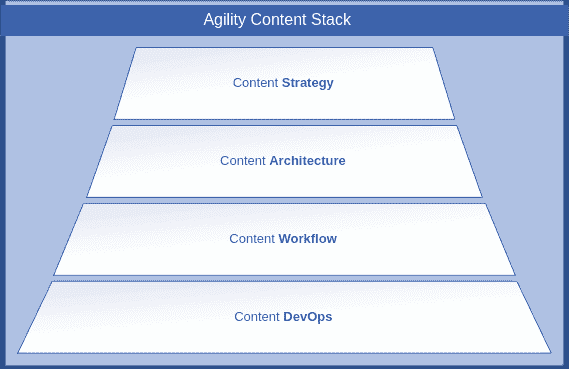
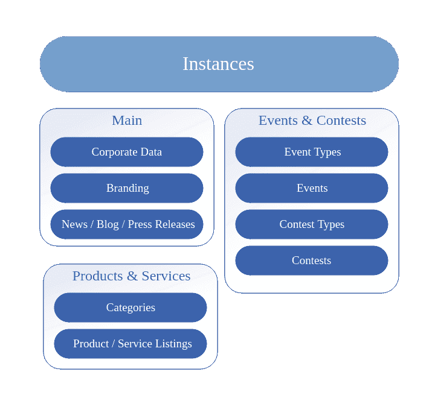
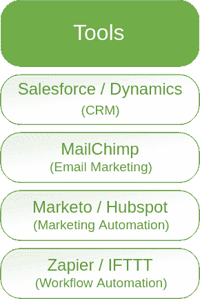
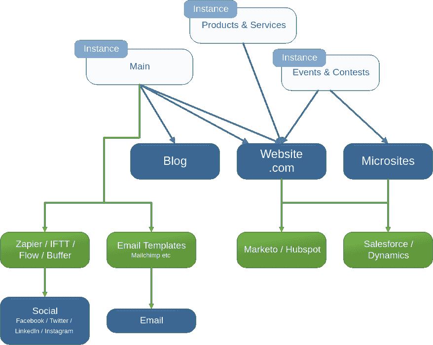
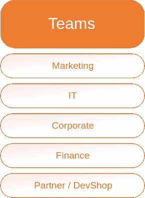
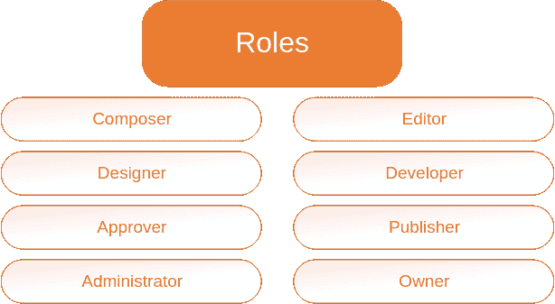
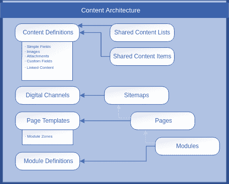
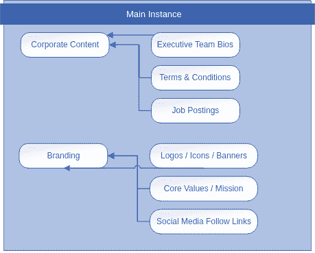
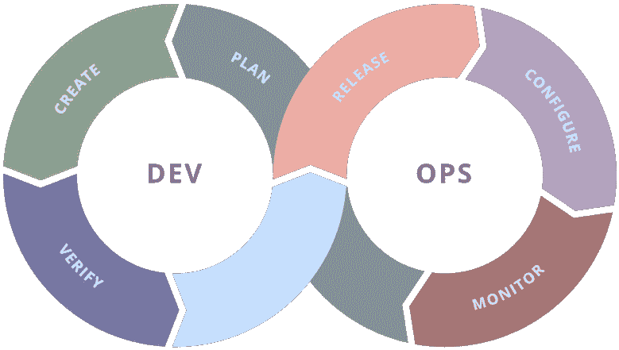

# 如何构建您的内容堆栈

> 原文：<https://dev.to/agilitycms/how-to-build-your-content-stack-3666>

# 如何构建您的内容堆栈

#### 战略-架构-工作流-开发运维

**跳到一节**

*   [概述](#overview)
*   [内容策略](#content-strategy)
*   [内容架构](#content-architecture)
*   [内容工作流程](#content-workflow)
*   [内容 DevOps](#content-devops)
*   [结论](#conclusion)

## 概述

在组织内部构建内容战略时，内容管理策略师通常会提到“内容堆栈”在 Agility 中，我们更具体地指堆栈中的 4 个独立组件:内容策略、内容架构、内容工作流和内容开发运维。

在我们这个互联的世界里，作为一个现代组织，构建您的内容堆栈可能是最重要的操作。你如何能够推广你的品牌和传达你的信息与你的内容堆栈的表现直接相关，这转化为更多的参与和增加的流量，最终，更多的转换。构建一个有效的内容堆栈可以让您的组织快速行动，并且在品牌信息方面具有更高的可靠性。让我们看看内容堆栈的每个组件。

T4】

内容堆栈是一个自顶向下的结构。我们从高层次的组件开始，然后努力定义和实现低层次的元素。重要的是要注意，在我们实现了较低级别的组件之后，更改较高级别的组件可能会非常昂贵和耗时，所以我们希望确保我们有一个明智的开始。同样重要的是，我们要努力让简单的事情变得简单，把复杂的问题分解成更小、更简单的部分。

最高层是**内容策略**。我们的战略针对企业的需求，并说明了最高目标是什么；我们需要对这个系统应该如何工作有一个总体的了解。在定义了我们的战略愿景和目标之后，我们可以看看工作从哪里开始，交付成果从哪里结束，以及其间的所有任务和检查点。

我们的目标是编写一个引人注目的、全面的叙述来指导不同内容元素的架构模型的创建。这就成为了**内容架构**。

接下来，我们需要考虑我们希望内容在哪里结束，我们称之为目的地或输出。

不变的是，当我们继续检查每个端点需求的细节时，我们最终会改变我们的架构模型。当我们在你的内容将流向的所有地方工作时，我们还应该思考未来可能会是什么样子——我们是否在基于一种可能很快消失或彻底改变的技术做出决策？我们将如何应对这些变化？我们如何在我们的系统中建立弹性以允许这种灵活性？

在这一点上，我们必须考虑谁在什么时候用哪些内容元素做什么的问题:

*   谁创作内容？
*   谁批准的？
*   谁触发了导致内容流向终端的事件？

这被称为**内容工作流程**，它完全是关于等式的人的一面。重要的是要记住，这些人是你内容的生命线，他们的经验很重要。我们需要确保他们为成功做好准备。

现在，我们可以开始构思我们的内容将如何在堆栈中流向各种输出。我们称之为**内容开发**。它可能意味着我们集成的工具，提供我们数据的应用程序协议，或者需要实现的软件开发组件。

让我们从内容策略开始，更深入地研究一下这四个层面。

## 内容策略

在你的内容堆栈中，第一个也可以说是最重要的部分是你的策略。你可以把它想象成一个正在进行的鸟瞰图，它展示了一切应该是如何工作的。制定您的战略是确定所有对您最重要的真正高层次问题的机会:

*   作为一家企业(或业务单位)，你的战略目标是什么？
*   你的创意内容如何适应提供价值的战略？
*   组织的哪些领域将从这一战略中受益？
*   随着时间的推移，需要哪些团队来实施和维护我们战略的完整性？

提出这些问题(以及更多问题)将为你的内容堆栈的主要元素提供基础。这确实是一个自上而下的场景；我们能够更好地定义什么将使你从高水平成功前进，随着时间的推移，继续取得成功就越容易。

有 3 个战略领域需要关注:

T4】

### 实例

T4】

“实例”是你的敏捷账户的构建模块，为你提供了一种将你的内容分割成逻辑块的方法。

例如，在上图中，我们为所有组织数据使用了 3 个实例，其中一个“主”实例用于公司数据、品牌以及新闻、博客文章和新闻发布的列表。您可能还想将 Agility 的实例用于产品和服务以及事件和竞赛。

### 工具

T4】

处理数据的工具正在快速变化，但我们已经看到一些顶级玩家的出现，特别是在上面显示的 4 个类别中:CRM、电子邮件营销/营销自动化，以及我们可以称为“工作流自动化”的广泛类别。

Agility 非常灵活，可以轻松地与这些平台集成。您的内容策略的一部分必须解决您希望如何实现平台集成，您希望哪些数据通过哪些工具流动，以及需要对这些数据进行哪些处理。例如，您可能希望您的博客帖子整合到您的社交媒体帐户上，或者您可能希望集中管理您的徽标和品牌文件。

。

T4】

在上图中，我们可以描绘出数据是如何从您的主要敏捷性实例流入您组织中的各种工具和输出目的地的。请注意，这只是*一个*可能场景的示例——您自己的结构将是独一无二的。这就是为什么构建内容堆栈的过程(包括详细的内容策略)如此重要。

### 球队

T4】

人是任何组织最大的资产。那些日复一日和你一起工作的人是负责推动你的组织前进的人。 团队内外运作的好坏将决定任何内容策略的成功与否。

在短期内，重要的是确定你需要完成什么样的角色和职责才能开始。牢记长期成功所必需的责任。考虑这些角色，并决定这些角色是外部职责还是内部职责。

T4】

你不需要把所有人都召集到一个大房间里，但是你应该在这些人之间建立融洽的关系。如果您了解内容的战略目标、谁编写了内容、谁编辑了内容、开发人员为谁工作以及与谁一起工作等等，那么作为审批者，您就更容易出色地完成自己的工作。

一旦您定义了团队和分配的角色，您就准备好处理内容架构了。

## 内容架构

创建一个经得起时间考验的有效内容架构从来都不容易，但是有了一些指导和对谁将处理什么内容(稍后在内容工作流程中详细介绍)以及他们需要什么的深入了解，我们应该能够打造一个可扩展的结构。请记住，这里的辛勤工作将在以后得到回报，因为我们最初的架构计划将成为组织如何管理内容的基础。

在你根据人力资源和有状态的 机制定义你的内容工作流程之前，你不能完全定义你的内容架构。类似地，当您处理您的内容开发运维清单时，您可能需要向架构中添加一些部分。在某些情况下，可能需要包含您已经忘记的数据，但是允许并期望与您的不同团队进行大量的交流。还要小心让内容栈中较低项目的需求过多地决定结构如何工作的陷阱。基础的形状需要适应建筑的其余部分，但必须有自己的完整性来支撑整个结构。

首先，我们来看看敏捷内容架构的组件。在下图中，我们看到了两个不同的组件层——共享内容和页面。

T4】

### 分享内容

Agility 的共享内容部分很像一个内容数据库:它提供内容列表和单个内容项，可以通过名称引用，并在您喜欢的任何地方重用。考虑前面有 3 个敏捷实例的例子，第一个是主实例，包括公司内容和品牌。下面是我们如何使用主 Agility 实例。

T4】

我们已经决定在公司内容的保护伞下拥有高管团队的简历、条款&条件和职位发布。这些可能分别是一个列表(bios)、一个项目(条款和条件文档/副本)和一个列表(职位空缺)。同样，我们已经确定了我们认为应该在品牌下生存的内容种类。你可以很容易地在你的团队内部对这类内容进行头脑风暴，想出对你来说重要的各种内容，然后有效地组织起来。

接下来，是时候决定您需要捕获每种内容类型中的哪些数据，这些数据类型是什么，以及它们如何相互关联。  我们不会在本文档中深入探讨这一层次的规划，因为它本身就是一个完整的主题，并且在每个组织中都有所不同。

### 频道、网站地图、页面和模块

通过允许您创建多个特定的层次结构，敏捷内容架构在云中大放异彩。这是描述“网站地图”的一种奇特方式，我们用它来定义和管理网站上特定数字频道中的页面。当然，我们希望能够使用我们需要的内容，但通常主要输出是一个*网站*。为您的团队提供一种在您的网站上查找、编辑、批准和发布页面的简单方法，通常是营销团队的首要任务，因此正确处理这部分架构是必不可少的。

站点地图结构的重要元素有:

*   **数字频道**
    *   这些是站点地图可以存在的顶级分组。你可以用它来描绘任何需要自己层次的东西。
*   **网站地图**
    *   每个频道可以有一个站点地图，但是一个站点地图可以有你需要的多个页面，并且每个页面下面可以有你决定的多个嵌套页面。
    *   这为你的内容团队创造网站的整体结构提供了惊人的灵活性。
*   **页面模板**
    *   Agility 中的页面模板允许我们在给定的页面上描绘可以放置内容的命名区域。这可能是顶部/底部、左/右部分，或者可能是列 1 /列 2。
    *   这给了编辑更多对内容呈现的控制，而无需访问任何代码，或者实际上根本没有任何开发经验。
*   **模块定义**
    *   模块定义与共享内容项的内容定义非常相似，只是它是专门为页面设计的。
    *   当编辑使用页面模板构建页面时，他们将能够从我们设置的任何模块定义中进行选择。
*   **页**
    *   就是它了！这是您在数据模型的设置和配置方面的所有辛勤工作开始得到回报的地方。
    *   将页面添加到站点地图允许你的内容编辑者定义你的网站内容的导航结构和层次结构。选择一个模板，将一些模块放到可用区域中，然后您就可以开始运行了。

## 内容流程

内容栈中最有价值的元素是人。随着组织的发展，您的内容团队将是您解决问题和获得结果的依靠。让他们开心的最好方法是什么？听他们说。听取他们的反馈，确保他们拥有成功所需的工具。看看他们每天做的事情，他们扮演的角色和职能，并确保你有你所有的基础。

毫无疑问，你的内容堆栈的这一部分代表着一段旅程，希望它永远不会结束。大多数内容管理系统的实现被认为是失败的，因为每天实际使用该解决方案的团队并不认为自己有能力做到最好。

你现在有机会避免这些陷阱。

### 用例

创建优秀内容工作流体验的所有方面都应该从识别用例开始。用例是简单的项目/行动，概述了你的团队成员将如何完成工作。

有几种方法可以让你想出一组很棒的用例，包括:

*   **和你的团队见面，头脑风暴**
    *   这可能是你的第一选择，并会给你带来丰富的想法和知识，让你的团队更有力量。
    *   确保这些会议不会过多关注利用现有工具发泄过去的不满。这是一个推进新流程的机会，让我们把重点放在这一点上。
*   **观察你的团队工作并收集指标**
    *   看看你的团队现在是如何工作的。他们的行动是什么，做一个任务需要多长时间？每个任务有几个步骤？
    *   这些指标将帮助您定义衡量您希望对内容工作流程做出的改进的方法。
*   **创建基于内容架构的空用例**
    *   为了确保用例覆盖了内容架构的所有方面，仔细检查每种类型的共享内容、页面和模块定义，确保您的团队能够有效地处理每种情况。

您可能想知道为什么我们在创建内容架构之前没有创建这些用例作为内容工作流的一部分。这是一个好问题，在许多情况下，当开始项目时，在开始定义结构之前，您应该首先考虑团队的需求。然而，在内容架构的情况下，我们想要保持一个鸟瞰图，看看我们试图用我们的内容策略完成什么。

一旦你开始对内容工作流程用例进行头脑风暴，你可能会发现自己在本质细节上陷入了困境，甚至对你的团队有些不满。我们的经验证明，根据您对系统需要完成的合理预测，为您的内容准备一个架构结构草案可以极大地帮助您的团队专注于未来，而不是停留在过去。

一定要利用用例创建的机会来验证你的内容架构。至少与开发 DevOps 流程后进行更改相比，您现在对该结构进行的任何更改都相对容易。

### 用户指南

一旦用内容架构对用例进行了验证，用例的自然进展就是根据每个特定的任务生成用户指南。这些指南通常是特定于角色的，并且可以概述组织中的用户为了使用您的内容而需要了解的每项任务。

用户指南通常被编辑成一个文档，但是你也可以用它们来填充维基系统。把每一个指南都看作是成功的一步一步的秘诀。一个好的用户指南可以帮助新用户快速进入系统，在你需要完成任务时，为你节省大量的时间和资源。

展望未来，随着系统的发展，将用户指南放在首位非常重要。通常，我们会看到已经构建了多年的内容架构——我几乎可以肯定地说，自从最初的用例集和指南创建以来，人们开始执行的相同任务已经发生了变化。随着时间的推移，保持这些工具的更新和全面将会带来回报。

## 内容提要

T4】

DevOps 将开发和运营流程整合到一个循环中，用于部署和更新为我们的在线资产提供动力的工件。这通过贯穿计划>创建>验证>包>发布>配置>监控>计划各阶段的连续重复路径来说明。  这个过程已经重新定义了我们如何在线部署和维护我们的代码，因为它允许我们快速和持续地迭代新功能和错误修复。

### 德沃普斯的崛起

DevOps 的概念近年来因其提供的几个好处而受到关注。

*   **集中管理的源代码控制库服务**
    *   像 GitHub 和其他托管代码库服务这样的工具使得团队可以轻松地利用复杂的代码工具和团队功能，而无需花费大量的时间和成本。
    *   这些服务使内部和外部/外包团队能够以很少的 IT 开销一起工作。
*   **在线包管理器**
    *   节点包管理器(npm.org)，nuget.org 和其他包管理器已经出现，以民主化可重用代码模块。
    *   这使得开发团队能够快速地将行业标准的功能包集成到他们的代码中。
*   *   GitHub Pipelines、Azure DevOps 和 AWS CodeDeploy 等工具已经变得非常流行，并且很容易获得。
    *   任何开发团队都可以轻松地自动化他们的代码部署机制，这样一旦代码被签入源代码控制库，构建>测试>验证过程就可以开始，然后发布管理团队就可以批准将该代码发布到生产部署。
*   **使用 PaaS 技术的容器化托管**
    *   让构建和部署我们的代码变得更容易固然很好，但如果没有一个灵活且可扩展的托管模型，所有的努力都是徒劳的。

利用 Docker/Kubernetes 以及 Azure 和 AWS 的 PaaS 产品部署和编排“容器化”应用的能力，使您的 DevOps 团队能够以可扩展且经济高效的方式快速启动部署端点，满足您的所有需求。

### 你的 DevOps 策略

为了制定您的 DevOps 战略，您需要问几个问题。这里有几个让你开始:

*   谁来开发在线房产所需的软件？
*   随着时间的推移，谁将拥有代码工件？
*   代码将存储在哪里(内部部署还是托管服务)？
*   构建/测试/批准/发布代码的过程需要什么？
*   在每一级职责中，谁将对流程负责？
*   您将依赖什么样的软件包和/或框架，会有什么样的风险？

**云 vs 本地托管**

就开发运维而言，每个组织面临的最大选择之一是确定*东西放在哪里*。东西是在云中托管还是在本地托管？这是一个会影响后续战略战术决策的大问题。如果您选择在云中托管，哪家提供商最有意义？有没有可以帮您省钱的无服务器选项？

**版本化和发布**

我们总是建议对每个内容堆栈采用分阶段的方法，这种方法包括开发运维。系统的架构需要保证定期的发布时间表是有意义的，包括新特性和必要的错误修复。

最灵活的 DevOps 战略将包括*持续集成*和*持续交付*的概念。

**速度、可靠性、灾难恢复和业务连续性**

我们的工作理念是一切都要快。速度是重中之重，在生产场景中不应该妥协，并且确保您构建的任何东西的响应时间在秒以下，应该尽早并且经常地提出来。

可靠性和正常运行时间也是重中之重——您需要对您的在线服务和资产始终可用有信心，并且如果必要的话，您需要能够以指标的形式展示这一点。现代开发运维策略将包括负载平衡和地理故障转移等概念，作为提高正常运行时间和可靠性的工具。

内容交付网络(CDN)也可用于加快速度，并为您的在线服务提供 Web 应用防火墙(WAF)保护，帮助防范分布式拒绝服务(DDoS)等攻击。CDN 也有助于在交通高峰时保持速度。

## 结论

我们生活在一个需要我们快速行动的世界。我们需要快速原型化，并将我们的想法从最初的概念转化为最终的输出。我们必须充分了解我们的流程如何工作以及为什么会失败。我们的努力也需要有一个有效的节奏。作为人类和组织，我们每天、每周、每月都在固有的节奏中前进。

你的内容堆栈是一个工具，它可以帮助你将组织的节奏转化为成功所需的产出。我们已经了解了内容战略、内容架构、内容工作流程和内容开发的概念。解开这些概念与你对你的组织的想法之间的联系是一件令人兴奋和富有挑战性的事情。

我们希望你能允许我们加入你的旅程。