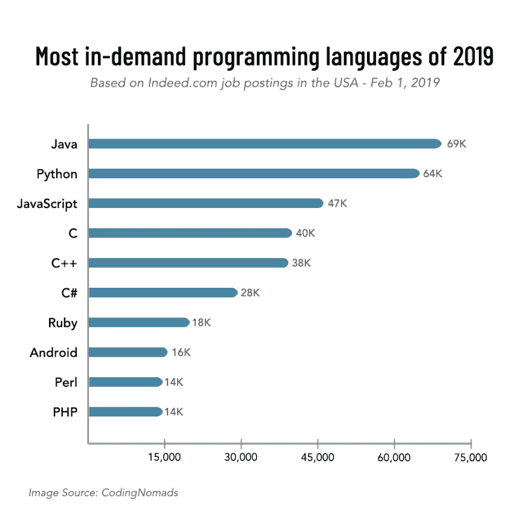
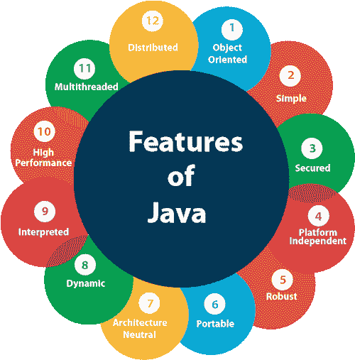
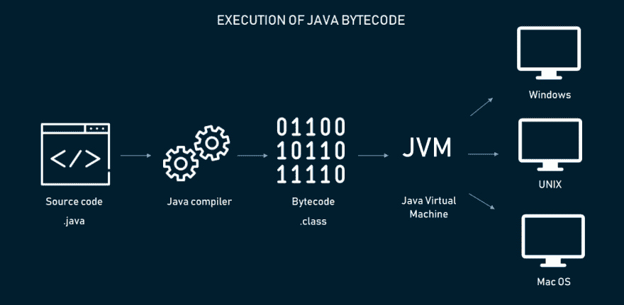

# 爪哇的美丽

> 原文：<https://dev.to/blender/the-beauty-that-is-java-3nph>

Java 是一种强大的通用编程语言，自 1996 年问世以来已经存在了 24 年。Java 编程环境包括—

1.  Java 语言 —程序员用来编写应用程序的语言
2.  **Java 虚拟机(JVM)** —用于执行应用程序
3.  **Java 生态系统** —为使用编程语言的开发者提供额外的价值

# 什么是 Java 语言？

*   它是一种人类可读的语言，通常被认为易于读写(尽管有时有点冗长)。
*   它本质上是基于类和面向对象的。
*   Java 旨在易于学习和教授。
*   Java 有许多不同的实现方式，有专有的也有开源的。
*   **Java 语言规范(JLS)** 定义了确认 Java 应用程序必须如何运行。

# 什么是 JVM？

Java 虚拟机是一个提供运行环境来执行 Java 程序的程序。如果没有支持的 JVM，Java 程序就无法运行。

从命令行运行一个 Java 程序，比如—

##### java <自变量> <程序名>

操作系统将把 JVM 作为一个进程启动，然后在新启动的(空的)虚拟机上执行程序。

#### 好玩的事实:Sun JVM 是用 C 写的(大部分)。

JVM 不接受 Java 源文件作为输入。java 源代码首先被 javac 程序转换成**字节码**。Javac 接受源文件作为输入，用**以类文件的形式输出字节码。类扩展**。

然后这些类文件被 JVM 解释器**解释(一次一个)**，程序被执行。

JVM 通过以下方式使程序员的生活变得更容易

*   为 Java 程序运行提供一个**容器**
*   与 C/C++相比，创建一个安全的执行环境
*   将**内存管理**从开发者手中拿走
*   允许来自一个平台的类文件在不同的环境中运行，而无需任何修改或重新编译

这种特性被称为**“编写一次，随处运行”(WORA)** ，从而使 Java 成为一种易于**移植的**语言。

JVM 的另一个重要方面是**实时(JIT)编译器**。20 世纪 70 年代和 80 年代的研究表明，程序的运行时行为有一些有趣的模式。代码的某些部分比其他部分执行得更频繁。

Java 是第一种利用这种运行时信息的语言，而 **HotSpot JVM** (由 Sun 在 Java 1.3 中首次推出)识别了**、【hot methods】**(经常被调用)，JIT 编译器绕过源代码到字节码的转换，直接将它们转换成机器码。

Java 的这个**运行时插装**显著提高了 Java 的性能，在某些情况下甚至超过了编译的 C 和 C++代码。

JVM 也有许多可用的实现，就像 Java 语言本身一样。JVM 规范定义了一个正常运行的 JVM 的行为。

# Java 生态系统

Java 已经成为一种健壮、可移植和高性能的语言，并在全球范围内被广泛采用。Java 成功的主要原因之一是用 Java 编写的大量第三方库和组件。

如今，很难找到没有支持 Java 连接器的组件。从传统的 MySQL 到 NoSQL，监控框架，网络组件都有现成的 Java 连接器。

**来源:[Java 编程环境](https://medium.com/javarevisited/the-java-programming-environment-1bdc7833870e)T3】**