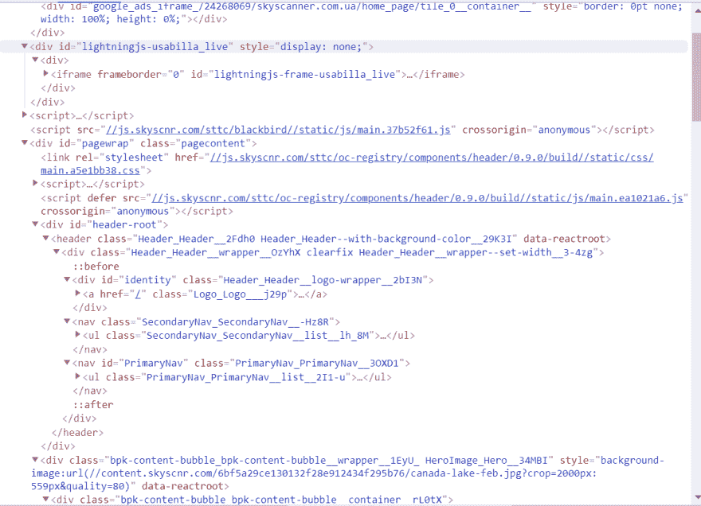
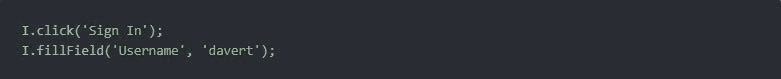
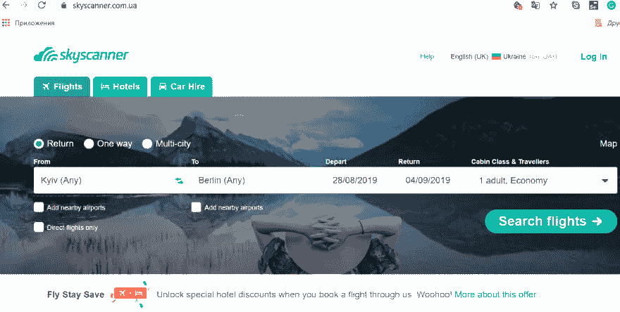
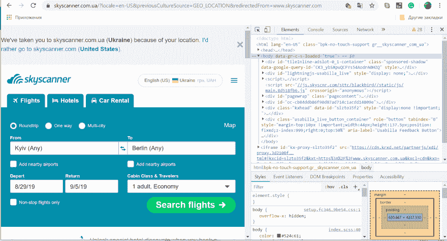
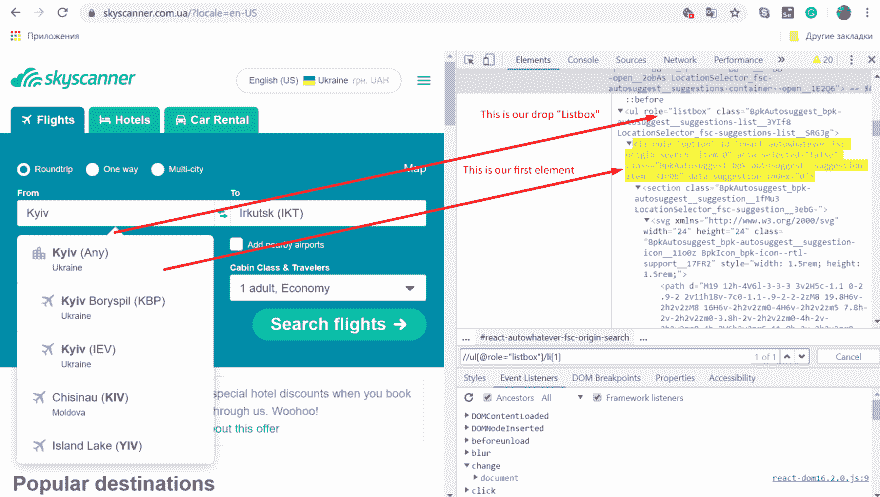
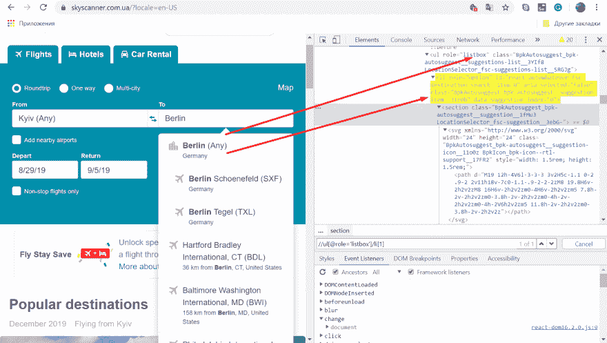
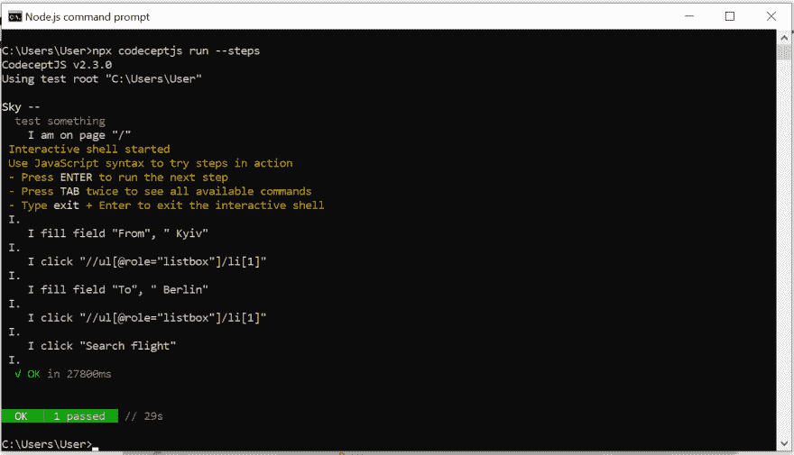

# 如果可以的话，抓住它们:稳定端 2 端测试的质量定位器

> 原文：<https://dev.to/vladimirbag/catch-them-if-you-can-or-why-locators-make-my-tests-stable-4lja>

每个测试自动化初学者在编写有效的测试时都会遇到许多困难，尤其是对于网站，因为网站的结构中有一个 DOM 树。有时在页面上找到我们需要的元素并不那么简单，尤其是当它没有被标记的时候。到目前为止，还没有人工智能能够解决这个问题。用户看网站的方式和我们在测试中看到的不一样。当用户看到一个链接或按钮时，我们只有一个 HTML 元素。那么我们如何自动化用户的行为呢？
是的。这是一个巨大的问题。为了理解它并找到答案，你需要借助帮助。我为这个角色推荐两个候选人。

**XPath 或者 CSS**

有两种最常见的定位器。每个测试人员和开发人员都认为这种或那种类型是最有效的，并准备在坚持的战斗中证明这一点。尽管如此，实践表明，在众多类型的定位器中，最强大和最有效的两种是 XPath 定位器和 CSS 定位器。然而，它们从未被设计用于测试自动化。然而，它们从未被设计用于测试自动化。为什么？让我们看看。

所有的浏览器都实现了 CSS 引擎，这样开发者就可以在他们的项目中使用 CSS。CSS 有一些模式，根据这些模式，开发人员创建的样式被应用到页面元素(DOM)中。这些模式被称为选择器。Selenium WebDriver 使用相同的原理来查找元素。CSS 的优点是易于理解、阅读和编译。缺点是，CSS 只能通过在 DOM 树中上下移动来搜索一个元素，搜索一行中的第三个或第五个元素(如果可以，定位符将非常长，难以阅读)，例如，搜索帐户中的第三个复选框，或者在处理下拉列表时查找特定的项目)。
我们来看一些使用 CSS 的基本定位器:

**绝对路径:**
*html 体形式输入*

**相对路径:**
*输入*

**搜索直系子女:**
*分部> a*

**搜索任意级别的孩子:**
*div a*

**按物品 ID 搜索:**
*输入#用户名*

**按类搜索:**
*input.classname*

XPath 是一种用于在 XML 文档树中搜索节点的语言。它适用于网页，因为 HTML 实际上是 XML 文档的子集，所以我们可以通过 XPath 查询它的元素。XPath 超越了对 id 为**的**或名称为**的**属性的简单搜索方法(同时支持它们),并开辟了一系列新特性，比如通过文本搜索第三个复选框。
使用 XPath 的一个很好的理由是当您不能使用适合作为指针的属性时，比如您想要获取的元素的标识符或名称。可以使用 XPath 在绝对路径(不推荐)或相对路径(对于具有给定 id 或名称的元素)中搜索元素。XPath 指针也可以用来使用除了 **id** 和 **name 之外的属性定义元素。**

**XPath 最大的优势是:**

1.  向上搜索的能力，即通过父元素的后代来搜索父元素。
2.  使用内置函数的能力。
3.  你可以在 DOM 上做垂直导航。
4.  通过文本搜索的能力。但是有一些缺点:太长，难以构建和阅读，太严格，不太适合 HTML 搜索。例如，很难用其中一个类来指定元素:

**//div[contains(concat('，normalize-space(@class)，' ')，' test ')]**

让我们看看一些使用 XPath 的基本定位器:

**绝对路径:**
T3】//html/body/div/div/form/input

**相对路径:**
*//输入*

**搜索直系子女:**
*//div/a*

**搜索任意级别的孩子:**
*//div//a*

**在文本中搜索一项:**
*。//* [text()= '第一链接']/..*

**按属性值搜索:**
*//输入[ [@id](https://dev.to/id) = '用户名']*

**按属性名称搜索:**
*//img[@alt]*

那么定位器到底应该是什么呢？
我为自己定义了三个标准，在我看来，一个设计良好的定位器应该满足这三个标准:

1.  **稳定:**

*   定位器越短，越稳定，例如，

*//ul[@role ="listbox"]/li[1]*

*   编译定位器时，首先使用属性**【id】****【名称】****【类】**；
*   不要使用不稳定的类和属性，例如， **@ aria-controls** (这不是一个元素的标准属性)或者 **"id = 123rth45bvj"** (很明显 **id** 是生成的，以后可能会改变)。

2.**可读**(你需要能够阅读编译的定位器。比如**//input[[@ id](https://dev.to/id)= " FSC-origin-search "]**-find**input**其中属性 **id = "fcs-origin-search"** 。而这样的定位器很难读懂:
**//div/div/div/div[contains(concat('，normalize-space (@class)，'')，' test')]**

3.**语义**(它应该与元素的作用相关联。例如， **input # city-from** 明确显示它是一个用于输入文本的元素，但是* * *[@ react-select-bla = " asdsad "]**不清楚它是做什么的)
对于一个初学自动化测试的人来说，理解正确编写定位器的所有错综复杂是非常困难的，因为它们应该是**short** 和 **stable** 和 **semantic** ，这样，如果 DOM 树中有任何可能的变化，您就不必再次重写它们。我开始寻找另一种选择，因为应该有更简单、更全面的东西。你知道，我找到了一种方法，帮助我理解你不应该害怕定位器，它们需要被指挥。
**这些是 CodeceptJS** 中的语义定位符——当你甚至不看页面的源代码，而只是简单地写下点击哪些链接和填充哪些字段，因为 CodeceptJS 通过内部的 XPath 工作。各种策略被用来定位语义元素。然而，与通过 XPath 或 CSS 指定精确定位器相比，CodeceptJS 语义定位器的运行速度可能会更慢。
**CodeceptJS** 可以从上下文中猜出一个元素的定位符。例如，在点击时，CodeceptJS 将试图通过它们的文本值找到一个链接或按钮。当输入一个字段时，这个字段可以通过它的**名称**和**占位符定位。**

如果你不熟悉 CodeceptJS——看看我以前的帖子，我是如何发现它并编写我的第一个测试的。

**JavaScript End 2 End 测试凡人**
([https://medium . com/@ vladimirbaginskiy/JavaScript-End-2-End-Testing-for-Mere-凡人-e055db5e80d4](https://medium.com/@vladimirbaginskiy/javascript-end-2-end-testing-for-mere-mortals-e055db5e80d4)

这篇文章描述了一个初学者如何一步一步地在没有任何 JavaScript 和定位器知识的情况下完成他的第一个自动测试。这至少节省了我大量的时间和精力。有了定位器的基本知识，我可以开始为一个真实的网站编写测试。
我将使用 SkyScanner(【https://www.skyscanner.com】)获取基辅到柏林的航班列表。只要按照我的步骤，看看定位器如何为我工作。但是，我不能保证 Skyscanner 团队将来不会更改他们的预订页面，同样的定位器也适用于您。

Skyscanner 希望用户输入出发地和目的地，并从列表中选择正确的城市名称。从弹出的下拉菜单中选择一个项目有点棘手。

我将使用 CodeceptJS +木偶师设置。我可以用两个命令安装它。

**NPM init-y**
T3】NPM 安装 codeceptjs 木偶师-步骤

Puppeteer 是 Google Chrome 的一个工具，允许在浏览器中直接执行测试，无需 Selenium。这很酷，因为我不需要安装任何额外的东西！在你走完整个安装路径并创建了一个测试文件(我有 **sky_test** )之后，我们将去我们的实验站点并尝试编写一个 **XPath** 定位器，正如已经提到的，它将负责在下拉列表中选择一个项目。

1.  在**开发工具(F12)** 的帮助下，我们正在寻找对应于“From”和“to”字段的元素。

1.1 .在的**字段中输入 Kyiv，当列表出现时，在列表上单击鼠标右键，选择**“检查元素”。****

与**开发工具(F12)** 相同，我们正在寻找与**“到”**字段相对应的元素。

2.我们按“Ctrl + F”并在出现的窗口中输入我们的定位器。定位器可以附加到**【id】**或者**【name】**或者**【class】**(如果你确定它们是唯一的、稳定的，也就是开发者以后不会更改)，但是在我们的例子中，这是一个下拉列表，你需要从中选择元素。因此，在进行了许多寻找正确定位器的实验后，我得到了这个:

**//ul[@role="listbox"]/li[1]**

对于“To”窗口下拉列表的第二个元素，我得到了这样的结果:

**//ul[@role="listbox"]/li[1]**

3.我们将打开我们的代码编辑器(我有这个**“Visual Studio Code”**)，打开您在安装 CodeceptJS 时创建的 javascript 文件，并为我们的测试编写脚本:

**场景('测试某物'，(I)=>{
I . amon page('/')；
I . fill field(‘从’，‘基辅’)；
I . click('//ul[@ role = " listbox "]/Li[1]]')；
I .菲尔菲尔德(‘到’，‘柏林’)；
I . click('//ul[@ role = " listbox "]/Li[1]]')；
I . click(‘搜索航班’)；
})**

4.让我们打开我们的 **Node.js 命令提示符**并使用 **npx codeceptjs run - steps** 命令来运行测试。

*npx codeceptjs 运行步骤*

如果一切都做得正确，网站将打开。
现在按下**“еenter”**并检查测试。

5.**我的最终成绩:**

在我的文章中，我展示了一个对定位器一无所知、不具备 Java 编程语言领域的超级知识的自动化测试工具初学者如何编写自测，同时研究他需要的领域，从而提高他的技能，而不会浪费时间在一个简单枯燥的理论上。

**XPath** 没有你想象的那么可怕。你的定位器越短越简单，将来就越容易使用。尝试寻找不会被先验地改变的唯一静态元素。

**如果你不确定这个定位器是否足够好，用定位器顾问测试一下:**

[https://dav RTM . github . io/locator/](https://davertmik.github.io/locator/)

希望他帮你写出正确的定位器。