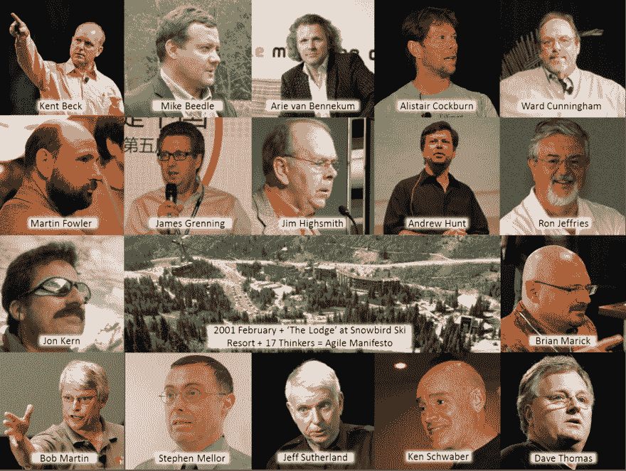
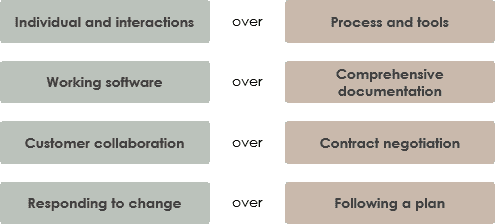
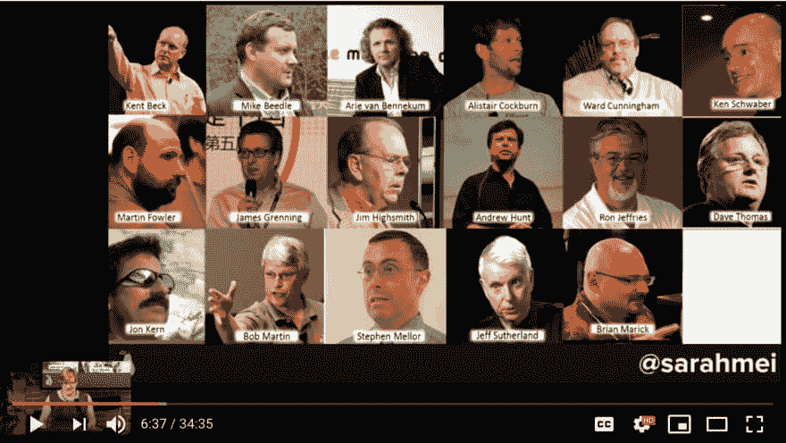

# 敏捷:我们接受吗？

> 原文：<https://dev.to/danvyle/agile-do-we-accept-5bj0>

为什么要学习敏捷编程？作为一名准备进入科技领域的学生，我一直看到这个词被战略性地放在所有的求职板和简历板上。值得更深入地研究一下。

### 什么是敏捷宣言？

敏捷软件开发是一种软件开发方法，在这种方法下，需求和解决方案通过自组织和跨职能团队及其客户/最终用户的协作努力而发展。它提倡适应性计划、进化开发、早期交付和持续改进，并鼓励对变化做出快速灵活的反应。

### 历史

在 20 世纪 90 年代，许多轻量级软件开发方法发展起来，作为对流行的重量级方法的反应，批评者称之为过度监管、计划和微观管理。这些包括:快速应用开发(RAD)，从 1991 年开始；统一过程(UP)和动态系统开发方法(DSDM)，都是从 1994 年开始的；Scrum，从 1995 年开始；Crystal Clear 和极限编程(XP)，都是 1996 年的；和功能驱动开发，从 1997 年开始。尽管这些都起源于敏捷宣言出版之前，但是现在它们被统称为敏捷软件开发方法。[6]

2001 年，这 17 名软件开发人员在犹他州雪鸟的一个度假胜地会面，讨论这些轻量级开发方法:他们一起发表了敏捷软件开发宣言。[4]

### 宣言的作者

17 个白人在滑雪胜地。请归入“可能发生的最糟糕的事情是什么？”

### 原则

*   我们最优先考虑的是通过早期和持续交付有价值的软件来满足客户。
*   欢迎不断变化的需求，即使是在开发的后期。敏捷流程利用变化为客户带来竞争优势。
*   频繁地交付工作软件，从几个星期到几个月，优先选择较短的时间尺度。
*   业务人员和开发人员必须在整个项目中每天一起工作。
*   围绕有积极性的个人建立项目。给他们需要的环境和支持，相信他们能完成工作。向开发团队传达信息的最有效的方法是面对面的交谈。
*   工作软件是进步的主要衡量标准。
*   敏捷过程促进可持续发展。发起人、开发人员和用户应该能够无限期地保持恒定的步调。
*   对技术优势和良好设计的持续关注增强了敏捷性。
*   简单——最大化未完成工作量的艺术——至关重要。
*   最好的架构、需求和设计来自自组织团队。
*   团队定期反思如何变得更有效，然后相应地调整自己的行为。

### 值

这个想法是，当你面临一个编程决策时，敏捷建议你考虑左边的项目，而不是右边的项目。

### 萨拉梅和敏捷宣言的陷阱

这个演讲是由 SalesForce 的软件架构师 Sarah Mei 在 Pear 会议上做的，在这个会议上，开发人员被教导成为更好的“配对者”。值得一看！

一些摘录引起了我的注意:

“敏捷不愿意接纳其他动机，这是他们所知道的最大弱点”

“[敏捷开发人员说]极限编程[和其他敏捷实践]不是种族主义或性别歧视，但它们确实排除了那些负有照顾责任的人，那些家庭生活不由呆在家里的配偶处理的人，或者那些一天中任何时候都需要注意力在别处的人”

“[敏捷假设]参与其中的每个人都觉得和其他人一样有权做出贡献。敏捷忽略了权力动态”

### 思想

我还没准备好对敏捷宣言形成看法。最初，从纯粹的商业立场来看，我看到了遵循《宣言》的许多好处，但想象一下，它的模糊性以及作者对多样化和交叉性观点和动机的不考虑可能会产生许多影响。

一切，理论上总是理想的，但实际上，会错过很多分数。我想象着，随着我在技术领域的不断前进，我会对敏捷、它的实现以及与我相关的障碍有更好的理解，我是一个有色人种的怪人，有着许多可感知的低能量动力。无论如何，我会回来报道的！

### 这留给我最后一个讨论问题:如果敏捷宣言今天被重写，你希望谁在那个房间里？

资源:
[https://www . mitchlacey . com/blog/the-history-of-the-the-agile-manifesto](https://www.mitchlacey.com/blog/the-history-of-the-agile-manifesto)

[https://en.wikipedia.org/wiki/Agile_software_development](https://en.wikipedia.org/wiki/Agile_software_development)