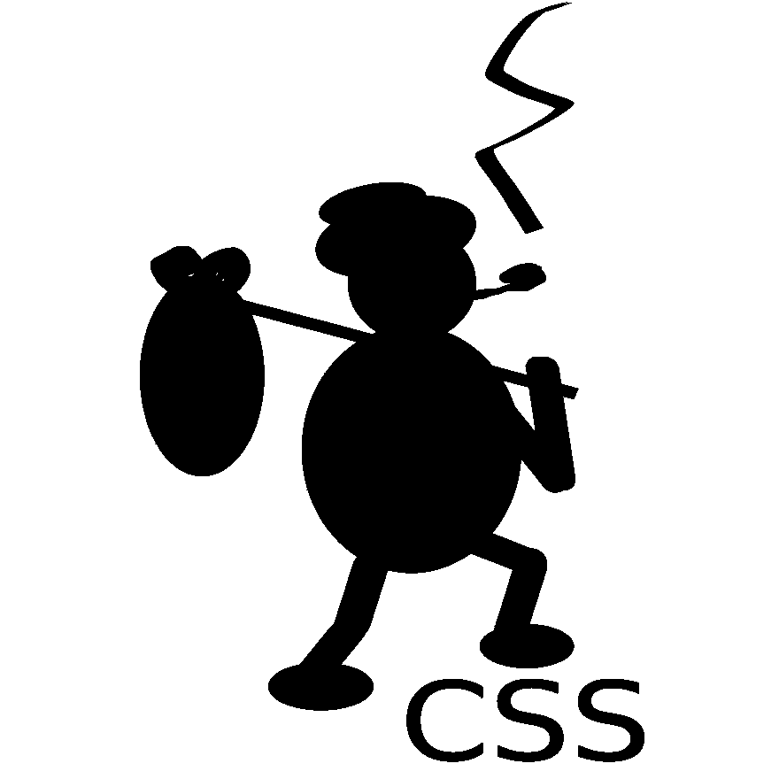

# bum(S)CSS——编写懒惰和实用的 CSS 的惯例

> 原文：<https://dev.to/johannesjo/bum-s-css-conventions-for-writing-lazy-and-pragmatic-css-17m9>

# bumcss(在制品)

*最佳实用模块化 CSS——为懒惰和务实的人设计*

[](https://github.com/johannesjo/bumcss)

## 简介

bumcss 是一种 [(S)css](https://sass-lang.com/) 的编写方法(主要是)[语义](https://alistapart.com/article/meaningful-css-style-like-you-mean-it/)，可扩展和可维护的 CSS，旨在*最具表现力的语义 html* ，用最少的代码量来编写。这种方法在使用 JavaScript 框架(如 Vue.js、React 或 Angular 或 web 组件)开发单页面应用程序时特别有用，在这种情况下，快速掌握正在发生的事情对于开发来说是最重要的，但它也可以用于经典的 web 页面。

bumcss 它的灵感来源于 [BEM](http://getbem.com) 、[smacs](http://smacss.com)和 [ITCSS](https://www.creativebloq.com/web-design/manage-large-css-projects-itcss-101517528) 。这三种方法的问题在于，它们要求你分配许多类(又名 [classitis](https://www.steveworkman.com/html5-2/standards/2009/classitis-the-new-css-disease/) ),这些类往往有很长的名字。依我个人的拙见，代码太多不仅会降低加载速度，更重要的是会增加开发时间，降低代码的可读性，因为代码太多了。

## 为什么习俗如此重要

好多已经被[写成了](https://www.multidots.com/importance-of-code-quality-and-coding-standard-in-software-development/) [上的](https://medium.com/@marksiu/why-naming-convention-is-a-must-for-your-development-team-628188f392d5) [那个](https://www.google.com/search?q=why+conventions+are+important+in+software+development&oq=why+conventions+are+important+in+software+development&aqs=chrome..69i57.11723j0j7&sourceid=chrome&ie=UTF-8)。他们是！传统上，CSS 是最容易被忽视的地方。

## 非常基本的例子

```
<button class="btn _primary">
  Hello
</button> 
```

```
// btn.scss
.btn {
    display: inline-block;
    border: 1px solid gray;
    padding: 5px;

    @media(min-width: 780px) {
      padding: 10px;
    }

    &:hover {
      border-color: black;
    }

    // variant styles
    &._primary {
      background: blue;
      color: #fff;

      &:hover {
        background: lightblue;
        color: black;
      }
    }
} 
```

## UI 组件、包装组件和默认样式

让我们从最基本的开始。在过去，一个典型的应用程序有三种类型的元素。

**表格、链接、标题、段落、strong 等基本元素的全局默认样式**。应该首先导入它们，以便在需要时可以轻松覆盖它们。从长远来看，设计好基本样式的基础，并把自己限制在固定的样式上，比如标题样式，将会为你节省很多工作。

**包装组件/逻辑组件**比如页面或逻辑部分，比如购物车或地图组件。始终按照 BEM 的精神屏蔽元素。在一个单页面应用程序中，这些组件很可能是在你的 UI 组件中分发数据的地方。

**UI 组件**如按钮、标签或手风琴等。它们只应该有表示逻辑，可以是块元素，也可以是内联元素。

### 在精神块、元素、修饰语中

几乎所有的 ui 组件都应该有响应能力。您应该能够将它们放在不同大小的响应和非响应容器中，而不会破坏它们的风格。

### 与 ITCSS 集成

bumcss 的类命名约定非常适合 ITCSS 的一般方法。你[可以在这里](https://www.creativebloq.com/web-design/manage-large-css-projects-itcss-101517528)了解更多信息。

## 样式顺序:简单 UI 组件示例

bumcss 的基本原则是，属于元素的所有样式应该尽可能紧密地组合在一起。

有的代码说了 100 多行理论。所以这里有一些实际的例子:

```
<button class="btn _primary-variant">
  <span>hello</span>
  <icon>fish</icon>
</button> 
```

```
.btn {
    /* Different states & variants of the element itself */
    // NOTE: variant names should either always be adjectives (while element names,
    // e.g. btn, should never be) or they should have a prefix like "_"
    &._primary-variant {}
    // camel cased and usually prefixed with "is" or "has" to distinguish them visually
    &.isVisible {}
    // pseudo states
    &:hover {}

    // parent modifiers, used for themes or for parent states & variants
    .global-theme-class & {}
    .parent._variant & {}
    .parent.isExpanded & {}

    // pseudo selectors
    &:first-child {}

    // sibling selectors (probably rarely used)
    ~ .btn {}

    /* Sub element selectors
    While these should normally be avoided, there are two exceptions:
    1\. Child elements and pseudo elements that usually don't have any styling on them.
    2\. Positioning of global ui elements of global ui components and default elements.
    This is fine, because they normally should not have any positioning in the
    first place or can be easily overwritten in the case of default styles.*/

    // pseudo elements
    &:after {}

    // normally unstyled sub elements
    span {
      font-size: 20px;
    }
    &._variant span {}
    &.isVisible span {}

    // sub ui elements which are only positioned or shown/hidden,
    // e.g. margin, position, left, top, right, bottom, display, visibility, flex
    icon {
        position: absolute;
        right: 10px;
    }
    &._primary-variant .icon {}
    &.isVisible .icon {}
} 
```

## CSS 特异性:复杂组件示例

BEM 的一个主要论点是，通过在任何地方都只使用一个类，你就不会遇到需要越来越深地覆盖样式属性的问题(关于 CSS 特异性的更多信息，请看这里的[和这里的](http://cssspecificity.com/))。

让我们探索一下 bumcss 组件中的特殊性是什么样子的。

```
<tabs>
  <tab class="_hero">
    <tab-heading>heading <icon>fish</icon></tab-heading>
    <tab-content></tab-content>
  </tab>
  <tab class="_accented">
    <tab-heading class="_empha">heading <icon>icon</icon></tab-heading>
    <tab-content class="_boxed"></tab-content>
  </tab>
</tabs> 
```

```
// components/tabs/tabs.scss
// or for global scss: scss/components/tabs.scss

// el S001
tabs {
  // ...
}

// el S001
tab {
  // states S011
  &.isActive {
  }

  // variant S011
  &._accented {
    // variant + state S021
    &.isActive{}
  }

  // variant S011
  &._hero {
    // variant + state S021
    &.isActive{

      // DON'T DO THIS, if you don't have to, don't nest elements
      tab-heading {}
    }
  }
}

// el S001
tab-heading {
  // state (pseudo selector) S011
  &:hover{
    color: blue;
  }
  // parent state S012
  tab.isActive & {
    color: red;

    // parent state + state S021
    &:hover {
      color: darkred;
    }
  }

  // parent variant S012
  tab._hero & {
    font-size: 20px;

    // every sub element and variant gets its own media query
    @media (max-width: $screen-xs) {}
  }

  // child el S 002
  icon {
    margin: 5px;

    // parent variant S013
    // a bit ugly, but probably not needed very often
    @at-root tab-heading._empha & {
      transform: scale(2) rotate(13deg);
    }

    // parent parent state S013
    tab.isActive & {
      transform: rotate(360deg);
    }
  }
}

// el S001
tab-content {
  // parent state S012
  tab.isActive & {}

  // ...
} 
```

正如您所看到的，如果您坚持所描述的模式，特殊性和冲突的风格在大多数时候都不是问题。唯一的例外是“父变量”&即“父变量”和“变量”对“状态”。你看着办吧，你怎么想，应该有流行度。

#### 变体 vs 状态

我个人认为先写状态更好，因为它们与默认主元素关系更密切，而变体可以被认为是同一元素的新实例。另一方面，我认为各州通常应该优先于变体。大多数情况下这不是问题，因为状态更可能关注于转换和可见性，或者换句话说，关注于组件在页面上做什么，而变体更可能关注于改变总体外观的属性，比如字体大小、颜色、边框和框阴影。

将它们如此紧密地写在一起，应该有助于您快速识别可能的冲突，如果您认为一个州在任何情况下都应该优先于一个变体，那么使用`!important`来表示类似于`el.isHidden {display: none !important;}`的东西可能是没问题的，因为您可能希望 100%地应用`display: none`(但只有在您确定它确实是 100%时才这样做)。

#### 父父状态/变量与父状态/状态变量

大多数情况下可能不是问题，因为不太可能有太多的组合。但是就像“变体与状态”一样，将它们紧密地写在一起，应该有助于您快速识别有问题的区域，并根据需要对它们进行排序。

## 包装器/逻辑组件示例

```
<div class="product">
    <header>
      <h1>Product Header</h1>
    </header>

    <section class="product-info">
      <h2 class="_fancy">Product Info</h2>
      <tabs>
        <tab class="_hero">
          <tab-heading>heading <icon>fish</icon></tab-heading>
          <tab-content>
            <h2>Description</h2>
            <div class="product-description">
              <p>...</p>
              <p>...</p>
            </div>
            <button>Buy</button>
          </tab-content>
        </tab>
        <tab class="_accented">
          <tab-heading class="_empha">heading <icon>icon</icon></tab-heading>
          <tab-content class="_boxed">
            <h2>Features</h2>
            <ul class="features">
              <li>...</li>
            </ul>
          </tab-content>
        </tab>
      </tabs>
    </section>
</div> 
```

```
// global default styles in their own file(s)
// should be included first so they can be overwritten
h2 {
  // S 011
  ._fancy {
    // ...
  }

  // DON'T DO THIS
  // Global default styles should be applied regardless of context
  header &._fancy{
  }
} 
```

```
.product-info {

  // remember adjusting positioning is ok, everything else should be a variant
  // S 011 => overwrites default styles, even for variants
  h2 {
    margin-top: 0;
    margin-bottom: 20px;
  }

  tabs {
    margin-top: 30px;
  }
  // DON'T DO THIS
  // this probably better done inside the file for the tabs as a variant
  // e.g. tab-heading.blue {}
  tab-heading {
    color: blue;
  }
} 
```

## 文件和文件夹结构

这很大程度上取决于您是否使用以及使用哪种 JavaScript 框架。但是一般的经验法则是:

*   创建一个全局 scss 文件夹，用于以下默认样式:
    *   标题
    *   文本(如 p、em、I、b、strong 等。)
    *   桌子
    *   输入
    *   按钮
    *   链接
    *   (可选)放置库的 css 文件或覆盖这些样式的文件夹
*   通常情况下，您不必过于频繁地覆盖这些全局样式。如果你这样做了，这是一个强烈的迹象，表明事情一开始就被设计得一团糟。所以去和你的设计师谈谈吧！；)
*   按组件对文件分组比按类型对文件分组更可取
*   应首先导入全局默认样式，以便可以覆盖它们

## 一般提示和窍门

*   拥有一个一致的垂直边距系统会有所帮助。使用 scss 变量或混合变量。
*   对不同的字体风格使用变量或混合，但最好使用默认标签，如 h1、h2、p、strong、table 等。可能的话
*   拥有一个好的基本样式系统将会为你节省很多代码
*   当你经常识别一个模式时，养成提取 ui 组件的习惯，但是也不要过度提取。如果您发现自己的按钮组件有 50 种不同的变体，那么很可能是出了问题。
*   如果你发现了不理解的矛盾之处，就和你的设计师谈谈。很可能他们不是故意的。

### 网格

在我看来，网格实用程序类很方便，因为您可以快速指示正在发生的事情。可能不是语义上的，但很实用，所以使用它们完全没问题。

### 关于效用类的一句话

我个人不是最大的粉丝，我会建议一个健康的怀疑，但如果你觉得，它对你的特殊情况非常有用，比如说垂直边距或不同的字体样式和大小，然后使用它们。但是如果你这样做了，要始终如一。混合多种方法会导致混乱。

### 全局框尺寸

是的，请！