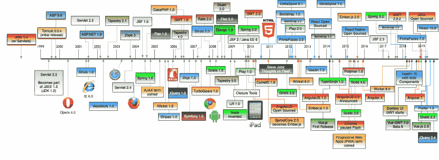
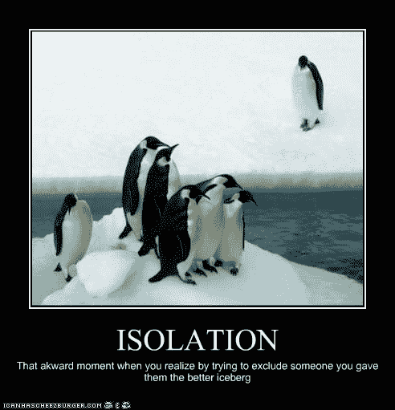

# 不要让您的工具将您定义为开发人员

> 原文：<https://dev.to/remotesynth/don-t-let-your-tools-define-you-as-a-developer-knk>

在我的职业生涯中，我能够见证的变化之一是 web 开发人员称呼自己的方式。在早期，当 nothing web 被认为是真正的开发时，你是一个“网站管理员”。对于那些不熟悉这个术语的人来说，网站管理员就像一个拥有更多衣服但更少野兽的兽王。

最终我们都成了“web 开发人员”，这意味着我们从前端到后端构建一切。然而，随着 web 开发变得越来越复杂，许多 web 开发人员变成了前端开发人员。

这是我认为事情开始改变的地方。突然，你会遇到不认为自己是 web 开发人员或前端开发人员，而是认为自己是 Angular 开发人员或 React 开发人员的人。

## 有什么变化？

从早期开始，我们就有了 web 框架。虽然它可能比以前更普遍，正如你在下面的时间表中看到的，但这不是一个新现象。

 

*来源:[Web 框架的历史时间轴](https://github.com/mraible/history-of-web-frameworks-timeline)作者 Matt Raible*

不过，回到 2006 年到 2012 年之间，你可能从来没有听到一个 web 开发人员称自己为 jQuery 开发人员或 Dojo 开发人员。直到 React、Angular、Ember 和 Vue 等现代框架的兴起，开发人员(甚至他们的雇主)才开始将自己与他们选择的框架联系起来。

## 为什么把你的工具和你的身份捆绑在一起会有问题

开发人员总是对他们喜欢的工具有一种半宗教式的依赖。从历史上看，这采取了“我的语言比你的语言更好”的辩论形式。这部分是因为作为一名 Java 开发人员、Ruby 开发人员或. NET 开发人员会有一种认同感。

这些都不是健康的争论，但是今天我们已经将它们进一步缩小到由给定社区内的框架定义的更小的领域。

例如，如果我是 Angular 开发人员，我可能会加入 Angular 小组，阅读 Angular 博客，参加 Angular 开发人员会议。其他社区也是如此——这甚至不仅限于 Angular 或 web 框架。

我认为过于依赖你的特定工具并以此来定义自己是有问题的，原因如下:

*   你把自己绑在一个特定的工具上，限制了自己的职业灵活性和机会。我们用来构建 web 的工具来来去去，但是 web 开发将永远存在。
*   它限制了你的视角，仅仅根据它对你选择的工具的影响，把事情看作是威胁还是帮助。一个有棱角的开发者可能会把有利于 Vue 采用的事情看作是对他们自己生活甚至身份的威胁。
*   它可以将你的职业成功与特定公司或项目的命运联系起来。
*   这会导致根据人们对你选择的工具的隶属关系来判断他们的价值。

开发人员在学习工具和有时存在于他们周围的生态系统上投入了大量的时间和精力，因此可以理解他们对这些工具和生态系统的投入。但是让我们诚实地说——我们有足够多的问题需要在开发者社区中解决，而不是让一个人对 web 框架的选择在人们之间传播。让我们把注意力集中在把我们联系在一起的事情上——对网络的热爱和在网络上建立美好的体验！