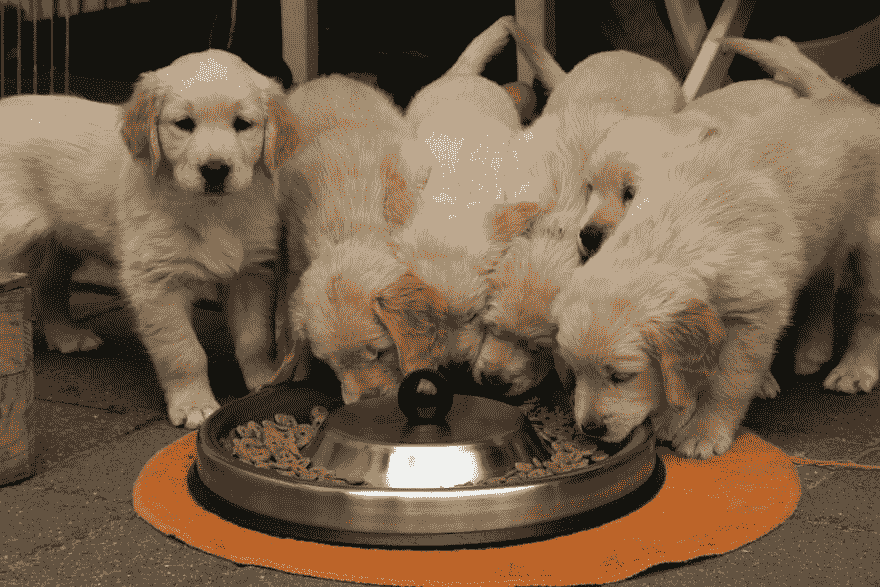

# 光吃自己的产品是不够的

> 原文：<https://dev.to/polluterofminds/dogfooding-your-own-product-isn-t-enough-2gb9>

dog fooding——在向其他人发布产品之前，建议团队使用自己的产品这种令人厌恶且不太准确的方式——是初创公司测试产品的常用方式。如果你不喜欢自己的产品，还有谁会喜欢呢？这很有道理，但还不够。

先说狗食有什么好处。这有利于确保你有一个可用的产品。通过你的团队使用你的产品——区分使用和测试是很重要的——你会感觉到它有多有用。你会抓住眼前的问题。你会发现，如果整个事情是一个完整的烂摊子，需要废弃。尝试自己的产品也是了解你要服务的市场的好方法。我们并不是都为我们非常熟悉的市场制造产品。如果可以的话，那就太好了，但那不是现实。因此，通过在内部使用你的产品，你将开始看到市场会如何使用你的工具。你会更好地了解市场。总而言之，dogfooding 是一件好事。必要的事情。

但问题来了:*根本不够*。

即使你了解市场，即使你了解竞争对手，即使你在客户知道他们想要什么之前就知道他们想要什么，狗食你的产品也只能让你到此为止。当我和我的团队构建[simple id](https://www.simpleid.xyz/?t=dev_df)——一个在几分钟内为应用程序添加身份验证和存储的开发工具包——时，我们发现了三个主要的盲点，它们限制了对产品进行测试的有效性。这些盲点是:

*   对代码的熟悉程度

*   对设计的熟悉

*   当边缘案例实际上是中心案例时，相信它们是边缘案例

我将逐一介绍这些，然后我将讨论应该添加到 dogfooding 产品中的层，以帮助解决这些问题。

### 对代码的熟悉程度

我的团队完全是技术性的。我们都写代码。我们都知道密码。我们都知道应该做什么。这对于开发效率来说很好，但是在将产品发布给客户之前尝试探索用户体验问题就不那么好了。

作为开发人员，我们有一种内在的倾向，那就是走快乐的路。我们并不总是知道我们在走快乐的路。这是潜意识照亮的路径，告诉我们“不要点击那个按钮，傻瓜”或“如果我在这里输入正确的文本，我知道我会继续。”编写测试有助于迫使我们避免这些快乐的时刻，但是当实际使用我们构建的产品时，很难避免知识的负担。

我们知道产品应该做什么，所以我们最终完全按照它的设计使用它，并绕过其他人可能会发现的任何可怜的 UX。更糟糕的是，我们错过了其他人可能在使用产品的前五分钟发现的错误。

### 熟悉设计

与理解代码的问题非常相似，当我们理解设计时，我们在下一个屏幕出现之前就知道它是什么样子的。我们知道按钮 A 是设计来帮助用户进入页面 d 的。所以，当它应该发生的时候，我们点击按钮 A。我们不会提前点击它。我们知道设计，我们知道应该发生什么，我们服从我们如此努力实现的设计。

但是普通用户不会这么做。

如果您知道产品中的表单需要一个用户名，那么您可能完全忽略了这样一个事实:您忘记了标记该表单字段。您的用户不知道该领域期望什么，但您知道，因为您设计了流程。你设计了流程。

这当然是一个简单的例子。但它说明了当我们对设计非常熟悉时，我们是多么容易忽略应用程序中的问题。

### 当边缘事例实际上是中心事例时，认为它们是边缘事例

撇开长期目标不谈，这可能是狗粮产品时最难克服的盲点。简而言之，这意味着假设人们不会做人们会做的事情。每个产品看起来可能不同，但我们实现这一目标的方式大体上是相同的。

我们追求效率。我们想把我们的产品推向市场，所以我们告诉自己“当边缘情况出现时，我们会处理。”然而，我们不知道的是那些边缘情况是什么。当产品对市场来说是新的，创新的，或者是以前没有尝试过的东西时，尤其如此。然后，我们根据自己对产品的了解，自己决定什么是边缘案例。请参阅盲点一和盲点二，了解这如何导致对边缘情况的不良假设。

所以，我们认为我们知道什么是边缘情况。我们喂了我们的产品，我们自己的确认偏差证明我们是对的。"看，伙计们，我们没有碰到任何边缘情况，我们很好！"然后，产品面向大众，第一天就有人碰到了我们认为的边缘案例。然后是另一个人。突然，在一天之后，我们认为是边缘的情况实际上是产品的核心使用…并且它不工作。

我们如何解决这些问题？我们会放弃喂食我们的产品吗？我们直接跳到用户测试吗？

确切的答案将因产品而异，但对于我的团队来说，我们找到了一个平衡点，我们构建产品，喂养产品，向少数早期采用者发布产品(注意:这不是公共的 alpha 或 beta 程序)，然后我们广泛发布。称之为私人测试版，称之为朋友间的测试。不管你叫它什么，只管去做。对 SimpleID 来说，这意味着联系我们已经认识的开发人员，请他们尝试使用面向外部的应用程序和开发人员工具。

你应该这样做，而你狗粮你的产品。之前没有，之后也没有。通过让一些值得信任的同事使用你的产品，同时你也在使用它，你得到的反馈会产生更多的共鸣。虽然我们可能错过了应用程序 Z 页上的那个断开的链接，但我们知道它的确切位置，以及我们的早期采用者是如何到达那里的，因为我们也在使用该产品。我们可能错过了从我们的 API 返回的错误消息，但是因为我们也在使用该产品，所以当我们的早期采用者告诉我们时，我们发现了问题并更快地修复了它。

其中一些似乎是显而易见的，但是在创业的世界里，你的产品被如此强调，以至于一些团队忘记做除此之外的任何事情。整个想法是继续狗粮，但永远不要用它来代替人们的早期反馈，他们可能有一天会付钱给你使用这个产品。

* * *