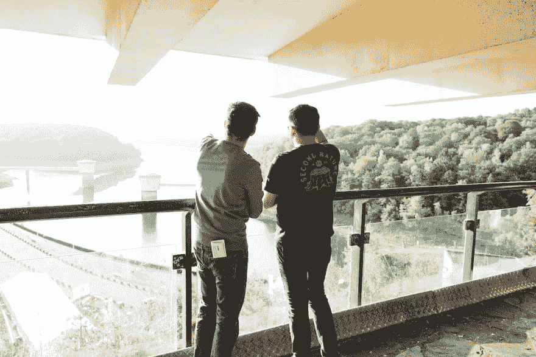
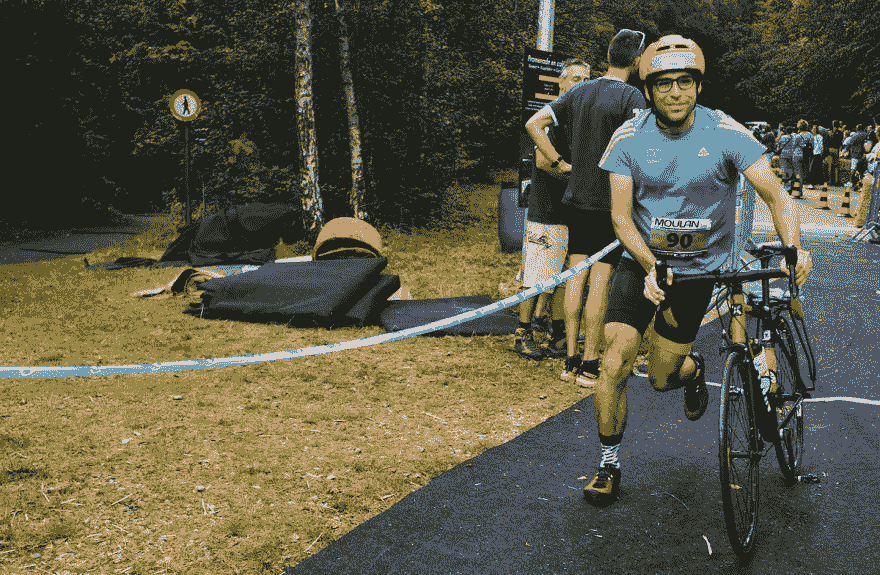
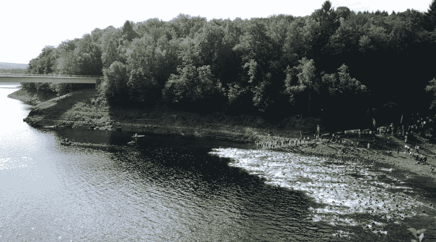

# 铁人三项训练≈创业生活

> 原文：<https://dev.to/bismuthlabs/triathlon-training-startup-life-7n5>

上周，我完成了我的第一次铁人三项，这让我意识到这场比赛的旅程与我在创造铋合金的过程中所经历的是多么的相似。

# 起点

当你不是一个有成就的运动员时，报名参加铁人三项赛不是一件轻松的事。我在 2012-2015 年是一名狂热的跑步者，但从那以后就停止了训练。我经常骑自行车上下班(单程约 9 公里)，所以我的腿仍然很好，但我一生中几乎没有超过 20 公里的旅行。

当一个朋友邀请我加入一个想成为铁人三项运动员的小组，为 La Gileppe Trophy Orbea 进行训练时，我很难拒绝。我们不会白白训练:我们有一个明确的目标。这与仅仅瞄准一个抽象的目标(成为三项全能运动员)是非常不同的。

创业也是如此。瞄准创业生活本身不应该是一个目标。你应该有一个更具体的计划。

# 团队&网络

不应低估这一努力的社会方面。我们是一个五人小组，为三项运动进行训练。我们分散在整个地区(蒙斯-布鲁塞尔-列日，比利时)，只有一些培训在一起。当你们住在相距 2 小时的地方时，见面进行一小时的跑步/游泳没有什么意义。不过，我们在周日进行了几次更长时间的自行车训练。

但是不一起训练并不意味着没有网络效应。日志和脸书小组的谈话是强有力的激励工具。我们可以在完成一次清晨游泳或一次晚间骑车时问候自己。漫长的一天过后，我骑着自行车出去兜风的几率比我独自一人的几率要大得多。当镇上只有你一个人的时候，推迟任务太容易了。

当你犹豫不决，认为自己落后时，幽默和友情很管用。分享内容和训练技巧保持了兴趣，并确保我们学得更快。

创业团队也是如此。当你需要专注于工作时，独处是很好的，但互动和讨论对思维能力、动机和心理健康很重要。

# 规划

即使我们注册了短距离(铁人三项短跑)，我们中的一个人还是带着一个雄心勃勃的训练计划出现了。对我来说有点太多了。我从一开始就知道我跟不上。

没关系。坚持你知道你不能遵循的训练计划是一个愚蠢的想法。调低音量，直到你确信你能做到。

在我这边，我已经很久没有游泳了，几乎不能不喘着气穿过游泳池。由于我的通勤，骑自行车还行，但更长的距离是一个未知的领域。跑步是我的强项，因为我有越野跑的经验，知道在整个过程中腿部和大脑的感觉。

了解到这一点，我为自己定制了一个计划。我仍然不知道它是否是最佳的。可能不是，但它让我顺利通过了比赛，所以我认为这是一场胜利。

# 执行和计划外变更

有了计划只是开始。这是你不能授权的事，你是负责人。同样，群体的同辈压力也很重要。你不需要对他们负责，但是你也不想成为一个什么都不做的懒驴。

不过要小心。我很快注意到，社交生活会让遵循计划变得很有挑战性。今晚一起去喝啤酒吃披萨吗？这种文字会挑战你的专注度和奉献精神。在变成一个社会隐士和每晚出去之间有一个平衡。我愿意做出的妥协是，保留披萨，但用啤酒换苏打水。

最近对凯蒂·阿诺德的采访表明，只要有一点创造力，你就可以将社交生活与孩子和长距离训练结合起来。

在我这个层次，计划只是一个指引。我们的目标不是进入前 10 名，所以灵活性比性能更重要。不过，在初创企业中，你可能会有更多的目标。这没什么，但是要意识到对你生活的影响。

# 多语种

> 铁人三项还是如何在三项运动上平庸

游泳、自行车和跑步是不同的项目。在他们三个中至少体面是整个游戏。对我来说，这是一个启示:为三项运动训练比专注于一项运动有趣得多。

在初创公司，创始人通常什么都做一点。他们需要在销售、编码、市场营销、筹集资金等方面周旋。结果应该是这些任务之间的平衡。当然，平衡在每个阶段都是不同的，创始人必须对新情况做出快速反应。

这种多样性极具挑战性，但也非常有趣和有益。

# 学习&保持谦逊

开始新的努力总是充满了教训。在铁人三项训练中，你学会倾听你的身体。你实验。你学习如何通过调整泳姿来提高效率。你听从建议，在比赛日之前在公开水域试试你的潜水衣！)。有些在一个上下文中有效，但在另一个上下文中无效。但是请记住它们，它们可能有一天会有用。

你是没有经验的初学者。通过练习，你会建立自信并找到你的节奏。要有耐心，但不要被动。

# 知道何时放慢脚步

在训练的第二个月，我的膝盖开始疼痛。我放慢了训练速度，很快确定疼痛来自跑步。在交叉训练时，很难找出单一的问题来源，但对我来说，这很容易:我的跑鞋跑了 1000 多公里。幸运的是，夏季大减价总是买新鞋的好时机，这个问题出现得快，消失得也快。

不花时间放慢速度并发现问题可能会产生严重的后果。创业也是如此。你应该总是听从你的感觉(和衡量标准),并适当调整。

# 装备没那么重要

有些人会认为你需要顶级的装备来完成一场比赛。这远非事实，你需要的唯一两件技术装备是一件游泳潜水服和一辆自行车。

这辆自行车是你需要的最贵的东西。最好的自行车是你已经有的那辆。一名女子骑着可折叠的 Brompton 完成了铁人三项，许多骑手都有山地车。在 craigslist 上找到一辆便宜的二手自行车，然后开始骑行。

现在，大多数创业公司都可以在没有任何特定设备的情况下启动。你只需要一台笔记本电脑和一部手机就可以开始了。你不需要 3000 多美元的 Macbook Pro 或昂贵的 SAP 许可证就可以开始使用。聪明一点，只在需要的时候才准备好。

# 渴望更多

这只是我铁人三项之旅的开始。冲刺距离是一个不错的开始，但在比赛结束时，我仍然有一些能量。这意味着训练足够好，我的身体和精神都准备好了。整个比赛很有趣，那天释放了大量的内啡肽。是时候计划下一个了。这次我很想走更长的距离。

大约在我开始为铁人三项训练的同时，我开始全职研究铋。同时关注这两件事是一个挑战，有些人会说同时做两件事都需要很大的勇气，这是浪费时间的最好方式。我不相信。相反，我认为两者是相辅相成的。

在铋心情不好的时候，去跑步是释放压力的好方法。另一方面，早期游泳是开始一天的好方法，也是从床上跳起来的好理由。

我迫不及待地想看看这两个人最终会有什么样的结局！

(图片由[卡罗琳·维穆伦](http://www.carolinevml.be/)和[林赛·埃克哈特](https://www.instagram.com/lilibabulle)拍摄)