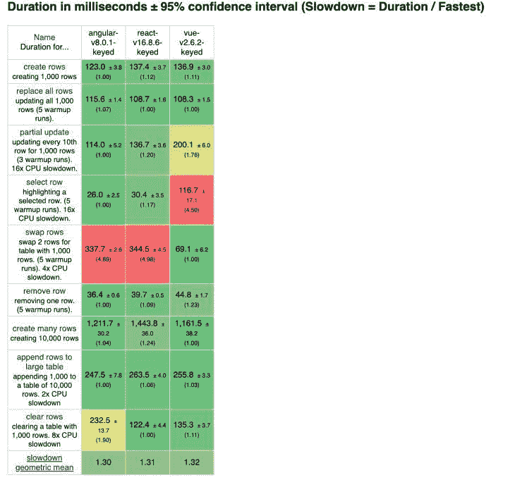
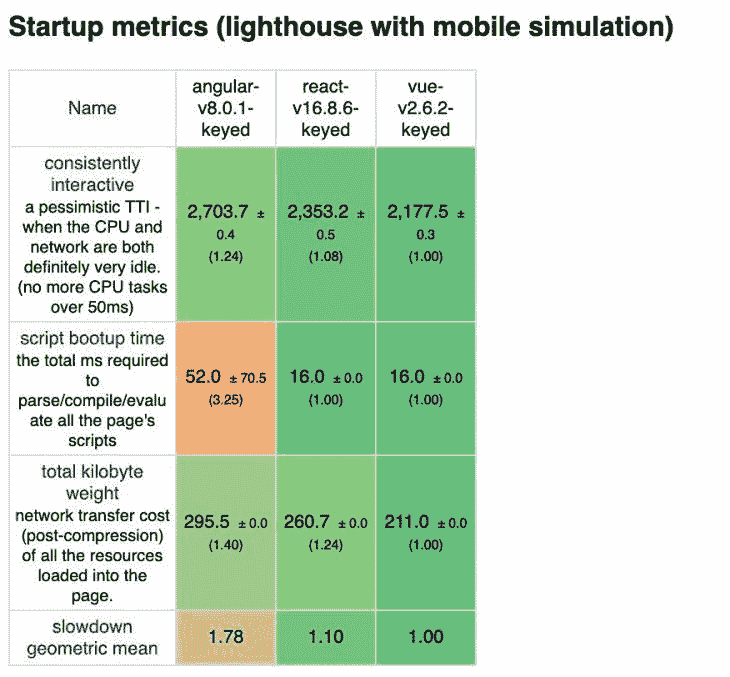

# 角度、反应和 Vue:性能比较

> 原文：<https://dev.to/bnevilleoneill/angular-vs-react-vs-vue-a-performance-comparison-3i0f>

**作者:[皮耶罗·博雷利](https://blog.logrocket.com/author/pieroborrelli/)** ✏️

在这个不断变化的技术世界中，一些工具已经存在，而许多其他工具随着时间的推移已经淡出人们的视线。然而，我们都同意 JavaScript 编程语言将长期存在。

这项令人惊叹的技术因其多功能性而受到数百万人的喜爱——它可以部署在服务器端和客户端，用于移动应用程序和桌面。

这种语言的其他特点是它能够从一开始就创建很酷的项目，它的广泛使用也使它非常有市场，对试图在这个领域获得第一份工作的人来说非常有趣。

但是我们知道，使用技术是有代价的。JavaScript 是一种非常复杂的语言，有其语法和特性。我承认我发现自己很多次看着一段 JS 代码，想知道幕后到底发生了什么。

这就是技术历史出现和重复的地方:每当许多人有类似的问题，解决方案就开始出现。人们利用他们的集体智慧来寻找更好的制造东西的方法。在我们的例子中，我们开始创建叫做框架的工具。

这些作为我们应用程序的框架，定义了开发我们项目的指导方针和最佳实践，同时简化了我们的许多因素，例如代码结构和维护。

## 三解

尽管已经出现了数十种优秀的 JavaScript 框架，但在本文中，我将只关注其中最流行的三种。当然，我说的是 Angular、React 和 Vue。特别是，我将特别关注它们的性能，以帮助您了解在选择您将使用的工具时，这是如何发挥作用的。

### 寻找完美的自己

很多时候，当你发现自己不知道在开始一个新项目时使用什么框架时，你可能会在没有完全正确分析的情况下选择一个框架。但是从长远来看，当您意识到所选择的框架不能满足您的应用程序需求时，这可能会暴露出它本身的问题。

假设您不想知道在这些框架之间编码时的差异——没问题。但是如果你有一个非常重要的项目，有不同的瓶颈，你需要一个详细的图片来说明在你的情况下哪种技术会表现得更好呢？

这就是本文的目的:为您提供做出最佳选择的工具，不仅为您提供每个框架的快速介绍，还为您提供性能分析，帮助您指导您的选择并挑选出最适合您的框架。

### 请注意…

即使我们在这里专门讨论性能，我仍然会为您提供框架的总体概述。这是为了帮助你理解为什么创建这个框架，它试图解决什么样的问题，以及它的一般优势。当我们比较这三种方法时，这些方法将会对你有很大的帮助，这样你就可以很快找到一个参考来帮助你做出选择。

## 棱角分明

在前端 JS 框架的一个旧的、新的和新兴的世界中，Angular 迅速确立了自己作为主流技术被数百万开发人员使用的地位。这不仅是因为一个好的发布时机，还因为它提供了一个令人难以置信的结构，提供了简单的双向数据绑定、MVC 模型和内置的模块系统、路由包和依赖注入。

### 一般表现亮点

由于其 MVC 结构，Angular 可以将任务分成逻辑块，减少网页的初始加载时间。MVC 模型还允许关注点的分离，视图部分呈现在客户端，大大减少了后台的查询。此外，与该工具的通信以异步模式工作，这意味着对服务器的调用较少。

### 一般优点

*   **双向数据绑定:** Angular 以一种简单、高效、直观的方式将对模型所做的更改即时复制到视图中。
*   **受欢迎且被广泛使用:** Angular 在这个领域有很大的影响力，有许多社区和专业人士支持它。

### 一般弊

*   **较重的应用程序:**由于这个框架的许多特性，有时它们会给你的项目带来负担，所有这些都转化为较重的应用程序和比 React 或 Vue 慢的性能。
*   **不断更新:**新的、重大的变化经常推出。这可能会给开发人员在适应它们时带来问题。
*   陡峭的学习曲线:这个框架有许多方面和特性，肯定比它的同类产品更难学。

## 做出反应

React 是一个前端库，用于创建有状态和可重用的 UI 组件。它允许开发人员创建大型 web 应用程序，无需重新加载页面即可更改数据。

它背后的主要任务是简单、可伸缩和快速。实际上，作为一个前端库，它没有完整地实现 MVC 模板——但是，你可以把它看作视图的一部分。

### 一般表现亮点

使用 React 的其他巨大优势是它的性能。凭借 43KB 的 gzip 文件大小，该库以其令人难以置信的速度和它用来实现所有这一切的许多功能而迅速闻名，例如:

*   **使用虚拟 DOM:** React 使用这种技术，通过只根据需要重新渲染节点来实现最大效率。
*   **支持捆绑和摇树:**用于最小化终端用户的资源负载。
*   **服务器端渲染(SSR):** React 提供了对这种功能的支持，这对于某些类型的实现来说是非常好的。

### 一般优点

*   **虚拟 DOM:** 使用虚拟 DOM 在性能和优化应用工作负载方面有很多优势。
*   **单向数据绑定:**在编写我们的 React 应用程序时，数据将只向一个方向流动，这为我们提供了对整个项目的更好控制。
*   易于测试:使用 React 测试我们的组件和监控我们动作的输出是非常容易的，这使得整个开发过程变得更好。

### 一般弊

*   **没有实现 MVC:** 这意味着你有时需要使用额外的库来实现状态和模型。
*   **糟糕的文档:**由于对该工具的不断更新，加上为支持它而创建的所有配套库，React 技术发展如此之快，以至于没有时间编写适当的指令。
*   **不断变化:**如上所述，React 不断变化，开发人员必须定期更新新的做事方式。一切都在发展，有时你可能会发现自己跟不上这样的步伐。

## vista . js

按照通常的定义，Vue.js 是一个用于构建用户界面的渐进式框架。与 Angular 之类的单一框架相比，Vue 被构建为用户可增量采用。

它是 Github 上最受瞩目的 JS 框架之一，这要归功于它的特性、相对简单的学习曲线以及创建高效、快速和复杂的单页面应用程序的能力。

尤其是在谈到 Vue 的时候，由于他们的使命相对相似，所以更容易将其进行比较以做出反应。一些相似之处包括:

*   它们都使用虚拟 DOM。
*   它们都利用了反应式和可组合的视图组件。
*   他们都把精力集中在库的核心部分，把其他重要的操作，比如路由到伙伴库。

### 一般表现亮点

说到性能，Vue 是一个异常快速的工具。gzipping 后的 18KB 小得令人难以置信，这项技术可能会有很长的寿命。

### 一般优点

*   **整体性能:**凭借其可管理的规模和逐步采用部分技术的能力，性能涵盖了 Vue 成为伟大工具的大部分原因。
*   与 Angular 等其他框架相反，Vue 易于学习，这使得它对初学者和资深专业人士都很有吸引力。
*   出色的文档:Vue 背后的团队在该工具的文档中投入了大量的精力，这对用户来说非常有帮助..
*   **简单的项目集成:**这允许您在项目中立即开始使用 Vue。

### 一般弊

*   小社区:作为一个新的框架，Vue 仍然需要时间将其社区发展到支持 React 或 Angular 的规模。
*   **较小的就业市场:**与我们上面所说的类似，由于这是一个相对较新的框架，更广泛的市场尚未采用与 React 和 Angular 相同的 Vue。因此，我们可能需要一段时间才能在就业市场上看到对新的、熟练的 Vue.js 开发人员的大量需求。

## 并排性能对比

既然我已经对所有框架进行了快速概述，那么让我们试着将它们放在一起进行适当的性能比较。最后，您将能够看到何时应该使用一个框架而不是另一个框架。

我们将分析的三个因素是:

*   DOM 操作:这有助于我们确定哪些框架对于需要与 DOM 进行大量交互的高度动态的应用程序表现得更好。
*   启动时间:这将让我们知道当你需要更快的初始加载时间时，哪种框架更合适，这对需要更快速度的应用程序很有用。
*   **内存分配:**这揭示了哪些框架更好地使用内存——例如，执行批量操作，如从数据库中读取或写入数千条记录。

你在图片中看到的每种颜色都有特定的含义:

*   绿色意味着给定的框架比另一个框架表现得更好。
*   红色/黄色意味着给定框架的性能较差。

所有显示的测试都在框架的键控版本之间，所有时间单位都以毫秒表示。

### 执行基准测试

下面介绍的所有基准都来自 Stefan Krause 的精彩分析。我决定使用这些，以便每个人都有一个在线参考咨询。您甚至可以找到在本地机器上测试每个框架的说明。

### DOM 操纵

正如您从第一批统计数据中看到的，Angular 在 DOM 操作方面表现得更好，除了一些表现不佳的情况。因此，一般来说，我们可以同意它在这种特定类型的操作中表现更好。

### 启动时间

你可能已经猜到了，在这种情况下，Vue.js 是绝对的赢家。如上所述，这个框架非常小，在启动时帮助很大。

在这种情况下，我们看到 React 的结果非常相似，我们可以承认它在这里的表现也很好。然而，正如我们可以清楚地看到的那样，Angular 受到其较重结构的影响。

### 内存分配

查看这些统计数据，我们可以首先声明 Angular 在这些类别中肯定比 Vue 和 React 慢。后两种框架都表现得非常好，这进一步证明了这两种框架在性能方面没有真正的显著差异。然而，如果我们不得不宣布一个赢家，这仍然是 Vue 在这种情况下。

## 最后…

既然我们已经从性能的角度分析了所有三个框架，我们可以试着给出我们的结论了。但是，请记住，无论何时您必须根据性能选择要使用的技术，都很难找到适合每种情况的解决方案。

这背后的原因主要是因为当你开始一个新项目时，你可能会发现自己经历无数不同的情况。还要注意我们谈到的所有工具通常表现良好，并且已经成为开发人员的既定技术。但现在让我们尽最大努力来引导您做出选择:

### 该不该选有棱角的？

可以从使用 Angular 中获益的应用类型有:

*   **内容非常动态的应用:**由于其结构和高效的数据绑定，Angular 对于那些需要根据用户行为动态改变显示内容的应用非常有用。Angular 将确保一旦一个组件被更改，与之链接的所有其他相关组件都会立即更新。
*   **非常大的企业级应用:**即使如上所述，Angular 非常频繁地更新自己，从而产生了频繁更新我们代码的需求，但它的核心结构和它提供的工具仍然使它成为大型应用的一个伟大框架。

但是要注意，对于小尺寸的静态页面，Angular 绝对不是最佳选择。由于其整体结构，该框架在生成小的静态页面时不能很好地工作，增加了无用的开销，从而减少了加载时间和整体性能。

### 应该选择 React？

使用这个广受欢迎的框架可以在处理以下问题时提供许多优势:

*   **需要速度的应用程序:**React 的设计考虑了性能并支持虚拟 DOM，当您需要应用程序的速度和性能时，它是一个非常好的框架。
*   **需要通用性的应用:**基本上可以在任何地方使用 React，而不会牺牲性能。最好的部分是你不需要修改任何东西或者使用任何特殊的技巧来使它在不同的平台上工作。你将有框架生态系统来支持你，比如 React Native 用于移动应用开发。
*   **需要良好 SEO 的一般网站:** React 的速度和一般性能可以通过提供更好的用户体验，为谷歌眼中更好的 SEO 做出贡献。
*   **适合国际受众:**当今的许多项目都面向全球受众，这意味着人们将通过各种速度和容量的硬件和互联网连接来访问您的应用程序。使用 React 的更快的应用程序可以帮助您将您的产品带到可能具有有限带宽或硬件能力的不同地区。

### 该不该选 Vue？

这一新创建但快速建立的框架在许多不同的情况下证明是有用的，例如:

*   **需要速度的应用程序:**与 React 一样，Vue.js 应用程序往往非常快，可以提高您的项目速度。
*   **当你需要非常轻量级的应用:** Vue 不仅速度快，而且轻得令人难以置信。这提供了一些优势，包括资源有限的机器性能更好，连接速度较慢的人的可访问性更好，以及用户的整体体验更好。
*   **当您想要将一个框架集成到现有的应用程序中:**由于 Vue 的内部结构，这可以轻松地逐步完成，而不会牺牲您的应用程序性能，并且只使用您需要的东西。从长远来看，这将节省时间和金钱，使 Vue 也成为初创公司和不断增长的想法的一个非常有效的工具。
*   **适合国际受众:**类似于我们上面说的 React，Vue 的速度和轻便也会让网速有限的国际用户有更多的可能从你的产品中获益。

今天就到这里吧！这本指南应该有助于你探索这个主题。欢迎在下面留下评论，意见和反馈对帮助大家更好地学习非常有用。

更多类似的内容，请关注我的 [T](https://twitter.com/BorrelliDev) [维特](https://twitter.com/BorrelliDev)和我的[博客](https://thecoderswag.com/)。

* * *

**编者按:**看到这个帖子有问题？你可以在这里找到正确的版本。

## Plug: [LogRocket](https://logrocket.com/signup/) ，一款适用于网络应用的 DVR

[log rocket](https://logrocket.com/signup/)是一个前端日志工具，让你重放问题，就像它们发生在你自己的浏览器中一样。LogRocket 不需要猜测错误发生的原因，也不需要向用户询问截图和日志转储，而是让您重放会话以快速了解哪里出错了。它可以与任何应用程序完美配合，不管是什么框架，并且有插件可以记录来自 Redux、Vuex 和@ngrx/store 的额外上下文。

除了记录 Redux 动作和状态，LogRocket 还记录控制台日志、JavaScript 错误、stacktraces、带有头+体的网络请求/响应、浏览器元数据、自定义日志。它还使用 DOM 来记录页面上的 HTML 和 CSS，甚至为最复杂的单页面应用程序重新创建像素级完美视频。

[免费试用](https://logrocket.com/signup/)。

* * *

帖子 [Angular vs. React vs. Vue:性能比较](https://blog.logrocket.com/angular-vs-react-vs-vue-a-performance-comparison/)首先出现在 [LogRocket 博客](https://blog.logrocket.com)上。