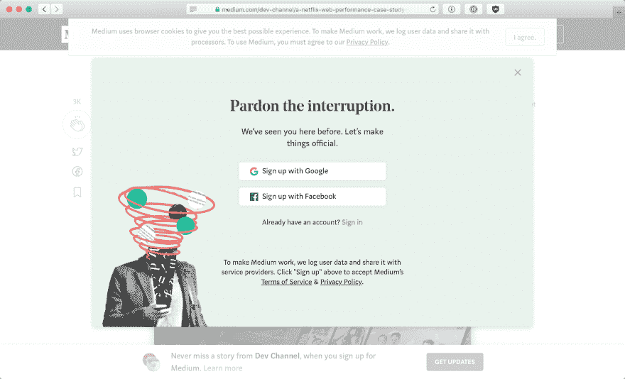

# 盖茨比或者半身像！

> 原文：<https://dev.to/joshghent/gatsby-or-bust-3nfe>

最近，我把我的网站从 GitHub 页面上的静态 HTML 文件(是的*实际上是*静态)和我的博客从 Medium 上移走了。我决定把它们结合起来，转到一个盖茨比的网站上。

## 为什么？

很久以来，我一直想把我的博客从媒体上移走。自平台建立以来，他们一直在努力寻找可行的商业模式，并采取越来越反用户友好的方式试图让人们为内容付费。我对他们应该做什么有想法，但那是下一次的话题。无论如何，我想让人们真正阅读我的博客，尤其不喜欢移动体验。

 *来源:[https://medium . com/@ nikitonsky/medium-is-a-poor-choice-for-blogging-bb 0048d 19133](https://medium.com/@nikitonsky/medium-is-a-poor-choice-for-blogging-bb0048d19133)*

此外，我想重新控制我的内容。我不喜欢一个平台可以从不属于他们的内容中获得收入的想法。这并不是说我在免费使用这个平台，我花了大约 70 美元让它指向我自己的子域(后来他们放弃了这个功能)。

## 此举

我选择 Gatsby 有两个原因，它看起来很快，很容易部署和添加新的博客文章。我还可以将我已经用于开发工作的所有东西和工具保存在 git 中。

### 部署

我选择在 Netlify 上托管站点，并在主分支上配置来自新提交的自动部署。我还从 Netlify 应用程序的我的域的根目录用 CNAME 配置了我的 DNS 提供者。

除此之外，我还将 TravisCI 配置为对我所有的博客帖子进行拼写检查，并为新的 PR 发布预览。这让我可以在新帖子被合并到 live 站点之前看到它们。

### 发展

像大多数人一样，我从盖茨比的博客开始。我不喜欢其中的一些编码风格，但也不太在乎。在样板文件的顶部，我做了一些额外的修改

*   在 Navbar 中增加了一个亮/暗模式切换——很大程度上是受 Overreacted.io 博客以及无数其他具有相同功能的博客的启发。这很容易做到
*   改变了配色方案
*   添加了我的[密钥库](https://keybase.io/joshghent) GPG 密钥来验证我的身份
*   改变了博客文章的标题风格，我发现默认的标题比慈善支票上写的要大
*   受 David Sivers 的启发，添加了一个/now 页面，并记录了我目前使用的应用程序和工具。这需要一些改进

### 移动我的旧帖子

建立网站相对容易。困难和费力的部分将是移动我的旧邮件。由于 Gatsby 在 Markdown 上运行，我发现了一个整洁的 NPM 应用程序，名为 [medium-2-md](https://www.npmjs.com/package/medium-2-md) 。我进入了所有 30 个左右我的旧博客，然后复制了网址，然后运行命令`medium-2-md convertUrl https://blog.joshghent.com/sample-post -f -o index.md`

我本来可以编写一个脚本来实现自动化。但是…

…这真的不值得

在将它们全部转移到 markdown 之后，我在本地运行了这个网站，将 markdown 帖子与 Medium 帖子进行比较，以确保它们匹配，并且所有内容都正常工作。

我发现了几个反复出现的问题

*   单词经常把`*`用在错误的地方
*   段落没有足够的`\n`所以全部呈现为一个段落
*   嵌入诸如 Gists 和 Tweets 之类的内容不起作用——我不得不为此找到 Gatsby 插件，并移植引用以使用它们的格式
*   图像标题不起作用——我不得不移动它们来使用`<em>`标签
*   图像必须手动移动-是的，保存每一张并正确导入。现在有了一个可以传递给`medium-2-md`的`-i`特性，但是当我做最初的移植时，这个特性并不存在(在真正的东西发布之前很久！)

## 回顾

总的来说，我对结果很满意。有些事情我需要改变，但现在，它会做的。和盖茨比一起生活真是又快又容易。