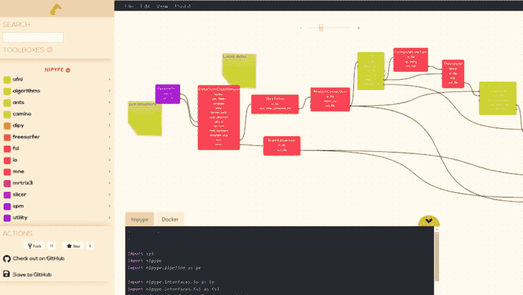

# GiraffeTools:一个通用在线工作流编辑器

> 原文：<https://dev.to/timvanmourik/giraffetools-a-generic-online-workflow-editor-f7j>

[https://长颈鹿.工具](https://giraffe.tools/)

对*大数据*的分析至少十年来一直是热门话题。这些分析通常由一系列步骤组成，这些步骤将数据塑造并转换为具有某种有意义解释的特征。也许你想为后续的机器学习分析提取特征。

以图形方式构建分析管道不是很酷吗？这当然不是一个新的想法。你可以在[图形](https://docs.blender.org/manual/en/2.79/_images/editors_node-editor_nodes_frame_example.png)、[基因分析](https://www.researchgate.net/profile/Kristina_Hettne/publication/264578295/figure/fig4/AS:613949972176926@1523388488995/Taverna-nested-workflow-for-gene-annotation-Blue-boxes-represent-input-and-output.png)、[金融科技](https://daw18osvyl2bu.cloudfront.net/wp-content/uploads/2019/02/HighGear-Workflow-with-Sections-Highlight.jpg)等更多地方找到节点编辑器。然而，如果您已经编写了自己的数据分析工具箱，那么让您的用户以可视化的方式访问您的工具和示例管道不是很好吗？

[](https://res.cloudinary.com/practicaldev/image/fetch/s--_9V6vcnH--/c_limit%2Cf_auto%2Cfl_progressive%2Cq_auto%2Cw_880/https://cdn-images-1.medium.com/max/1024/1%2A9EC03vcH_67deEdxRx3Ssg.png)

### 长颈鹿工具简介

**GiraffeTools** 是一个通用的 **G** 图形 **I** 接口用于**R**E**生产**A**F**分析或者工作 **F** 低 **E** 实验！我最初开发长颈鹿工具是为了“神经成像”。每天，我都和分析各种大脑数据(核磁共振成像、脑电图、脑磁图等)的人一起工作。)，但很快注意到，所有重要的工具箱都有完全不同的 API，而且往往是用不同的编程语言编写的。

所以我开发了一个 GitHub 集成的 web 编辑器，它可以从可视化的工作流中自动创建分析代码…

1.  您可以向其中添加自己的工具箱
2.  您可以将自定义模块添加到任何支持的工具箱中
3.  您可以向其中添加自定义的“语法”,将图形表示转换为工具箱的代码。
4.  从中您可以将任何管道保存到 GitHub 存储库中，并轻松地为您的用户构建示例
5.  其中您可以在任何之前的提交中检查您的可视化工作流，因为您的工作流是完全由 GitHub 版本控制的！

您的项目可以在:[https://giraffe.tools/](https://giraffe.tools/github/%24username/%24repository/%24branch_or_commit)[工作流](https://giraffe.tools/workflow/TimVanMourik/SomeGiraffeExample)[/$ username/$ repository/$ branch _ or _ commi](https://giraffe.tools/github/%24username/%24repository/%24branch_or_commit)t 访问，例如:[https://giraffe . tools/workflow/TimVanMourik/some giraffe example](https://giraffe.tools/workflow/TimVanMourik/SomeGiraffeExample)看起来像:

[](https://res.cloudinary.com/practicaldev/image/fetch/s--g3g9hnUm--/c_limit%2Cf_auto%2Cfl_progressive%2Cq_auto%2Cw_880/https://cdn-images-1.medium.com/max/1024/1%2AviEk1aJgmAXbG3A_JdqE-Q.png)

<figcaption>[https://长颈鹿. tools/workflow/TimVanMourik/some giraffe example](https://giraffe.tools/workflow/TimVanMourik/SomeGiraffeExample)</figcaption>

### 添加自己的内容

好吧，那是怎么回事？任何 GitHub 项目都可以是 GiraffeTools 项目，只需在项目的根目录中放入一个 **GIRAFFE.yml** 配置文件。在那里，你可以具体地

*   指向要向其中写入可视化管道的文件的文件列表，
*   指向您可能希望在管道中使用的工具箱模块的节点列表，
*   一个语法列表，指定将图形转换为代码的解释器。

```
**# Content of a GIRAFFE.yml file in the root of your repository.**  
tools:
  workflow:
    # A file in your repository to which the UI state is saved 
    # Currently only a single file is supported 
    files:
      - GIRAFFE/keras.json
    # A list of nodes to load into the editor
    # The path is either relative to the root or a full URL
    nodes:
      - https://raw.githubusercontent.com/TimVanMourik/keras/giraffe-tools/keras_nodes.json
    # You can load your own JavaScript code generator. Documentation will follow soon
    # The path is either relative to the root or a full URL
    grammars:
      - language: 'Keras'
        script: GIRAFFE/test.js
        format: python 
```

现在好的部分是，一旦你建立了一个节点库和一个语法代码解释器，任何人都可以用你的软件建立管道！任何人都可以创建一个新的存储库，用你的软件构建一个定制的工作流，这个工作流是有洞察力的，并且可以立即共享(通过一个简单的 Github‘fork’)。

### 入门

这些文件看起来怎么样？如何以编程方式创建节点文件的示例(Python 和 MATLAB 代码)包含在[https://github.com/GiraffeTools/Libraries](https://github.com/GiraffeTools/Libraries)中。它需要你的工具箱的 JSON 规范，你可能想要细分你的所有函数的类别，你想要用户能够拖放到编辑器中的节点(函数)列表，以及它们的输入和输出端口列表:

```
{
  "toolboxes": [
   {
    //specify the name of the toolbox, e.g. Keras
    "name": "Keras",
    //specify a list of categories within the toolbox
    "categories": [
     {
      //specify the name of the category
      "name": "core",
      //specify the nodes within that category
      "nodes": [
       {
        //specify the name and attributes of a single module
        "name": "Dense",
        "category": "core",
        "toolbox": "Keras",
        "web_url": "https://keras.io/layers/core/Dense",
        //add any set of parameters that are required to generate
        //your specific code.
        "code": [
         {
          "language": "Keras",
          "argument": {
           "name": "Dense",
           "import": "from keras.layers import Dense"
          }
         }
        ],
        //add input and output ports.
        "ports": [
         {
          "name": "units",
          "input": false,
          "output": false,
          "visible": true,
          "editable": true,
          "code": [
           {
            "language": "Keras",
            "argument": {
             "kwarg": false,
             "arg": 0
            }
           }
          ]
         },
         ... 
```

不管是否指定了语法代码解释器，这些节点都被加载到编辑器中进行拖放。另外，您可以使用这个解释器，它是一个 JavaScript 文件。最简单的形式是包含一个 writeCode 和 writeFiles 函数。前者将管道图的代码翻译成代码，后者指定在用户使用“保存到 GitHub”功能的情况下，将管道图写入您的存储库中的哪个文件。

```
module.exports = () => {
  async function writeCode(nodes, links) {
    return "I am creating code here!";
  }
  async function writeFiles(nodes, links) {
    const myFilename = 'GIRAFFE/my_code.py';
    return {
      [myFilename]: await writeCode(nodes, links)
    }
  }
  return {
    writeCode,
    writeFiles,
  }
} 
```

这是接收(节点、链接)属性的普通 JavaScript，在此基础上，您可以为您的特定目的编写更复杂的代码。例子包括在[https://github.com/GiraffeTools/CodeGenerators](https://github.com/GiraffeTools/CodeGenerators)中。

[](https://res.cloudinary.com/practicaldev/image/fetch/s--uhoK6t95--/c_limit%2Cf_auto%2Cfl_progressive%2Cq_auto%2Cw_880/https://cdn-images-1.medium.com/max/1024/1%2Ac7b0AWZCwjhfzpl0aJTiGQ.png)

### 项目页面

作为奖励，有一个项目页面，其中列出了您对某个特定项目的所有承诺。这样，您可以在之前的任何时间点打开工作流。您还可以查看来自我们存储库不同分支的代码。

### 开源

该平台旨在创建您自己的开源分析管道。GiraffeTools 代码本身也是完全开源的:[https://github.com/GiraffeTools/GiraffeTools](https://github.com/GiraffeTools/GiraffeTools)！星星，叉子，错误报告，功能请求，或贡献非常感谢！

### 文档

本文只是对 GiraffeTools 的介绍。更多的文档和中型职位将随之而来！这些都是*正在进行的工作*和积极开发中！欢迎任何反馈！