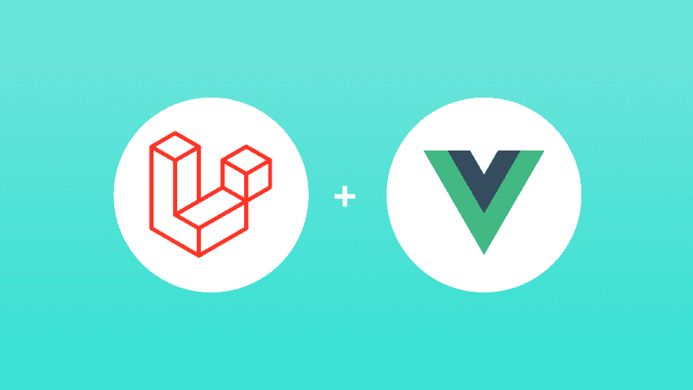
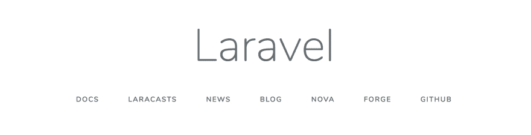
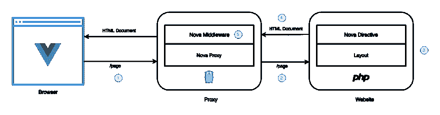
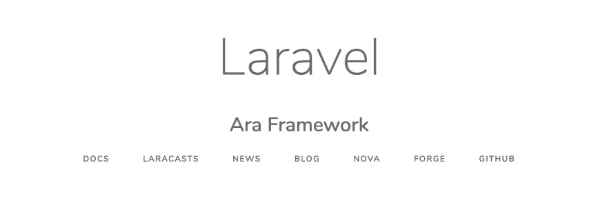
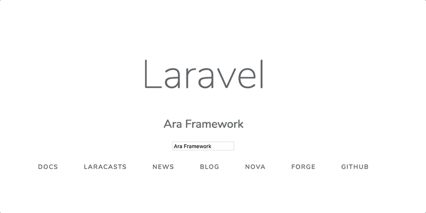

# 使用 Vue.js 和 Ara 框架在 Laravel 中进行通用渲染

> 原文：<https://dev.to/phillipgd1992/universal-rendering-in-laravel-using-vue-js-and-ara-framework-5amd>

[](https://res.cloudinary.com/practicaldev/image/fetch/s--TCM-sU6k--/c_limit%2Cf_auto%2Cfl_progressive%2Cq_auto%2Cw_880/https://ara-framework.github.io/website/img/blog/laravel-vue.png)

本文原载于 [Ara 博客](https://ara-framework.github.io/website/blog/2019/08/28/universal-rendering-in-laravel)。

通用渲染包括在服务器上渲染页面，并使用 React、Vue.js、Angular 等库构建的相同视图组件在浏览器上进行交互。

如今，像 [Next.js](https://nextjs.org/) 、 [Nuxt.js](https://nuxtjs.org/) 和 [NgUniversal](https://github.com/angular/universal) 这样的 JavaScript 框架让这项任务变得更加容易。但是，如何在 Laravel 这样的非 JavaScript 框架上实现呢？

## 设置 Laravel

使用 Composer 下载 Laravel 安装程序。

```
composer global require laravel/installer 
```

创建一个名为`ara-laravel`的文件夹，并在该文件夹中运行以下命令来创建一个 Laravel 项目。

```
composer create-project --prefer-dist laravel/laravel laravel-site 
```

一旦创建了项目，就在 [http://localhost:8000/](http://localhost:8000/) 上运行 Laravel 应用程序。

```
php artisan serve 
```

浏览器:

[](https://res.cloudinary.com/practicaldev/image/fetch/s--7S20urGM--/c_limit%2Cf_auto%2Cfl_progressive%2Cq_auto%2Cw_880/https://ara-framework.github.io/website/img/blog/laravel-main-page.png)

## 设置 Nova 服务

我们将使用 Vue.js 创建一个 Nova 服务。

安装 [Ara CLI](https://github.com/ara-framework/ara-cli) :

```
npm i -g ara-cli 
```

创建 Nova 服务:

```
ara new:nova -t vue nova 
```

转到 Nova 服务文件夹:

```
cd nova 
```

运行 Nova 服务:

```
yarn dev 
```

Nova 服务运行在 [http://localhost:3000](http://localhost:3000) 上。

### 测试 Nova 服务。

一旦 Nova 服务开始运行，您就可以使用有效负载向[http://localhost:3000/batch](http://localhost:3000/batch)发出一个`POST`请求，比如:

```
{  "uuid":  {  "name":  "Example",  "data":  {  "title":  "Ara Framework"  }  }  } 
```

响应中的`results`属性包含由 Nova 服务呈现的视图的`html`。

示例:

```
{  "success":  true,  "error":  null,  "results":  {  "uuid":  {  "name":  "Example",  "html":  "<div data-hypernova-key=\"Example\" data-hypernova-id=\"4d9e81bd-6413-4661-ab56-ed5bb4f59cae\"><h1 data-server-rendered=\"true\">Ara Framework</h1></div>\n<script type=\"application/json\" data-hypernova-key=\"Example\" data-hypernova-id=\"4d9e81bd-6413-4661-ab56-ed5bb4f59cae\"><!--{\"title\":\"Ara Framework\"}--></script>",  "meta":  {},  "duration":  1.210146,  "statusCode":  200,  "success":  true,  "error":  null  }  }  } 
```

## 在 Laravel Blade 中设置 Nova 指令

在`laravel-site`文件夹中使用 Composer 为 Laravel Blade 安装 Nova 指令。

```
composer require marconi1992/hypernova-blade-directive 
```

在应用程序配置`config/app.php`
中添加`NovaServiceProvider`

```
 return [
    ...
    'providers': [
        ...
        Illuminate\View\ViewServiceProvider::class,
        /*
         * Package Service Providers...
         */
        Marconi\Nova\NovaServiceProvider::class,
        /*
         * Application Service Providers...
         */
        App\Providers\AppServiceProvider::class,
        ...
    ]
    ...
] 
```

## 在 Laravel 视图中使用 Nova 指令

在欢迎页面上添加`Example`视图。

`resources/views/welcome.blade.php`

```
<html>
    ...
    <body>
        ...
        <div class="content">
            <div class="title m-b-md">
                Laravel
            </div>
            <!-- Nova Directive starts -->
            @hypernova('Example', [ 'title' => 'Ara Framework'])
            <!-- Nova Directive ends -->
            <div class="links">
                <a href="https://laravel.com/docs">Docs</a>
                <a href="https://laracasts.com">Laracasts</a>
                <a href="https://laravel-news.com">News</a>
                <a href="https://blog.laravel.com">Blog</a>
                <a href="https://nova.laravel.com">Nova</a>
                <a href="https://forge.laravel.com">Forge</a>
                <a href="https://github.com/laravel/laravel">GitHub</a>
            </div>
        </div>
        ...
    </body>
</html> 
```

## 服务器端渲染

Nova 视图还没有渲染，我们需要实现 [Nova 代理](https://github.com/ara-framework/nova-proxy)以便服务器端渲染并包含 Nova 视图。

Nova Direvitve 呈现包含必要信息的占位符，以使 Nova 代理能够与 Nova 服务通信并包括 Nova 视图。

```
<div data-hypernova-key="Example" data-hypernova-id="d198fa6c-c9ec-11e9-a223-8c85903a4c93"></div>
<script type="application/json" data-hypernova-key="Example" data-hypernova-id="d198fa6c-c9ec-11e9-a223-8c85903a4c93"><!--{"title":"Ara Framework"}--></script> 
```

### 新代理

Nova proxy 是一个在任何 web 平台(Laravel、Flask 等)上实现任意视图库(React、Vue.js 等)通用渲染的服务。例如，在这个演示中，我们将使用 Vue.js 在一个用 Laravel 构建的 web 应用程序中呈现一个视图。

工作原理:

[](https://res.cloudinary.com/practicaldev/image/fetch/s--GiWYGeBj--/c_limit%2Cf_auto%2Cfl_progressive%2Cq_auto%2Cw_880/https://cdn-images-1.medium.com/max/2400/1%2A0_KCs-IFVCIN8J5RwP7uFg.png)

1.  用户向 **Nova 代理**请求页面。

2.  **Nova 代理**将请求传递给网站服务器。

3.  网站使用一个 **Nova 指令**来呈现应该包含 Nova 视图的占位符。

4.  网站将生成的 HTML 发回给 **Nova 代理**。

5.  **Nova 代理**包括占位符上的 Nova 视图，并将 HTML 发送回浏览器。

最后，在浏览器上，JavaScript 用于逐步增强应用程序并使其具有交互性。点击此处阅读更多关于 Nova 架构的信息。

### 设置 Nova 代理

在根文件夹中创建 Nova 代理的配置文件:

```
touch nova-proxy.json 
```

在`nova-proxy.json`文件中添加以下配置，将传入请求代理到 Laravel web 服务器。

```
{  "locations":  [  {  "path":  "/",  "host":  "http://localhost:8000",  "modifyResponse":  true  }  ]  } 
```

### 运行 Nova 代理

在运行命令之前，我们需要使用 Nova 服务端点设置`HYPERNOVA_BATCH`变量。

```
export HYPERNOVA_BATCH=http://localhost:3000/batch 
```

您需要在创建了`noxa-proxy.json`文件的地方运行下面的命令，或者传递带有配置文件路径的`--config`参数。

```
ara run:proxy --config ./nova-proxy.json 
```

该命令在 http://localhost:8080 上运行 Nova 代理。

现在，看看 Nova 视图是如何显示的，这是因为 Nova Proxy 在来自 Laravel 应用程序的页面中包含了 Nova 视图。

浏览器:

[](https://res.cloudinary.com/practicaldev/image/fetch/s--u_NEdoAa--/c_limit%2Cf_auto%2Cfl_progressive%2Cq_auto%2Cw_880/https://ara-framework.github.io/website/img/blog/laravel-ssr-nova-view.png)

## 客户端渲染

视图只呈现了一个简单的标题。我们可以通过添加一个改变标题文本的输入元素来使它具有交互性。

用以下代码替换`nova/src/components/Example.vue`:

```
<template>
  <div>
    <h2>{{title}}</h2>
    <div>
      <input type="text" v-model="title">
    </div>
    <br/>
  </div>
</template>

<script>
export default {
  props: ['title']
}
</script> 
```

现在，Nova 视图显示了一个 input 元素，但是当我们键入一些内容时，标题文本不会改变。这是因为我们需要添加客户端脚本。

## 水合物新星浏览器上的视图

水合是使用在服务器上呈现视图组件时使用的状态在浏览器上安装视图组件的过程。

为了丰富视图，我们需要在浏览器上加载`client.js`脚本。

更新 Laravel 应用程序中的`welcome.blade.php`文件:

```
<!DOCTYPE html>
<html lang="en">
<head>
    ....
</head>
<body>
    ....
    <script src="http://localhost:3000/public/client.js"></script>
</body>
</html> 
```

[](https://res.cloudinary.com/practicaldev/image/fetch/s--0zbMif0i--/c_limit%2Cf_auto%2Cfl_progressive%2Cq_66%2Cw_880/https://ara-framework.github.io/website/img/blog/laravel-interactive-view.gif)

## 结论

Nova 代理使我们能够在任何 web 框架上使用现代视图库。因此，如果您之前使用非 JavaScript 框架(Laravel、Flask、Ruby on Rails 等)开发了一个 web 应用程序，那么 Nova Proxy 可以帮助您在短时间内逐步将其视图迁移到 Javascript 视图库(React、Vue.js)。