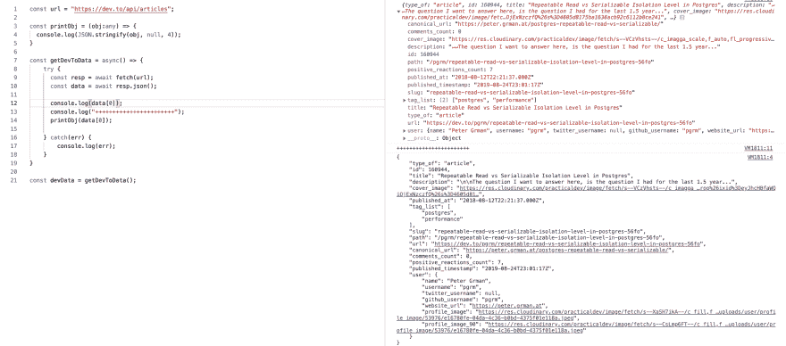

# 让我们漂亮地显示来自 API 的响应

> 原文：<https://dev.to/0xkoji/let-s-display-the-response-from-api-beautifully-4m56>

您可能已经使用了`console.log`来显示来自 API 的数据。

```
import fetch from "node-fetch";

const getDevToData = async() => {
    try {
      const url = "https://dev.to/api/articles";
      const resp = await fetch(url);
      const data = await resp.json();      
      console.log(data[0]); // In this post i just need to check one
    } catch(err) {
        console.log(err);
    }
}

const devData = getDevToData(); 
```

<svg width="20px" height="20px" viewBox="0 0 24 24" class="highlight-action crayons-icon highlight-action--fullscreen-on"><title>Enter fullscreen mode</title></svg> <svg width="20px" height="20px" viewBox="0 0 24 24" class="highlight-action crayons-icon highlight-action--fullscreen-off"><title>Exit fullscreen mode</title></svg>

也许我们需要像下面这样添加。

```
console.log(`id: ${data[0].id}`);
console.log(`title: ${data[0].title}`); 
```

<svg width="20px" height="20px" viewBox="0 0 24 24" class="highlight-action crayons-icon highlight-action--fullscreen-on"><title>Enter fullscreen mode</title></svg> <svg width="20px" height="20px" viewBox="0 0 24 24" class="highlight-action crayons-icon highlight-action--fullscreen-off"><title>Exit fullscreen mode</title></svg>

但有时我们需要完整的回应，对我们(人类)来说应该是可读的。下面这个小功能对我们有帮助。

#### ts

```
const printObj = (obj:any) => {
  console.log(JSON.stringify(obj, null, 4));
} 
```

<svg width="20px" height="20px" viewBox="0 0 24 24" class="highlight-action crayons-icon highlight-action--fullscreen-on"><title>Enter fullscreen mode</title></svg> <svg width="20px" height="20px" viewBox="0 0 24 24" class="highlight-action crayons-icon highlight-action--fullscreen-off"><title>Exit fullscreen mode</title></svg>

#### js

```
const printObj = (obj) => {
  console.log(JSON.stringify(obj, null, 4));
} 
```

<svg width="20px" height="20px" viewBox="0 0 24 24" class="highlight-action crayons-icon highlight-action--fullscreen-on"><title>Enter fullscreen mode</title></svg> <svg width="20px" height="20px" viewBox="0 0 24 24" class="highlight-action crayons-icon highlight-action--fullscreen-off"><title>Exit fullscreen mode</title></svg>

截图是使用 Chrome 使用 TypeScript playground 因为我比较懒，不想为下面的代码创建项目。
但是如果你用 Nodejs，你会很容易看出区别，也会喜欢这个小功能。事实上，这对我很有帮助

号码是给`indent`的。我使用 2 进行编码，但仍然更喜欢使用 JSON 的`4`。

[](https://res.cloudinary.com/practicaldev/image/fetch/s--BAzHhYH0--/c_limit%2Cf_auto%2Cfl_progressive%2Cq_auto%2Cw_880/https://thepracticaldev.s3.amazonaws.com/i/x1yvngx4pu8prpjti1nm.png)

顺便说一下，我在这篇文章中使用了 dev.to API。

### 开发到 api

[https://docs.dev.to/api/#section/Authentication](https://docs.dev.to/api/#section/Authentication)

### [打字稿游乐场](http://www.typescriptlang.org/play/#code/FDDGHsDsGcBcAIAOAnAlpWB5ARgK3gLzwAU4eAXAIaQCeAlIQHzwDew88EM4ANgKYA6HuADmxAFIBlTADkBcNJBGoAZjVJ4ANPEgBXHj20AWOnQDcwAL4guceCL6wAInwBuAFXBPKsSoXiU0DSQoMQMBMxsHBywyDSs7NEctgi6yDz+AEQAFrCwiNDkAPRFACZuArDgRZSIqDXIsKig-NCZFknJUHbIfNCI-pQA7pSoCCqOoNnEaTzmiUkp8KU+fkTDowi9-QK40FBhHZ0L0ba8gsJiK74A2gAMALrznZzd50KixJkA1L9--wDAb9Ms9Oih0Fg8MRrpR7k8jkkTpZOD4psQ+MhkAwoi9Xtx+B8xBisQj4NZrGBughyq5vL5-A5nG5PHTKIcgA)