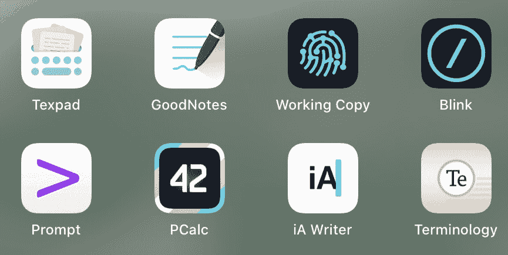
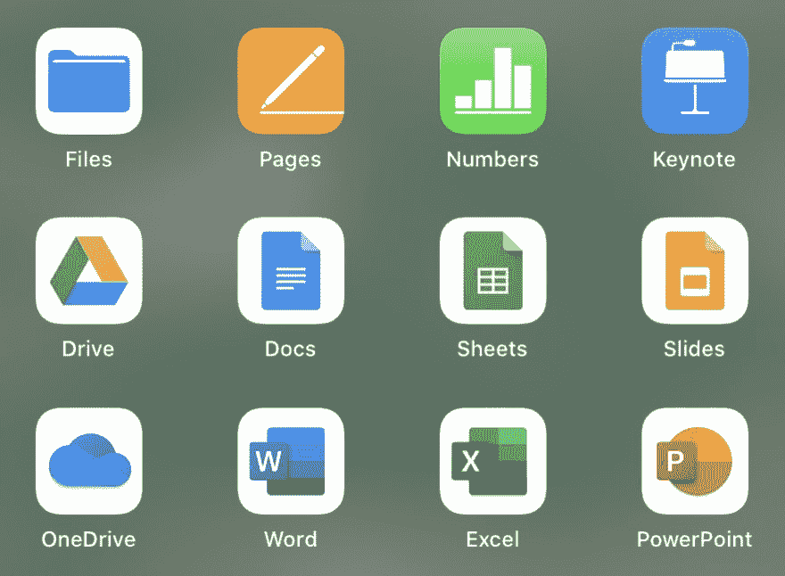

# 我的 iPad 设置

> 原文：<https://dev.to/gonsie/my-ipad-setup-295f>

近一年来，我的 iPad 一直是我旅行时的主要计算设备(唯一的另一个设备是我的手机)。一旦我决定购买任何(和所有)我认为会让我的生活更轻松的应用程序，做出改变就相对容易了。我遇到的任何不利之处都被不必携带大约 5 磅额外的笔记本电脑所抵消。在这篇文章中，我将详细介绍一些挑战，并重点介绍我发现的最好的应用程序。

## 我的推荐

在我进入杂草之前，这是前面的底线。这些都是我的必备应用。价格可能高于大多数应用程序，但我保证它们物有所值。

| 名字 | 价格 | 描述 |
| --- | --- | --- |
| [Texpad](https://www.texpad.com) | $19.99 | TeX 和 LaTeX 编辑和编译 |
| [好笔记 5](https://www.goodnotes.com) | $7.99 | 苹果铅笔的数字笔记本 |
| [工作副本](https://workingcopy.app) | 约 15.99 美元 | Git & GitHub |
| [闪烁外壳](http://www.blink.sh) | $19.99 | SSH 终端 |
| [提示](https://www.panic.com/prompt/)被[惊慌](https://panic.com) | $19.99 | SSH 终端 |
| [iA 作家](https://ia.net) | $8.99 | 纯文本写作应用 |
| [PCalc](https://www.pcalc.com) | $9.99 | 带着*所有*铃铛和哨子的计算器 |
| [术语](http://agiletortoise.com/terminology/) | $1.99 | 字典和同义词词典 |

## 硬件设置

当然，这一切都是从 iPad 开始的。我有一台 9.7 寸的 iPad Pro(一代)，32 GB 的空间。它又小又轻。小屏幕意味着它不适合多任务处理/分屏，但在我需要的时候它是可用的。我也有苹果键盘盖(大约 1 磅)。我也有一支苹果铅笔，但我通常不会随身携带。我会考虑下一代 iPad，仅仅是为了铅笔磁铁。

### 关于 Apple Pencil 的一些想法

我经常做手写笔记，但数字笔记就不太一样了。也就是说，我确实试了一下，发现 [GoodNotes](https://www.goodnotes.com) 是一个绝对令人惊叹的应用程序。它允许你创建不同的笔记本，并配备了很好的页面模板。作为奖励，GoodNotes 4(我在 2016 年第一次获得 iPad 时购买的)的用户在今年早些时候发布时获得了 GoodNotes 5 的免费或补贴升级。

一些其他有趣的应用程序，只是为了使用铅笔:

*   [天象图](https://amaziograph.com)
*   [iOrnament](http://science-to-touch.com/en/iOrnament.html)
*   [论文](https://paper.bywetransfer.com)

## 圣杯

我已经告诉了[我在 30，000 英尺高空编译幻灯片的故事](https://www.gonsie.com/blorg/texpad-story.html)，我怎么推荐 [Texpad](https://www.texpad.com) 都不为过。如果你需要做任何 TeX，得到 Texpad，**它工作**。TeX/LaTeX 套件是一个庞然大物，有大量的包和古老的旗帜。我是一个 CLI 人，但我仍然使用 MacTex 提供的 TexShop GUI 应用程序来实际编译我的 Tex 文件。什么是最重要的命令？我其实不知道这个神奇的咒语。但是 Texpad 知道。和 Texpad 作品。

## 编码

我日常工作的技术方面是编码。见鬼，有了 Emacs 和 Org-mode，甚至写作、文本编辑、制作海报、制作幻灯片等等。正在编码。在 iPad 上编码有两种方式:

1.  SSH 到一台远程机器(比如，您办公室后面的一台台式机)
2.  将源代码下载到 iPad 上并直接编辑。

我的首选方法是(1)SSH-back 到我的办公室桌面计算机。这意味着当我旅行回来时，我做的任何工作都在等待着我，加上我可以访问 emacs、编译器、Unix、办公室内部网……有两个非常好的应用程序可以做到这一点: [Panic 的提示](https://www.panic.com/prompt/)和 [Blink](http://www.blink.sh) 。虽然我喜欢并支持恐慌乐队的成员，但我的选择是眨眼。Blink 允许按键重新映射，意味着 caps-lock 是 control，而`是 Esc。谢天谢地，因为在飞机上打字已经足够诱发 RSI 了。Blink 还支持 MOSH，我还没试过。

有时，我在任何地方都不想 SSH，或者我想在没有互联网接入的情况下做一些 git 工作。为此有[工作副本](https://workingcopy.app)(通过应用内购买解锁所有功能)。这个应用程序是一个梦想。它完全支持 git，具有内置的代码编辑和比较查看功能(包括一个图像比较查看器)。内置的文本编辑器很棒，我有没有提到它的所有功能！？推送至 GitHub 确实需要一些设置:你必须向任何你想推送至的组织申请许可。

## 纯文本编辑

我花了很长时间才想出一个好的文本编辑应用程序，一个适用于纯文本而不一定是代码的应用程序。当然，org-mode 已经宠坏了我。我真的想要纯文本…但有一些语法突出。我也真的希望 readline 快捷方式可以工作(C-a，C-e，C-f，C-b 等等。).和一个固定宽度字体的黑暗模式(请使用 Inconsolata 或 Fira 代码)。有了这些“简单”的要求，我花了相当一段时间才找到一款自己喜欢的文字编辑 app。

我发现的最好的普通应用是 iA Writer。我早就听说过这个应用程序的好处，但在我的 Mac 上使用 emacs，我从来没有一个好的投资理由。这些家伙真的懂*的普通*文字。不会碍事，也不会强迫我降价，使用起来很流畅，文件存储为。txt(甚至。org ),文件浏览器很容易访问这些文件。

## 缺少必需品

iPad 上完全缺少两个基础:一个计算器和一个独立的词典/词库应用程序。

对于计算器，我使用 PCalc，基于 Daring Fireball 的[建议。PCalc 是伟大的，有你需要的每一个功能:单位转换，纸带，十六进制/八进制/二进制转换，颜色主题，等等。另外，这也给了你一个练习](https://daringfireball.net/linked/2008/07/10/pcalc)[反向波兰符号](https://en.wikipedia.org/wiki/Reverse_Polish_notation)的机会。

我在写作时经常使用内置的 MacOS 词典，主要是为了词库。在 iPad 上，我找到了[术语](http://agiletortoise.com/terminology/)。它对键盘快捷键有很好的支持，可以离线工作，并提供大量的相关词汇(来自普林斯顿 [WordNet 词汇数据库](https://wordnet.princeton.edu))。

## 休息

如果你正准备把你的 iPad 作为一个主要的计算设备，有一堆应用程序你应该有*以防万一*。大多数情况下，它们是办公软件和视频会议平台的典型套件。就我个人而言，我不会选择使用这些，但没有人问我。也就是说，当我不得不使用这些办公套件应用时，我对它们的无缝运行感到惊讶。在等待航班的时候，完全可以编辑一个预算电子表格(充满了高级宏)。