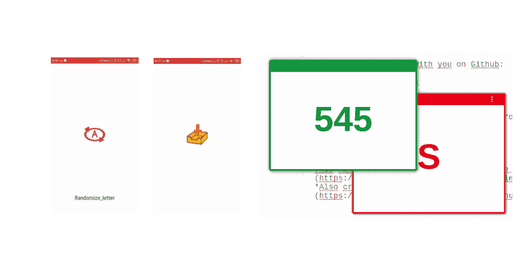

# PWA 和离线缓存

> 原文：<https://dev.to/thomasbnt/pwa-and-offline-cache-4em9>

在一天结束以及一个美好的夜晚，我想回到实践中与 **PWA** 和缓存管理器一起为**离线模式**以便**即使没有互联网连接也能提供网页服务**。

我研究了一下，在阅读了谷歌的进步网络应用程序并调整了一些脚本使其工作后，我成功地整合了它。

所以我在 Github 上和你分享了这一切:

*   渐进式网络应用
*   服务人员
*   离线模式
*   随机字母
*   在您的设备上安装(Chrome 上的计算机，所有装有 Firefox 或 Chrome 的智能手机)

> 从 Chrome 73 开始，所有桌面平台都支持渐进式网络应用，包括 Chrome OS、Linux、Mac 和 Windows。[链接到帖子](https://developers.google.com/web/progressive-web-apps/desktop)

[](https://res.cloudinary.com/practicaldev/image/fetch/s--OORT-D6C--/c_limit%2Cf_auto%2Cfl_progressive%2Cq_auto%2Cw_880/https://thepracticaldev.s3.amazonaws.com/i/lnsg7pmncnc0azhcxt4e.png)

这个项目的名字命名为 [Randomize_letter](https://github.com/thomasbnt/Randomize_letter) 。
的*也在这里创造了[号的版本](https://github.com/thomasbnt/Randomize_number)。*

## /[随机化 _ 字母](https://github.com/thomasbnt/Randomize_letter)

### 这只是一个字母随机发生器。

<article class="markdown-body entry-content container-lg" itemprop="text">

[](https://thomasbnt.fr/discord)[](https://www.buymeacoffee.com/thomasbnt)[](https://twitter.com/Thomasbnt_)

## 一.整合

> 它只是一个字母随机发生器。

```
function Load() {
    let l = "ABCDEFGHIJKLMNOPQRSTUVWXYZ"
    const out = l.charAt(Math.floor(Math.random() * l.length)) // Randomize !
    document.getElementById('random').textContent = out // Get ID 'random' for edit the text context
    document.title = out // Edit the title of page
}
```

<svg width="20px" height="20px" viewBox="0 0 24 24" class="highlight-action crayons-icon highlight-action--fullscreen-on"><title>Enter fullscreen mode</title></svg> <svg width="20px" height="20px" viewBox="0 0 24 24" class="highlight-action crayons-icon highlight-action--fullscreen-off"><title>Exit fullscreen mode</title></svg>

[](https://github.com/thomasbnt/Randomize_letterassets/img/manifest/192x192.png)

**Randomize_letter** 是一个简单的脚本，带有 PWA ( [Manifest](https://github.com/thomasbnt/Randomize_lettermanifest.json) 和 [init.js 用于安装 SW](https://github.com/thomasbnt/Randomize_letterassets/js/init.js) )和 [Service Worker](https://github.com/thomasbnt/Randomize_lettersw.js) 。

## 二.捐款

随时欢迎投稿！在参与之前，请阅读投稿规则。

请确保您的提取请求符合以下准则:

*   按字母顺序排列你的条目。
*   在提出新的建议之前，寻找以前的建议，因为你的建议可能是重复的。
*   建议的自述文件应该美观或者在某些方面突出。
*   制作…

</article>

[View on GitHub](https://github.com/thomasbnt/Randomize_letter)

我真的很喜欢 PWA 及其功能，因为你现在可以在智能手机上创建一个原生应用程序，而不必更新 Android/IOS 和 Web 端代码。