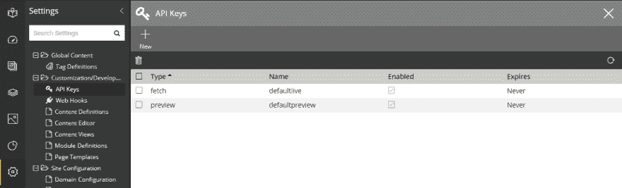
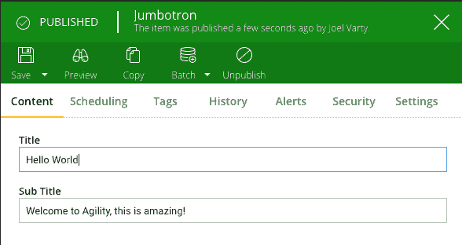

# 使用 Gatsby 和 Agility CMS

> 原文：<https://dev.to/joelvarty/using-gatsby-with-agility-cms-ojm>

Gatsby 是一个令人惊奇的静态站点生成框架。建立在 [React.js](https://reactjs.org) 之上，已经有几年的历史了，它是可靠的。

最近我的同事 [James Vidler](https://github.com/jamesvidler) 为 [Agility CMS](https://agilitycms.com) 写了一个 [Gatsby 源码插件](https://github.com/agility/gatsby-source-agilitycms)。它允许您使用 Gatsby 构建站点，内容直接来自 Agility 的无头内容 APIs 包括动态页面路由。

我们来看看吧！

### 创建免费敏捷账户

创建一个 Agility CMS 账户只需要一分钟，而且永远免费。[在这里报名](https://account.agilitycms.com/sign-up?product=agility-free)。

一旦创建了您的帐户，我们将需要获取您的 GUID 和 API 密钥。

### 获取代码

确保您安装了 Gatsby CLI 工具(我们这里使用的是 npm...)

```
npm install -g gatsby-cli 
```

<svg width="20px" height="20px" viewBox="0 0 24 24" class="highlight-action crayons-icon highlight-action--fullscreen-on"><title>Enter fullscreen mode</title></svg> <svg width="20px" height="20px" viewBox="0 0 24 24" class="highlight-action crayons-icon highlight-action--fullscreen-off"><title>Exit fullscreen mode</title></svg>

继续从 GitHub 上克隆 starter repo，它包含了您开始工作所需的所有代码。

```
git clone https://github.com/agility/agility-gatsby-starter.git 
```

<svg width="20px" height="20px" viewBox="0 0 24 24" class="highlight-action crayons-icon highlight-action--fullscreen-on"><title>Enter fullscreen mode</title></svg> <svg width="20px" height="20px" viewBox="0 0 24 24" class="highlight-action crayons-icon highlight-action--fullscreen-off"><title>Exit fullscreen mode</title></svg>

解决任何依赖关系

```
npm install 
```

<svg width="20px" height="20px" viewBox="0 0 24 24" class="highlight-action crayons-icon highlight-action--fullscreen-on"><title>Enter fullscreen mode</title></svg> <svg width="20px" height="20px" viewBox="0 0 24 24" class="highlight-action crayons-icon highlight-action--fullscreen-off"><title>Exit fullscreen mode</title></svg>

在开发模式下运行它！

```
gatsby develop 
```

<svg width="20px" height="20px" viewBox="0 0 24 24" class="highlight-action crayons-icon highlight-action--fullscreen-on"><title>Enter fullscreen mode</title></svg> <svg width="20px" height="20px" viewBox="0 0 24 24" class="highlight-action crayons-icon highlight-action--fullscreen-off"><title>Exit fullscreen mode</title></svg>

该网站只是一个开端，但它有一堆有趣的功能，你可以用来建立。让我们将这段代码挂接到您刚刚创建的新 Agility CMS 实例上。

## 将其连接到您的 Agility CMS 实例

编辑 **gatsby-config.js** 文件，用你的替换 *guid* 和 *apiKey* 。

你可以通过导航到设置，然后点击 API 键来找到你的 API 键。

[](https://res.cloudinary.com/practicaldev/image/fetch/s--TRSv6Yhu--/c_limit%2Cf_auto%2Cfl_progressive%2Cq_auto%2Cw_880/https://help.agilitycms.com/hc/article_attachments/360035503851/mceclip0.png)

如果你使用“预览”键，你不需要发布就能看到你所做的修改。如果您使用“获取”键，请确保您已经发布了任何您希望看到更改的内容。

## 它是如何工作的

Gatsby 源代码插件下载 Agility CMS 站点地图上的所有页面，以及 gatsby-config.js 文件的 *sharedContent* 属性上引用的任何共享内容。

然后，所有这些页面和内容都可以在 GraphQL 中提供给 React 组件，您将编写这些组件来呈现这些页面。

查看用于呈现超大屏幕模块的超大屏幕组件。这是在敏捷内容管理器中:

[](https://res.cloudinary.com/practicaldev/image/fetch/s--OQKoH_Nv--/c_limit%2Cf_auto%2Cfl_progressive%2Cq_auto%2Cw_880/https://thepracticaldev.s3.amazonaws.com/i/mjv2brybc17iyqdoy25u.png)

这是用来渲染它的代码。注意，*标题*和*副标题*字段可作为*项目.字段*对象的属性。

```
import React, { Component } from 'react';
import { graphql, StaticQuery } from "gatsby"

import './Jumbotron.css'

export default class Jumbotron extends Component {
    render() {    
        return (
            <section className="jumbotron">
                <h1>{this.props.item.fields.title}</h1>
                <h2>{this.props.item.fields.subTitle}</h2>
            </section>
        );
    }
} 
```

<svg width="20px" height="20px" viewBox="0 0 24 24" class="highlight-action crayons-icon highlight-action--fullscreen-on"><title>Enter fullscreen mode</title></svg> <svg width="20px" height="20px" viewBox="0 0 24 24" class="highlight-action crayons-icon highlight-action--fullscreen-off"><title>Exit fullscreen mode</title></svg>

当我们向 Agility 添加新的模块和内容定义时，我们用来呈现这些模块的组件将自动获得作为道具交付给这些模块的强类型数据。

太棒了。

...

这只是与盖茨比和敏捷 CMS 合作的冰山一角。

请在下面的评论中告诉我你的想法！