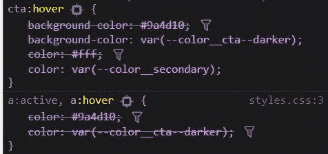

# CSS 预设环境:CSS 的巴别塔

> 原文：<https://dev.to/adrianbdesigns/postcss-preset-env-babel-for-css-12hp>

在过去的一年半时间里，在所有用于编写 CSS 的工具(或风格)中，PostCSS 是我个人最喜欢的。设置真的很简单，它有大量非常有用的插件，而且性能很好。我最喜欢的一个插件绝对是`postcss-preset-env`。

## 什么是 postcss-preset-env？

基本上，它是 CSS 的通天塔。它允许开发人员使用现代和未来的语法编写 CSS，并将代码转换为 CSS，这得到了大多数浏览器的广泛支持。听起来很简单，对吧？

例如，这允许开发人员在他们的常规 CSS 代码中使用 CSS 变量。根据配置的不同，`postcss-preset-env`在 CSS 变量旁边包含常规值，作为不支持 CSS 变量的浏览器的后备。

**代号**

```
.cta:hover {
  background-color: var(--color__cta--darker);
  color: var(--color__secondary);
} 
```

<svg width="20px" height="20px" viewBox="0 0 24 24" class="highlight-action crayons-icon highlight-action--fullscreen-on"><title>Enter fullscreen mode</title></svg> <svg width="20px" height="20px" viewBox="0 0 24 24" class="highlight-action crayons-icon highlight-action--fullscreen-off"><title>Exit fullscreen mode</title></svg>

**成绩**
[](https://res.cloudinary.com/practicaldev/image/fetch/s--8f4_85a---/c_limit%2Cf_auto%2Cfl_progressive%2Cq_auto%2Cw_880/https://thepracticaldev.s3.amazonaws.com/i/u68aqybwbyc3ux5ncl6n.JPG)

## 安装

1.  使用 npm 安装它:`npm install postcss-preset-env --save-dev`
2.  把它添加到你的 postcss 插件配置文件:gulp，webpack，PostCSS 配置文件等。例如，在`postcss.config.js`中，我们可以这样包含它:

```
module.exports = {
  plugins: {
    "postcss-preset-env": { /* Options */ },
  }
} 
```

<svg width="20px" height="20px" viewBox="0 0 24 24" class="highlight-action crayons-icon highlight-action--fullscreen-on"><title>Enter fullscreen mode</title></svg> <svg width="20px" height="20px" viewBox="0 0 24 24" class="highlight-action crayons-icon highlight-action--fullscreen-off"><title>Exit fullscreen mode</title></svg>

在默认配置下，`postcss-preset-env`使用 Stage 2 CSS 特性(我们将在后面解释)并面向所有浏览器(如果项目中没有设置`browsers`选项)。

## 基本配置

我只想介绍最常用和最重要的配置选项，它们是**阶段**、**特性**和**浏览器**。您可以在[文档](https://www.npmjs.com/package/postcss-preset-env)中查看所有选项的列表。

### 阶段

这类似于巴别塔中使用的 ECMAScript 提议。这些阶段代表了 CSS 中的每个特性(或提议)成为 CSS 标准的一部分所必须经历的步骤。它包括以下几个阶段:

*   阶段 0:抱负-一个想法或早期草案。非常不稳定且易变
*   第一阶段:实验性的——也非常不稳定，并且可能会发生变化，但是该提案得到了 W3C 成员的认可。
*   第二阶段:可允许的——也非常不稳定，可能会发生变化，但它正在积极地工作。
*   第三阶段:拥抱-稳定且变化不大。这个特性很可能会成为一个标准。
*   阶段 4:标准化-最终工作解决方案。所有主流浏览器都支持。

通过设置一个`stage`选项，我们选择了*组 CSS 特性*，我们可以在编写 CSS 时使用这些特性:

```
 "postcss-preset-env": {
      stage: 3
    } 
```

<svg width="20px" height="20px" viewBox="0 0 24 24" class="highlight-action crayons-icon highlight-action--fullscreen-on"><title>Enter fullscreen mode</title></svg> <svg width="20px" height="20px" viewBox="0 0 24 24" class="highlight-action crayons-icon highlight-action--fullscreen-off"><title>Exit fullscreen mode</title></svg>

用于跟踪哪些 CSS 功能处于哪个阶段的有用链接:

*   [https://cssdb.org/](https://cssdb.org/)
*   [https://preset-env.cssdb.org/features](https://preset-env.cssdb.org/features)

## 特性

我们可以使用`feature`配置来仅启用特定的 CSS 特性，而不管已经设置了哪个`stage`选项。

所有的特征变量都可以在这里找到:[https://preset-env.cssdb.org/features](https://preset-env.cssdb.org/features)

在下面的例子中，我们使用所有的`stage 3+`特征，并且我们包括`nesting-rules`特征，它是**阶段 1** 特征。

```
 "postcss-preset-env": {
      stage: 3,
      features: {
        "nesting-rules": true
      }
    } 
```

<svg width="20px" height="20px" viewBox="0 0 24 24" class="highlight-action crayons-icon highlight-action--fullscreen-on"><title>Enter fullscreen mode</title></svg> <svg width="20px" height="20px" viewBox="0 0 24 24" class="highlight-action crayons-icon highlight-action--fullscreen-off"><title>Exit fullscreen mode</title></svg>

## 浏览器

这是一个标准的浏览器列表配置，被各种工具和插件使用，比如 Autoprefixer。

在下面的例子中，我们只针对浏览器的最后两个版本。

```
 "postcss-preset-env": {
      browsers: "last 2 versions",
      stage: 3,
      features: {
        "nesting-rules": true
      }
    } 
```

<svg width="20px" height="20px" viewBox="0 0 24 24" class="highlight-action crayons-icon highlight-action--fullscreen-on"><title>Enter fullscreen mode</title></svg> <svg width="20px" height="20px" viewBox="0 0 24 24" class="highlight-action crayons-icon highlight-action--fullscreen-off"><title>Exit fullscreen mode</title></svg>

## 完整配置和文档

这几个选项足以让您开始使用`postcss-preset-env`并编写现代 CSS 语法，将其转换成广泛支持的 CSS 语法。有关配置选项和特性的完整列表，您可以查看以下链接

*   [https://github.com/csstools/postcss-preset-env](https://github.com/csstools/postcss-preset-env)
*   [https://preset-env.cssdb.org/](https://preset-env.cssdb.org/)

* * *

感谢你花时间阅读这篇文章。如果你觉得这很有用，请给它一个❤️或🦄，分享评论。