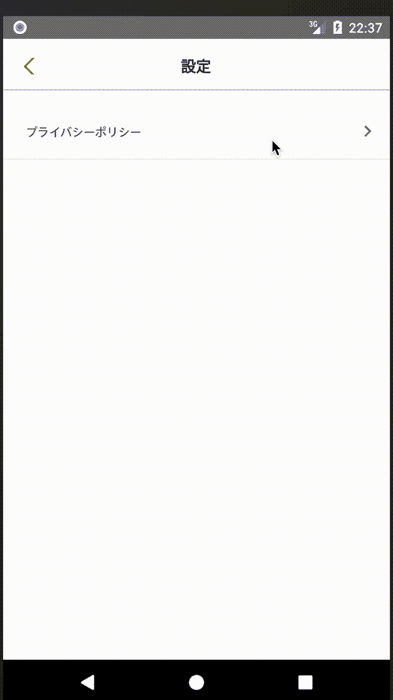

# 通过 React Native + React 导航在 Android/iOS 上使用相同的屏幕导航动画

> 原文：<https://dev.to/acro5piano/use-the-same-screen-navigation-animation-both-on-android-ios-with-react-native-react-navigation-eng>

React Navigation 在 Android 上的默认屏幕导航看起来很奇怪，因为即使“向左滑动”关闭模态，它也会创建模态:

[](https://res.cloudinary.com/practicaldev/image/fetch/s--vkL-iNti--/c_limit%2Cf_auto%2Cfl_progressive%2Cq_66%2Cw_880/https://qiita-image-store.s3.ap-northeast-1.amazonaws.com/0/103885/406ca584-ef13-da52-2c9d-524b3d5eba86.gif)

我希望动画在 iOS 上以同样的方式从左向右滑动:

[](https://res.cloudinary.com/practicaldev/image/fetch/s--_MxZGnaH--/c_limit%2Cf_auto%2Cfl_progressive%2Cq_66%2Cw_880/https://qiita-image-store.s3.ap-northeast-1.amazonaws.com/0/103885/f28b8fe8-35a4-11a7-194a-62a7c60ffbe9.gif)

解决方法很简单:

```
import {
  createAppContainer,
  createStackNavigator,
  StackViewTransitionConfigs,
} from 'react-navigation'

const Navigation = createStackNavigator({
  screenA: ComponentA,
  screenB: ComponentB,
}, {
  mode: 'card',
  transitionConfig: () => StackViewTransitionConfigs.SlideFromRightIOS,
}

export const AppNavigation = createAppContainer(Navigation) 
```

<svg width="20px" height="20px" viewBox="0 0 24 24" class="highlight-action crayons-icon highlight-action--fullscreen-on"><title>Enter fullscreen mode</title></svg> <svg width="20px" height="20px" viewBox="0 0 24 24" class="highlight-action crayons-icon highlight-action--fullscreen-off"><title>Exit fullscreen mode</title></svg>

我想知道为什么这是默认行为...

# Ref

[https://stack overflow . com/questions/48018666/how-to-change-the-direction-of-animation-in-stack navigator](https://stackoverflow.com/questions/48018666/how-to-change-the-direction-of-the-animation-in-stacknavigator)