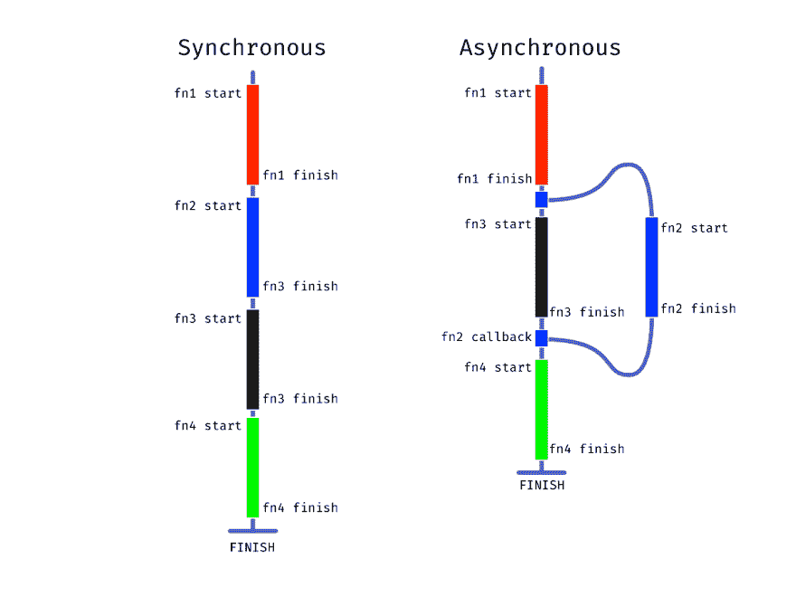

# 现代 Javascript 技术

> 原文：<https://dev.to/irmerk/modern-javascript-techniques-4chc>

## 干净且可扩展的语法追求纯粹性

作为一门非常复杂且适应性很强的语言， *[JavaScript](https://developer.mozilla.org/en-US/docs/Web/JavaScript)* 拥有许多每年都在增长的优势。难怪这种语言和社区如此受欢迎，因为它在将用户界面交互性和响应性 web 设计引入互联网方面发挥了巨大作用。虽然有时很复杂，但这种语言被证明很容易掌握和开始，并且通过在客户端执行，允许更快的用户体验。

很长一段时间，JavaScript 被视为有问题和有缺陷的。这从来都不是语言的问题，而是它运行的平台:浏览器。这个生态系统是有缺陷的，因为有如此多的分支派别——最明显的是微软的介入，把一切都搞砸了。在这一时期，Mozilla 一直是理性的声音，但直到 Chrome 获得了足够的市场份额，才激励人们围绕引擎应该如何外观和构造的标准进行重新调整。用*设置标准 [V8](https://v8.dev/)* 就是 *[Node.js](https://nodejs.org/en/)* 随后如何构建的。作为一种具有服务器端执行支持的完整编程语言，JavaScript 现在支持现代 web 应用程序，并在整个技术堆栈中扩展。

### 走近

[](https://res.cloudinary.com/practicaldev/image/fetch/s--bcCx-IZx--/c_limit%2Cf_auto%2Cfl_progressive%2Cq_auto%2Cw_880/https://thepracticaldev.s3.amazonaws.com/i/vfvvmu7kmqvepby5mch2.png)

我作为智能法律合同开源项目 *[Accord 项目](https://www.accordproject.org/)* 的维护者和全栈工程师的经历向我展示了可以实现 JavaScript 的强大应用。此外，我变得非常热衷于学习和采用更好、更有效的语言实践。我将分享这一点，作为对他人有益的参考，也作为我自己未来的历史参考。我希望在随后更深入的文章中扩展这个话题。

我们在 Accord 项目中的大部分工作都是用 JavaScript 编写的，还混合了一些特定领域的语言。为了构建一个可靠的技术堆栈，允许智能合同的稳定性和效率，Accord 项目依赖于 JavaScript，以及 *[OCaml](https://ocaml.org/)* 和 *[Ergo](https://www.accordproject.org/projects/ergo)* 。JavaScript 提供了最好的工具集，可以在各种各样的用例及环境中处理这个问题。我们选择 JavaScript 是因为它的适用性、库的多样性和易用性。这种语言的语法既有表现力又很简单。

Accord 项目核心代码库包含超过 25 万行代码。连同我们的模板库和 UI 组件，有将近一百万个。

## 概述:

→ [进场](#approach)
→ [基础](#fundamentals)→[工作流程](#workflow)
→ [操作](#operations)
→ [功能](#functions)
→ [异步](#async)
→ [功能编程](#functional)
→ [结论](#conclusion)
→ [资源](#resources)

* * *

### 基本面

#### 易于理解

文档代码。可读性对于编程来说是至关重要的，因为是人类需要解释代码来进行协作。与通过用单个字母命名变量来节省一些额外的字符相比，足够冗长以便在以后的某一天或对另一个人来说是更好的做法。此外，注释和文档——比如 *[JSDocs](https://devdocs.io/jsdoc/about-getting-started)* 格式——对于构建可与团队或其他人共享的可访问代码非常有用。

乍一看，这似乎是多余的，但是尽可能好地注释代码将允许在几个月后当您回到一个项目或与同事合作时，通过这个内置的文档轻松刷新。

#### Globals

避免全局范围内的变量。避免在全局范围内使用变量有多种原因。由于函数执行会导致 JavaScript 从 in 到 out 搜索范围变化，直到找到全局对象，因此性能会降低。此外，这也存在安全缺陷，因为在全局空间中定义函数时，可以通过浏览器调用这些函数。这一点将在功能编程[章节](#functional)中再次出现。

#### 变量

停止使用`var`。范围行为是不一致和混乱的，这可能会导致错误。ES6 带来了`const`和`let`。严格使用`const`，如果不可行，只使用`let`。有更多的限制，const 是不可重赋值的，但也不是完全不可变的。该变量将具有对同一对象或原始值的不变引用，但是该变量持有的值不是不可变的。尽管如此，这将是前进的最佳实践。

#### 命名

有点跑题了，但是程序员可以在命名约定上花费 10 倍的精力，却努力让自己的语言具有包容性。

花些时间来描述和适当的易读性和全面的可读性将会在代码的未来创造奇迹。

这对那些希望教育他人的人来说尤其重要；变量名应该有助于解释和给出代码中发生的事情的上下文。刚接触这段代码的人应该能够对正在发生的事情有一个大致的了解。用动词！布尔变量的例子可以从`is...`开始，函数的例子可以是动作动词。

这里可以找到很好的参考资料: *[一个基于语法的命名约定](https://dev.to/somedood/a-grammar-based-naming-convention-13jf)*

* * *

### 工作流程

可维护性的一个主要关键是将逻辑保持在正确的位置，而不是杂乱无章。项目或代码库的构建方式会对理解和遵循的难易程度产生很大影响。

#### 导入订单

从粒度级别开始，导入不同模块的顺序可以通过一个可预测的模式来减少混乱。你所使用的特定结构没有有*某种*结构:
重要

```
/* Packages */
import React, { useState } from 'react';
import PropTypes from 'prop-types';
import * as R from 'ramda';

/* Styled Components */
import * as SC from './styles';

/* Components */
import Navigation from './Navigation';

/* Actions */
import * as ACT from './actions';

/* Utilities */
import { navigateToClause } from '../utilities'; 
```

<svg width="20px" height="20px" viewBox="0 0 24 24" class="highlight-action crayons-icon highlight-action--fullscreen-on"><title>Enter fullscreen mode</title></svg> <svg width="20px" height="20px" viewBox="0 0 24 24" class="highlight-action crayons-icon highlight-action--fullscreen-off"><title>Exit fullscreen mode</title></svg>

#### 模块化

要记住的一个目标是保持包、模块、函数和范围较小。在实践中，可重用性和链接变得更加容易。相似的功能或具有许多步骤的功能可以归入一个模块或类中。尽量保持功能简单，逐步执行复杂的过程。

一旦一个文件增长到 300-400 行代码以上，就很有可能变得过于混乱和不可维护。在这一点上，通过创建新的模块和文件夹来分解进程可以获得很多好处。将项目想象成一棵有许多分支的树，而不是堆积如山的代码。

*[ESLint](https://eslint.org/)* 在这里是一个很好的帮助工具。目标是让文件的深度少于四到五个凹痕。这使得代码专门化，并鼓励清理死代码。做一个小程序的几个函数比做几件事的一个函数更有用。大函数只能以这种方式使用，而小函数可以在一个项目的多个过程中使用。公开这些较小的辅助函数会在项目中创建一个健壮的 API 库。

伟大的代码可以在不重写一切的情况下得到改进。

#### 隔离代码

一个函数*应该*有一个目的，不做多个动作。那个目的*应该是*而不是副作用，但是我们会在函数式编程[部分](#functional)回到这个话题

一个人为的例子是封装条件:

```
// NO:
if (props.contract.errors === [] && isEmpty(parseErrors)) {
  // ... code
}

// YES:
const errorsExist = (props, parseErrors) => props.contract.errors === [] && isEmpty(parseErrors);

if (errorsExist(contractProps, parseErrors)) {
  // ... code
} 
```

<svg width="20px" height="20px" viewBox="0 0 24 24" class="highlight-action crayons-icon highlight-action--fullscreen-on"><title>Enter fullscreen mode</title></svg> <svg width="20px" height="20px" viewBox="0 0 24 24" class="highlight-action crayons-icon highlight-action--fullscreen-off"><title>Exit fullscreen mode</title></svg>

#### 守护条款

构造具有导致错误或空结果的边缘情况的函数的一个好方法是尽早检查这些无效结果。如果这个条件没有被满足或者有一个无效的用例，那么大部分的计算就被阻止了，因为我们已经知道了结果。这就是所谓的 *[保镖模式](http://rikschennink.nl/thoughts/the-bouncer-pattern/)* 或 *[护卫条款](https://dev.to/lanecwagner/guard-clauses-how-to-clean-up-conditionals-2fdm)* :

```
const parseContract = (contract) => {
  // Does a contract exist
  if (!contract) return "Error, no contract!";

  // Are there already parsed errors
  if (contract.currentErrors.length > 0) return contract.currentErrors;

  // Parse the contract
  return contract.clauses.map((clause) => doSomething(clause));
} 
```

<svg width="20px" height="20px" viewBox="0 0 24 24" class="highlight-action crayons-icon highlight-action--fullscreen-on"><title>Enter fullscreen mode</title></svg> <svg width="20px" height="20px" viewBox="0 0 24 24" class="highlight-action crayons-icon highlight-action--fullscreen-off"><title>Exit fullscreen mode</title></svg>

这不仅会优化代码，还会鼓励以一种考虑处理边缘情况的方式来思考函数和过程。

#### 漂亮些+林挺

我这篇文章的主题是代码应该易于阅读和理解。随之而来的是一致的风格和结构。棉绒——任何棉绒——都会非常有用。ESLint 是一个 linter，将识别代码正确性的问题，比如使用`var`的警告。 *[更漂亮](https://prettier.io/)* 是一个格式化程序，它将识别一致性和一致性问题，并自动对齐括号，例如。鼓励两者结合使用。

*[StandardJS](https://standardjs.com/)* 和 ESLint 的 *[预定义配置](https://github.com/feross/eslint-config-standard)* 如果你需要一个好的起点，是林挺规则很好的来源。

* * *

### 作战

#### 解构

通过保持变量简短并在早期从对象中取出，析构可以帮助节省大量的输入和代码行。与 *[ECMAScript 6](https://www.w3schools.com/js/js_es6.asp)* 一起引入，这允许从任何对象或模块访问特定字段，并立即将其赋给变量。

对象:

```
// NO
const generateText = contract => {
 const clauses = contract.body.clauses;
 const text = contract.body.text;
 const errors = contract.errors;

 Cicero.parseContract( clauses, text )
};

// YES
const generateText = contract => {
 const { body: { clauses, text }, errors }, = contract;

 Cicero.parseContract( clauses, text )
}; 
```

<svg width="20px" height="20px" viewBox="0 0 24 24" class="highlight-action crayons-icon highlight-action--fullscreen-on"><title>Enter fullscreen mode</title></svg> <svg width="20px" height="20px" viewBox="0 0 24 24" class="highlight-action crayons-icon highlight-action--fullscreen-off"><title>Exit fullscreen mode</title></svg>

数组(跳过的元素由`, ,` ):

```
// NO
const lettersArray = [ "A", "B", "C", "D", "E", "F" ];
const firstLetter = lettersArray[0]; // "A"
const thirdLetter = lettersArray[2]; // "C"

// YES
const [ firstLetter, , thirdLetter, ...remaining ] = lettersArray; // remaining = [ "D", "E", "F" ] 
```

<svg width="20px" height="20px" viewBox="0 0 24 24" class="highlight-action crayons-icon highlight-action--fullscreen-on"><title>Enter fullscreen mode</title></svg> <svg width="20px" height="20px" viewBox="0 0 24 24" class="highlight-action crayons-icon highlight-action--fullscreen-off"><title>Exit fullscreen mode</title></svg>

功能(类似于对象):

```
// NO
const generateText = (contract) => {
  if(contract.errors) return "Errors exist!"
  if(!contract.clauses) return "No clauses exist!"
}

// YES
const generateText = ({ errors = null, clauses = null }) => {
  if(errors) return "Errors exist!"
  if(!clauses) return "No clauses exist!"
} 
```

<svg width="20px" height="20px" viewBox="0 0 24 24" class="highlight-action crayons-icon highlight-action--fullscreen-on"><title>Enter fullscreen mode</title></svg> <svg width="20px" height="20px" viewBox="0 0 24 24" class="highlight-action crayons-icon highlight-action--fullscreen-off"><title>Exit fullscreen mode</title></svg>

#### 默认值

当进行析构时，可以为参数分配默认值。这也可以向用户表明可以传入什么值或者需要什么值。

```
const generateText = ({
    name = "Stock Contract",
    language = "English",
    text = "No text exists yet!",
    errors = [],
    clauses = [],
}) => { Cicero.parseContract( clauses, text ) } 
```

<svg width="20px" height="20px" viewBox="0 0 24 24" class="highlight-action crayons-icon highlight-action--fullscreen-on"><title>Enter fullscreen mode</title></svg> <svg width="20px" height="20px" viewBox="0 0 24 24" class="highlight-action crayons-icon highlight-action--fullscreen-off"><title>Exit fullscreen mode</title></svg>

如果在值没有被传递时不应该抛出错误，那么默认值可能是有用的。

#### 三元

该运算符的工作方式类似于 *[逻辑运算符](https://developer.mozilla.org/en-US/docs/Web/JavaScript/Reference/Operators/Logical_Operators)* 和`if...else`语句，有三个部分:

1.  布尔条件
2.  真实情况下的返回值
3.  falsy 情况下的返回值

```
// condition ? truthyResult : falsyResult
const errorArrayLength = errors => ( errorsExist(errors) ? errors.length : 'No' ); 
```

<svg width="20px" height="20px" viewBox="0 0 24 24" class="highlight-action crayons-icon highlight-action--fullscreen-on"><title>Enter fullscreen mode</title></svg> <svg width="20px" height="20px" viewBox="0 0 24 24" class="highlight-action crayons-icon highlight-action--fullscreen-off"><title>Exit fullscreen mode</title></svg>

试着避开负面条件句——检查某事是否存在，而不是它是否不存在。

#### 传播开来

另一种形式的对象析构，spread 操作符允许从数据中提取值，而不必显式地迭代数据。这在 *[Redux](https://redux.js.org/)* 和函数式编程中很常见，因为这是一种添加对象而不改变它的捷径——通过扩展旧对象并向其添加新值来复制旧对象。

```
const firstHalf = [ "A", "B", "C" ];
const secondHalf = [ "D", "E", "F" ]; 

const lettersArray = [ ...firstHalf, ...secondHalf ];
// lettersArray = [ "A", "B", "C", "D", "E", "F" ]; 
```

<svg width="20px" height="20px" viewBox="0 0 24 24" class="highlight-action crayons-icon highlight-action--fullscreen-on"><title>Enter fullscreen mode</title></svg> <svg width="20px" height="20px" viewBox="0 0 24 24" class="highlight-action crayons-icon highlight-action--fullscreen-off"><title>Exit fullscreen mode</title></svg>

```
const contract = {
    text = "No text exists yet!",
    errors = []
};

const contractWithClauses = {
    ...contract,
    clauses = []
}; 
```

<svg width="20px" height="20px" viewBox="0 0 24 24" class="highlight-action crayons-icon highlight-action--fullscreen-on"><title>Enter fullscreen mode</title></svg> <svg width="20px" height="20px" viewBox="0 0 24 24" class="highlight-action crayons-icon highlight-action--fullscreen-off"><title>Exit fullscreen mode</title></svg>

#### 模板文字

这个特性允许将动态内容嵌入到字符串中，并编写连接多行的字符串。这些用反引号和模板文字片段(`${}`)指定。

```
// NO
var contractTitle = ("Contract Name: " + contract.name + ", Errors: " + contract.errors.length + ".")

// YES
const contractTitle = `Contract Name: ${contract.name}, Errors: ${contract.errors.length}.`

// OTHER USES
const conditionalTitle = `${contractExist() ? ('Contract Name: ' + contract.name) : 'No contract exists.'}`
const multipleLines = `Hello,

Good to meet you` 
```

<svg width="20px" height="20px" viewBox="0 0 24 24" class="highlight-action crayons-icon highlight-action--fullscreen-on"><title>Enter fullscreen mode</title></svg> <svg width="20px" height="20px" viewBox="0 0 24 24" class="highlight-action crayons-icon highlight-action--fullscreen-off"><title>Exit fullscreen mode</title></svg>

* * *

### 功能

#### 限制范围

函数*应该*做一件事。一旦他们开始执行多个动作，就很难测试和推理。目标是在函数中不要有一个以上的抽象层次——如果必要的话，将函数拆分。

```
// NO
const parseContract = contract => {
    contract.forEach(contract => {
        const contractText = generateText(contract);
        if (contractText.noErrors()) {
            execute(contract);
        };
    });
};

// YES
const isContractValid = contract => {
    const contractText = generateText(contract);
    return contractText.noErrors();
};

const parseContract = contracts => contracts.filter(isContractValid).forEach(execute); 
```

<svg width="20px" height="20px" viewBox="0 0 24 24" class="highlight-action crayons-icon highlight-action--fullscreen-on"><title>Enter fullscreen mode</title></svg> <svg width="20px" height="20px" viewBox="0 0 24 24" class="highlight-action crayons-icon highlight-action--fullscreen-off"><title>Exit fullscreen mode</title></svg>

#### 箭头

这种新的函数语法为符号提供了简明清晰的流程。通过从定义函数的作用域中继承`this`,这些函数还有更实际的作用域行为。

以前，函数可以写成:

```
function someFunction(input) {
 // ... code
} 
```

<svg width="20px" height="20px" viewBox="0 0 24 24" class="highlight-action crayons-icon highlight-action--fullscreen-on"><title>Enter fullscreen mode</title></svg> <svg width="20px" height="20px" viewBox="0 0 24 24" class="highlight-action crayons-icon highlight-action--fullscreen-off"><title>Exit fullscreen mode</title></svg>

现在我们把同样的东西定义为:

```
const someFunction = input => {
 // ... code
} 
```

<svg width="20px" height="20px" viewBox="0 0 24 24" class="highlight-action crayons-icon highlight-action--fullscreen-on"><title>Enter fullscreen mode</title></svg> <svg width="20px" height="20px" viewBox="0 0 24 24" class="highlight-action crayons-icon highlight-action--fullscreen-off"><title>Exit fullscreen mode</title></svg>

如果函数只是返回简单的东西，我们可以用一行隐式的`return`语句:
来写

```
const add = (a, b) => a + b;
const createObject = (a, b) => ({ a, b }); 
```

<svg width="20px" height="20px" viewBox="0 0 24 24" class="highlight-action crayons-icon highlight-action--fullscreen-on"><title>Enter fullscreen mode</title></svg> <svg width="20px" height="20px" viewBox="0 0 24 24" class="highlight-action crayons-icon highlight-action--fullscreen-off"><title>Exit fullscreen mode</title></svg>

#### 参数

旨在限制传递给函数的参数数量，以提高可测试性。理想情况下，这将低于 3。通常，如果有三个或更多的参数，该函数可能试图自己做很多事情，应该拆分和合并。

#### 链接

当前令人沮丧的一个原因是无法方便地访问对象中的嵌套值。类似这样的东西目前可能正在使用:

```
if(contract && contract.firstProp && contract.firstProp.secondProp && contract.firstProp.secondProp.thirdProp && contract.firstProp.secondProp.thirdProp.fourthProp.data) execute(contract.firstProp.secondProp.thirdProp.fourthProp.data) 
```

<svg width="20px" height="20px" viewBox="0 0 24 24" class="highlight-action crayons-icon highlight-action--fullscreen-on"><title>Enter fullscreen mode</title></svg> <svg width="20px" height="20px" viewBox="0 0 24 24" class="highlight-action crayons-icon highlight-action--fullscreen-off"><title>Exit fullscreen mode</title></svg>

可怕的。

这样做的原因是，如果您直接进入最后一行，您可能会遇到这种错误:

```
TypeError: Cannot read property ‘fourthProp’ of undefined 
```

<svg width="20px" height="20px" viewBox="0 0 24 24" class="highlight-action crayons-icon highlight-action--fullscreen-on"><title>Enter fullscreen mode</title></svg> <svg width="20px" height="20px" viewBox="0 0 24 24" class="highlight-action crayons-icon highlight-action--fullscreen-off"><title>Exit fullscreen mode</title></svg>

TC39(决定哪些特性成为 JavaScript 标准的一部分的技术委员会)已经将 *[可选链接提议](https://github.com/tc39/proposal-optional-chaining)* 移到了接受的后期阶段。

我真的很期待，因为它会让上面的代码看起来像这样:

```
const data = contract?.firstProp?.secondProp?.thirdProp?.fourthProp?.data
if(data) execute(data) 
```

<svg width="20px" height="20px" viewBox="0 0 24 24" class="highlight-action crayons-icon highlight-action--fullscreen-on"><title>Enter fullscreen mode</title></svg> <svg width="20px" height="20px" viewBox="0 0 24 24" class="highlight-action crayons-icon highlight-action--fullscreen-off"><title>Exit fullscreen mode</title></svg>

如果任何属性不存在，挖掘退出并返回`undefined`。

另一个当前的解决方案是 *[Ramda](https://ramdajs.com/)* ，它使用一个名为`path`的函数在运行时安全地执行代码，并且不会在控制台中遇到`undefined`错误。

* * *

### 异步

我之前已经写过关于 *[与](https://dev.to/irmerk/asynchronous-with-redux-sagas-44dm)* 的异步，但是将会更加关注`async` / `await`并承诺这一点。

异步仅仅意味着事情的发生独立于主程序流；电脑就是这样设计的。处理器不会暂停以等待副作用发生来恢复操作。JavaScript 默认是同步的，单线程的；代码不能并行运行。然而，JavaScript 是为响应用户动作而设计的，本质上是异步的。JavaScript 所在的浏览器提供了一组处理该功能的 API。而且， *[Node.js](https://nodejs.org/en/)* 引入了非阻塞 I/O 环境，将这个概念扩展到文件、网络调用等。

[](https://res.cloudinary.com/practicaldev/image/fetch/s--VyV9yMwR--/c_limit%2Cf_auto%2Cfl_progressive%2Cq_auto%2Cw_880/https://github.com/irmerk/outreach/blob/mastimg/AsyncDiagram.jpg%3Fraw%3Dtrue)

当这个辅助函数被交给一个单独的线程时，比如一个 API 调用。，它作为回调返回，回调是作为参数传递给另一个函数的函数。然后在外部函数中调用它来完成一个动作。

#### 异步+等待

以前，JavaScript 依赖于异步代码的承诺和回调。这很容易导致 *[回调](https://blog.hellojs.org/asynchronous-javascript-from-callback-hell-to-async-and-await-9b9ceb63c8e8)* 。这种建立在承诺之上的语法糖提供了一种更加平滑的处理异步代码的方式，但是不能用于普通回调或节点回调。现在异步代码可以写得更像同步代码。类似于承诺，这些是非阻塞的。

使用它的函数需要在它前面有关键字`async`，并且`await`只能在有这个关键字的函数中使用。这个`async`函数隐式返回一个承诺，该承诺将解析为函数内部返回的值。

```
// Promises
const outsideRequest = () =>
  retrieveData()
    .then(data => {
      execute(data)
      return “Executed”
    })

// Async/Await
const outsideRequest = async () => {
  execute(await retrieveData())
  return “Executed”
} 
```

<svg width="20px" height="20px" viewBox="0 0 24 24" class="highlight-action crayons-icon highlight-action--fullscreen-on"><title>Enter fullscreen mode</title></svg> <svg width="20px" height="20px" viewBox="0 0 24 24" class="highlight-action crayons-icon highlight-action--fullscreen-off"><title>Exit fullscreen mode</title></svg>

好处:
`+`代码更清晰，可读性更强。
`+`错误处理- `try/catch`可以处理同步和异步代码
`+`条件句-更直接地处理动态结果
`+`调试-错误堆栈跟踪更容易跟踪
`+`等待一切

* * *

### 功能编程

谈到编程，有两种主要的范例，命令式和声明式。编写函数的必要方法是解释过程的每一步，而声明性方法是表达计算逻辑而不描述具体流程。

**命令式**:如何做某事
*例句*:指导某人烤一个蛋糕，按部就班
**陈述式**:做什么
*例句*:通过描述一个蛋糕来告诉某人烤一个蛋糕

函数式编程是声明性的。这是一个令人生畏的强大编程范例，它将计算视为数学函数的评估，并避免改变和 *[可变](https://en.wikipedia.org/wiki/Immutable_object)* 数据。函数是 JavaScript 中的第一类实体，这意味着它们被视为值，并且可以用作数据。函数可以从常量和变量中引用，作为参数传递给其他函数，并作为函数的结果返回。

在函数式代码中，输出值只取决于传入的参数*和*，对于相同的输入，输出值总是相同的。相反，面向对象的程序通常依赖于状态，并且在不同的时间使用相同的参数会产生不同的结果。

#### 纯函数

纯函数是遵循函数式编程的一些准则的函数，即在给定相同参数( *[幂等](https://en.wikipedia.org/wiki/Idempotence)* )的情况下，它返回相同的结果，并且不会导致可观察到的副作用。这使得它在引用上是透明的，这样做的好处是代码更容易测试。有了这个概念，我们就能够 *[记忆](https://en.wikipedia.org/wiki/Memoization)* 这些功能。

#### 副作用

在函数式编程中避免可变性，例如修改全局对象或全局范围内的值。函数式编程的目的不是改变数据，而是通过增加或减少来创建新的数据副本，而不是改变原始数据。

要点是避免陷阱，比如在对象之间共享状态，或者使用可以被任何东西写入的可变数据。一个不纯的动作，比如写一个文件，应该被限制在一个服务之内——最小化不纯的功能。

在 JavaScript 中，原始数据类型通过值传递，而对象通过引用传递。因此，如果一个函数对一个数组进行了更改，那么引用该数组的任何其他函数都会受到影响。这是函数式编程试图避免的巨大危险；如果两个独立且不相关的函数接受相同的输入，但是其中一个函数改变了那个输入，那么另一个函数现在就有缺陷了。一直克隆大型对象可能会对性能造成很大的负担，但是有一些很棒的库性能很好，比如 *[Ramda](https://ramdajs.com/)* 。

#### 拉姆达

[](https://res.cloudinary.com/practicaldev/image/fetch/s--4JOFWNqr--/c_limit%2Cf_auto%2Cfl_progressive%2Cq_auto%2Cw_880/https://github.com/irmerk/outreach/blob/mastimg/ramda.jpg%3Fraw%3Dtrue) 
一个优秀的库，它为 JavaScript 中的函数式编程提供了额外的工具，使创建代码管道变得更加容易。所有的函数都是自动生成的，这使得这个库非常有用。他们的 wiki 有一个很有用的部分可以帮你找到“ *[我应该用什么功能](https://github.com/ramda/ramda/wiki/What-Function-Should-I-Use)* ”

*[Currying](http://www.sitepoint.com/currying-in-functional-javascript/)* 让我们能够使用高阶函数(将函数作为输入和返回函数的函数)和闭包来达到很好的效果。curried 函数不是一个有多个参数的函数，而是一个只有一个参数的函数，并返回一个只有一个参数的函数。这些串在一起形成一个管道。

#### 配管

虽然 Ramda 非常适合在一个管道中组合函数，但是 JavaScript 是一种不断发展的语言，很快就会具备这种特性。TC39 目前有一个*管道操作员* *[管道操作员](https://github.com/tc39/proposal-pipeline-operator/wiki)* 的提案。同时，看看 Ramda，找到一些真正强大的工具！

* * *

### 结论

这个比喻已经过时了，许多圈子对 JavaScript 的批评已经失去了价值。我想这需要 10 倍的时间来消除他们的疑虑。这种语言具有很高的效率，适用于许多环境和应用程序。整个技术领域有许多激动人心的使用案例，能够触及整个堆栈。

抛开这一领域中的把关和毒性不谈，进入如此多不同部门的能力为社区中更具协作性和更有经验的人群提供了机会。这种语言有如此强大的力量。跨平台桌面应用可以用电子版的 JavaScript 构建，移动应用可以用 React Native 构建，服务器端解决方案可以用 Node.js 构建。

虽然这种语言在不断发展，但并不是每周都有新的框架。进步是好的，这种语言背后的社区是相当进步和创新的。

如有任何问题或反馈，请随时联系我。

* * *

### 资源

#### 社区

*   [开发#javascript](https://dev.to/t/javascript)
*   [Javascript 周刊](https://javascriptweekly.com/)

#### 教育

*   [FreeCodeCamp](https://learn.freecodecamp.org/)
*   [可汗学院电脑编程](https://www.khanacademy.org/computing/computer-programming)
*   [JavaScript 的再介绍](https://developer.mozilla.org/en-US/docs/Web/JavaScript/A_re-introduction_to_JavaScript)
*   [现代 JavaScript 教程](https://javascript.info/)

#### 书籍

*   [你不知道 JavaScript](https://github.com/getify/You-Dont-Know-JS)
*   [雄辩的 Javascript](https://eloquentjavascript.net/)

#### 博客

*   [埃里克·艾略特](https://medium.com/@_ericelliott)

#### 播客

*   [Javascript Jabber](https://pca.st/m5IV)
*   [JS 党](https://pca.st/ijqf)
*   [Syntax.fm](https://pca.st/fmx9)
*   [全栈无线电](https://pca.st/fullstack)
*   [瓢虫播客](https://pca.st/ZD17)
*   [Javascript 到 Elm](https://pca.st/tr6K)
*   [榆树镇](https://pca.st/i2d2)

#### 杂项

*   [JavaScript:理解奇怪的部分](https://www.youtube.com/watch?v=Bv_5Zv5c-Ts)
*   30 天的 JavaScript 挑战与相应视频 Wes Bos: [JS 30](https://javascript30.com/)
*   [趣味趣味功能](https://www.youtube.com/channel/UCO1cgjhGzsSYb1rsB4bFe4Q/featured)
*   切换大小写与对象文字:
    *   [开关箱，否则或 May Shavin 的循环图](https://medium.com/front-end-weekly/switch-case-if-else-or-a-lookup-map-a-study-case-de1c801d944)
    *   [重写 Javascript:克里斯·布尔金替换 Switch 语句](https://medium.com/chrisburgin/rewriting-javascript-replacing-the-switch-statement-cfff707cf045)
*   静态打字
    *   [打字稿(TS)](https://en.wikipedia.org/wiki/Microsoft_TypeScript)
    *   [2019 年开始使用 TypeScript](https://dev.to/robertcoopercode/get-started-with-typescript-in-2019-6hd)
    *   [委婉地介绍打字稿](https://scrimba.com/g/gintrototypescript)
    *   [理解 TypeScript 的类型符号](http://2ality.com/2018/04/type-notation-typescript.html)
*   功能前端
    *   [榆树](https://guide.elm-lang.org/)
    *   [榆树教程](https://elmprogramming.com/)