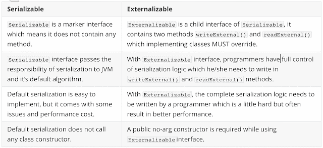

# 如何使用外部化接口定制 Java 中的序列化

> 原文：<https://dev.to/njnareshjoshi/how-to-customize-serialization-in-java-by-using-externalizable-interface-3gja>

在上一篇文章[中，关于 Java 序列化的一切都用例子](https://www.programmingmitra.com/2019/08/what-is-serialization-everything-about-java-serialization-explained-with-example.html)解释了，我解释了我们如何使用`Serializable`接口序列化/反序列化一个对象，还解释了我们如何使用的 writeObject 和 readObject 方法[定制序列化过程。](https://www.programmingmitra.com/2019/08/java-serialization-magic-methods-and-their-uses-with-example.html)

## Java 序列化过程的缺点

但是这些定制是不够的，因为 JVM 完全控制序列化过程，而那些定制逻辑只是默认序列化过程的补充。我们仍然必须通过从`writeObject`和`readObject`方法中调用`ObjectOutputStream.defaultWriteObject()`和`ObjectInputStream.defaultReadObject()`来使用默认的序列化逻辑。如果不调用这些默认方法，我们的对象将不会被序列化/反序列化。

默认的序列化过程是完全递归的。因此，每当我们试图序列化一个对象时，序列化过程都会尝试用我们的类序列化所有字段(原语和引用)(除了`static`和`transient`字段)。这使得序列化过程非常缓慢。

现在让我们假设我们有一个对象，它有很多字段，由于某些原因我们不想序列化这些字段(这些字段总是被赋予默认值)。使用默认的序列化过程，我们将不得不使所有这些字段都是瞬态的，但这仍然不是有效的，因为将有大量的检查来查看这些字段是否是瞬态的。

正如我们所看到的，使用默认序列化过程有很多缺点，比如:

1.  定制序列化是不够的，因为 JVM 完全控制序列化过程，我们的定制逻辑只是对默认序列化过程的补充。
2.  默认的序列化过程是完全递归的，速度很慢。
3.  为了不序列化一个字段，我们必须声明它是瞬态的，而大量的瞬态字段又会使这个过程变慢。
4.  我们无法控制如何序列化和反序列化我们的字段。
5.  默认序列化进程在创建对象时不调用构造函数，因此它不能调用构造函数提供的初始化逻辑。

## 什么是外化和可外化接口

正如我们在上面看到的，默认的 java 序列化效率不高。我们可以通过使用`Externalizable`接口代替`Serializable`接口来解决其中的一些问题。

我们可以通过实现[可外化的](https://docs.oracle.com/javase/7/docs/api/java/io/Externalizable.html)接口并覆盖它的方法`writeExternal()`和`readExternal()`来编写自己的序列化逻辑。但是使用这种方法，我们不会从 JVM 获得任何类型的默认序列化逻辑，而是由我们来提供完整的序列化和反序列化逻辑。

因此，非常小心地编写这些方法的测试代码是非常必要的，因为它可能会破坏序列化过程。但是如果实现得当，外部化过程比默认的序列化过程要快得多。

下面我们将以`Employee`类对象为例进行说明:

```
// Using Externalizable, complete serialization/deserialization logic becomes our responsibility,
// We need to tell what to serialize using writeExternal() method and what to deserialize using readExternal(),
// We can even serialize/deserialize static and transient variables,
// With implementation of writeExternal() and readExternal(),  methods writeObject() and readObject() becomes redundant and they do not get called.
class Employee implements Externalizable {

   // This serialVersionUID field is necessary for Serializable as well as Externalizable to provide version control,
    // Compiler will provide this field if we do not provide it which might change if we modify class structure of our class, and we will get InvalidClassException,
    // If we provide a value to this field and do not change it, serialization-deserialization will not fail if we change our class structure.
    private static final long serialVersionUID = 2L;

    private String firstName;
    private transient String lastName; // Using Externalizable, we can even serialize/deserialize transient variables, so declaring fields transient becomes unnecessary.
    private int age;
    private static String department; // Using Externalizable, we can even serialize/deserialize static variables according to our need.

    // Mandatory to have to make our class Externalizable
    // When an Externalizable object is reconstructed, the object is created using public no-arg constructor before the readExternal method is called.
    // If a public no-arg constructor is not present then a InvalidClassException is thrown at runtime.
    public Employee() {
    }

    // All-arg constructor to create objects manually
    public Employee(String firstName, String lastName, int age, String department) {
        this.firstName = firstName;
        this.lastName = lastName;
        this.age = age;
        Employee.department = department;

        validateAge();
    }

    private void validateAge() {
        System.out.println("Validating age.");

        if (age < 18 || age > 70) {
            throw new IllegalArgumentException("Not a valid age to create an employee");
        }
    }

    @Override
    // We need to tell what to serialize in writeExternal() method
    public void writeExternal(ObjectOutput out) throws IOException {
        System.out.println("Custom externalizable serialization logic invoked.");

        out.writeUTF(firstName);
        out.writeUTF(lastName);
        out.writeInt(age);
        out.writeUTF(department);
    }

    @Override
    // We need to tell what to deserialize in readExternal() method
    // The readExternal method must read the values in the same sequence and with the same types as were written by writeExternal
    public void readExternal(ObjectInput in) throws IOException {
        System.out.println("Custom externalizable serialization logic invoked.");

        firstName = in.readUTF();
        lastName = in.readUTF();
        age = in.readInt();
        department = in.readUTF();

        validateAge();
    }

    @Override
    public String toString() {
        return String.format("Employee {firstName='%s', lastName='%s', age='%s', department='%s'}", firstName, lastName, age, department);
    }

    // Custom serialization logic, It will be called only if we have implemented Serializable instead of Externalizable.
    private void writeObject(ObjectOutputStream oos) throws IOException {
        System.out.println("Custom serialization logic invoked.");
    }

    // Custom deserialization logic, It will be called only if we have implemented Serializable instead of Externalizable.
    private void readObject(ObjectInputStream ois) throws IOException, ClassNotFoundException {
        System.out.println("Custom deserialization logic invoked.");
    }
} 
```

<svg width="20px" height="20px" viewBox="0 0 24 24" class="highlight-action crayons-icon highlight-action--fullscreen-on"><title>Enter fullscreen mode</title></svg> <svg width="20px" height="20px" viewBox="0 0 24 24" class="highlight-action crayons-icon highlight-action--fullscreen-off"><title>Exit fullscreen mode</title></svg>

## 序列化如何与外部化接口一起工作

正如我们在上面的示例`Employee`类中看到的，我们可以通过实现[可外部化的](https://docs.oracle.com/javase/7/docs/api/java/io/Externalizable.html)接口并覆盖其方法`writeExternal()`和`readExternal()`来编写自己的序列化逻辑。

该对象可以实现 writeExternal 方法来保存其内容，方法是为其基元值调用 DataOutput 的方法，或者为对象、字符串和数组调用 ObjectOutput 的 writeObject 方法。

该对象可以实现 readExternal 方法，通过调用基元类型的 DataInput 方法和对象、字符串和数组的 readObject 方法来恢复其内容。readExternal 方法读取的值必须与 writeExternal 写入的序列和类型相同。

```
// We need to tell what fields to serialize in writeExternal() method
public void writeExternal(ObjectOutput out) throws IOException {
    System.out.println("Custom externalizable serialization logic invoked.");

    out.writeUTF(firstName);
    out.writeUTF(lastName);
    out.writeInt(age);
    out.writeUTF(department);
}

// We need to tell what fields to deserialize in readExternal() method
// The readExternal method must read the values in the same sequence and with the same types as were written by writeExternal
public void readExternal(ObjectInput in) throws IOException {
    System.out.println("Custom externalizable serialization logic invoked.");

    firstName = in.readUTF();
    lastName = in.readUTF();
    age = in.readInt();
    department = in.readUTF();

    validateAge();
} 
```

<svg width="20px" height="20px" viewBox="0 0 24 24" class="highlight-action crayons-icon highlight-action--fullscreen-on"><title>Enter fullscreen mode</title></svg> <svg width="20px" height="20px" viewBox="0 0 24 24" class="highlight-action crayons-icon highlight-action--fullscreen-off"><title>Exit fullscreen mode</title></svg>

为了将我们的对象序列化和反序列化为一个文件，我们需要遵循与 Serializable 示例中相同的过程，这意味着调用`ObjectOutputStream.writeObject()`和`ObjectInputStream.readObject()`，如以下代码所示:

```
public class ExternalizableExample {
    public static void main(String[] args) throws IOException, ClassNotFoundException {
        Employee empObj = new Employee("Shanti", "Sharma", 25, "IT");
        System.out.println("Object before serialization  => " + empObj.toString());

        // Serialization
        serialize(empObj);

        // Deserialization
        Employee deserializedEmpObj = deserialize();
        System.out.println("Object after deserialization => " + deserializedEmpObj.toString());
    }

    // Serialization code
    static void serialize(Employee empObj) throws IOException {
        try (FileOutputStream fos = new FileOutputStream("data.obj");
             ObjectOutputStream oos = new ObjectOutputStream(fos))
        {
            oos.writeObject(empObj);
        }
    }

    // Deserialization code
    static Employee deserialize() throws IOException, ClassNotFoundException {
        try (FileInputStream fis = new FileInputStream("data.obj");
             ObjectInputStream ois = new ObjectInputStream(fis))
        {
            return (Employee) ois.readObject();
        }
    }
} 
```

<svg width="20px" height="20px" viewBox="0 0 24 24" class="highlight-action crayons-icon highlight-action--fullscreen-on"><title>Enter fullscreen mode</title></svg> <svg width="20px" height="20px" viewBox="0 0 24 24" class="highlight-action crayons-icon highlight-action--fullscreen-off"><title>Exit fullscreen mode</title></svg>

`Externalizable`接口是`Serializable`的子接口，即`Externalizable extends Serializable`。因此，如果我们实现`Externalizable`接口并覆盖它的`writeExternal()`和`readExternal()`方法，那么这些方法将优先于 JVM 提供的默认序列化机制。这些方法取代了`writeObject`和`readObject`方法的定制实现，所以如果我们也提供了`writeObject()`和`readObject()`，那么它们将被忽略。

在序列化过程中，每个要序列化的对象都要针对外部化接口进行测试。如果对象支持外部化，则调用 writeExternal 方法。如果对象不支持 Externalizable，但实现了 Serializable，则使用 ObjectOutputStream 保存对象。

当重构一个外部化对象时，使用公共的无参数构造函数创建一个实例，然后调用 readExternal 方法。可序列化对象通过从 ObjectInputStream 中读取来还原。

> 1.  When an externalizable object is reconstructed and the object is created using the public parameterless constructor before calling the readExternal method. If the public parameterless constructor does not exist, an InvalidClassException is thrown at runtime.
> 2.  With externalization, we can even serialize/deserialize transient variables, so it becomes unnecessary to declare field transients. With externalization, we can even serialize/deserialize static variables if necessary.

外部化实例可以通过 Serializable 接口中记录的 writeReplace 和 readResolve 方法指定一个替换对象。

Java [序列化也可以用来深度克隆一个对象](https://www.programmingmitra.com/2019/08/how-to-deep-clone-an-object-using-java-in-memory-serialization.html)。Java 克隆是 Java 社区中最有争议的话题，它确实有它的缺点，但它仍然是创建对象副本的最流行和最容易的方法，直到该对象完全满足 Java 克隆的强制条件。我在一篇 3 篇文章的 [Java 克隆系列](https://programmingmitra.blogspot.in/search/label/Java%20Cloning)中详细介绍了克隆，其中包括类似 [Java 克隆和克隆类型(浅层和深层)的文章，并附有示例](https://programmingmitra.blogspot.in/2016/11/Java-Cloning-Types-of-Cloning-Shallow-Deep-in-Details-with-Example.html)、 [Java 克隆——复制构造函数与克隆的比较](https://programmingmitra.blogspot.in/2017/01/Java-cloning-copy-constructor-versus-Object-clone-or-cloning.html)、 [Java 克隆——即使复制构造函数也不够用](https://programmingmitra.blogspot.in/2017/01/java-cloning-why-copy-constructors-are-not-sufficient-or-good.html)，如果您想了解更多关于克隆的知识，请继续阅读。

## 可外部化与可序列化的区别

让我们列出 java 中可外部化接口和可序列化接口的主要区别。

[](////4.bp.blogspot.com/-Z-MlBmCNsYs/XVAcnBY5cNI/AAAAAAAAVwk/JkyAJ74GdgUTqSisG8LNbWDYoLJJO0pMQCK4BGAYYCw/s1600/Differences-between-Externalizable-vs-Serializable.png)

您可以在这个 [Github 资源库](https://github.com/njnareshjoshi/exercises/blob/master/src/org/programming/mitra/exercises/ExternalizableExample.java)上找到本文的完整源代码，请随时提供您的宝贵反馈。