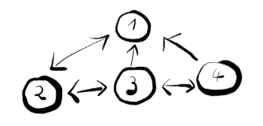
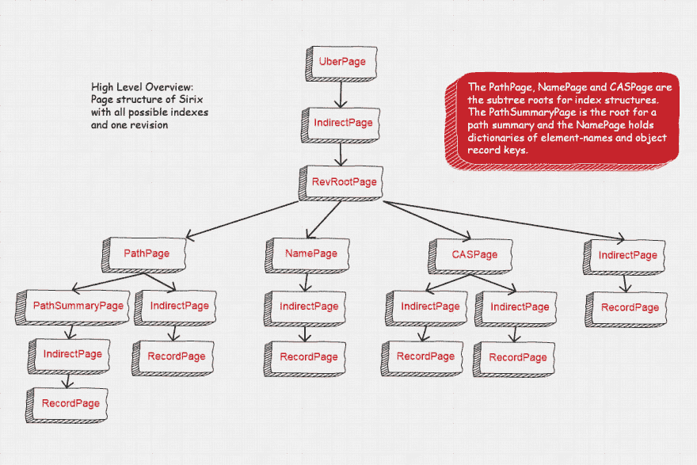
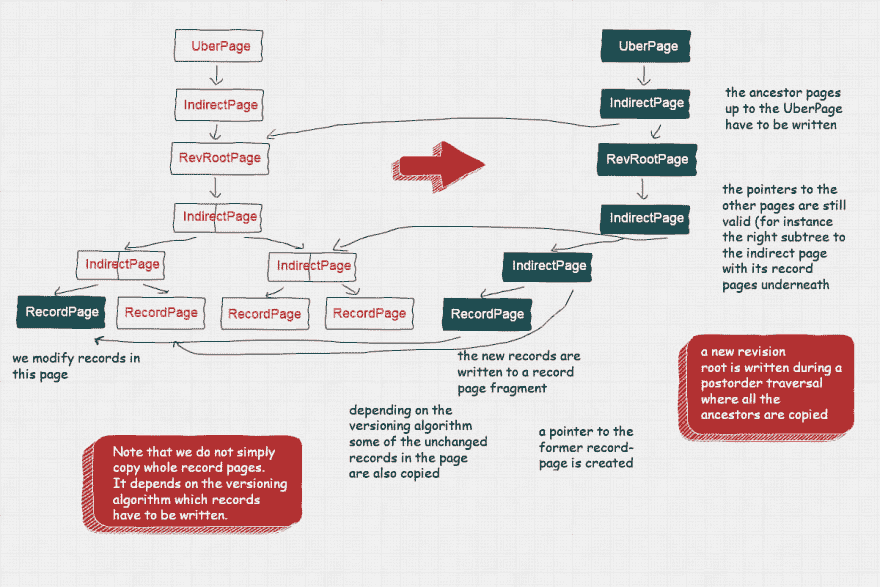

# 一个进化的时态数据库系统的体系结构

> 原文：<https://dev.to/johanneslichtenberger/sirixdb-concepts-of-an-evolutionary-temporal-database-system-ef4>

## 简介

SirixDB 是一个时态数据库系统，从不覆盖数据。每次提交事务时，SirixDB 都会创建一个新的轻量级快照。它使用日志结构的写时复制方法，而版本控制发生在页面级和节点级。让我们首先定义一个时态数据库系统是什么。

时态数据库能够检索过去的状态。通常，它存储事务时间，即事务提交数据的时间。如果有效时间也被存储，即当一个事实在现实世界中为真时，我们有一个双时态关系，即两个时间轴。

像下面这样的问题可能很容易回答:给我上个月美元对英镑的欧元汇率历史。根据当天的记录，客户在 2015 年 7 月 12 日的地址是什么？是他们移动了还是有人纠正了错误？我们在数据库中有错误吗，这些错误后来被纠正了吗？

让我们把焦点转向为什么历史数据没有被保留在过去的问题。我们认为，近年来新的存储技术进步为构建复杂的解决方案提供了可能性，有助于解决这些问题，而没有最先进的系统带来的障碍。

## 固态硬盘等闪存驱动器的优缺点

正如马克·克拉米斯在他的论文《让持久的树木生长到 21 世纪》中指出的那样:

> 切换到闪存驱动器强烈地促使人们从“当前状态”范式转向记住导致这种状态的进化步骤。

主要观点是，如今常见的闪存驱动器(例如 SSD)具有零寻道时间，同时无法对数据进行就地修改。闪存驱动器被组织成页面和块。由于它们的特性，它们能够在精细粒度的页面级读取数据，但只能在较粗的块级擦除数据。此外，在更新数据块之前，必须先将其擦除。因此，更新的数据被写到另一个地方。垃圾收集器将已经被重写到新位置的数据标记为在先前的块位置被擦除，以便将来可以存储新的数据。更新在新位置查找数据的元数据。

## 通过细粒度的修改来演化状态

此外，Marc 指出，这些小的修改通常不仅包括写入修改过的数据，还包括修改过的页面中的所有其他记录，以及许多包含未修改数据的页面。由于传统机械磁盘磁头寻道时间的缓慢随机读取，传统旋转磁盘需要群集。这显然是不希望的结果。

相反，从存储的角度来看，最好只存储更改。正如我们将看到的，这归结为读写性能之间的权衡，即必须从分散的增量更改中重建内存中的页面，或者必须存储比必要的更改更多的记录。

## 我们如何基于这些观察从零开始构建一个开源存储系统

SirixDB 存储每个修订版和每个页面的增量。由于闪存驱动器的寻道时间为零，SirixDB 不必对数据进行群集。它只在事务提交期间聚集数据。它基于仅附加的日志结构存储。数据从不就地修改。

相反，在事务提交期间，通过内部树结构的后序遍历，数据库页面被批量复制到内存、更新和同步到文件。

页面结构深受 ZFS 操作系统的启发。我们使用了一些想法来在子文件级别存储和版本化数据。我们将看到，Marc Kramis 基于从备份系统中观察到的版本控制方法的缺点，提出了一种新颖的滑动快照算法来对记录页进行版本控制。

### 节点层/树-编码

SirixDB 中 XML 和 JSON 文档的底层树结构的编码使用基于指针的方法。

SirixDB 不使用范围编码(不支持更新)或层次标签(B+-树索引结构遍历可能代价太高)。但是，我们可以指定 SirixDB 为 XML 资源存储分层标签(DeweyIDs ),以提供快速的文档顺序确定。

SirixDB 中的节点通过 first child/left sibling/right sibling/parent node key/node key 编码来引用其他节点，而不是上述编码。可以把它想象成一个持久的 DOM:

图中的数字是自动生成的唯一、稳定的节点 id 或节点键，由一个简单的序列号生成器生成。

每个结构节点可能有一个第一子节点、一个左兄弟节点、一个右兄弟节点和一个父节点。

名称空间和属性是 XML 资源中唯一的非结构化节点。它们有一个父指针。如果事务游标指向一个元素节点，可以通过特殊的 moveToAttribute 和 moveToNamespace 引用这些节点。

然而，在 JSON 到树的映射中，每个节点都是一个结构化节点。为了支持节点的细粒度版本控制并能够重用 axis 实现，SirixDB 对 JSON 资源使用了与我们看到的相同的编码。

**注意，SirixDB 中的二进制 JSON 格式允许有序的重复对象记录键。然而，上层可能将对象记录存储在哈希映射中，因此不跟踪顺序，也不支持重复的记录键。**

### 页面结构

一个版本的页面结构如下图所示:

我们不想深入细节，但是图中的要点是资源存储在一个巨大的基于数组的 trie 中。正如我们将看到的，提交新的 *UberPage* 版本是原子性的，并且是最后编写的。一个*修订根页面*表示修订的主入口点。

SirixDB 中的每个节点和修订版都由一个唯一、稳定的标识符引用。首先，SirixDB 必须通过其修订号遍历间接页树来查找修订。寻址节点的方式完全相同。

如果节点或修订的数量不能被当前级别可寻址的最大数量引用，则写入额外的顶层*间接页面*。

### 事务提交

下图描述了事务提交期间发生的情况:

我们假设最左边的*记录页*中的记录已经被修改。根据 SirixDB 使用的版本控制算法，修改后的记录以及页面的其他记录可能会被复制到一个新的页面片段中。首先，所有更改都存储在内存中的事务(意图)日志中，如果需要，可以持久化该日志。第二，在事务提交期间，当前 *RevisionRootPage* 的页面结构在后序遍历中被串行化。

所有已更改的*记录页*从最左边开始写入永久存储器。如果间接页下存在其他已更改的记录页，这些记录页将在指向已更新记录页的*间接页*之前序列化。然后写入指向更新的修订根页面的*间接页面*。用对记录页的新持久位置的更新引用来写入间接页。SirixDB 还像 ZFS 一样在父指针中存储校验和，这样，一旦我们对数据进行分区，特别是复制数据，未来的存储就能够检测数据损坏并自我修复。整个页面结构以这种方式序列化。我们还希望将来在引用中存储一个加密密钥，以支持静态加密。

请注意，SirixDB 必须更新每个已更改的*记录页*的祖先路径。然而，存储间接页面以及 *RevisionRootPage* 、 *CASPage* 、 *PathSummaryPage* 和 *PathPage* 是很便宜的。我们目前存储了*名称页面*的副本，但是将来可能会根据所选择的版本化算法对这些页面进行版本化。因此，我们不需要复制整个字典并节省存储成本。没有指向新页面或页面片段的每个引用都保持不变。因此，未更改的页面(也不在已更改页面的祖先路径上)只是在它们在先前修订中的相应位置被引用，而不会被重写。

### 记录级版本化

SirixDB 的一个与众不同的特性是它对*记录页*进行版本化，而不仅仅是复制页面的所有记录，即使只有一条记录被修改。新记录页片段总是包含对以前版本的引用。因此，版本化算法能够最多解引用固定的预定义数量的页面片段，以在内存中重建记录页面。

用于版本记录页面的滑动快照算法能够避免读取和写入峰值。避免了间歇性的全页快照，否则在增量或差异页面版本控制过程中需要这种快照来快速跟踪其重建。

### 资源级事务

SirixDB 支持一个读写事务并发到 N 个只读事务。因此，该架构非常好地支持并发性(注意并发性和并行计算之间的区别；前者只是后者的先决条件)。如果我们希望在 SirixDB 中允许对同一资源的并发写入，我们可以引入一种可序列化的快照隔离形式。然而，我们认为像 XML 和 JSON 这样的树结构数据是不可行的，至少如果构建了节点的散列并且还存储了后代的数量。

## 结论

我们已经描述了 SirixDB 的一些架构概念。主要特性是 SirixDB 中从头开始构建的全面版本控制。与其他方法相比，每个版本都有索引，不仅页面快照是从更改的页面写入的，而且 SirixDB 还适用于每个记录的版本控制。可以有效地存储和查询每个资源的历史。

## 试一试/需要帮助

如果你喜欢这个，请在 Twitter 上分享，在 Github 上给我一颗星，最重要的是检查一下并让我知道。几年来，我是 SirixDB 的唯一维护者，现在比以往任何时候都更渴望提出一个版本化的、安全的时态分析平台社区的想法。我很乐意听到任何建议，反馈，对未来工作的建议，例如关于水平缩放的工作，错误报告，只是一切…请联系):-)

开源库:[https://github.com/sirixdb/sirix](https://github.com/sirixdb/sirix)

新社区论坛:[https://sirix . discourse . group](https://sirix.discourse.group)

SirixDB 网址: [https://sirix.io](https://sirix.io)