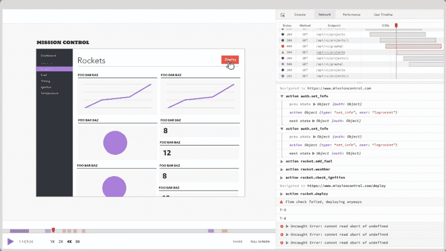

# 你不需要巴别塔与节点

> 原文：<https://dev.to/bnevilleoneill/you-don-t-need-babel-with-node-1l7n>

**作者:[乔尔·格里菲斯](https://blog.logrocket.com/author/joelgriffith/)** ✏️

如果您一直是 Node.js 开发人员，或者甚至涉足过 React 或 Vue.js 等前端库，那么毫无疑问，您很可能遇到过 Babel。曾经作为 Reddit 上的一个不起眼的副业项目，[你可以在这里看到](https://www.reddit.com/r/javascript/comments/2mxt5f/6to5_js_a_readable_es6_compiler/)，现在已经发展得如此之快，以至于它从根本上改变了我们构建和开发 Node.js 应用程序的方式。

很难将 Babel 的规模放在上下文中，因为它现在被分解成了独立的小软件包，但是只要看一看 npm `@Babel/core`软件包，就应该对它的性质有所了解(提示:它每周大约有 800 万次下载，而 React 有 500 万次！).

尽管巴别塔令人惊叹，但它也带来了一些令人难以接受的东西。首先，您现在需要在您的应用程序或库中引入一个构建系统。虽然它本身并不是一件可怕的事情，但它确实带来了许多其他的复杂性和问题:您是否打包了一个 es 兼容的库和一个 ES20XX 版本？您希望将 ECMAScript 规范的哪个“阶段”作为目标？我个人最喜欢的是，你当前的工具集将如何与之配合工作(调试或其他)？！

当然，我们不能忘记我们的老朋友 source maps，这样我们就可以智能地从编译后的代码*倒推*到我们源代码的样子。如果你同时为两个浏览器*和* Node.js 构建，情况会变得更加复杂，因为你还必须为两个浏览器捆绑一个构建——天哪！

相反，我想说的是，也许你不再需要巴别塔了。大部分曾经只有 Babel 才有的功能现在都是 Node.js 中的一等公民，这意味着您可以删除许多依赖项、构建步骤，甚至是自动为您完成这一编译的第三方系统。

一旦你阅读了这篇文章的全部内容，我希望你能和我一起看到我们有望进入一个节点开发的“复兴”,在那里你将不再需要一个构建系统——包括 Babel！

[](https://logrocket.com/signup/)

## 消除混乱的第一步:处理模块

JavaScript 开发中更具对抗性的部分之一一直是它的模块系统。对于那些不熟悉的人，你可能会在网上经常看到这个语法:

```
export const double = (number) => number * 2;
export const square = (number) => number * number; 
```

<svg width="20px" height="20px" viewBox="0 0 24 24" class="highlight-action crayons-icon highlight-action--fullscreen-on"><title>Enter fullscreen mode</title></svg> <svg width="20px" height="20px" viewBox="0 0 24 24" class="highlight-action crayons-icon highlight-action--fullscreen-off"><title>Exit fullscreen mode</title></svg>

然而，在 Node 中运行上面的代码而没有任何巴别塔化(或者标记)将会导致下面的错误:

```
export const double = (number) => number * 2;
^^^^^^

SyntaxError: Unexpected token export 
```

<svg width="20px" height="20px" viewBox="0 0 24 24" class="highlight-action crayons-icon highlight-action--fullscreen-on"><title>Enter fullscreen mode</title></svg> <svg width="20px" height="20px" viewBox="0 0 24 24" class="highlight-action crayons-icon highlight-action--fullscreen-off"><title>Exit fullscreen mode</title></svg>

多年前的人们可能会回想起我们同时使用`requirejs`和`commonjs`语法的时候，以及我们现在同时使用`commonjs`和 ECMAScript 模块语法时是多么惊人的相似。

然而，如果您运行的是 Node——即使是版本 8——您也可以开始使用 ECMAScript 模块，而无需任何 transpiling 或 Babel。你需要做的就是用`--experimental-modules`开关启动你的应用程序:

```
node --experimental-modules my-app.mjs 
```

<svg width="20px" height="20px" viewBox="0 0 24 24" class="highlight-action crayons-icon highlight-action--fullscreen-on"><title>Enter fullscreen mode</title></svg> <svg width="20px" height="20px" viewBox="0 0 24 24" class="highlight-action crayons-icon highlight-action--fullscreen-off"><title>Exit fullscreen mode</title></svg>

当然，最大的警告是——至少在版本 8 和 10 中——您的文件必须以扩展名`mjs`结尾，以消除它们是 ECMAScript 模块而不是 CommonJS 的歧义。在 Node 12 中，情况变得更好，在这里，您所要做的就是向您的应用程序(或库)添加一个新的属性`pacakge.json` :

```
// package.json
{
    "name": "my-application",
    "type": "module" // Required for ECMASCript modules
} 
```

<svg width="20px" height="20px" viewBox="0 0 24 24" class="highlight-action crayons-icon highlight-action--fullscreen-on"><title>Enter fullscreen mode</title></svg> <svg width="20px" height="20px" viewBox="0 0 24 24" class="highlight-action crayons-icon highlight-action--fullscreen-off"><title>Exit fullscreen mode</title></svg>

当在 Node.js 12 和更高版本上使用`type`方法时，它有一个很好的副作用，即加载所有的*依赖项*，同时支持 ECMAScript 模块。因此，随着越来越多的库迁移到“原生”JavaScript，您将不必担心如何解析`import`或`require`，因为许多库捆绑了不同的模块系统。

你可以在 Node 优秀的文档网站[上阅读更多相关内容，该网站位于这里](https://nodejs.org/docs/latest-v12.x/api/esm.html#esm_enabling)。

## 消除混乱步骤#2:使用现代异步控制流

如果您一直喜欢 Node.js 中更现代的异步控制流方法(即 promises 及其对应的 async/await)，那么您会很高兴地知道，自 Node 8 以来，它们就已经得到了本机支持！

拥有良好的控制流，尤其是对于并行发出请求这样的操作，对于编写快速且可维护的节点应用程序至关重要。要在 Node 8 中使用像`Promise`或`await`这样的东西，你甚至不需要做什么特别的事情:

```
// log.js
async function delayedLogger(...messages) {
    return new Promise((resolve) => {
        setImmediate(() => {
            console.debug(...messages);
            resolve(true);
        });
    });
}

async function doLogs() {
    delayedLogger('2\. Then I run next!');
    console.log('1\. I run first!');
    await delayedLogger('3\. Now I run third because I "await"');
    console.log('4\. And I run last!');
}

doLogs(); 
```

<svg width="20px" height="20px" viewBox="0 0 24 24" class="highlight-action crayons-icon highlight-action--fullscreen-on"><title>Enter fullscreen mode</title></svg> <svg width="20px" height="20px" viewBox="0 0 24 24" class="highlight-action crayons-icon highlight-action--fullscreen-off"><title>Exit fullscreen mode</title></svg>

运行这个例子现在变得很简单:

```
node log.js 
```

<svg width="20px" height="20px" viewBox="0 0 24 24" class="highlight-action crayons-icon highlight-action--fullscreen-on"><title>Enter fullscreen mode</title></svg> <svg width="20px" height="20px" viewBox="0 0 24 24" class="highlight-action crayons-icon highlight-action--fullscreen-off"><title>Exit fullscreen mode</title></svg>

你的`package.json`没有特殊的开关或更新——它只是工作！不仅如此，您甚至可以使用这些本机承诺来尝试并捕获未捕获的异常，以防您的应用程序出现问题:

```
process.on('unhandledRejection', (reason, promise) => {
  console.log('Unhandled Rejection at:', promise, '\nMessage:', reason);
});

async function willThrowErrors() {
    return new Promise(function shouldBeCaught(resolve, reject) {
        reject('I should be caught and handled with!');
    });
}

willThrowErrors(); 
```

<svg width="20px" height="20px" viewBox="0 0 24 24" class="highlight-action crayons-icon highlight-action--fullscreen-on"><title>Enter fullscreen mode</title></svg> <svg width="20px" height="20px" viewBox="0 0 24 24" class="highlight-action crayons-icon highlight-action--fullscreen-off"><title>Exit fullscreen mode</title></svg>

尽管这很好，但如果我们需要深入查看异步调用堆栈，看看抛出了什么以及我们是如何到达那里的，这有时会特别具有挑战性。为了启用异步堆栈跟踪，您需要在节点 12 上，并对某些版本使用`--async-stack-traces`开关。

一旦完成，您就可以更好地推理错误来自哪里，并追溯到问题的根源。例如，下面这个虚构的程序很难看出我们是如何出错的:

```
// app.js
async function sleep(num) {
    return new Promise((resolve) => {
        setTimeout(resolve, num);
    });
}

async function execute() {
    await sleep(10);
    await stepOne();
}

async function stepOne() {
    await sleep(10);
    await stepTwo();
}

async function stepTwo() {
    await sleep(10);
    await stepThree();
}

async function stepThree() {
    await sleep(10);
    throw new Error('Oops');
}

execute()
    .then(() => console.log('success'))
    .catch((error) => console.error(error.stack)); 
```

<svg width="20px" height="20px" viewBox="0 0 24 24" class="highlight-action crayons-icon highlight-action--fullscreen-on"><title>Enter fullscreen mode</title></svg> <svg width="20px" height="20px" viewBox="0 0 24 24" class="highlight-action crayons-icon highlight-action--fullscreen-off"><title>Exit fullscreen mode</title></svg>

在节点 10 中运行此命令会返回以下跟踪:

```
$ node temp.js --async-stack-traces
Error: Oops
    at stepThree (/Users/joelgriffith/Desktop/app.js:24:11) 
```

<svg width="20px" height="20px" viewBox="0 0 24 24" class="highlight-action crayons-icon highlight-action--fullscreen-on"><title>Enter fullscreen mode</title></svg> <svg width="20px" height="20px" viewBox="0 0 24 24" class="highlight-action crayons-icon highlight-action--fullscreen-off"><title>Exit fullscreen mode</title></svg>

一旦我们切换到节点 12，我们现在得到一个更好的输出，在这里我们可以看到我们调用的确切结构:

```
$ node temp.js --async-stack-traces
Error: Oops
    at stepThree (/Users/joelgriffith/Desktop/temp.js:24:11)
    at async stepTwo (/Users/joelgriffith/Desktop/temp.js:19:5)
    at async stepOne (/Users/joelgriffith/Desktop/temp.js:14:5)
    at async execute (/Users/joelgriffith/Desktop/temp.js:9:5) 
```

<svg width="20px" height="20px" viewBox="0 0 24 24" class="highlight-action crayons-icon highlight-action--fullscreen-on"><title>Enter fullscreen mode</title></svg> <svg width="20px" height="20px" viewBox="0 0 24 24" class="highlight-action crayons-icon highlight-action--fullscreen-off"><title>Exit fullscreen mode</title></svg>

## 脱涩第三步:留着糖！

Babel 的一个真正好的好处是几年前它从 ES6 中暴露出来的所有伟大的语法糖。这些小小的好处使得以一种可读性更强、更简洁的方式执行常用操作变得更加容易。我非常高兴地说，自从 Node 的第 6 版以来，大多数这些东西都工作得很顺利。

我个人最喜欢的一个是破坏作业。这个小快捷方式使得下面的内容更容易理解，并且不需要任何构建系统就可以很好地使用 Node:

```
const letters = ['a', 'b', 'c'];

const [a, b, c] = letters;

console.log(a, b, c); 
```

<svg width="20px" height="20px" viewBox="0 0 24 24" class="highlight-action crayons-icon highlight-action--fullscreen-on"><title>Enter fullscreen mode</title></svg> <svg width="20px" height="20px" viewBox="0 0 24 24" class="highlight-action crayons-icon highlight-action--fullscreen-off"><title>Exit fullscreen mode</title></svg>

如果你只关心第三个元素，那么下面的也行，虽然看起来有点不协调。

```
const stuff = ['boring', 'boring', 'interesting'];

const [,, interesting] = stuff;

console.log(interesting); 
```

<svg width="20px" height="20px" viewBox="0 0 24 24" class="highlight-action crayons-icon highlight-action--fullscreen-on"><title>Enter fullscreen mode</title></svg> <svg width="20px" height="20px" viewBox="0 0 24 24" class="highlight-action crayons-icon highlight-action--fullscreen-off"><title>Exit fullscreen mode</title></svg>

说到甜言蜜语的语法，对象析构也是开箱即用的:

```
const person = {
    name: 'Joel',
    occupation: 'Engineer',
};

const personWithHobbies = {
    ...person,
    hobbies: ['music', 'hacking'],
};

console.log(personWithHobbies); 
```

<svg width="20px" height="20px" viewBox="0 0 24 24" class="highlight-action crayons-icon highlight-action--fullscreen-on"><title>Enter fullscreen mode</title></svg> <svg width="20px" height="20px" viewBox="0 0 24 24" class="highlight-action crayons-icon highlight-action--fullscreen-off"><title>Exit fullscreen mode</title></svg>

现在，我要说的是，使用对象析构确实需要节点 8 才能工作，而数组析构早在节点 6 就受到支持。

最后，从 Node 6 及更高版本开始，现在完全支持默认参数(这是该语言非常缺少的特性)。这移除了你的程序中的许多`typeof`检查(以及 Babel 的 transpiled 输出)，所以你可以做以下事情:

```
function messageLogger(message, level = 'debug >') {
    console.log(level, message);
}

messageLogger('Cool it works!');
messageLogger('And this also works', 'error >'); 
```

<svg width="20px" height="20px" viewBox="0 0 24 24" class="highlight-action crayons-icon highlight-action--fullscreen-on"><title>Enter fullscreen mode</title></svg> <svg width="20px" height="20px" viewBox="0 0 24 24" class="highlight-action crayons-icon highlight-action--fullscreen-off"><title>Exit fullscreen mode</title></svg>

Node 中的功能如此之多，以至于我甚至无法触及其表面:模板文字、反斜线(多行字符串)、粗箭头，甚至`class`关键字都已经准备就绪。

## 但是等等，还有！

消除不必要的依赖是提高应用程序安全性和可维护性的一个好方法。你变得不那么依赖外部维护的软件，并且可以自由地移动得更快一些，而不需要等待生态系统跟上。然而，在这种情况下，通过删除 Babel，您实际上也部署了更多可读的代码。

例如，有时候 Babel 会在程序文件的开头注入大量的聚合填充。虽然这些帮助器在大多数情况下是完全无害的，但对于新手或不熟悉为什么代码会出现在那里的人来说，它可能会导致一个间接层。这在一般情况下是正确的:如果一个新人会被它迷惑，那么也许它不属于你的项目。

这也使得其他使用你的包的人很难确定问题是来自你的代码还是你的 transpiler 注入的帮助器。当注入到最终输出中的代码更少时，您也会更好地理解您正在构建的基础。

关于抛弃巴别塔，我想说的最后一点是，承担或消除任何依赖，那就是责任。任何时候你引入你没有亲自阅读或了解的代码，都有可能发生不好的事情。由于巨大的依赖关系图而导致的更慢的时间，由于模块被即时修补而导致的更慢的启动时间，以及对问题的误报都使得采用像 Babel 这样的包成为一种禁忌。

承担一个新的模块或构建过程是每个人在他们的团队和项目中必须弄清楚的事情，所以我要求你开始更多地将它视为一种责任(维护它，升级它，并了解它会发生什么)，而不仅仅是一个可以利用的工具。

## 最后，为什么你可能仍然需要巴别塔

尽管 Node 最近取得了很大的进步，但有时候你可能还是需要 Babel。如果你想运行“最新最棒的”规范，那么 Babel 是你唯一的选择。如果您想在不改变整个构建管道的情况下尝试 TypeScript，那么 Babel 也可以做到这一点。

有时候，Babel 的代码实际上比节点本地的方法要快。通常情况下，这是由于节点维护人员必须处理的边缘情况，但 Babel 不必担心。再过几年，我相信 Node 最终会成为最快的产品，但是新的特性会比用户平台上实现的要慢得多。

最后，如果您正在向 web 浏览器交付代码，那么在可预见的未来，您可能不得不坚持使用 Babel。像 React 和其他实现或增强该语言的库总是需要一种方法来向下转换成浏览器可理解的代码。

然而，如果你知道你的用户群使用更现代的浏览器，那么抛弃构建系统会有更多的好处，因为你也缩小了有效载荷的大小。这不仅带来了许多好处，即更快的页面加载时间，还带来了可感知的性能提升，因为即使 1KB 也可能花费大量时间，因为每个字节都需要在执行前进行解析和验证！

我希望这有助于您编写更好、更快、更安全的 Node.js 应用程序——尤其是没有 Babel 的所有特性！

* * *

**编者按:**看到这个帖子有问题？你可以在这里找到正确的版本。

## Plug: [LogRocket](https://logrocket.com/signup/) ，一款适用于网络应用的 DVR

[](https://res.cloudinary.com/practicaldev/image/fetch/s--6FG5kvEL--/c_limit%2Cf_auto%2Cfl_progressive%2Cq_auto%2Cw_880/https://i2.wp.com/blog.logrocket.com/wp-content/uploads/2017/03/1d0cd-1s_rmyo6nbrasp-xtvbaxfg.png%3Fresize%3D1200%252C677%26ssl%3D1)

[log rocket](https://logrocket.com/signup/)是一个前端日志工具，让你重放问题，就像它们发生在你自己的浏览器中一样。LogRocket 不需要猜测错误发生的原因，也不需要向用户询问截图和日志转储，而是让您重放会话以快速了解哪里出错了。它可以与任何应用程序完美配合，不管是什么框架，并且有插件可以记录来自 Redux、Vuex 和@ngrx/store 的额外上下文。

除了记录 Redux 动作和状态，LogRocket 还记录控制台日志、JavaScript 错误、stacktraces、带有头+体的网络请求/响应、浏览器元数据、自定义日志。它还使用 DOM 来记录页面上的 HTML 和 CSS，甚至为最复杂的单页面应用程序重新创建像素级完美视频。

[免费试用](https://logrocket.com/signup/)。

* * *

帖子[你不需要节点为](https://blog.logrocket.com/you-dont-need-babel-with-node/)的巴别塔首先出现在[博客](https://blog.logrocket.com)上。