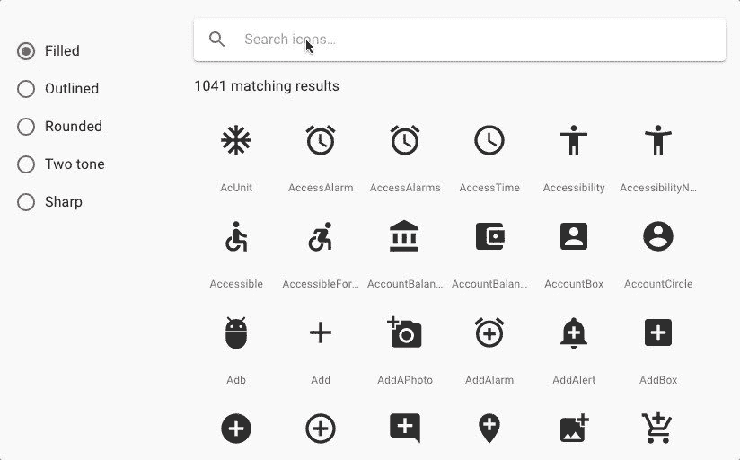

# 现在可以非常轻松地使用材质界面图标

> 原文：<https://dev.to/blueturtle/now-use-material-ui-icons-with-super-ease-3f54>

不再是在[材质图标](https://material.io/tools/icons/?style=baseline)中搜索图标，然后试图弄清楚所需的图标组件名称会是什么样子，现在你可以直接在转换成 svg 图标组件的 1000+个官方材质图标中搜索任意图标。

> <video loop="" controls=""><source src="https://video.twimg.com/ext_tw_video/1164302813700198400/pu/vid/434x270/SmNWDb115jEwZqZ7.mp4?tag=10" type="video/mp4"></video>Material-UI@ Material UI想知道如何使用材质设计图标吗？我们很高兴推出直接内置在文档中的新图标搜索🔍✨.
> 
> 2019 年 8 月 21 日 22 点 26 分27142

搜索功能超级简单。选择图标后，会弹出一个窗口，显示该图标的导入信息。

您还可以在左侧栏中选择图标样式(填充、轮廓、圆形、双色和锐利)。

[https://www.youtube.com/embed/xN46x0piLZE](https://www.youtube.com/embed/xN46x0piLZE)

正如 Material-UI [tweet](https://twitter.com/MaterialUI/status/1164303661880754177) 中宣布的，他们的同义词列表还不完善。他们会根据搜索使用情况对其进行优化。