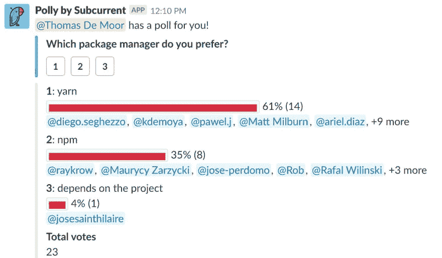

# 纱线 vs npm

> 原文：<https://dev.to/x-team/yarn-vs-npm-3mg>

Node.js 的默认包管理器叫做 [npm](https://www.npmjs.com/) 。这是从 2011 年发布到 2016 年的行业标准，当时发布了一个竞争包管理器: [Yarn](https://yarnpkg.com) 。Yarn 由脸书创建，旨在解决当时 npm 的一些缺点。

# npm 的原始缺点

国家预防机制有两个主要缺点。首先，npm 没有使用 lockfile。锁定文件包含关于每个依赖项的确切版本的所有信息。

考虑到软件包一直在添加新版本，如果它与某些依赖项的最新版本不兼容，那么您的代码就有可能崩溃。这就是为什么将依赖关系锁定到单一版本非常重要。这是 npm 做不到的。

Yarn 通过生成一个`yarn.lock`文件来解决这个问题，该文件精确地存储安装了哪个依赖项的哪个版本。

npm 的第二个主要缺点是它是不确定的。您的`node_modules`文件夹可能不同于您同事的`node_modules`文件夹，甚至不同测试和生产服务器的文件夹。

Yarn 是一个确定性的包管理器，这意味着所有具有给定的`package.json`文件的计算机将在它们的`node_modules`文件夹中安装完全相同的依赖项。这有助于避免代码可以在您的计算机上工作，但不能在另一台计算机上工作的情况。

<figure>

<figcaption>The laptop sticker you could point to if someone accused you of writing broken code in npm@3</figcaption>

</figure>

Yarn 解决了 npm 的两个主要缺点，以及它的速度和语法(带有大量表情符号😎)让许多开发人员从 npm 转向 Yarn。

# npm 的复出

但 npm 背后的开发团队并没有坐以待毙，并在 2017 年中期发布了 npm@5。用`npm install`安装模块变得明显更快，他们最终添加了锁文件(`package-lock.json`)。

在撰写本文时，npm 似乎已经赶上了 Yarn 的特性集。npm 团队在安全性方面做了大量工作，收购了 Lift Security 和 Node Security Platform ，并使用了`npm-audit`命令，该命令递归地分析您的依赖关系树，以确定哪些是不安全的。

# X-Team 的开发者用什么？

因为我很想知道 X-Team 的开发人员目前使用的是哪个包管理器，所以我发出了一个 Slack poll 来询问。结果如下:

纱线仍然是赢家。我们的开发人员说，他们发现 Yarn 在生成确定性依赖树方面更快更好，并且有更好的缓存。

当然，每当一个包管理器可能比另一个好一点的时候，在两个包管理器之间切换是没有意义的。因此，许多开发人员在 2016/17 年转向 Yarn，并认为没有令人信服的理由转回。