# 用 React Native 构建一个“非热狗”克隆

> 原文：<https://dev.to/amanhimself/build-a-not-hotdog-clone-with-react-native-367m>

[](https://res.cloudinary.com/practicaldev/image/fetch/s--cpFNJBKo--/c_limit%2Cf_auto%2Cfl_progressive%2Cq_auto%2Cw_880/https://amanhimself.dev/static/29cdcebe32a0daa1982382c3e8caa5ec/f39d8/banner.webp)

如果你是 HBO《硅谷》(Silicon Valley)的粉丝，你会记得他们推出了一款真正的人工智能移动应用，可以根据给定的图像(或不根据图像)对热狗进行分类。使用 Google 的 Vision API，让我们尝试在 React Native 中重新创建一个应用程序的工作模型。

谷歌的视觉 API 是一种机器学习工具，它从作为输入提供的图像中对细节进行分类。这些分类过程基于预先训练的 API 模型中包含的数千个不同类别。Vision API 支持通过 REST API 访问这些预先训练好的模型。

## 我们在建造什么？

[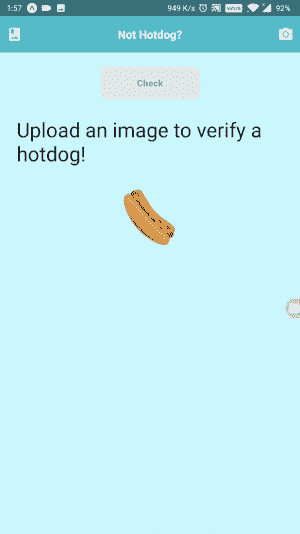](https://res.cloudinary.com/practicaldev/image/fetch/s--jVPSFycL--/c_limit%2Cf_auto%2Cfl_progressive%2Cq_66%2Cw_880/https://cdn-images-1.medium.com/max/800/1%2AHg6nlnaROCavW5_YLygtEA.gif)

## 目录

*   先决条件
*   设置 Firebase 项目
*   将 Firebase SDK 与 React 本机应用程序集成
*   生成 Google Vision API 密钥
*   设定相机和相机胶卷的权限
*   创建标题组件
*   添加覆盖微调器
*   进入照相机和胶卷
*   添加确定热狗的功能
*   显示最终结果
*   结论

## 先决条件

要学习本教程，请确保您在本地开发环境中安装了以下软件，并且能够访问下面提到的服务:

*   安装了 npm/yarn 的 [Node.js](https://nodejs.org/en/) ( > = `10.x.x`)。
*   [expo-cli](https://docs.expo.io/versions/latest/workflow/expo-cli/?) ( > = `3.0.9`)，原名 create-react-native-app。
*   一个[谷歌云平台](https://cloud.google.com/)账号
*   [Firebase 存储](https://console.firebase.google.com/)设置
*   Android 或 iOS 版 Expo 客户端应用，用于测试应用

## 设置 Firebase 项目

在本节中，让我们建立一个新的 Firebase 项目。如果您已经熟悉这个过程，并且知道如何从 Firebase 项目中获取配置密钥，那么您可以跳过这一步。

访问 [Firebase](https://console.firebase.google.com/) 并用您的 Google ID 登录。登录后，单击一个新项目并输入名称。最后，点击**创建项目**按钮。

[](https://res.cloudinary.com/practicaldev/image/fetch/s--1xMKnU1Z--/c_limit%2Cf_auto%2Cfl_progressive%2Cq_auto%2Cw_880/https://cdn-images-1.medium.com/max/800/1%2ABDhg-K1-ekeYg4D2AAir3A.jpeg)

创建项目并重定向到仪表板屏幕后，在左侧菜单中，点击**设置**图标，然后转到**项目设置**。

[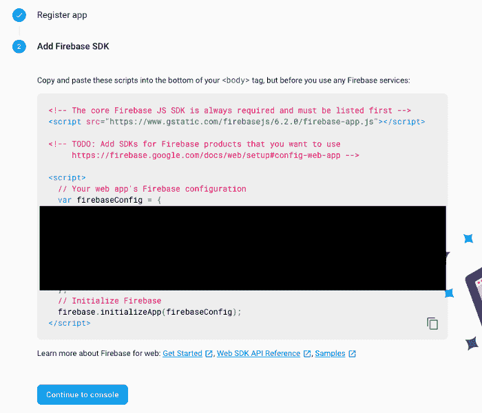](https://res.cloudinary.com/practicaldev/image/fetch/s--kwGPGWDw--/c_limit%2Cf_auto%2Cfl_progressive%2Cq_auto%2Cw_880/https://cdn-images-1.medium.com/max/800/1%2AyJvioMA9wqdBcPGS5HiwYQ.png)

如上所示，将 Firebase 与 React Native 或 Expo 应用程序集成需要整个`firebaseConfig`对象。将它们保存在某个地方，或者确保您知道如何导航到此页面。

下一步是设置 Firebase 存储规则，例如允许通过应用程序上传图像文件。从 Firebase 控制台的左侧菜单中，打开**存储**选项卡，然后选择**规则**。按如下方式修改它们。

```
service firebase.storage {
  match /b/{bucket}/o {
    match /{allPaths=**} {
      allow read, write
    }
  }
} 
```

<svg width="20px" height="20px" viewBox="0 0 24 24" class="highlight-action crayons-icon highlight-action--fullscreen-on"><title>Enter fullscreen mode</title></svg> <svg width="20px" height="20px" viewBox="0 0 24 24" class="highlight-action crayons-icon highlight-action--fullscreen-off"><title>Exit fullscreen mode</title></svg>

Firebase 设置完成。

## 将 Firebase SDK 与 React 原生 app 集成

首先，创建一个新的 React 本地项目。对于这个演示，让我们使用`expo-cli`，这是一个非常棒的工具，有助于以更快的速度创建 React 原生应用。打开终端窗口，运行以下一系列命令。

```
# generate a new app
expo init not-hotdog-app

# navigate inside the app folder
cd not-hotdog-app

# install the firebase SDK & other dependencies
yarn add firebase@6.0.1 expo-permissions expo-image-picker uuid react-native-elements 
```

<svg width="20px" height="20px" viewBox="0 0 24 24" class="highlight-action crayons-icon highlight-action--fullscreen-on"><title>Enter fullscreen mode</title></svg> <svg width="20px" height="20px" viewBox="0 0 24 24" class="highlight-action crayons-icon highlight-action--fullscreen-off"><title>Exit fullscreen mode</title></svg>

> 此外，本教程使用`yarn`作为包管理器，但是非常欢迎您使用`npm`。

现在项目已经生成，在您喜欢的文本编辑器中打开目录。然后创建一个名为`config`的新文件夹，并在其中创建一个名为`Firebase.js`的新文件。这个文件将负责集成 Firebase 和 Expo 应用程序。

```
import * as firebase from 'firebase'

const firebaseConfig = {
  apiKey: 'XXXX',
  authDomain: 'XXXX',
  databaseURL: 'XXXX',
  projectId: 'XXXX',
  storageBucket: 'XXXX',
  messagingSenderId: 'XXXX',
  appId: 'XXXX'
}

// Initialize Firebase
firebase.initializeApp(firebaseConfig)

export default firebase 
```

<svg width="20px" height="20px" viewBox="0 0 24 24" class="highlight-action crayons-icon highlight-action--fullscreen-on"><title>Enter fullscreen mode</title></svg> <svg width="20px" height="20px" viewBox="0 0 24 24" class="highlight-action crayons-icon highlight-action--fullscreen-off"><title>Exit fullscreen mode</title></svg>

所有的 x 都是上一节中的`firebaseConfig`对象中每个键的值。这就完成了将 Firebase Web SDK 与 Expo 应用程序集成的步骤。

## 生成一个谷歌视觉 API 密钥

登录谷歌云平台后，您可以访问[谷歌云控制台](https://console.cloud.google.com/)，创建一个新项目。

[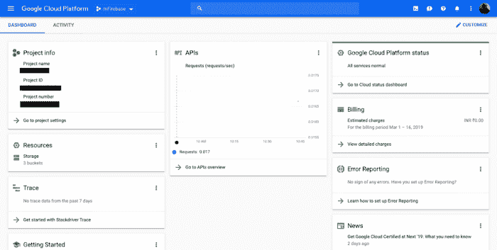](https://res.cloudinary.com/practicaldev/image/fetch/s--fVFBq9kx--/c_limit%2Cf_auto%2Cfl_progressive%2Cq_auto%2Cw_880/https://cdn-images-1.medium.com/max/800/1%2AxVCIMrUY0EDtGMfUKJC5Hg.png)

从下拉菜单中心，选择一个项目。然后在下面的屏幕中点击按钮**新建项目**。注意，您已经生成了一个 Firebase 项目，从可用列表中选择它。

[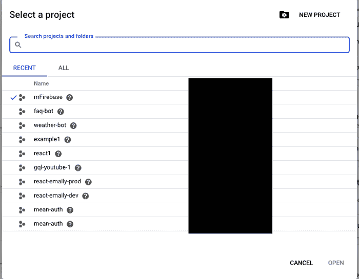](https://res.cloudinary.com/practicaldev/image/fetch/s--9ds9-Rdd--/c_limit%2Cf_auto%2Cfl_progressive%2Cq_auto%2Cw_880/https://cdn-images-1.medium.com/max/800/1%2AFUsemE_BjGBUN2T1gorSUg.png)

现在你在控制台内名为**仪表板**的屏幕上。从左上角，点击菜单按钮，会弹出一个侧边栏菜单。选择**API&服务>仪表盘**。

[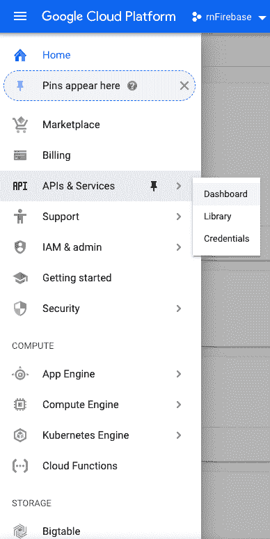](https://res.cloudinary.com/practicaldev/image/fetch/s--lOhaK8OQ--/c_limit%2Cf_auto%2Cfl_progressive%2Cq_auto%2Cw_880/https://cdn-images-1.medium.com/max/800/1%2AggHFyid_JjNABDZh6JfsMA.png)

在仪表板上，选择按钮**启用 API 和服务**。

[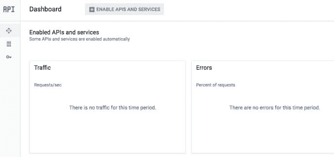](https://res.cloudinary.com/practicaldev/image/fetch/s--B0QOHIVV--/c_limit%2Cf_auto%2Cfl_progressive%2Cq_auto%2Cw_880/https://cdn-images-1.medium.com/max/800/1%2ArhVkQAIWdeqV9wSZsjacew.jpeg)

然后搜索**视觉 API** 并确保点击按钮**启用**。

[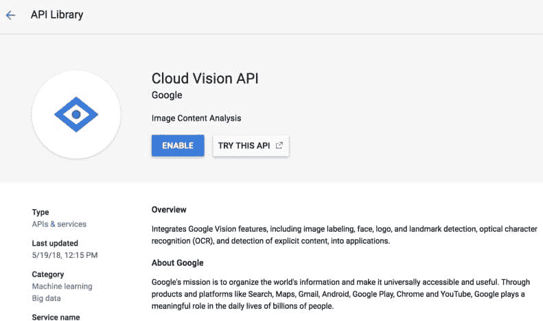](https://res.cloudinary.com/practicaldev/image/fetch/s--nf78gdRf--/c_limit%2Cf_auto%2Cfl_progressive%2Cq_auto%2Cw_880/https://cdn-images-1.medium.com/max/800/1%2ADzHGkXJQyTeYCHqETkhIPA.jpeg)

现在，返回到**仪表板**并转到**凭证**以生成 API 密钥。点击按钮**创建凭证**，您将经历一个生成 API 密钥的小过程。

[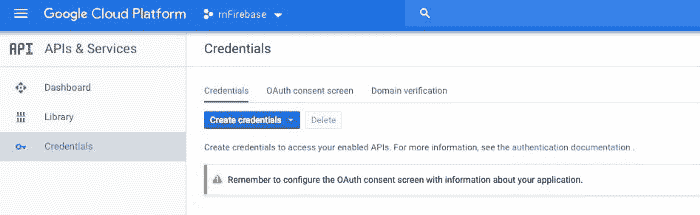](https://res.cloudinary.com/practicaldev/image/fetch/s--_UTiKpKu--/c_limit%2Cf_auto%2Cfl_progressive%2Cq_auto%2Cw_880/https://cdn-images-1.medium.com/max/800/1%2A8SdYi2l3aGS3VcvG7PU-Fg.jpeg)

完成后，在所有导入语句之后，将 API 键保存在`App.js`文件中。

```
const VISION_API_KEY = 'XXXX' 
```

<svg width="20px" height="20px" viewBox="0 0 24 24" class="highlight-action crayons-icon highlight-action--fullscreen-on"><title>Enter fullscreen mode</title></svg> <svg width="20px" height="20px" viewBox="0 0 24 24" class="highlight-action crayons-icon highlight-action--fullscreen-off"><title>Exit fullscreen mode</title></svg>

设置完成。让我们进入下一部分，开始构建应用程序。

## 设置相机权限&相机卷

要在任何 Expo 应用程序中设置权限，您所需要的就是利用来自模块`expo-permissions`的异步方法。对于此克隆，需要设置两个权限。所需的权限适用于相机和相机胶卷(或设备的照片)。

在用户想要上传图像的情况下使用相机胶卷。对于 iOS 模拟器开发，你不能访问相机，所以如果你不打算使用一个真正的设备，直到本教程结束，但想跟随。建议添加相机胶卷功能。

在`App.js`文件中导入权限模块。

```
import * as Permissions from 'expo-permissions' 
```

<svg width="20px" height="20px" viewBox="0 0 24 24" class="highlight-action crayons-icon highlight-action--fullscreen-on"><title>Enter fullscreen mode</title></svg> <svg width="20px" height="20px" viewBox="0 0 24 24" class="highlight-action crayons-icon highlight-action--fullscreen-off"><title>Exit fullscreen mode</title></svg>

下一步是设置一个初始状态，它将通过确定用户是否已经授予您的应用程序使用相机和相机胶卷的权限来控制`render`方法中的`View`。

```
class App extends Component {
  state = {
    hasGrantedCameraPermission: false,
    hasGrantedCameraRollPermission: false,
  } 
```

<svg width="20px" height="20px" viewBox="0 0 24 24" class="highlight-action crayons-icon highlight-action--fullscreen-on"><title>Enter fullscreen mode</title></svg> <svg width="20px" height="20px" viewBox="0 0 24 24" class="highlight-action crayons-icon highlight-action--fullscreen-off"><title>Exit fullscreen mode</title></svg>

接下来，使用生命周期方法`componentDidMount()`，为每个许可定义一个承诺。在下面的代码片段中，您会发现两个函数`cameraRollAccess()`和`cameraAccess()`执行这个操作。这些权限组件中每一个都有一个[权限类型](https://docs.expo.io/versions/v34.0.0/sdk/permissions/#permissions-types):

*   对于相机胶卷:`Permissions.CAMERA_ROLL`
*   对于摄像机:`Permissions.CAMERA`

```
async componentDidMount() {
    this.cameraRollAccess()
    this.cameraAccess()
  }

  cameraRollAccess = async () => {
    const { status } = await Permissions.askAsync(Permissions.CAMERA_ROLL)

    if (status === 'granted') {
      this.setState({ hasGrantedCameraRollPermission: true })
    }
  }

  cameraAccess = async () => {
    const { status } = await Permissions.askAsync(Permissions.CAMERA)

    if (status === 'granted') {
      this.setState({ hasGrantedCameraPermission: true })
    }
  } 
```

<svg width="20px" height="20px" viewBox="0 0 24 24" class="highlight-action crayons-icon highlight-action--fullscreen-on"><title>Enter fullscreen mode</title></svg> <svg width="20px" height="20px" viewBox="0 0 24 24" class="highlight-action crayons-icon highlight-action--fullscreen-off"><title>Exit fullscreen mode</title></svg>

每个权限组件返回一个`granted`或`denied`的`status`值。在许可被授予的情况下，状态变量`hasGrantedCameraRollPermission`和`hasGrantedCameraPermission`的值都被设置为真。方法`Permissions.askAsync()`提示用户权限类型。

接下来，转到`App`组件的 render 方法，并使用双态变量添加条件。如果两者都设置为真，它将显示应用程序的第一个屏幕。

```
 render() {
    const {
      hasGrantedCameraPermission,
      hasGrantedCameraRollPermission,
    } = this.state

    if (
      hasGrantedCameraPermission === false &&
      hasGrantedCameraRollPermission === false
    ) {
      return (
        <View style={{ flex: 1, marginTop: 100 }}>
          <Text>No access to Camera or Gallery!</Text>
        </View>
      )
    } else {
      return (
        <View style={styles.container}>
          {*/ Rest of the content in the next section*/ }
        </View>
      )
    }
  }

// Corresponding StyleSheet Object

const styles = StyleSheet.create({
  container: {
    flex: 1,
    backgroundColor: '#fff'
  }
}) 
```

<svg width="20px" height="20px" viewBox="0 0 24 24" class="highlight-action crayons-icon highlight-action--fullscreen-on"><title>Enter fullscreen mode</title></svg> <svg width="20px" height="20px" viewBox="0 0 24 24" class="highlight-action crayons-icon highlight-action--fullscreen-off"><title>Exit fullscreen mode</title></svg>

如果其中一个或两个未被授予，应用程序将显示消息`No access to Camera or Gallery!`，也如下所示。

[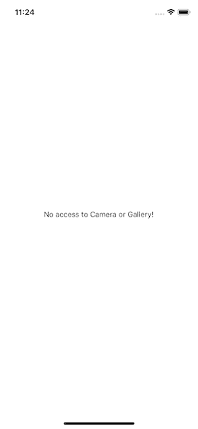](https://res.cloudinary.com/practicaldev/image/fetch/s--05V3bXKb--/c_limit%2Cf_auto%2Cfl_progressive%2Cq_auto%2Cw_880/https://cdn-images-1.medium.com/max/800/1%2ARPW_mo8N7A303-1dKqHsRA.png)

当在真实的 android 设备上测试时，它确实会要求权限。

[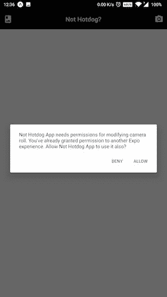](https://res.cloudinary.com/practicaldev/image/fetch/s--2ExRLwEI--/c_limit%2Cf_auto%2Cfl_progressive%2Cq_auto%2Cw_880/https://cdn-images-1.medium.com/max/800/1%2AZ-YtLTjjd-jbDtNKA9gWNw.jpeg)

同样，要使用摄像机:

[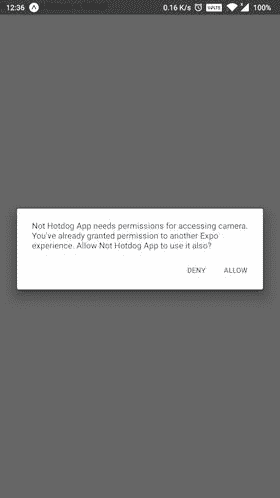](https://res.cloudinary.com/practicaldev/image/fetch/s--V7uPskyS--/c_limit%2Cf_auto%2Cfl_progressive%2Cq_auto%2Cw_880/https://cdn-images-1.medium.com/max/800/1%2Ac0BRdUMxfP_WTYt0VoVTRA.jpeg)

## 创建表头组件

使用 React Native 的 UI 库，让我们快速创建一个有用的标题，其中包含两个按钮和应用程序的标题文本。左按钮将打开手机的图库或包含用户照片的相机胶卷。右边的按钮是在真实设备上打开访问摄像头。

从`react-native-elements`库中导入`Header`组件。

```
import { View, Text, StyleSheet, TouchableOpacity } from 'react-native'
import { Header, Icon } from 'react-native-elements' 
```

<svg width="20px" height="20px" viewBox="0 0 24 24" class="highlight-action crayons-icon highlight-action--fullscreen-on"><title>Enter fullscreen mode</title></svg> <svg width="20px" height="20px" viewBox="0 0 24 24" class="highlight-action crayons-icon highlight-action--fullscreen-off"><title>Exit fullscreen mode</title></svg>

UI 库有一个名为`Header`的预定义组件，您可以立即使用。该组件接受左侧和右侧的图标。因为应用程序需要这些图标是可点击的，所以使用`TouchableOpacity`，以便它的`prop`可以在以后用于打开相机或相机胶卷。

```
<View style={styles.container}>
  <Header
    statusBarProps={{ barStyle: 'light-content' }}
    backgroundColor="black"
    leftComponent={
      <TouchableOpacity onPress={() => alert('soon')}>
        <Icon name="photo-album" color="#fff" />
      </TouchableOpacity>
    }
    centerComponent={{
      text: 'Not Hotdog?',
      style: { color: '#fff', fontSize: 20, fontWeight: 'bold' }
    }}
    rightComponent={
      <TouchableOpacity onPress={() => alert('soon')}>
        <Icon name="camera-alt" color="#fff" />
      </TouchableOpacity>
    }
  /> </View> 
```

<svg width="20px" height="20px" viewBox="0 0 24 24" class="highlight-action crayons-icon highlight-action--fullscreen-on"><title>Enter fullscreen mode</title></svg> <svg width="20px" height="20px" viewBox="0 0 24 24" class="highlight-action crayons-icon highlight-action--fullscreen-off"><title>Exit fullscreen mode</title></svg>

`Header`组件还有一个`statusBarProps`道具，可以改变状态栏的颜色，跨平台工作。它将给出以下输出。

[](https://res.cloudinary.com/practicaldev/image/fetch/s--bKYjsoNv--/c_limit%2Cf_auto%2Cfl_progressive%2Cq_auto%2Cw_880/https://cdn-images-1.medium.com/max/800/1%2AHUDX6p1wtfbrBGmNNanPVw.png)

这两个图标都是可触摸的，但是现在除了一个虚拟的`alert`消息之外，它们没有关联的处理程序方法。

[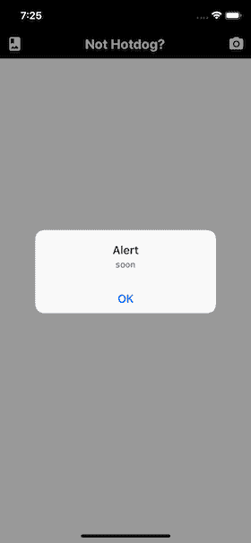](https://res.cloudinary.com/practicaldev/image/fetch/s--Vn4C6zfH--/c_limit%2Cf_auto%2Cfl_progressive%2Cq_auto%2Cw_880/https://cdn-images-1.medium.com/max/800/1%2AuKMGmdh-AQESyamwCwZ3tA.png)

默认情况下，`react-native-elements`库使用材质图标，并有一个 [`react-native-vector-icons`](https://github.com/oblador/react-native-vector-icons) 的对等依赖。

## 添加叠加微调器

要添加到初始状态对象中的下一个元素是值为 false 的`uploading`。每当从相机胶卷上传图像或由 Vision API 分析结果时，该变量将在应用程序中用于显示动画微调器。

```
state = {
  //... rest,
  uploading: false
}

// also make sure to include deconstruct the state inside render()
const {
  hasGrantedCameraPermission,
  hasGrantedCameraRollPermission,
  uploading
} = this.state 
```

<svg width="20px" height="20px" viewBox="0 0 24 24" class="highlight-action crayons-icon highlight-action--fullscreen-on"><title>Enter fullscreen mode</title></svg> <svg width="20px" height="20px" viewBox="0 0 24 24" class="highlight-action crayons-icon highlight-action--fullscreen-off"><title>Exit fullscreen mode</title></svg>

在`components/UploadingOverlay.js`中创建一个新文件。这个文件将包含一个与文件名同名的表示组件。使用来自`react-native`的`ActivityIndicator`，你可以通过使用它的道具`animating`来制作这个组件的动画。

```
import React from 'react'
import { ActivityIndicator, StyleSheet, View } from 'react-native'

const UploadingOverlay = () => (
  <View style={[StyleSheet.absoluteFill, styles.overlay]}>
    <ActivityIndicator color="#000" animating size="large" />
  </View> )

const styles = StyleSheet.create({
  overlay: {
    backgroundColor: 'rgba(255,255,255,0.9)',
    alignItems: 'center',
    justifyContent: 'center'
  }
})

export default UploadingOverlay 
```

<svg width="20px" height="20px" viewBox="0 0 24 24" class="highlight-action crayons-icon highlight-action--fullscreen-on"><title>Enter fullscreen mode</title></svg> <svg width="20px" height="20px" viewBox="0 0 24 24" class="highlight-action crayons-icon highlight-action--fullscreen-off"><title>Exit fullscreen mode</title></svg>

将`StyleSheet.absoluteFill`添加到持有旋转器的`View`组件的`style`支柱中，您可以创建一个叠加屏幕。一个*覆盖图*仅仅是一个屏幕，或者是 React Native 的一个`View`，允许当前屏幕出现在其他屏幕之上。使用`backgroundColor`属性，您可以在定义 RBG 值后在最后添加`opacity`。

例如，当请求访问摄像头的权限时，应用程序屏幕上出现一个对话框(*如上一节*所示)。请注意背景中的框是如何放置在屏幕顶部的。

现在，回到`App.js`，在`render()`部分的底部添加这个组件，就在根`View`组件结束之前。不要忘记导入组件。

```
import UploadingOverlay from './components/UploadingOverlay'

// ... rest
{
  uploading ? <UploadingOverlay /> : null
} 
```

<svg width="20px" height="20px" viewBox="0 0 24 24" class="highlight-action crayons-icon highlight-action--fullscreen-on"><title>Enter fullscreen mode</title></svg> <svg width="20px" height="20px" viewBox="0 0 24 24" class="highlight-action crayons-icon highlight-action--fullscreen-off"><title>Exit fullscreen mode</title></svg>

上述条件表明，如果`this.state.uploading`的值为真，将显示覆盖屏幕。为了进行测试，暂时将状态对象中的值`uploading`设置为`true`。

[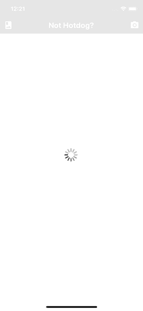](https://res.cloudinary.com/practicaldev/image/fetch/s--rVIxf_0s--/c_limit%2Cf_auto%2Cfl_progressive%2Cq_auto%2Cw_880/https://cdn-images-1.medium.com/max/800/1%2AxcmtOrumJIUGwTIVaV8lSQ.png)

无休止的旋转将继续出现。继续之前，将`uploading`的值设置回 false。

## 访问相机和相机胶卷

在本节中，您将通过在`App`组件中定义三个不同的处理函数来添加访问相机和相机胶卷的功能。确保您在文件`App.js`中。首先，导入下面的语句，因为本节将利用 Firebase 的存储和`uuid`模块来创建每个图像的唯一引用。

```
import firebase from './config/Firebase'
import uuid from 'uuid' 
```

<svg width="20px" height="20px" viewBox="0 0 24 24" class="highlight-action crayons-icon highlight-action--fullscreen-on"><title>Enter fullscreen mode</title></svg> <svg width="20px" height="20px" viewBox="0 0 24 24" class="highlight-action crayons-icon highlight-action--fullscreen-off"><title>Exit fullscreen mode</title></svg>

接下来，修改对象的初始状态，最后添加以下内容。

```
state = {
  hasGrantedCameraPermission: false,
  hasGrantedCameraRollPermission: false,
  uploading: false,
  image: null,
  googleResponse: false
} 
```

<svg width="20px" height="20px" viewBox="0 0 24 24" class="highlight-action crayons-icon highlight-action--fullscreen-on"><title>Enter fullscreen mode</title></svg> <svg width="20px" height="20px" viewBox="0 0 24 24" class="highlight-action crayons-icon highlight-action--fullscreen-off"><title>Exit fullscreen mode</title></svg>

为了在当前应用中启用这两种功能，让我们利用另一个名为`expo-image-picker`的 Expo 模块。首先，在其余的导入语句之后导入模块。

```
import * as ImagePicker from 'expo-image-picker' 
```

<svg width="20px" height="20px" viewBox="0 0 24 24" class="highlight-action crayons-icon highlight-action--fullscreen-on"><title>Enter fullscreen mode</title></svg> <svg width="20px" height="20px" viewBox="0 0 24 24" class="highlight-action crayons-icon highlight-action--fullscreen-off"><title>Exit fullscreen mode</title></svg>

Expo 文档对这个模块的用途有最好的定义。看一看。

> [图像拾取器]提供对系统用户界面的访问，以便从手机的图像库中选择图像和视频，或使用相机拍照。

这就是你现在需要的。定义第一个函数，`takePhoto`，它将访问手机的摄像头来点击一张照片。

```
takePhoto = async () => {
  let pickerResult = await ImagePicker.launchCameraAsync({
    allowsEditing: true,
    aspect: [4, 3]
  })

  this.handleImagePicked(pickerResult)
} 
```

<svg width="20px" height="20px" viewBox="0 0 24 24" class="highlight-action crayons-icon highlight-action--fullscreen-on"><title>Enter fullscreen mode</title></svg> <svg width="20px" height="20px" viewBox="0 0 24 24" class="highlight-action crayons-icon highlight-action--fullscreen-off"><title>Exit fullscreen mode</title></svg>

异步方法`ImagePicker.launchCameraAsync()`接受两个参数:

*   `allowsEditing`显示点击后编辑图像的界面。主要用于裁剪图像。
*   `aspect`是一个数组，如果`allowsEditing`设置为 true，则保持一致的纵横比。

类似地，`ImagePicker.launchImageLibraryAsync()`与相同的一组参数一起用于访问相机胶卷。

```
pickImage = async () => {
  let pickerResult = await ImagePicker.launchImageLibraryAsync({
    allowsEditing: true,
    aspect: [16, 9]
  })

  this.handleImagePicked(pickerResult)
} 
```

<svg width="20px" height="20px" viewBox="0 0 24 24" class="highlight-action crayons-icon highlight-action--fullscreen-on"><title>Enter fullscreen mode</title></svg> <svg width="20px" height="20px" viewBox="0 0 24 24" class="highlight-action crayons-icon highlight-action--fullscreen-off"><title>Exit fullscreen mode</title></svg>

这两个异步函数都返回所选图像的`uri`(其他参数中的*可以在官方文档中查看[这里的](https://docs.expo.io/versions/v34.0.0/sdk/imagepicker/#returns)* )。最后，这两个方法都在它们的工作完成后调用另一个回调`handleImagePicked`。这个方法包含了在从相机胶卷中选取或点击图像后如何处理图像的逻辑业务。

```
handleImagePicked = async pickerResult => {
  try {
    this.setState({ uploading: true })

    if (!pickerResult.cancelled) {
      uploadUrl = await uploadImageAsync(pickerResult.uri)
      this.setState({ image: uploadUrl })
    }
  } catch (e) {
    console.log(e)
    alert('Image Upload failed')
  } finally {
    this.setState({ uploading: false })
  }
} 
```

<svg width="20px" height="20px" viewBox="0 0 24 24" class="highlight-action crayons-icon highlight-action--fullscreen-on"><title>Enter fullscreen mode</title></svg> <svg width="20px" height="20px" viewBox="0 0 24 24" class="highlight-action crayons-icon highlight-action--fullscreen-off"><title>Exit fullscreen mode</title></svg>

最初，将`uploading`的状态设置为真。然后，如果选择了一个图像，调用自定义方法`uploadImageAsync` ( *，它将在本节*的最后定义)并传递所选图像的 URI。这也将把状态对象的`image`的值设置为上传图像的 URL。最后，如果结果是肯定的，并且图像上传没有任何错误，则将`finally`模块中的`uploading`的状态设置回 false。

自定义方法`uploadImageAsync`必须在`App`组件之外定义。它将通过在`uuid`的帮助下创建一个唯一的图像 ID 或斑点来上传图像。它使用`xhr`进行 Ajax 调用，向 Firebase 存储器发送上传图像的请求。

```
async function uploadImageAsync(uri) {
  const blob = await new Promise((resolve, reject) => {
    const xhr = new XMLHttpRequest()
    xhr.onload = function() {
      resolve(xhr.response)
    }
    xhr.onerror = function(e) {
      console.log(e)
      reject(new TypeError('Network request failed'))
    }
    xhr.responseType = 'blob'
    xhr.open('GET', uri, true)
    xhr.send(null)
  })

  const ref = firebase
    .storage()
    .ref()
    .child(uuid.v4())
  const snapshot = await ref.put(blob)

  blob.close()

  return await snapshot.ref.getDownloadURL()
} 
```

<svg width="20px" height="20px" viewBox="0 0 24 24" class="highlight-action crayons-icon highlight-action--fullscreen-on"><title>Enter fullscreen mode</title></svg> <svg width="20px" height="20px" viewBox="0 0 24 24" class="highlight-action crayons-icon highlight-action--fullscreen-off"><title>Exit fullscreen mode</title></svg>

> 请注意，用于访问和上传图像到 Firebase 的源代码摘自本例中的[使用 Expo 和 Firebase。](https://github.com/expo/firebase-storage-upload-example)

现在你可以添加两个函数，`pickImage`和`takePhoto`作为相应图标的`onPress`道具的值。

```
<Header
  statusBarProps={{ barStyle: 'light-content' }}
  backgroundColor="#000"
  leftComponent={
    <TouchableOpacity onPress={this.pickImage}>
      <Icon name="photo-album" color="#fff" />
    </TouchableOpacity>
  }
  centerComponent={{
    text: 'Not Hotdog?',
    style: styles.headerCenter
  }}
  rightComponent={
    <TouchableOpacity onPress={this.takePhoto}>
      <Icon name="camera-alt" color="#fff" />
    </TouchableOpacity>
  }
/> 
```

<svg width="20px" height="20px" viewBox="0 0 24 24" class="highlight-action crayons-icon highlight-action--fullscreen-on"><title>Enter fullscreen mode</title></svg> <svg width="20px" height="20px" viewBox="0 0 24 24" class="highlight-action crayons-icon highlight-action--fullscreen-off"><title>Exit fullscreen mode</title></svg>

这是一个访问相机胶卷的例子。

[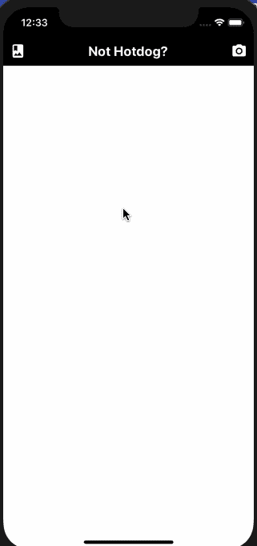](https://res.cloudinary.com/practicaldev/image/fetch/s--yj2qIr_Y--/c_limit%2Cf_auto%2Cfl_progressive%2Cq_66%2Cw_880/https://cdn-images-1.medium.com/max/800/1%2AdEcP_2OfNpFepEiWpwg3lA.gif)

## 添加确定热狗的功能

由于大部分应用程序现在已经设置好了，这一部分将会非常有趣。您将利用 Google 的 Vision API 来分析用户提供的图片是否是热狗。

在`App`组件内部，添加一个名为`submitToGoogle`的新方法。它将发送请求并与 API 通信，以便在图像上传后用户按下按钮时获取结果。同样，在分析和获取结果时，这个方法会将状态变量`uploading`设置为 true。然后，它将从状态对象的`image`发送图像的 URI 作为请求的主体。

除了 URI，还定义了您想要使用的类别类型以及它可以作为响应获取的大量结果。您可以更改`LABEL`类别的`maxResults`值。目前，的值被设置为`7`。除了下面使用的`LABEL_DETECTION`之外，视觉 API 还提供了其他检测类别，如人脸、徽标、地标、文本等。

```
submitToGoogle = async () => {
  try {
    this.setState({ uploading: true })
    let { image } = this.state
    let body = JSON.stringify({
      requests: [
        {
          features: [{ type: 'LABEL_DETECTION', maxResults: 7 }],
          image: {
            source: {
              imageUri: image
            }
          }
        }
      ]
    })
    let response = await fetch(
      `https://vision.googleapis.com/v1/images:annotate?key=${VISION_API_KEY}`,
      {
        headers: {
          Accept: 'application/json',
          'Content-Type': 'application/json'
        },
        method: 'POST',
        body: body
      }
    )
    let responseJson = await response.json()
    const getLabel = responseJson.responses[0].labelAnnotations.map(
      obj => obj.description
    )

    let result =
      getLabel.includes('Hot dog') ||
      getLabel.includes('hot dog') ||
      getLabel.includes('Hot dog bun')

    this.setState({
      googleResponse: result,
      uploading: false
    })
  } catch (error) {
    console.log(error)
  }
} 
```

<svg width="20px" height="20px" viewBox="0 0 24 24" class="highlight-action crayons-icon highlight-action--fullscreen-on"><title>Enter fullscreen mode</title></svg> <svg width="20px" height="20px" viewBox="0 0 24 24" class="highlight-action crayons-icon highlight-action--fullscreen-off"><title>Exit fullscreen mode</title></svg>

在上面的代码片段中，结果被提取到一个数组中。在当前场景中，每个数组都有七个不同的对象。使用 JavaScript 的`map`让我们从每个对象中提取`description`的值。你需要做的就是检测描述中是否包含`hotdog`这个词。这是在变量`result`中完成的。最后，`uploading`覆盖图的状态被设置回 false，上传图像是否包含热狗的结果将更新`googleResponse`为 boolean。

另外，Vision API 使用 HTTP Post 请求作为 REST API 端点，对请求中发送的图像执行数据分析。这是通过 URL `https://vision.googleapis.com/v1/images:annotate`完成的。要验证每个请求，您需要 API 密钥。这个 POST 请求的主体是 JSON 格式的。比如:

```
{  "requests":  [  {  "image":  {  "content":  "/9j/7QBEUGhvdG9...image contents...eYxxxzj/Coa6Bax//Z"  },  "features":  [  {  "type":  "LABEL_DETECTION",  "maxResults":  1  }  ]  }  ]  } 
```

<svg width="20px" height="20px" viewBox="0 0 24 24" class="highlight-action crayons-icon highlight-action--fullscreen-on"><title>Enter fullscreen mode</title></svg> <svg width="20px" height="20px" viewBox="0 0 24 24" class="highlight-action crayons-icon highlight-action--fullscreen-off"><title>Exit fullscreen mode</title></svg>

## 显示最终结果

使用来自`googleResponse`的布尔值，最终结果将被输出。将使用`renderImage`显示输出。

```
renderImage = () => {
  let { image, googleResponse } = this.state
  if (!image) {
    return (
      <View style={styles.renderImageContainer}>
        <Button
          buttonStyle={styles.button}
          onPress={() => this.submitToGoogle()}
          title="Check"
          titleStyle={styles.buttonTitle}
          disabled
        />
        <View style={styles.imageContainer}>
          <Text style={styles.title}>Upload an image to verify a hotdog!</Text>
          <Text style={styles.hotdogEmoji}>🌭</Text>
        </View>
      </View>
    )
  }
  return (
    <View style={styles.renderImageContainer}>
      <Button
        buttonStyle={styles.button}
        onPress={() => this.submitToGoogle()}
        title="Check"
        titleStyle={styles.buttonTitle}
      /> 
      <View style={styles.imageContainer}>
        <Image source={{ uri: image }} style={styles.imageDisplay} />
      </View> 
      {googleResponse ? (
        <Text style={styles.hotdogEmoji}>🌭</Text>
      ) : (
        <Text style={styles.hotdogEmoji}>❌</Text>
      )}
    </View>
  )
} 
```

<svg width="20px" height="20px" viewBox="0 0 24 24" class="highlight-action crayons-icon highlight-action--fullscreen-on"><title>Enter fullscreen mode</title></svg> <svg width="20px" height="20px" viewBox="0 0 24 24" class="highlight-action crayons-icon highlight-action--fullscreen-off"><title>Exit fullscreen mode</title></svg>

上面使用的`Button`组件来自`react-native-elements`库。它将被禁用，直到没有图像被选中。在它的支柱`onPress`上调用了句柄函数`submitToGoogle`。第二个视图显示图像，在它下面，一个表情符号展示了图像是否有想要的结果。请注意，默认情况下会显示十字表情符号，因为在定义初始状态时,`googleResponse`的默认值被设置为 false。只有点击按钮后，显示的表情符号才是最终结果。

最后，不要忘记在`App`组件的`render`方法中添加`renderImage`，就在`UploadingOverlay`组件之前。

```
// inside the render method
{
  this.renderImage()
}
{
  uploading ? <UploadingOverlay /> : null
} 
```

<svg width="20px" height="20px" viewBox="0 0 24 24" class="highlight-action crayons-icon highlight-action--fullscreen-on"><title>Enter fullscreen mode</title></svg> <svg width="20px" height="20px" viewBox="0 0 24 24" class="highlight-action crayons-icon highlight-action--fullscreen-off"><title>Exit fullscreen mode</title></svg>

这里有一个简短的演示，展示了该应用程序在使用 Expo 客户端运行该应用程序的真实 android 设备上的外观和工作方式。

[](https://res.cloudinary.com/practicaldev/image/fetch/s--jVPSFycL--/c_limit%2Cf_auto%2Cfl_progressive%2Cq_66%2Cw_880/https://cdn-images-1.medium.com/max/800/1%2AHg6nlnaROCavW5_YLygtEA.gif)

这里是`StyleSheet`对象的完整源代码。

```
const styles = StyleSheet.create({
  container: {
    flex: 1,
    backgroundColor: '#cafafe'
  },
  headerCenter: {
    color: '#fff',
    fontSize: 20,
    fontWeight: 'bold'
  },
  renderImageContainer: {
    marginTop: 20,
    alignItems: 'center'
  },
  button: {
    backgroundColor: '#97caef',
    borderRadius: 10,
    width: 150,
    height: 50
  },
  buttonTitle: {
    fontWeight: '600'
  },
  imageContainer: {
    margin: 25,
    alignItems: 'center'
  },
  imageDisplay: {
    width: 300,
    height: 300
  },
  title: {
    fontSize: 36
  },
  hotdogEmoji: {
    marginTop: 20,
    fontSize: 90
  }
})

export default App 
```

<svg width="20px" height="20px" viewBox="0 0 24 24" class="highlight-action crayons-icon highlight-action--fullscreen-on"><title>Enter fullscreen mode</title></svg> <svg width="20px" height="20px" viewBox="0 0 24 24" class="highlight-action crayons-icon highlight-action--fullscreen-off"><title>Exit fullscreen mode</title></svg>

如果您访问 Firebase 中的存储部分，您会注意到每个图像都以 base64 二进制字符串的名称存储。

[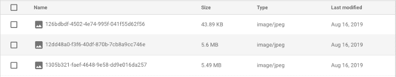](https://res.cloudinary.com/practicaldev/image/fetch/s--6b14_VDc--/c_limit%2Cf_auto%2Cfl_progressive%2Cq_auto%2Cw_880/https://cdn-images-1.medium.com/max/800/1%2ACIWmTd4__kyKZRBBqQG0iw.png)

## 结论

通过集成 Firebase 存储并使用 Google 的 Vision API 和 React Native，您已经完成了本教程。API 是惊人的，有无穷无尽的用例。我希望你通过阅读这篇文章学到了一些东西。该应用程序的完整源代码可在 Github repo 获得。本帖中使用的一些资源:

*   [react-native-elements](https://react-native-training.github.io/) UI 组件库
*   [世博摄像师](https://docs.expo.io/versions/v34.0.0/sdk/imagepicker/#returns)
*   [firebase-storage-upload-Expo 示例](https://github.com/expo/firebase-storage-upload-example)
*   [视觉人工智能](https://cloud.google.com/vision/?utm_source=google&utm_medium=cpc&utm_campaign=japac-IN-all-en-dr-bkws-all-super-trial-e-dr-1003987&utm_content=text-ad-none-none-DEV_c-CRE_256563224787-ADGP_Hybrid+%7C+AW+SEM+%7C+BKWS+~+T1+%7C+EXA+%7C+ML+%7C+1:1+%7C+IN+%7C+en+%7C+Vision+%7C+google+vision+api-KWID_43700023274811671-kwd-312947612586&userloc_9061696&utm_term=KW_google%20vision%20api&ds_rl=1264446&gclid=CjwKCAjwqNnqBRATEiwAkHm2BCkLuArU9ZtlYQ4p3bCJoHF0CDQ0Gm2o0rjZVWHWJ63kdpz7AbwtPxoCoWgQAvD_BwE)

* * *

> [最初发布于心跳](https://heartbeat.fritz.ai/build-a-not-hotdog-clone-with-react-native-8f9b9eb75bd2)

我经常在 Nodejs、Reactjs 和 React Native 上写。你可以通过[aman his . dev](https://amanhimself.dev)来访问我，或者你可以订阅[我的每周简讯](https://tinyletter.com/amanhimself)，直接在你的收件箱中接收所有关于新帖子和内容的更新💌。